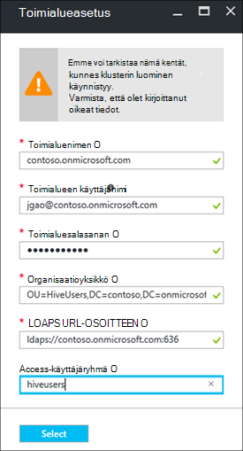

<properties
    pageTitle="Määrittää toimialueen liittyneet HDInsight klustereiden | Microsoft Azure"
    description="Lisätietoja toimialueen liittyneet HDInsight klustereiden määrittäminen"
    services="hdinsight"
    documentationCenter=""
    authors="saurinsh"
    manager="jhubbard"
    editor="cgronlun"
    tags=""/>

<tags
    ms.service="hdinsight"
    ms.devlang="na"
    ms.topic="article"
    ms.tgt_pltfrm="na"
    ms.workload="big-data"
    ms.date="10/26/2016"
    ms.author="saurinsh"/>

# Määritä toimialueen liittyneet HDInsight varausyksiköt (ennakkoversio)

Opi määrittämään Azure HDInsight-klusterin Azure Active Directory (Azure AD) ja [Apache Metsänvartijan](http://hortonworks.com/apache/ranger/) hyödyntää vahva todennus ja rich Roolipohjainen käytön hallinta (RBAC) käytännöt.  Toimialueen liittyneet HDInsight voidaan määrittää vain Linux-pohjaiset klustereiden. Lisätietoja on artikkelissa [oma toimialue liittyneet HDInsight klustereiden](hdinsight-domain-joined-introduction.md).

Tässä artikkelissa on sarjan ensimmäinen opetusohjelma:

- Voit luoda yhteydessä Azure AD (joko Azure Directory-toimialuepalveluiden ominaisuuksien) HDInsight-klusterin Apache Metsänvartijan käytössä.
- Luo ja käyttää rakenteen käytäntöjä Apache Metsänvartijan kautta ja Salli käyttäjien (esimerkiksi tietoja tutkijoiden) muodostaa yhteyden rakenteen käyttämällä ODBC-pohjainen työkaluja, kuten Excel, Tableau jne. Microsoft tekee yhteistyötä muiden toiminnoista, kuten HBase, ohjattu ja myrsky, lisäämisestä toimialueeseen liittyneet HDInsight pian.

Esimerkki lopullinen topologian näyttää seuraavasti:

Koska Azure AD tällä hetkellä tukemien perinteinen virtual verkkojen (VNets) ja Linux-pohjaiset HDInsight klusterit tukevat vain Azure Resurssienhallinta perusteella VNets, HDInsight Azure AD-integrointi edellyttää kaksi VNets ja peering niiden välillä. Kaksi käyttöönotto-mallien välillä vertailu, tiedot on [Azure Resurssienhallinta ja perinteinen käyttöönoton: käyttöönoton mallit ja resurssien tilan](../resource-manager-deployment-model.md). Kaksi VNets on oltava sama kuin Azure AD DS alue.

Azure palveluiden nimet on oltava yksilöivä. Seuraavat nimet käytetään tässä opetusohjelmassa. Contoso on kuvitteellinen nimi. *Contoso* on tilalle eri nimellä, kun siirryt – opetusohjelman. 
    
**Nimet:**

|Ominaisuus|Arvo|
|--------|-----|
| Azure AD-VNet|contosoaadvnet|
| Azure AD Virtual Machine (AM)|contosoaadadmin. Tämä AM käytetään organisaatioyksikkö ja käänteinen DNS-vyöhyke.|
| Azure Active directory|contosoaaddirectory|
| Azure AD-toimialuenimi|Contoson (contoso.onmicrosoft.com)|
| HDInsight VNet|contosohdivnet|
| HDInsight VNet resurssiryhmä|contosohdirg|
| HDInsight-klusterin|contosohdicluster|

Tässä opetusohjelmassa kerrotaan toimialueen liittyneet HDInsight-klusterin määrittämistä varten. Jokaisessa osassa on linkkejä muihin artikkeleihin Lisää taustatietoja.

## Edellytyksenä:

- Valintanauhaan tutustuminen [Azure AD-toimialueen palveluista](https://azure.microsoft.com/services/active-directory-ds/) [hinnat](https://azure.microsoft.com/pricing/details/active-directory-ds/) sen rakennetta.
- Varmista, että tilauksesi whitelisted tätä yleisen esikatselua varten. Voit tehdä niin sähköpostia lähettämällä hdipreview@microsoft.com käyttämällä tilauksen.
- SSL-varmenne, joka on allekirjoitettu allekirjoitetun viranomainen toimialueen. Varmenteen tarvitaan määrittämällä suojatun LDAP. Itse allekirjoitetun varmenteet ei voi käyttää.

## Ohjeita

1. Luo Azure perinteinen VNet Azure AD.  
2. Luo ja Määritä Azure AD- ja Azure AD DS.
3. Lisää AM perinteinen VNet organisaatioyksikkö luomiseen. 
4. Luo organisaatioyksikkö Azure AD DS: ÄÄN.
5. Luo HDInsight-VNet Azure resurssien hallinta-tilassa.
6. Asetukset käänteinen DNS-vyöhykkeet Azure AD DS.
6. Vertaisjärjestelmä kahden VNets.
7. Luo HDInsight-klusterin.

> [AZURE.NOTE] Tässä opetusohjelmassa oletetaan, että sinulla ei ole Azure AD. Jos käytössäsi on jokin, voit ohittaa vaiheen 2 osaan.
    
## Luo Azure perinteinen VNet

Tässä osiossa luot perinteinen VNet, Azure-portaalissa. Seuraavan osion Azure AD DS käyttöön oman Azure AD-perinteinen VNet. Saat lisätietoja seuraavassa ja VNet luominen jollakin toisella tavalla [Luo virtuaalisia verkon (perinteinen) mukaan Azure-portaalissa](../virtual-network/virtual-networks-create-vnet-classic-portal.md).

**Voit luoda perinteinen VNet**

1. Kirjaudu [Azure portal](https://portal.azure.com). 
2. Valitse **Uusi** > **Verkko** > **VPN**.
3. **Valitse käyttöönottomalli**Valitse **perinteinen**ja valitse sitten **Luo**.
4. Kirjoita tai valitse seuraavat arvot:

    - **Nimi**: contosoaadvnet
    - **Osoitetilan**: 10.1.0.0/16
    - **Aliverkon nimi**: Subnet1
    - **Aliverkon osoitealueita**: 10.1.0.0/24
    - **Tilaus**: (Valitse käytettävä luomisesta tähän VNet Tilauksen.)
    - **ResourceGroup**:
    - **Sijainti**: (Valitse alueen HDInsight-klusterin.)

        > [AZURE.IMPORTANT] Sinun on valittava sijaintiin, joka tukee Azure AD DS: ÄÄN. Lisätietoja on artikkelissa [tuotteiden alueittain](https://azure.microsoft.com/en-us/regions/services/). 
        >
        > Perinteinen VNet ja resurssien ryhmä-VNet on oltava sama kuin Azure AD DS alue.

5. Valitse **Luo** VNet luomiseen.

## Luo ja Azure AD Azure AD DS: N määrittäminen

Tässä osassa menettelet seuraavasti:

1. Luo Azure AD.
2. Luo Azure AD-käyttäjille. Nämä käyttäjät ovat Toimialuekäyttäjät. Voit käyttää ensimmäinen käyttäjä määrittäminen HDInsight-klusterin Azure AD.  Muut käyttäjät ovat valinnaisia Tässä opetusohjelmassa. Ne käytetään- [toimialueeseen liittyneet HDInsight klustereiden määrittäminen rakenne käytännöt](hdinsight-domain-joined-run-hive.md) , kun määrität Apache Metsänvartijan käytännöt.
3. Luo AAD Ohjauskoneen Järjestelmänvalvojat-ryhmän ja Azure AD-käyttäjien lisääminen ryhmään. Luo organisaatioyksikkö kyseisen käyttäjän avulla.
4. Ottaa käyttöön Azure AD Azure AD-toimialueen palveluita (Azure AD DS).
7. Määritä LDAPS Azure AD. Luku- ja kirjoitusoikeudet Azure AD käytetään Lightweight Directory Access Protocol (LDAP).

Jos haluat käyttää aiemmin luotuja Azure AD, voit ohittaa vaiheet 1 ja 2.

**Voit luoda Azure AD**

1. [Azure perinteinen portaaliin](https://manage.windowsazure.com)ja valitse **Uusi** > **Sovelluksen Services** > **Active Directory** > **Directory** > **Mukautettu luominen**. 
3. Kirjoita tai valitse seuraavat arvot:

    - **Nimi**: contosoaaddirectory
    - **Toimialuenimi**: contoso.  Tämän nimen on oltava yksilöivä.
    - **Maa tai alue**: Valitse maa tai alue.
4. Valitse **Valmis**.

**Luo Azure AD-käyttäjä**

1. [Azure perinteinen portaaliin](https://manage.windowsazure.com)ja valitse **Active Directory** -> **contosoaaddirectory**. 
3. Valitse yläreunan valikosta **käyttäjiä** .
4. Valitse **Lisää käyttäjä**.
4. Kirjoita **Käyttäjänimi**ja valitse sitten **Seuraava**. 
5. Määrittää käyttäjäprofiileja; Valitse **rooli**, **Yleinen järjestelmänvalvoja**; ja valitse sitten **Seuraava**.  Voit luoda organisaatioyksiköiden tarvitaan yleisen järjestelmänvalvojan roolilla.
6. Valitse **Luo** saat tilapäinen salasana.
7. Tee kopio salasana ja valitse sitten **Valmis**. Jäljempänä tässä opetusohjelmassa-käytetään tätä yleisen järjestelmänvalvojan käyttäjän kirjautuminen järjestelmänvalvojan AM organisaatioyksikkö luominen ja määrittäminen käänteinen DNS.

Toimi luomalla kaksi käyttäjää **käyttäjän** rooli, hiveuser1 ja hiveuser2. Seuraavien käyttäjien käytetään [toimialueen liittyneet HDInsight klustereiden määrittäminen rakenne käytännöt](hdinsight-domain-joined-run-hive.md).

**Voit luoda AAD Ohjauskoneen järjestelmänvalvojien ryhmän ja Azure AD-käyttäjän lisääminen**

1. [Azure perinteinen portaaliin](https://manage.windowsazure.com)ja valitse **Active Directory** > **contosoaaddirectory**. 
3. Valitse yläreunan valikosta **ryhmät** .
4. Valitse **Lisää ryhmä** tai **Lisää ryhmä**.
5. Kirjoita tai valitse seuraavat arvot:

    - **Nimi**: AAD Ohjauskoneen järjestelmänvalvojat.  Älä muuta ryhmänimi.
    - **Ryhmälaji**: suojaus.
6. Valitse **Valmis**.
7. Valitse **AAD Ohjauskoneen järjestelmänvalvojien** ryhmään avaamaan.
8. Valitse **Lisää jäseniä**.
9. Valitse edellisessä vaiheessa luomasi ensimmäinen käyttäjä ja valitse sitten **Valmis**.
10. Toista samat vaiheet, voit luoda toisen ryhmän nimeltä **HiveUsers**ja kaksi rakennetta käyttäjien lisääminen ryhmään.

Lisätietoja on artikkelissa [Azure AD-toimialueen palveluista (esikatselu) - luo "AAD Ohjauskoneen Järjestelmänvalvojat"](../active-directory-domain-services/active-directory-ds-getting-started.md).

**Jos haluat ottaa käyttöön Azure AD Azure AD DS: ÄÄN**

1. [Azure perinteinen portaaliin](https://manage.windowsazure.com)ja valitse **Active Directory** > **contosoaaddirectory**. 
3. Valitse **Määritä** yläreunan valikosta.
4. Siirry **Toimialueen palveluista**ja määritä seuraavat arvot:

    - **Ottaa käyttöön toimialuepalveluita tämän hakemiston**: Kyllä.
    - **DNS-toimialuenimi toimialueen palveluiden**: Näyttää Azure directory DNS oletusnimi. Esimerkiksi contoso.onmicrosoft.com.
    - **Yhdistä toimialuepalveluita tähän virtual verkkoon**: Valitse aiemmin luomasi, eli **contosoaadvnet**perinteinen virtual verkko.
    
6. Valitse sivun alareunasta **Tallenna** . Näet **odotetaan...** vieressä **käyttöön tähän kansioon toimialuepalveluita**.  
7. Odota, kunnes **odotetaan...** ei enää näy, ja **IP-osoite** saa kaikille. Kahden IP-osoitteen hankkiminen kaikille. Nämä ovat valmisteltu toimialueen palvelujen toimialueen ohjaimet IP-osoitteet. Kunkin IP-osoite on näkyvissä, kun vastaavan toimialueen ohjauskoneen on valmisteltu ja valmis. Kirjoita muistiin kaksi IP-osoitteet. Tarvitset niitä myöhemmin.

Lisätietoja on artikkelissa [Azure AD-toimialueen palveluista (esikatselu) - käyttöön Azure AD-toimialueen palveluista](../active-directory-domain-services/active-directory-ds-getting-started-enableaadds.md).

**Jos haluat synkronoida salasana**

Voit käyttää omaa toimialuenimeä, jos haluat synkronoida salasana. Katso [käyttöön salasanojen synkronoinnin Azure AD-toimialueen palveluihin vain pilvipalveluita Azure Active directory](../active-directory-domain-services/active-directory-ds-getting-started-password-sync.md).

**Azure AD LDAPS määrittäminen**

1. Hanki SSL-varmenne, joka on allekirjoitettu allekirjoitetun viranomainen toimialueen. Itse allekirjoitetun varmenteet ei voi käyttää. Jos et saa SSL-varmenne, valitse saavuttaminen hdipreview@microsoft.com poikkeuksen.
1. [Azure perinteinen portaaliin](https://manage.windowsazure.com)ja valitse **Active Directory** > **contosoaaddirectory**. 
3. Valitse **Määritä** yläreunan valikosta.
4. Siirry **toimialuepalveluihin**.
5. Valitse **Määritä varmenne**.
6. Määritä sertifikaattitiedosto ja salasana noudattamalla ohjeita. Näet **odotetaan...** vieressä **käyttöön tähän kansioon toimialuepalveluita**.  
7. Odota, kunnes **odotetaan...** ei enää näy, ja **Suojata LDAP-sertifikaatin** käytössä kaikille.  Voi kestää vähintään 10 minuuttia.
 
>[AZURE.NOTE] Jos taustan joitakin tehtäviä suoritetaan Azure AD DS, näkyviin voi tulla virhe ladattaessa varmenteen - <i>on tämän vuokraajan tehtävän toiminnon. Yritä uudelleen myöhemmin</i>.  Siltä varalta, että tämä virhe ilmenee, yritä uudelleen myöhemmin uudelleen. Toisen toimialueen ohjauskoneen IP voi kestää jopa 3 tuntia valmistellaan.

Lisätietoja on artikkelissa [Määrittäminen suojatun LDAP (LDAPS) Azure AD-toimialueen palvelut hallitun toimialueen](../active-directory-domain-services/active-directory-ds-admin-guide-configure-secure-ldap.md).

## Määritä organisaatioyksikkö ja käänteinen DNS

Tässä osassa virtual machine lisääminen Azure AD-VNet ja asenna Valvontatyökalut tämän AM, jotta voit määrittää organisaatioyksikkö ja käänteinen DNS. Kerberos-todennus vaaditaan käänteinen DNS-haku.

**Voit luoda virtual machine virtual-verkostoon**

1. [Azure perinteinen portaaliin](https://manage.windowsazure.com)ja valitse **Uusi** > **Laske** > **virtuaalikoneen** > **-Valikoima**.
3. Valitse kuva ja valitse sitten **Seuraava**.  Jos et tiedä, mitä niistä käytetään, valitse oletusarvon mukaan **Windows Server 2012 R2-Palvelinkeskukseen**.
4. Kirjoita tai valitse seuraavat arvot:

    - Virtuaalikoneen nimi: **contosoaadadmin**
    - Taso: **Perustiedot**
    - Uuden käyttäjänimi: (Kirjoita käyttäjänimi)
    - Salasana: (Salasanaa)
    
    Huomaa, käyttäjänimi ja salasana on paikallinen järjestelmänvalvoja.
    
5. Valitse **Seuraava**
6. **Alue/Virtual verkossa**Valitse luomasi viimeisessä vaiheessa (contosoaadvnet) uusi virtual verkko ja valitse sitten **Seuraava**.
7. Valitse **Valmis**.

**Jos haluat RDP AM**

1. Valitse [Azure perinteinen portal](https://manage.windowsazure.com) **näennäiskoneiden** > **contosoaadadmin**.
3. Valitse **raporttinäkymät-ikkunan** yläreunan valikosta.
4. Valitse sivun alareunasta **Yhdistä** .
5. Noudattamalla ja muodostaa paikallisen järjestelmänvalvojan käyttäjänimi ja salasana.

**Voit liittyä AM Azure AD-toimialueesta**

1. RDP-istunnon napsauttamalla **Käynnistä-painiketta**ja valitse sitten **Palvelimen hallinta**.
2. Valitse **Paikallinen Server** vasemmasta valikosta.
3. Valitse työryhmän **työryhmän**.
4. Valitse **Muuta**.
5. Valitse **toimialue**, kirjoita **contoso.onmicrosoft.com**ja valitse sitten **OK**.
6. Kirjoita toimialueen käyttäjätietoja ja valitse sitten **OK**.
7. Valitse **OK**.
8. Valitse Hyväksy Käynnistä tietokone uudelleen **OK** .
9. Valitse **Sulje**.
10. Valitse **Käynnistä uudelleen**.

Lisätietoja on artikkelissa [liittyä Windows Server-virtual machine hallitun toimialueeseen](../active-directory-domain-services/active-directory-ds-admin-guide-join-windows-vm.md).

**Asenna Active Directory-hallintatyökalut ja DNS-Työkalut**

1. RDP **contosoaadadmin** Azure AD-käyttäjätunnuksella kyselyjä.
2. Napsauta **Käynnistä-painiketta**ja valitse sitten **Palvelimen hallinta**.
3. Valitse **raporttinäkymät-ikkunan** vasemmasta valikosta.
4. Valitse **Manage**ja valitse sitten **Lisää rooleja ja ominaisuuksia**.
5. Valitse **Seuraava**.
6. Valitse **Roolipohjainen tai ominaisuuksiin perustuvaan asennus**ja valitse sitten **Seuraava**.
7. Valitse nykyinen Virtuaalikoneen palvelimen käytetään varannon ja valitse **Seuraava**.
8. Valitse **Seuraava** Ohita roolit.
9. Laajenna **Remote palvelimen hallintatyökalujen**, laajenna **Roolin hallintatyökalut**, valitse **AD DS ja AD LDS Työkalut** ja **DNS Server työkalut**ja valitse sitten **Seuraava**. 
10. Valitse **Seuraava**
10. Valitse **Asenna**.

Lisätietoja on artikkelissa [Asenna Active Directory-hallintatyökalut-virtuaalikoneen](../active-directory-domain-services/active-directory-ds-admin-guide-administer-domain.md#task-2---install-active-directory-administration-tools-on-the-virtual-machine).

**Jos haluat käänteinen DNS-asetusten määrittäminen**

1. Contosoaadadmin Azure AD-käyttäjätunnuksella, RDP.
2. Napsauta **Käynnistä-painiketta**, valitse **Valvontatyökalut**ja valitse sitten **DNS**. 
3. Valitse **ei** , jos haluat ohittaa lisääminen ContosoAADAdmin.
4. Valitse **Seuraava tietokone**, kirjoita ensimmäisen aiemmin määritetty DNS-palvelimen IP-osoite ja valitse sitten **OK**.  On artikkelissa Ohjauskoneen/DNS lisätään vasemmanpuoleisessa ruudussa.
3. Laajenna Ohjauskoneen/DNS-palvelin, **Vastakkainen Lookup Zones**hiiren kakkospainikkeella ja valitse sitten **Uusi vyöhykkeeseen**. Näyttöön avautuu Zone ohjattu.
4. Valitse **Seuraava**.
5. Valitse **ensisijainen vyöhyke**ja valitse sitten **Seuraava**.
6. Valitse **kaikki käynnissä toimialueen ohjauskoneen tämän toimialueen DNS-palvelimet**ja valitse sitten **Seuraava**.
6. Valitse **IPv4 peruuttaa haun alue**ja valitse sitten **Seuraava**.
7. **Verkkotunnus**Anna etuliite HDInsight VNET verkko-alueelle ja valitse sitten **Seuraava**. Luo HDInsight-VNet seuraavassa osassa.
8. Valitse **Seuraava**.
9. Valitse **Seuraava**.
10. Valitse **Valmis**.

Voit luoda organisaatioyksikkö seuraava käytetään HDInsight-klusterin luotaessa. Tämä OU sijoitetaan Hadoop käyttäjien ja tietokonetilit.

**Luo organisaatioyksikkö (OU) hallitun Azure AD-toimialueen palvelut-toimialueella**

1. RDP **contosoaadadmin** toimialueen tilillä kyselyjä, jotka on **AAD Ohjauskoneen järjestelmänvalvojat** -ryhmän.
2. **Käynnistä-painiketta**ja valitse **Valvontatyökalut** **Active Directory järjestelmänvalvojan keskelle**.
5. Napsauta toimialueen nimeä vasemmassa ruudussa. Esimerkiksi contoso.
6. Valitse **Uusi** **-tehtäväruudun** toimialuenimen alta ja valitse sitten **Organisaatioyksikkö**.
7. Kirjoita nimi, esimerkiksi **HDInsightOU**, ja valitse sitten **OK**. 

Lisätietoja on artikkelissa [luominen organisaatioyksikkö (OU) hallitun Azure AD-toimialueen palvelut toimialueeseen](../active-directory-domain-services/active-directory-ds-admin-guide-create-ou.md).

## Resurssienhallinta-VNet HDInsight-klusterin luominen

Tässä osiossa luot Azure Resurssienhallinta VNet, jota käytetään HDInsight-klusterin. Lisätietoja Azure VNET jollakin toisella tavalla luomisesta on artikkelissa [luominen virtual verkossa](../virtual-network/virtual-networks-create-vnet-arm-pportal.md)

Kun olet luonut VNet, määritetään käyttämään samaan DNS-palvelimet kuin Azure AD-VNet Resurssienhallinta-VNet. Jos olet toiminut edellä kuvatulla tavalla tässä opetusohjelmassa perinteinen VNet ja Azure AD-DNS-palvelimet eivät 10.1.0.4 ja 10.1.0.5.

**Voit luoda Resurssienhallinta VNet**

1. Kirjaudu [Azure portal](https://portal.azure.com).
2. Valitse **Uusi** **Verkko**ja valitse **Virtual verkkoon**. 
3. **Valitse käyttöönottomalli**Valitse **Resurssienhallinta**ja valitse sitten **Luo**.
4. Kirjoita tai valitse seuraavat arvot:

    - **Nimi**: contosohdivnet
    - **Osoitetilan**: 10.2.0.0/16. Varmista, että osoite-arvo ei voi olla IP-osoitealueita, perinteinen VNet.
    - **Aliverkon nimi**: Subnet1
    - **Aliverkon osoitealueita**: 10.2.0.0/24
    - **Tilaus**: (Valitse Azure tilauksesi.)
    - **Resurssiryhmä**: contosohdirg
    - **Sijainti**: (Valitse samassa sijainnissa kuin Azure AD VNet eli contosoaadvnet.)

5. Valitse **Luo**.

**Voit määrittää DNS Resource Manager VNet**

1. [Azure-portaaliin](https://portal.azure.com)ja valitse **Lisää palveluja** -> **Virtual verkot**. Varmista Valitse **Virtual verkkojen (perinteinen)**.
2. Valitse **contosohdivnet**.
4. Valitse **DNS-palvelimet** uusi sivu vasemmasta reunasta.
6. Valitse **Mukautettu**ja kirjoita sitten seuraavat arvot:

    - 10.1.0.4
    - 10.1.0.5

    Nämä DNS server IP-osoitteiden on oltava samat Azure AD-VNet (perinteinen VNet) DNS-palvelimiin.
7. Valitse **Tallenna**.

## Vertaiskone Azure AD-VNet ja HDInsight-VNet

**Kaksi VNet vertaiskoneeseen**

1. Kirjaudu [Azure portal](https://portal.azure.com).
2. Valitse **Lisää palveluja** vasemmasta valikosta.
3. Valitse **Virtual verkot**. Älä napsauta **Virtual verkkojen (perinteinen)**.
4. Valitse **contosohdivnet**.  Tämä on HDInsight-VNet.
5. Valitse **Peerings** sivu vasemmalla olevasta valikosta.
6. Valitse **Lisää** yläreunan valikosta. Se **Lisää peering** -sivu avautuu.
7. Määritä **Lisää peering** , sivu tai seuraavat arvot:

    - **Nimi**: ContosoAADHDIVNetPeering
    - **Virtual verkon käyttöönoton mallin**: perinteinen
    - **Tilaus**: Valitse perinteinen (Azure AD) vnet käytettäviä tilauksen nimi.
    - **Virtual verkon**: contosoaadvnet.
    - **Salli virtual verkkokäyttö**: (Tarkista)
    - **Salli välittää liikenne**: (Tarkista). Jätä muiden valintaruutujen valinta.

8. Valitse **OK**.

## HDInsight-klusterin luominen

Tässä osassa voit luoda Linux-pohjaiset Hadoop-klusterin-HDInsight Azure portal tai [Azure Resurssienhallinta-mallin](../resource-group-template-deploy.md)avulla. Muut klusterin luominen menetelmistä ja tietoja asetukset-kohdassa [Luo HDInsight klustereiden](hdinsight-hadoop-provision-linux-clusters.md). Katso lisätietoja käyttämisestä Hadoop klustereiden luominen HDInsight Resurssienhallinta-mallin [luominen Hadoop varausyksiköt HDInsight Resurssienhallinta mallien käyttäminen](hdinsight-hadoop-create-windows-clusters-arm-templates.md)

**Voit luoda toimialueen liittyneet HDInsight-klusterin Azure-portaalissa**

1. Kirjaudu [Azure portal](https://portal.azure.com).
2. Valitse **Uusi**, **liiketoimintatietojen + analytics**ja sitten **Hdinsightista**.
3. Kirjoita **uuden HDInsight-klusterin** , sivu tai seuraavat arvot:

    - **Klusterinimi**: toimialueen liittyneet HDInsight-klusterin klusterin uusi nimi.
    - **Tilaus**: Valitse on käytettävä tämän klusterin luominen Azure tilaus.
    - **Klusterin määritykset**:

        - **Klusterin tyyppi**: Hadoop. Toimialueen liittyneet Hdinsightista on tällä hetkellä vain tukee Hadoop klusterit.
        - **Käyttöjärjestelmä**: Linux.  Toimialueen liittyneet Hdinsightista on tuettu vain Linux-pohjaiset HDInsight klustereiden.
        - **Versio**: Hadoop 2.7.3 (HDI 3.5). Toimialueen liittyneet HDInsight tuetaan vain HDInsight-klusterin version 3.5.
        - **Klusterin tyyppi**: PREMIUM

        Valitse Tallenna muutokset **valitsemalla** .

    - **Tunnistetietojen**: klusterin käyttäjän ja SSH käyttäjän tunnistetietojen määrittäminen.
    - **Tietolähde**: Luo uusi tallennustilan-tili tai käyttää käytössä olevan tallennustilan tilin tallennustilan oletustiliksi HDInsight-klusterin. Sijainti on oltava sama kuin kaksi VNets.  Sijainti on myös HDInsight-klusterin sijainti.
    - **Hinnoittelu**: Valitse yhteyttä klusterin työntekijä solmujen määrän.
    - **Laajennettu määritykset**: 

        - **Toimialueen liittymisestä ja Vnet/aliverkon**: 

            - **Toimialueasetukset**: 

                - **Toimialuenimi**: contoso.onmicrosoft.com
                - **Toimialueen käyttäjänimi**: Kirjoita toimialueen käyttäjänimi. Toimialueessa on oltava seuraavat oikeudet: toimialueen koneet, Kutsu osallistujat ja sijoittaa ne organisaatioyksikkö määritetty aiemmilla versioilla. Luo palvelun ansaitun sisällä organisaatioyksikkö määritetty aiemmilla versioilla. Luo käänteinen DNS-tapahtumat. Tämän toimialuekäyttäjän muuttuu tämän toimialueen liittyneet HDInsight-klusterin järjestelmänvalvojaan.
                - **Toimialuesalasana**: Kirjoita toimialueen käyttäjän salasana.
                - **Organisaatioyksikkö**: Kirjoita aiemmin määritetty OU päättymisestä-päättymiseen DN-nimi. Esimerkki: OU = HDInsightOU, Ohjauskoneen = contoso-Ohjauskoneen = onmicrosoft Ohjauskoneen = com
                - **LDAPS URL-osoite**: ldaps://contoso.onmicrosoft.com:636
                - **Access-käyttäjäryhmä**: Määritä suojaus ryhmitellä joiden käyttäjät haluat klusterin Synkronoi. Esimerkiksi HiveUsers.

                Valitse Tallenna muutokset **valitsemalla** .

                
            - **VPN**: contosohdivnet
            - **Aliverkon**: Subnet1

            Valitse Tallenna muutokset **valitsemalla** .       
        Valitse Tallenna muutokset **valitsemalla** .
    - **Resurssiryhmä**: Valitse HDInsight-VNet (contosohdirg) käytetään resurssiryhmä.

4. Valitse **Luo**.  

Toimialueen liittyneet HDInsight-klusterin luominen toinen vaihtoehto on käyttää Azure Resurssienhallinta mallia. Seuraavassa kerrotaan, miten:

**Voit luoda toimialueen liittyneet HDInsight-klusterin Resurssienhallinta mallin avulla**

1. Valitse Avaa Resurssienhallinta-malli Azure-portaalissa seuraavassa kuvassa. Resurssienhallinta-malli sijaitsee julkisen blob-säilö. 

    

2. Valitse **Parametrit** -sivu Anna seuraavat arvot:

    - **Tilaus**: (Valitse Azure tilauksen).
    - **Resurssiryhmä**: valitsemalla **Käytä aiemmin**, ja määrittää, haluatko käyttää samaa resurssiryhmä.  Esimerkiksi contosohdirg. 
    - **Sijainti**: resurssien ryhmä-sijainti.
    - **Klusterinimi**: nimi, jonka aiot luoda Hadoop-klusterin. Esimerkiksi contosohdicluster.
    - **Klusterin tyyppi**: Valitse klusterin tyyppi.  Oletusarvo on **hadoop**.
    - **Sijainti**: Valitse klusterin sijainti.  Tallennustilan oletustilin käyttää samaan sijaintiin.
    - **Klusterin työntekijä solmu Laske**: Valitse työntekijä solmujen määrän.
    - **Klusterin käyttäjätunnus ja salasana**: Kirjautuminen oletusnimi on **järjestelmänvalvoja**.
    - **SSH käyttäjänimi ja salasana**: oletusarvo-käyttäjänimi on **sshuser**.  Voit nimetä sen uudelleen. 
    - **Virtuaalinen verkkotunnus**: /subscriptions/&lt;SubscriptionID > /resourceGroups/&lt;ResourceGroupName > /providers/Microsoft.Network/virtualNetworks/&lt;VNetName >
    - **Virtuaalinen verkko-osoitteiden**: /subscriptions/&lt;SubscriptionID > /resourceGroups/&lt;ResourceGroupName > /providers/Microsoft.Network/virtualNetworks/&lt;VNetName >/aliverkosta/Subnet1
    - **Toimialuenimi**: contoso.onmicrosoft.com
    - **Organisaation yksikkö DN**: OU = HDInsightOU, Ohjauskoneen = contoso-Ohjauskoneen = onmicrosoft Ohjauskoneen = com
    - **Klusterin käyttäjien ryhmän D Ns**: "\"CN = HiveUsers, OU = AADDC käyttäjät Ohjauskoneen =<DomainName>, Ohjauskoneen = onmicrosoft Ohjauskoneen = com\""
    - **LDAPUrls**: ["ldaps://contoso.onmicrosoft.com:636"]
    - **DomainAdminUserName**: (Kirjoita toimialueen järjestelmänvalvojan käyttäjänimeä)
    - **DomainAdminPassword**: (Kirjoita toimialueen järjestelmänvalvojan käyttäjän salasanan)
    - **Voin hyväksy käyttöehdot edellä mainittujen**: (Tarkista)
    - **Raporttinäkymät-ikkunan kiinnittäminen**: (Tarkista)

6. Valitse **Osta**. Liittyvä **käyttöönotto mallin käyttöönottoa**uusi ruutu tulee näkyviin. Kestää noin 20 minuutin klusterin luomiseen. Kun klusterin on luotu, voit valita Avaa portaalissa klusterin-sivu.

Kun olet suorittanut opetusohjelman, haluat ehkä poistaa klusterin. HDInsight, jossa tiedot on tallennettu Azure-tallennustilan, joten voit poistaa klusterin turvallisesti, kun se ei ole käytössä. Myös perittävän HDInsight-klusterin, vaikka se ei ole käytössä. Koska klusterin kulut on monta kertaa enemmän kuin tallennustilan kulut, kannattaa taloudellisen poistaa klustereiden, kun he eivät ole käytössä. Poistoprosessi klusterin ohjeita on artikkelissa [Hallitse Hadoop varausyksiköt HDInsight mukaan Azure-portaalissa](hdinsight-administer-use-management-portal.md#delete-clusters).

## Seuraavat vaiheet

- Katso määrittämällä rakenteen käytännöt ja suorita rakenne-kyselyitä, [toimialueen liittyneet HDInsight klustereiden määrittäminen rakenne käytännöt](hdinsight-domain-joined-run-hive.md).
- Käynnissä rakenteen kyselyjen SSH-toimialueeseen liittyneet HDInsight klustereiden, katso [Käytä SSH Linux-pohjaiset Hadoop HDInsight Linux, Unix-tai OS X-ja](hdinsight-hadoop-linux-use-ssh-unix.md#connect-to-a-domain-joined-hdinsight-cluster).
