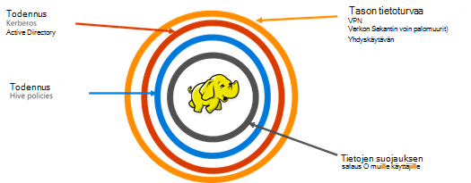

<properties
    pageTitle="Suojatun HDInsight yleiskatsaus | Microsoft Azure"
    description="Lisätietoja..."
    services="hdinsight"
    documentationCenter=""
    authors="saurinsh"
    manager="jhubbard"
    editor="cgronlun"
    tags="azure-portal"/>

<tags
    ms.service="hdinsight"
    ms.devlang="na"
    ms.topic="hero-article"
    ms.tgt_pltfrm="na"
    ms.workload="big-data"
    ms.date="10/24/2016"
    ms.author="saurinsh"/>

# Esittele toimialueeseen liittyneet HDInsight varausyksiköt (ennakkoversio)

Azure Hdinsightiin, kunnes tänään tuettu vain yhden käyttäjän paikallisen järjestelmänvalvoja. Tämä aiemmin erinomaisesti pienten sovelluksen ryhmiä tai osastot. Hadoop perusteella saadun Lisää suosion yrityksen alan työmääriä, kuten yrityksen luokka ominaisuuksia, kuten active directory-pohjaista todennus ja usean käyttäjän tuki roolista käyttöoikeuksien valvonta edellyttää tuli tärkeämpää. Käytä toimialueen liittyneet HDInsight klustereiden, voit luoda Active Directory-toimialueen HDInsight-klusterin, määrittäminen yrityksen työntekijät, jotka voi todentaa Azure Active Directoryn kirjautua HDInsight-klusterin kautta luettelo. Yrityksen ulkopuoliset ei voi kirjautua sisään tai käyttää HDInsight-klusterin. Yrityksen järjestelmänvalvoja voi määrittää roolista käytönvalvonta rakenteen suojausta käyttämällä [Apache Metsänvartijan](http://hortonworks.com/apache/ranger/), käytön rajoittaminen näin vain mahdollisimman paljon tarvittavat tiedot. Lopuksi järjestelmänvalvojan voit valvoa työntekijöiden tiedot-käyttöoikeudet ja valmis käytön ohjausobjektin käytännöt saavuttamiseksi näin niiden yritysresurssit hallinnointitapa hyvin aste muutokset.

[AZURE.NOTE]> On kuvattu esikatselussa uudet ominaisuudet ovat käytettävissä vain rakenne kuormituksen klustereiden Linux-pohjaiset Hdinsightista. Muut toiminnoista, kuten HBase, ohjattu, myrsky ja Kafka, otetaan käyttöön tulevissa versioissa. 

## Edut

Yrityksen suojaus on neljä suuri pylväiden – tietoturvaa, todennus, todennus ja salaus.

.

### Tietoturvaa

Tietoturvaa HDInsight-saavutetaan virtual verkkojen ja Gateway-palveluun. Nykyään yrityksen järjestelmänvalvoja, voit luoda HDInsight-klusterin virtual verkoston sisällä ja käyttää verkon käyttöoikeusryhmät (saapuvan tai lähtevän liikenteen säännöt) rajoittamisesta virtual verkkoon. Vain määritetyt saapuvien palomuurisäännöt IP-osoitteet voivat pitää yhteyttä HDInsight-klusterin ympäröivän avaussalasanan näin. Edustan suojausta saavutetaan Gateway-palveluun. Yhdyskäytävä on palvelu, joka toimii saapuvat pyynnöt HDInsight-klusterin linnaa ensimmäinen rivi. Se hyväksyy pyynnön, tarkistaa sen ja sallii vasta sen jälkeen siirtää solmujen klusterin, näin avaussalasanan ympäröivän nimen ja tietotyypin solmujen klusterin pyynnön.

### Todennus

Yrityksen järjestelmänvalvoja voi valmistella toimialueeseen liittyneet HDInsight-klusterin [VPN](https://azure.microsoft.com/services/virtual-network/)-tätä yleisen esikatselun avulla. HDInsight-klusterin solmut liitetään hallinnassa on käytössä yrityksen toimialueen. Tämä saavutetaan [Azure Active Directory-toimialueen palveluiden](https://technet.microsoft.com/library/cc770946.aspx)avulla. Klusterin solmut on liitetty toimialueeseen, joka hallitsee yrityksen. Tämä määritykset yrityksen työntekijöiden voit kirjautua sisään käyttämällä toimialueen käyttöoikeutensa klusterisolmut. He voivat myös käyttää toimialueen käyttöoikeutensa muiden hyväksytyn päätepisteet kuten sävyä, Ambari näkymiä, ODBC, JDBC, PowerShell ja REST API ottaa yhteyttä klusterin todentamismenetelmä. Järjestelmänvalvojalla on täydet oikeudet kautta nämä päätepisteet klusterin käyttäminen käyttäjien määrän rajoittaminen.

### Todennus

Paras käytäntö on useimmissa yrityksissä perään, että kaikki työntekijän on pääsy kaikki yrityksen resurssit. Vastaavasti tässä versiossa järjestelmänvalvoja määrittää roolista klusteriresurssien käytön käytännöt. Esimerkiksi järjestelmänvalvoja määrittää [Apache Metsänvartijan](http://hortonworks.com/apache/ranger/) , jotta voit määrittää access ohjausobjektin käytäntöjä rakenne. Tätä toimintoa, joka kertoo, että työntekijöiden voi käyttää vain yhtä paljon tietoja kuin tarvitsevat onnistuu niiden työt. Klusterin SSH käyttöä on myös rajoitettu vain järjestelmänvalvoja.

### Valvonta

Sekä suojaaminen HDInsight-klusteriresurssien luvattomia käyttäjiä ja tietojen suojaamisesta, kaikki klusteriresurssit ja tietojen käytön valvonta on tarpeen seurata luvattoman tai tahattoman Accessin resurssit. Tämä esikatselun avulla järjestelmänvalvoja voi tarkastella ja raportoi kaikki access HDInsight klusteriresursseja ja tiedot. Myös järjestelmänvalvoja voi tarkastella ja raportoi kaikki muutokset-ohjausobjektin käytäntöjen Apache Metsänvartijan tuettu päätepisteet valmis. Toimialueen liittyneet HDInsight-klusterin Etsi valvontalokien Apache Metsänvartijan tutun Käyttöliittymän avulla. Taustassa Metsänvartijan käyttää [Apache Solr]( http://hortonworks.com/apache/solr/) tallentaminen ja etsiminen lokit.

### Salaus

Tietojen suojaaminen on tärkeää kokouksen organisaation suojaus ja yhteensopivuusvaatimukset ja sekä käytön rajoittaminen tietojen luvattoman työntekijöiltä, se pitäisi myös suojata salauksen. Molemmat tietoja tallennetuista HDInsight klustereiden, Azure Blob-objektien tallennustilaan ja Azure järvi tietosäilö tue läpinäkyvä palvelinpuolen [tietojen salaamista](../storage/storage-service-encryption.md) rest-palvelussa. Suojatun klustereiden saumattomasti toimivat tämän palvelimen asiakaspuolen salausta tietojen etsiminen muiden ominaisuuksien Hdinsightista.

## Seuraavat vaiheet

- Katso määrittäminen toimialueeseen liittyneet HDInsight-klusterin [määrittäminen toimialueeseen liittyneet HDInsight klustereiden](hdinsight-domain-joined-configure.md).
- Toimialueen liittyneet HDInsight-klustereiden artikkelissa [hallita toimialueen liittyneet HDInsight klustereiden](hdinsight-domain-joined-manage.md)hallinta.
- Katso määrittämällä rakenteen käytännöt ja suorita rakenne-kyselyitä, [toimialueen liittyneet HDInsight klustereiden määrittäminen rakenne käytännöt](hdinsight-domain-joined-run-hive.md).
- Käynnissä rakenteen kyselyjen SSH-toimialueeseen liittyneet HDInsight klustereiden, katso [Käytä SSH Linux-pohjaiset Hadoop HDInsight Linux, Unix-tai OS X-ja](hdinsight-hadoop-linux-use-ssh-unix.md#connect-to-a-domain-joined-hdinsight-cluster).