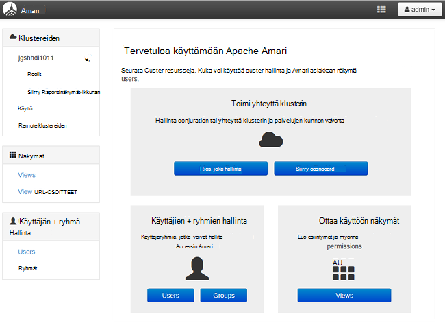

<properties
    pageTitle="Hallita toimialueen liittyneet HDInsight klustereiden | Microsoft Azure"
    description="Opi hallitsemaan toimialueen liittyneet HDInsight klustereiden"
    services="hdinsight"
    documentationCenter=""
    authors="saurinsh"
    manager="jhubbard"
    editor="cgronlun"
    tags=""/>

<tags
    ms.service="hdinsight"
    ms.devlang="na"
    ms.topic="article"
    ms.tgt_pltfrm="na"
    ms.workload="big-data"
    ms.date="10/25/2016"
    ms.author="saurinsh"/>

# Hallitse toimialueeseen liittyneet HDInsight varausyksiköt (ennakkoversio)

Lisätietoja käyttäjien ja roolien toimialueeseen liittyneet HDInsight ja kuinka voit hallita toimialueen liittyneet HDInsight klustereiden.

## Toimialueen liittyneet HDInsight klustereiden käyttäjät

HDInsight-klusteriin, joka ei ole toimialueen – liitetty on kaksi käyttäjätilit, jotka on luotu klusterin luonnin aikana:

- **Ambari järjestelmänvalvoja**: tämän tilin käytetään myös nimitystä *Hadoop-käyttäjä* tai *HTTP-käyttäjä*. Tämän tilin avulla voidaan Ambari kirjautua osoitteessa https://&lt;clustername >. azurehdinsight.net. Myös se voidaan suorittaa kyselyjä Ambari näkymissä ja suorittaa ulkoiset työkalut (eli PowerShell, Templeton, Visual Studio) kautta todentamismenetelmä rakenne ODBC-ohjaimen ja Liiketoimintatieto-työkaluista (kuten Excel, PowerBI tai Tableau).

- **SSH käyttäjä**: Tämä tili voidaan käyttää SSH ja suorittaa sudo komentoja. Siinä on Linux VMs pääkansion oikeudet.

Toimialueen liittyneet HDInsight-klusterin on kolmen uusille käyttäjille lisäksi Ambari järjestelmänvalvoja ja SSH käyttäjän.

- **Metsänvartijan järjestelmänvalvoja**: Tämä tili on Apache Metsänvartijan paikallisen järjestelmänvalvojatilin. Se ei ole active directory-toimialuekäyttäjä. Määritä käytännöt ja tee muut käyttäjät Järjestelmänvalvojat tai valtuutettujen järjestelmänvalvojien (niin, että käyttäjät voivat hallita käytännöt) avulla voidaan tähän tiliin. Oletusarvon mukaan käyttäjänimi on *järjestelmänvalvojan* ja salasana on sama kuin Ambari järjestelmänvalvojan salasanan. Salasanan voi päivittää Metsänvartijan asetukset-sivulta.

- **Klusterin järjestelmänvalvojan toimialuekäyttäjä**: Tämä tili on toimialueen active directory-käyttäjän sovelluksen mukaan lukien Ambari ja Metsänvartijan Hadoop-klusterin järjestelmänvalvoja. Klusterin luonnin aikana, sinun on annettava tämän käyttäjän tunnistetiedot. Käyttäjän on seuraavat oikeudet:

    - Liity koneet toimialueen ja sijoittaa ne, jotka määrität klusterin luonnin aikana OU.
    - Luo palvelun ansaitun sisällä OU, jotka määrität klusterin luonnin aikana. 
    - Luo käänteinen DNS-tapahtumat.

    Huomautus AD-käyttäjiä on myös nämä oikeudet. 

    On joitakin päätepisteestä sisällä klusterin (esimerkiksi Templeton), joka hallitsee ei Metsänvartijan ja näin ollen ei ole suojattu. Nämä päätepisteestä lukittu lukuun ottamatta klusterin järjestelmänvalvojan toimialuekäyttäjän kaikille käyttäjille. 

- **Tavallinen**: klusterin luonnin aikana voidaan lisätä useita active directory-ryhmä. Käyttäjien ryhmiin synkronoidaan Metsänvartijan ja Ambari. Nämä käyttäjät ovat Toimialuekäyttäjät ja voi käyttää vain Metsänvartijan hallitun päätepisteet (esimerkiksi Hiveserver2). RBAC käytännöt ja valvonta on sovellettava nämä käyttäjät.

## Toimialueen liittyneet HDInsight klustereiden roolit

Toimialueen liittyneet Hdinsightista on seuraavia rooleja:

- Klusterin järjestelmänvalvojaan
- Klusterin operaattori
- Palvelun järjestelmänvalvoja
- Palvelun operaattori
- Klusterin käyttäjä

**Jos haluat nähdä roolien käyttöoikeudet**

1. Avaa Ambari hallinnan Käyttöliittymä.  Katso [Avaa Ambari hallinnan Käyttöliittymä](#open-the-ambari-management-ui).
2. Valitse vasemmanpuoleisessa valikossa **roolit**.
3. Valitse sininen kysymysmerkki oikeudet:

    

## Avaa Ambari hallinnan Käyttöliittymä

1. Kirjaudu [Azure portaaliin](https://portal.azure.com).
2. Avaa HDInsight-klusterin sivu. Katso [luettelo- ja Näytä klustereiden](hdinsight-administer-use-management-portal.md#list-and-show-clusters).
3. Valitse **raporttinäkymät-ikkunan** yläreunan valikosta Avaa Ambari.
4. Kirjaudu Ambari klusterin järjestelmänvalvojan toimialueen käyttäjänimen ja salasanan.
5. Valitse oikeassa yläkulmassa **järjestelmänvalvoja** avattava valikko ja valitse sitten **Hallitse Ambari**.

    

    Käyttöliittymä näyttää seuraavanlaiselta:

    

## Luettele Active Directoryssa synkronoitujen Toimialuekäyttäjät

1. Avaa Ambari hallinnan Käyttöliittymä.  Katso [Avaa Ambari hallinnan Käyttöliittymä](#open-the-ambari-management-ui).
2. Valitse vasemmanpuoleisessa valikossa **käyttäjät**. Kaikki käyttäjät, jotka on synkronoitu Active Directorysta HDInsight-klusteriin on artikkelissa.

    

## Active Directoryssa synkronoitujen toimialueryhmien luettelo

1. Avaa Ambari hallinnan Käyttöliittymä.  Katso [Avaa Ambari hallinnan Käyttöliittymä](#open-the-ambari-management-ui).
2. Valitse **ryhmät**vasemmasta valikosta. Näet on synkronoitu Active Directorysta HDInsight-klusterin kaikki ryhmät.

    

## Rakenne-näkymien käyttöoikeuksien määrittäminen

1. Avaa Ambari hallinnan Käyttöliittymä.  Katso [Avaa Ambari hallinnan Käyttöliittymä](#open-the-ambari-management-ui).
2. Valitse vasemmasta valikosta **näkymiä**.
3. Valitse Näytä tiedot **rakenne** .

    

4. Valitse **Rakenne näkymän** linkittäminen rakenne näkymien määrittäminen.
5. Vieritä **käyttöoikeudet** -osaan.

    

6. **Lisää käyttäjä** tai **Ryhmä, Lisää**ja määritä sitten niiden käyttäjien tai ryhmien, voit käyttää rakenne näkymiä. 

## Käyttäjien roolien määrittäminen

 Luettelo roolit ja käyttöoikeudet-kohdassa [toimialueen roolit liittyneet HDInsight klustereiden](#roles-of-domain---joined-hdinsight-clusters).

1. Avaa Ambari hallinnan Käyttöliittymä.  Katso [Avaa Ambari hallinnan Käyttöliittymä](#open-the-ambari-management-ui).
2. Valitse vasemmanpuoleisessa valikossa **roolit**.
3. Valitse **Lisää käyttäjä** tai **Lisää ryhmä** , jos haluat määrittää käyttäjille ja ryhmille eri rooleja.
 
## Seuraavat vaiheet

- Katso määrittäminen toimialueeseen liittyneet HDInsight-klusterin [määrittäminen toimialueeseen liittyneet HDInsight klustereiden](hdinsight-domain-joined-configure.md).
- Katso määrittämällä rakenteen käytännöt ja suorita rakenne-kyselyitä, [toimialueen liittyneet HDInsight klustereiden määrittäminen rakenne käytännöt](hdinsight-domain-joined-run-hive.md).
- Käynnissä rakenteen kyselyjen SSH-toimialueeseen liittyneet HDInsight klustereiden, katso [Käytä SSH Linux-pohjaiset Hadoop HDInsight Linux, Unix-tai OS X-ja](hdinsight-hadoop-linux-use-ssh-unix.md#connect-to-a-domain-joined-hdinsight-cluster).
