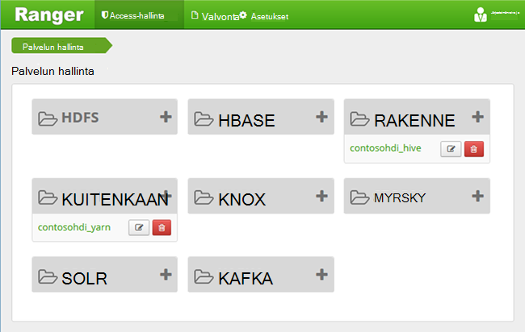
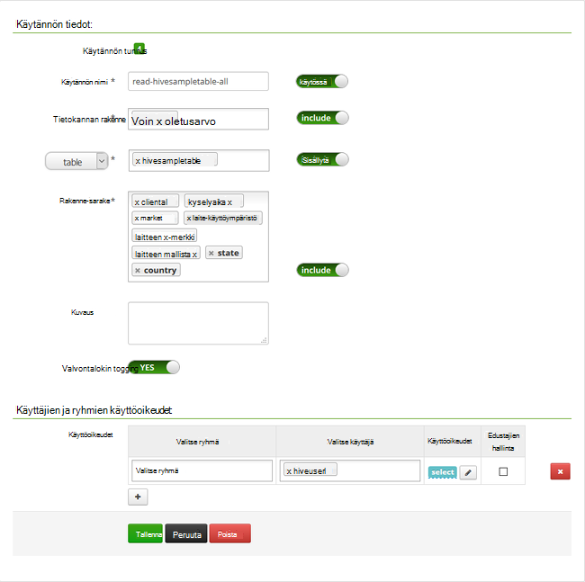

<properties
    pageTitle="Rakenteen käytännöt määrittäminen toimialueeseen liittyneet HDInsight | Microsoft Azure"
    description="Lisätietoja..."
    services="hdinsight"
    documentationCenter=""
    authors="saurinsh"
    manager="jhubbard"
    editor="cgronlun"
    tags="azure-portal"/>

<tags
    ms.service="hdinsight"
    ms.devlang="na"
    ms.topic="hero-article"
    ms.tgt_pltfrm="na"
    ms.workload="big-data"
    ms.date="10/25/2016"
    ms.author="saurinsh"/>

# Rakenteen käytäntöjen määrittäminen toimialueeseen liittyneet HDInsight (ennakkoversio)

Opettele Apache Metsänvartijan käytäntöjen määrittäminen rakenne. Tässä artikkelissa Luo kaksi käytön rajoittaminen hivesampletable Metsänvartijan käytännöt. Hivesampletable sisältyy HDInsight klustereiden. Sen jälkeen, kun olet määrittänyt käytäntöjä, käytä Excel- ja ODBC-ohjain muodostaa HDInsight rakenne-taulukoihin.

## Edellytykset

- Toimialueen liittyneet HDInsight-klusterin. Katso [määrittäminen toimialueeseen liittyneet HDInsight klustereiden](hdinsight-domain-joined-configure.md).
- Office 2016, Office 2013 Professional Plus, Office 365 Pro Plus, Excel 2013: n erillisversio tai Office 2010 Professional Plus työasemassa.

## Yhteyden muodostaminen Apache Metsänvartijan järjestelmänvalvojan Käyttöliittymä

**Muodosta yhteys Metsänvartijan järjestelmänvalvojan Käyttöliittymä**

1. Selaimesta Muodosta yhteys Metsänvartijan järjestelmänvalvojan Käyttöliittymä. URL-osoite on https://&lt;ClusterName >.azurehdinsight.net/Ranger/. 

    >[AZURE.NOTE] Metsänvartijan käyttää eri tunnistetietoja kuin Hadoop-klusterin. Voit estää selaimet välimuistiin Hadoop-tunnistetiedoilla Metsänvartijan järjestelmänvalvojan Käyttöliittymä muodostaa inprivate selainikkunassa avulla.
4. Kirjaudu sisään klusterin järjestelmänvalvojan toimialueen käyttäjänimen ja salasanan avulla:

    

    Metsänvartijan toimii tällä hetkellä vain kuitenkaan ja rakenteen kanssa.

## Luo Toimialuekäyttäjät

[Määrittää toimialueen liittyneet HDInsight klustereiden](hdinsight-domain-joined-configure.md#create-and-configure-azure-ad-ds-for-your-azure-ad)luomasi hiveruser1 ja hiveuser2. Voit käyttää kahta käyttäjätili Tässä opetusohjelmassa.

## Luo Metsänvartijan käytännöt

Tässä osiossa luot kaksi Metsänvartijan käytännöt käyttämiseen hivesampletable. Valitse käyttöoikeuden antaminen erilaisia sarakkeita. Molemmat käyttäjät on luotu [määrittäminen toimialueeseen liittyneet HDInsight](hdinsight-domain-joined-configure.md#create-and-configure-azure-ad-ds-for-your-azure-ad)klustereissa.  Seuraavan osion testaat kaksi käytännöt Excelissä.

**Jos haluat luoda Metsänvartijan käytäntöjä**

1. Avaa Metsänvartijan järjestelmänvalvojan Käyttöliittymä. Katso [Apache Metsänvartijan järjestelmänvalvojan Käyttöliittymä yhdistäminen](#connect-to-apache-ranager-admin-ui).
2. Valitse ** &lt;ClusterName > _hive**, valitse **rakenne**. Näet on kaksi määrittäminen valmiiksi käytännöt.
3. Valitse **Lisää uusi käytäntö**ja kirjoita sitten seuraavat arvot:

    - Käytännön nimi: luku hivesampletable all-
    - Tietokannan rakenne: oletusarvo
    - taulukko: hivesampletable
    - Sarakkeen rakenne: *
    - Valitse käyttäjä: hiveuser1
    - Käyttöoikeudet: Valitse

    .

    >[AZURE.NOTE] Jos toimialuekäyttäjä ei ole täytetty Valitse käyttäjä, odota hetki Metsänvartijan mobiililaitteesi kanssa AAD varten.

4. Valitse **Lisää** Tallenna käytännön.
5. Toista kaksi luoda toisen käytännön seuraavat ominaisuudet:

    - Käytännön nimi: luku-hivesampletable-devicemake
    - Tietokannan rakenne: oletusarvo
    - taulukko: hivesampletable
    - Sarakkeen rakenne: clientid, devicemake
    - Valitse käyttäjä: hiveuser2
    - Käyttöoikeudet: Valitse

## Luo rakenne ODBC-tietolähde

Ohjeita löytyvät [luominen rakenne ODBC-tietolähde](hdinsight-connect-excel-hive-odbc-driver.md).  

    Ominaisuus|Kuvaus
    ---|---
    Tietolähteen nimi|Kirjoita tietolähteen nimi
    Host (isäntä)|Kirjoita &lt;HDInsightClusterName >. azurehdinsight.net. Esimerkiksi myHDICluster.azurehdinsight.net
    Port (portti)|Käytä <strong>443</strong>. (Tämä portti on vaihdettu-563 443.)
    Tietokannan|Käytä <strong>Oletus</strong>.
    Rakenne-palvelintyyppi|Valitse <strong>rakenne palvelimen 2</strong>
    Järjestelmä|Valitse <strong>Azure HDInsight-palvelu</strong>
    HTTP-polku|Jätä se tyhjäksi.
    Käyttäjänimi|Kirjoita hiveuser1@contoso158.onmicrosoft.com. Päivitä toimialuenimi, jos se ei ole.
    Salasana|Kirjoita salasana hiveuser1.
    </table>

Varmista ennen tiedoston tallentamista tietolähteeseen valitsemalla **Testaa** .

##Tietojen tuominen Excel-HDInsight

Viimeisessä osassa on määritetty kaksi käytännöt.  hiveuser1 on select-oikeus kaikki sarakkeet ja hiveuser2 on kaksi saraketta select-käyttöoikeutta. Tässä osassa tekeytyminen kaksi käyttäjää, voit tuoda tietoja Exceliin.

1. Avaa uusi tai aiemmin luotu työkirja Excelissä.
2. Valitse **tiedot** -välilehdessä **muista tietojen**lähteistä ja valitse sitten **Ohjattu tietoyhteyden muodostaminen** käynnistää **Ohjatun tietoyhteyden muodostamisen**.

    ! [Avaa ohjattu tietoyhteyden muodostaminen] [img-hdi-simbahiveodbc.excel.dataconnection]

3. Valitse **ODBC DSN** tietolähteenä, ja valitse sitten **Seuraava**.
4. ODBC-tietolähteistä Valitse tietolähteen nimi, jonka loit edellisessä vaiheessa ja valitse sitten **Seuraava**.
5. Kirjoita ohjatussa klusterin salasana uudelleen ja valitse sitten **OK**. Odota, **Valitse tietokanta ja taulukko** -valintaikkunassa Avaa. Tämä voi kestää joitakin sekunteja.
8. Valitse **hivesampletable**ja valitse sitten **Seuraava**. 
8. Valitse **Valmis**.
9. **Tietojen tuominen** -valintaikkunassa voit muuttaa tai määrittää kyselyn. Voit tehdä sen valitsemalla **Ominaisuudet**. Tämä voi kestää joitakin sekunteja. 
10. Valitse **määritys** -välilehti. Komennon teksti on:

        SELECT * FROM "HIVE"."default"."hivesampletable"

    Määrittämäsi Metsänvartijan käytäntöjä mukaan hiveuser1 on select-käyttöoikeutta kaikki sarakkeet.  Niin tämä kysely toimii hiveuser1 käyttäjän tunnistetiedot, mutta tämä kysely ei ole ei toimi hiveuser2 käyttäjän tunnistetiedot.

    ! [Yhteyden ominaisuudet] [img-hdi-simbahiveodbc-excel-connectionproperties]

11. Valitse Sulje yhteyden ominaisuudet-valintaikkunassa **OK** .
12. Valitse **OK** ja sulje **Tuontitiedot** -valintaikkuna.  
13. Kirjoita hiveuser1 salasana ja valitse sitten **OK**. Kestää joitakin sekunteja, ennen kuin tiedot saa tuotu Exceliin. Kun se on valmis, näet on 11 tietosaraketta.

Voit testata toisen käytännön (luku-hivesampletable-devicemake) luomasi viimeisessä osassa

1. Lisää uusi taulukko Excelissä.
2. Noudata edellisen tuo tiedot.  Ainoa muutos tehdään on hiveuser2 käyttäjän tunnistetietojen sijaan hiveuser1's. Epäonnistuu, koska hiveuser2 on vain oikeuden tarkastella kaksi saraketta. On saat seuraavan virheilmoituksen:

        [Microsoft][HiveODBC] (35) Error from Hive: error code: '40000' error message: 'Error while compiling statement: FAILED: HiveAccessControlException Permission denied: user [hiveuser2] does not have [SELECT] privilege on [default/hivesampletable/clientid,country ...]'.

3. Toimi voit tuoda tietoja. Tällä hetkellä käyttää hiveuser2 käyttäjän tunnistetietoja ja muokata myös select-lauseen kohteesta:

        SELECT * FROM "HIVE"."default"."hivesampletable"

    seuraavasti:

        SELECT clientid, devicemake FROM "HIVE"."default"."hivesampletable"

    Kun se on valmis, näet on kaksi saraketta, tiedot on tuotu.

## Seuraavat vaiheet

- Katso määrittäminen toimialueeseen liittyneet HDInsight-klusterin [määrittäminen toimialueeseen liittyneet HDInsight klustereiden](hdinsight-domain-joined-configure.md).
- Toimialueen liittyneet HDInsight-klustereiden artikkelissa [hallita toimialueen liittyneet HDInsight klustereiden](hdinsight-domain-joined-manage.md)hallinta.
- Käynnissä rakenteen kyselyjen SSH-toimialueeseen liittyneet HDInsight klustereiden, katso [Käytä SSH Linux-pohjaiset Hadoop HDInsight Linux, Unix-tai OS X-ja](hdinsight-hadoop-linux-use-ssh-unix.md#connect-to-a-domain-joined-hdinsight-cluster).
- Yhteyden rakenne käyttämällä rakenne JDBC-aiheessa [yhteyden muodostaminen rakenne JDBC ohjaimen Azure HDInsight-rakenne](hdinsight-connect-hive-jdbc-driver.md)
- Yhdistäminen Excel Hadoop käyttämällä rakenne ODBC-kohdassa [Connect Excel to Microsoft rakenne ODBC-asema Hadoop Excelin](hdinsight-connect-excel-hive-odbc-driver.md)
- Muodostaa yhteyden Excel Hadoop Power Queryn avulla, kohdassa [Yhteyden Excelin Hadoop Power Queryn avulla](hdinsight-connect-excel-power-query.md)