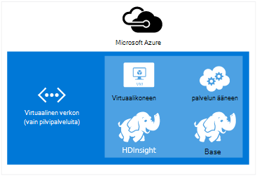
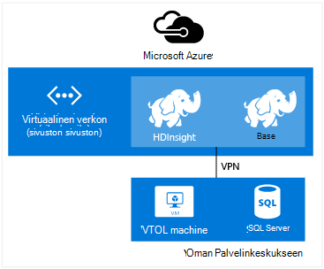
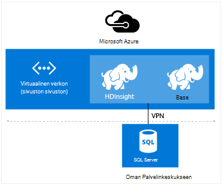

<properties
    pageTitle="Laajentaa HDInsight Virtual verkossa | Microsoft Azure"  
    description="Opettele käyttämään Azure Virtual Network HDInsight muodostaa muiden cloud resurssit tai resurssit-että palvelinkeskukseen"
    services="hdinsight"
    documentationCenter=""
    authors="Blackmist"
    manager="jhubbard"
    editor="cgronlun"/>

<tags
   ms.service="hdinsight"
   ms.devlang="na"
   ms.topic="article"
   ms.tgt_pltfrm="na"
   ms.workload="big-data"
   ms.date="10/21/2016"
   ms.author="larryfr"/>


#<a name="extend-hdinsight-capabilities-by-using-azure-virtual-network"></a>Laajentaa HDInsight ominaisuuksia käyttämällä Azure Virtual verkossa

Azure Virtual Network avulla voit laajentaa Hadoop ratkaisujen lisääminen paikalliseen resurssit, kuten SQL Server, yhdistää useita HDInsight-klusterin tyyppejä tai luoda suojatun verkot resurssien pilveen välillä.

[AZURE.INCLUDE [upgrade-powershell](../../includes/hdinsight-use-latest-powershell-and-cli.md)]


##<a id="whatis"></a>Mikä on Azure Virtual verkossa?

[Azure Virtual Network](https://azure.microsoft.com/documentation/services/virtual-network/) avulla voit luoda suojatun, pysyvä verkon sisältämiä ratkaisu tarvitaan resursseja. Virtuaalinen verkon avulla voit:

* Yhdistä cloud resurssien yhdessä (vain cloud) yksityisverkon.

    

    Linkki Azure Hdinsightiin Azure-palvelun VPN avulla ottaa käyttöön seuraavissa tilanteissa:

    * **Käynnistettäessä HDInsight-palveluja tai työt** Azure sivustoja tai Azuren näennäiskoneiden palveluita.

    * **Siirretään suoraan tietojen** HDInsight ja Azure SQL-tietokanta, SQL Server tai tietojen tallennustilan ratkaisu virtual tietokoneessa käynnissä välillä.

    * **Yhdistämällä useita HDInsight-palvelimia** yksittäiseksi ratkaisuksi. HDInsight klustereiden olla erilaisia tyypit, jotka vastaavat työmäärää tai tekniikka, joka on optimoitu klusterin. Ei ole tuettu menetelmä luo klusteriin, joka yhdistää useita tyyppejä, kuten myrsky ja HBase yhden klusterissa. Virtuaalinen verkon avulla useita klustereiden suoraan keskenään.

* Yhdistäminen pilveen resurssien paikallisen palvelinkeskuksen verkkoon (sivusto sivusto tai pisteen sivuston) näennäisen yksityisverkon (VPN).

    Sivuston sivuston määritysten avulla voit muodostaa useita resursseja oman palvelinkeskuksen Azure virtual verkon laitteiston VPN tai reititys- ja -palvelun avulla.

    

    Pisteen sivuston asetusten avulla voit muodostaa Azure virtual verkkoon tietyn resurssin ohjelmisto VPN-yhteyttä käyttämällä.

    

    Vastaavat skenaariot työnkulkuun vain pilvipalveluita käyttämällä VPN-linkki pilveen ja että palvelinkeskuksen avulla. Mutta sen sijaan, että rajoitettu käsittelyn resurssien pilveen, voit myös käyttää resurssien oman joten.

    * **Siirretään suoraan tietojen** HDInsight ja että palvelinkeskuksen välillä. Esimerkki siirtäminen tai SQL Server tai liiketoiminta-(LOB)-sovelluksen luoma tietojen lukeminen Sqoop avulla.

    * **Käynnistettäessä HDInsight-palveluja tai työt** LOB-sovelluksesta. Esimerkki käyttää HBase Java ohjelmointirajapinnan tallentamiseen ja tietojen noutaminen HDInsight HBase-klusterin.

Lisätietoja VPN-ominaisuuksia, edut ja ominaisuuksista on artikkelissa [Azure Virtual Network yleiskatsaus](../virtual-network/virtual-networks-overview.md).

> [AZURE.NOTE] Sinun on luotava Azure Virtual Network ennen valmistelu HDInsight-klusterin. Lisätietoja on artikkelissa [VPN-määritystehtäviä](https://azure.microsoft.com/documentation/services/virtual-network/).

## <a name="virtual-network-requirements"></a>Virtuaalinen verkko-vaatimukset

> [AZURE.IMPORTANT] HDInsight-klusterin luominen Virtual verkon vaatii tietyn VPN-määrityksiä, joka on kuvattu tämän osion.

###<a name="location-based-virtual-networks"></a>Sijaintiin perustuva Virtual verkot

Azure Hdinsightiin tukee vain sijainti-virtual verkkojen ja ei ole tällä hetkellä toimi virtual verkkojen affiniteetti ryhmään perustuen.

###<a name="classic-or-v2-virtual-network"></a>Perinteinen tai v2 Virtual verkossa

Windows-pohjaisesta klustereiden edellyttävät perinteinen Virtual verkossa, kun Linux-pohjaiset klustereiden käytettävä Azure Resurssienhallinta Virtual Network. Jos sinulla ei ole tyyppi on oikea verkon, se ei voi käyttää klusterin luodessasi.

Jos resurssien Virtual verkossa, joka ei ole käytettävissä klusterin aiot luominen, Luo uusi Virtual verkkoon, joka on käytettävissä klusterin ja muodosta yhteys ei ole yhteensopiva Virtual verkkoon. Voit luoda klusterin verkko-versiossa, joka edellyttää ja se voi käyttää resursseja muiden verkko-jälkeen kahden liitettyinä. Lisätietoja yhdistämisestä perinteinen ja uusi Virtual verkoissa on artikkelissa [yhteyden perinteinen VNets, uusi VNets](../vpn-gateway/vpn-gateway-connect-different-deployment-models-portal.md).

###<a name="custom-dns"></a>Mukautettu DNS

Virtual verkon luotaessa Azure on oletusarvoinen nimenselvitys Azure Hdinsightiin palveluihin, jotka asennetaan verkossa. Mutta joudut ehkä käyttää tilanteissa, kuten cross verkon toimialuenimen selvitys omia DNS Domain Name System (). Kun viestintä-palveluiden välillä sijaitsevat kaksi liitetty esimerkiksi virtual verkot. HDInsight tukee oletusarvon Azure nimenselvitys sekä mukautetut DNS Azure Virtual Network käytettäessä.

Lisätietoja DNS-palvelimen käyttäminen Azure Virtual Network [Nimenselvitys VMs ja roolin esiintymät](../virtual-network/virtual-networks-name-resolution-for-vms-and-role-instances.md#name-resolution-using-your-own-dns-server) asiakirjan kohdassa __nimenselvitys käyttämällä DNS-palvelimeen__ .

###<a name="secured-virtual-networks"></a>Suojattu Virtual verkoissa

HDInsight-palvelu on hallittujen palvelu ja tarvitaan Internet-yhteyttä aikana valmistelu ja suorituksen aikana. Tämä on niin, että Azure valvoa kunto klusterin aloittaa automaattisesti klusterin resursseja, skaalauksen toimintojen klusterissa ja muita hallintatehtäviä solmujen määrän muuttaminen.

Jos haluat asentaa HDInsight suojatun Virtual verkostoon, sinun on sallittava saapuvan seuraavia IP-osoitteet, jotka mahdollistavat Azure HDInsight-klusterin hallittavan portti 443.

* 168.61.49.99
* 23.99.5.239
* 168.61.48.131
* 138.91.141.162

Saapuvien käytöltä porttiin 443 nämä osoitteet salliminen avulla voit asentaa HDInsight suojatun virtual verkostoon.

> [AZURE.IMPORTANT] HDInsight ei tue rajoittaminen lähtevän tietoliikenteen vain saapuvan liikenteen. Verkko-käyttöoikeusryhmän säännöt, joka sisältää HDInsight aliverkon määritettäessä vain sellaisia saapuvan liikenteen säännöt.

Seuraavissa esimerkeissä kuvataan, miten voit luoda uuden verkon käyttöoikeusryhmän, joka sallii tarvittavat osoitteet ja koskee käyttöoikeusryhmän aliverkon Virtual verkossa oleville. Näissä vaiheissa oletetaan, että olet jo luonut VPN ja aliverkon, johon haluat asentaa HDInsight kyselyjä.

__Azure PowerShellin avulla__

    $vnetName = "Replace with your virtual network name"
    $resourceGroupName = "Replace with the resource group the virtual network is in"
    $subnetName = "Replace with the name of the subnet that HDInsight will be installed into"
    # Get the Virtual Network object
    $vnet = Get-AzureRmVirtualNetwork `
        -Name $vnetName `
        -ResourceGroupName $resourceGroupName
    # Get the region the Virtual network is in.
    $location = $vnet.Location
    # Get the subnet object
    $subnet = $vnet.Subnets | Where-Object Name -eq $subnetName
    # Create a new Network Security Group.
    # And add exemptions for the HDInsight health and management services.
    $nsg = New-AzureRmNetworkSecurityGroup `
        -Name "hdisecure" `
        -ResourceGroupName $resourceGroupName `
        -Location $location `
        | Add-AzureRmNetworkSecurityRuleConfig `
            -name "hdirule1" `
            -Description "HDI health and management address 168.61.49.99" `
            -Protocol "*" `
            -SourcePortRange "*" `
            -DestinationPortRange "443" `
            -SourceAddressPrefix "168.61.49.99" `
            -DestinationAddressPrefix "VirtualNetwork" `
            -Access Allow `
            -Priority 300 `
            -Direction Inbound `
        | Add-AzureRmNetworkSecurityRuleConfig `
            -Name "hdirule2" `
            -Description "HDI health and management 23.99.5.239" `
            -Protocol "*" `
            -SourcePortRange "*" `
            -DestinationPortRange "443" `
            -SourceAddressPrefix "23.99.5.239" `
            -DestinationAddressPrefix "VirtualNetwork" `
            -Access Allow `
            -Priority 301 `
            -Direction Inbound `
        | Add-AzureRmNetworkSecurityRuleConfig `
            -Name "hdirule3" `
            -Description "HDI health and management 168.61.48.131" `
            -Protocol "*" `
            -SourcePortRange "*" `
            -DestinationPortRange "443" `
            -SourceAddressPrefix "168.61.48.131" `
            -DestinationAddressPrefix "VirtualNetwork" `
            -Access Allow `
            -Priority 302 `
            -Direction Inbound `
        | Add-AzureRmNetworkSecurityRuleConfig `
            -Name "hdirule4" `
            -Description "HDI health and management 138.91.141.162" `
            -Protocol "*" `
            -SourcePortRange "*" `
            -DestinationPortRange "443" `
            -SourceAddressPrefix "138.91.141.162" `
            -DestinationAddressPrefix "VirtualNetwork" `
            -Access Allow `
            -Priority 303 `
            -Direction Inbound
    # Set the changes to the security group
    Set-AzureRmNetworkSecurityGroup -NetworkSecurityGroup $nsg
    # Apply the NSG to the subnet
    Set-AzureRmVirtualNetworkSubnetConfig `
        -VirtualNetwork $vnet `
        -Name $subnetName `
        -AddressPrefix $subnet.AddressPrefix `
        -NetworkSecurityGroupId $nsg

__Azure CLI käyttäminen__

1. Seuraavalla komennolla voit luoda uuden verkko-käyttöoikeusryhmän nimeltä `hdisecure`. Korvaa __RESOURCEGROUPNAME__ ja __sijainnin__ , joka sisältää Azure virtuaaliverkko- ja sijainti (alue), joka on luotu ryhmän resurssiryhmä.

        azure network nsg create RESOURCEGROUPNAME hdisecure LOCATION
    
    Kun ryhmä on luotu, saat lisätietoja uuteen ryhmään. Etsi seuraavankaltaiselta rivi ja tallentaa `/subscriptions/GUID/resourceGroups/RESOURCEGROUPNAME/providers/Microsoft.Network/networkSecurityGroups/hdisecure` tiedot. Sitä käytetään myöhemmin.
    
        data:    Id                              : /subscriptions/GUID/resourceGroups/RESOURCEGROUPNAME/providers/Microsoft.Network/networkSecurityGroups/hdisecure

2. Sääntöjen lisääminen uusi verkko-käyttöoikeusryhmän, jotka sallivat saapuvien tiedonsiirron porttiin 443 Azure Hdinsightiin terveys- ja palvelun seuraavat avulla. Korvaa __RESOURCEGROUPNAME__ resurssiryhmän, joka sisältää Azure Virtual verkon nimi.

        azure network nsg rule create RESOURCEGROUPNAME hdisecure hdirule1 -p "*" -o "*" -u "443" -f "168.61.49.99" -e "VirtualNetwork" -c "Allow" -y 300 -r "Inbound"
        azure network nsg rule create RESOURCEGROUPNAME hdisecure hdirule2 -p "*" -o "*" -u "443" -f "23.99.5.239" -e "VirtualNetwork" -c "Allow" -y 301 -r "Inbound"
        azure network nsg rule create RESOURCEGROUPNAME hdisecure hdirule3 -p "*" -o "*" -u "443" -f "168.61.48.131" -e "VirtualNetwork" -c "Allow" -y 302 -r "Inbound"
        azure network nsg rule create RESOURCEGROUPNAME hdisecure hdirule4 -p "*" -o "*" -u "443" -f "138.91.141.162" -e "VirtualNetwork" -c "Allow" -y 303 -r "Inbound"

3. Kun säännöt on luotu, lisätä uuden verkko-käyttöoikeusryhmän aliverkon käyttämällä seuraavia. Korvaa __RESOURCEGROUPNAME__ resurssiryhmän, joka sisältää Azure Virtual verkon nimi. Korvaa __VNETNAME__ ja __SUBNETNAME__ nimi ja Azure Virtual verkon aliverkon, jota käytetään, kun asennat Hdinsightista.

        azure network vnet subnet set RESOURCEGROUPNAME VNETNAME SUBNETNAME -w "/subscriptions/GUID/resourceGroups/RESOURCEGROUPNAME/providers/Microsoft.Network/networkSecurityGroups/hdisecure"
    
    Kun toiminto on valmis, voit asentaa HDInsight onnistuneesti käyttää näitä ohjeita aliverkon suojatun Virtual verkostoon.

> [AZURE.IMPORTANT] Voit käyttää edellä mainitut vaiheet vain Avaa käyttöoikeus HDInsight terveys- ja palvelun Azure pilveen. Näin voit asentaa onnistuneesti HDInsight-klusterin aliverkon, mutta HDInsight-klusterin ulkopuolella Virtual verkon käyttö on estetty oletusarvon mukaan. Sinun on Lisää verkko-käyttöoikeusryhmän lisäsääntöjä, jos haluat ottaa käyttöön käytöltä Virtual verkon ulkopuolelta.
>
> Esimerkiksi Salli SSH käyttää Internetistä, tarvitset lisää sääntö seuraavankaltaiselta: 
>
> * Azure PowerShell-```Add-AzureRmNetworkSecurityRuleConfig -Name "SSSH" -Description "SSH" -Protocol "*" -SourcePortRange "*" -DestinationPortRange "22" -SourceAddressPrefix "*" -DestinationAddressPrefix "VirtualNetwork" -Access Allow -Priority 304 -Direction Inbound```
> * Azure CLI-```azure network nsg rule create RESOURCEGROUPNAME hdisecure hdirule4 -p "*" -o "*" -u "22" -f "*" -e "VirtualNetwork" -c "Allow" -y 304 -r "Inbound"```

Lisätietoja verkko-käyttöoikeusryhmät on artikkelissa [verkon käyttöoikeusryhmät yleiskatsaus](../virtual-network/virtual-networks-nsg.md). Lisätietoja rajoittamisesta reititys Azure Virtual verkossa on artikkelissa [käyttäjän määrittämät tiet, IP lähettäminen edelleen](../virtual-network/virtual-networks-udr-overview.md).

##<a id="tasks"></a>Tehtävät ja tiedot

Tässä osassa on yleisiä tehtäviä ja tietosi, voit joutua käytettäessä HDInsight virtual verkoston kanssa.

###<a name="determine-the-fqdn"></a>Määrittää FQDN

HDInsight-klusterin määritetään tietyt täydellinen toimialuenimi (FQDN) VPN-liittymän. Tämä on osoite, sinun on käytettävä muodostettaessa yhteyttä klusterin muista resursseista virtual verkossa. Voit selvittää FQDN kyselyn Ambari hallintapalvelun URL-Osoitteen seuraavasti avulla:

    https://<clustername>.azurehdinsight.net/ambari/api/v1/clusters/<clustername>.azurehdinsight.net/services/<servicename>/components/<componentname>

> [AZURE.NOTE] Katso lisätietoja Ambari käyttämisestä HDInsight- [näytön Hadoop varausyksiköt Ambari Ohjelmointirajapinnan käyttäminen Hdinsightista](hdinsight-monitor-use-ambari-api.md).

Määritä klusterinimeä ja palvelun ja klusterin, kuten kuitenkaan Resurssienhallinta-osa.

> [AZURE.NOTE] Tietoja on JavaScript Object Notation (JSON) asiakirja, jossa on tietoja siitä, että osa. Voit purkaa vain FQDN olisi käyttämällä JSON-jäsentimen noutaa `host_components[0].HostRoles.host_name` arvo.

Esimerkiksi palauttamaan FQDN HDInsight Hadoop-klusterin, voit tehdä jollakin seuraavista tavoista tietojen noutaminen kuitenkaan Resurssienhallinta:

* [Azure PowerShell](../powershell-install-configure.md)

        $ClusterDnsName = <clustername>
        $Username = <cluster admin username>
        $Password = <cluster admin password>
        $DnsSuffix = ".azurehdinsight.net"
        $ClusterFQDN = $ClusterDnsName + $DnsSuffix

        $webclient = new-object System.Net.WebClient
        $webclient.Credentials = new-object System.Net.NetworkCredential($Username, $Password)

        $Url = "https://" + $ClusterFQDN + "/ambari/api/v1/clusters/" + $ClusterFQDN + "/services/yarn/     components/resourcemanager"
        $Response = $webclient.DownloadString($Url)
        $JsonObject = $Response | ConvertFrom-Json
        $FQDN = $JsonObject.host_components[0].HostRoles.host_name
        Write-host $FQDN

* [cURL](http://curl.haxx.se/) ja [jq](http://stedolan.github.io/jq/)

        curl -G -u <username>:<password> https://<clustername>.azurehdinsight.net/ambari/api/v1/clusters/<clustername>.azurehdinsight.net/services/yarn/components/resourcemanager | jq .host_components[0].HostRoles.host_name

###<a name="connecting-to-hbase"></a>Yhteyden muodostaminen HBase

Muodostaa yhteyden HBase etäyhteyden avulla Java-Ohjelmointirajapinta, määrittää HBase-klusterin ZooKeeper quorum-osoitteet ja määrittää tämän sovelluksen.

Saat ZooKeeper quorum osoite-Käytä kyselyn Ambari hallintapalvelun jollakin seuraavista tavoista:

* [Azure PowerShell](../powershell-install-configure.md)

        $ClusterDnsName = <clustername>
        $Username = <cluster admin username>
        $Password = <cluster admin password>
        $DnsSuffix = ".azurehdinsight.net"
        $ClusterFQDN = $ClusterDnsName + $DnsSuffix

        $webclient = new-object System.Net.WebClient
        $webclient.Credentials = new-object System.Net.NetworkCredential($Username, $Password)

        $Url = "https://" + $ClusterFQDN + "/ambari/api/v1/clusters/" + $ClusterFQDN + "/configurations?type=hbase-site&tag=default&fields=items/properties/hbase.zookeeper.quorum"
        $Response = $webclient.DownloadString($Url)
        $JsonObject = $Response | ConvertFrom-Json
        Write-host $JsonObject.items[0].properties.'hbase.zookeeper.quorum'

* [cURL](http://curl.haxx.se/) ja [jq](http://stedolan.github.io/jq/)

        curl -G -u <username>:<password> "https://<clustername>.azurehdinsight.net/ambari/api/v1/clusters/<clustername>.azurehdinsight.net/configurations?type=hbase-site&tag=default&fields=items/properties/hbase.zookeeper.quorum" | jq .items[0].properties[]

> [AZURE.NOTE] Katso lisätietoja Ambari käyttämisestä HDInsight- [näytön Hadoop varausyksiköt Ambari Ohjelmointirajapinnan käyttäminen Hdinsightista](hdinsight-monitor-use-ambari-api.md).

Kun quorum tiedot, voit käyttää sitä-asiakassovellukseen.

Esimerkiksi Java-sovelluksen, joka käyttää HBase Ohjelmointirajapinnan Lisää **hbase site.xml** -tiedosto projektiin ja määritä quorum tiedot tiedostoon seuraavasti:

```
<configuration>
  <property>
    <name>hbase.cluster.distributed</name>
    <value>true</value>
  </property>
  <property>
    <name>hbase.zookeeper.quorum</name>
    <value>zookeeper0.address,zookeeper1.address,zookeeper2.address</value>
  </property>
  <property>
    <name>hbase.zookeeper.property.clientPort</name>
    <value>2181</value>
  </property>
</configuration>
```

###<a name="verify-network-connectivity"></a>Tarkista verkkoyhteys

Joidenkin palvelujen, kuten SQL Server, voit rajoittaa verkkoyhteyksiä. Tämä estää HDInsight palveluun onnistuneesti käsitteleminen.

Jos ongelmia ilmenee palvelu avaaminen HDInsight-palveluun, jotta voit varmistaa, että olet ottanut verkkokäyttö käyttöohjeista. Voit myös tarkistaa verkkokäyttö luomalla Azure virtuaalikoneen virtual samassa verkossa ja asiakkaan apuohjelmien avulla voit varmistaa, että virtuaalikoneen muodostaa yhteyden palvelun virtual verkon kautta.

##<a id="nextsteps"></a>Seuraavat vaiheet

Seuraavissa esimerkeissä kuvataan HDInsight käyttämisestä Virtual Azure-verkoston kanssa:

* [Analysoi tunnistimen tietojen myrsky ja HBase HDInsight](hdinsight-storm-sensor-data-analysis.md) – esitellään myrsky ja HBase klusterin määrittämisestä virtual verkossa sekä voit kirjoittaa etäyhteyden HBase tietojen myrsky.

* [Varausyksiköt säännöstä Hadoop HDInsight](hdinsight-hadoop-provision-linux-clusters.md) - valmistelu Hadoop klustereiden, mukaan lukien tiedot käyttämällä Azure Virtual verkon tietoja.

* [Käytä Sqoop kanssa Hadoop HDInsight](hdinsight-use-sqoop-mac-linux.md) - tietoja Sqoop avulla voit siirtää tietoja SQL Serverin kanssa virtual verkon kautta.

Saat lisätietoja Azure virtual verkkojen artikkelissa [Azure Virtual Network yleiskatsaus](../virtual-network/virtual-networks-overview.md).
