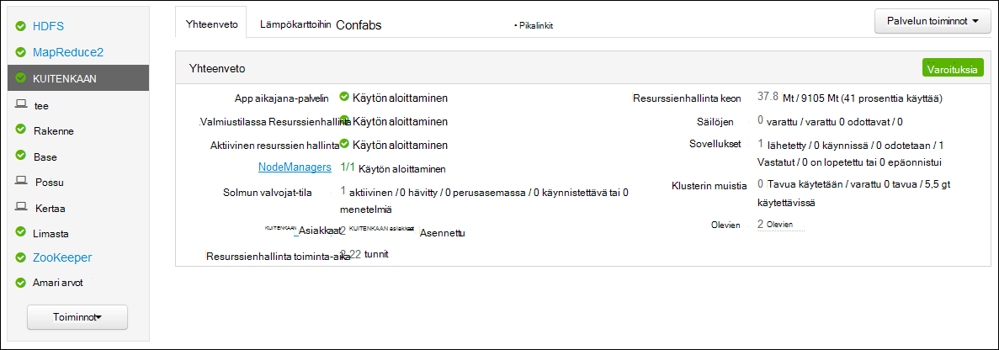
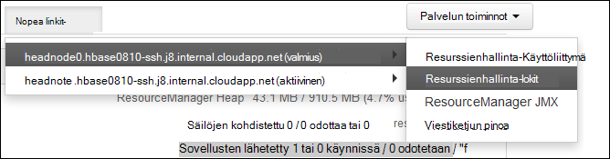

<properties
    pageTitle="Hadoop kuitenkaan Access-sovelluksen kirjautuu Linux-pohjaiset HDInsight | Microsoft Azure"
    description="Opi käyttämään kuitenkaan sovelluksen lokit Linux-pohjaiset HDInsight (Hadoop) klusterissa sekä komentorivillä ja selaimen avulla."
    services="hdinsight"
    documentationCenter=""
    tags="azure-portal"
    authors="Blackmist" 
    manager="jhubbard"
    editor="cgronlun"/>

<tags
    ms.service="hdinsight"
    ms.workload="big-data"
    ms.tgt_pltfrm="na"
    ms.devlang="na"
    ms.topic="article"
    ms.date="10/21/2016"
    ms.author="larryfr"/>

# Access-kuitenkaan sovelluksen kirjautuu Linux-pohjaiset Hdinsightiin 

Tässä asiakirjassa kerrotaan, miten voit käyttää kuitenkaan (vielä toisen resurssin neuvottelija)-sovelluksissa, jotka olet lopettanut Hadoop-klusterin Azure HDInsight-lokit.

> [AZURE.NOTE] Tässä asiakirjassa on Linux-pohjaiset HDInsight klustereiden. Lisätietoja Windows-pohjaisesta klustereiden on artikkelissa [Access kuitenkaan sovelluksen kirjautuu Windows-pohjaisesta Hdinsightiin](hdinsight-hadoop-access-yarn-app-logs.md)

## Edellytykset

* Linux-pohjaiset HDInsight-klusterin.

* Sinun täytyy [luoda SSH tunnelin](hdinsight-linux-ambari-ssh-tunnel.md) ennen kuin voit käyttää ResourceManager lokit-web-Käyttöliittymää.

## KUITENKAAN aikajana-palvelin

[Kuitenkaan aikajanan Server](http://hadoop.apache.org/docs/r2.4.0/hadoop-yarn/hadoop-yarn-site/TimelineServer.html) tarjoaa yleisiä tietoja valmiiden sovellusten sekä framework kielikohtaiset hakemuksen tiedot kaksi eri liittymää kautta. Tarkemmin:

* Tallennustilan ja HDInsight klustereiden yleisen sovelluksen tietojen noutaminen on jo käytössä 3.1.1.374-versiolla tai sitä uudemmassa versiossa.
* Aikajanan palvelimen framework kielikohtaiset sovelluksen tiedot-osa ei ole tällä hetkellä käytettävissä HDInsight klustereiden.

Yleisiä tietoja sovellusten sisältää seuraavat lajittelee tiedot:

* Sovellustunnus sovelluksen yksilöivä tunnus
* Sovelluksen aloittaneen käyttäjän
* Tehtävä suorittamiseen sovelluksen yritykset tiedot
* Sovelluksen käyttäjän yritys säiliöiden

## KUITENKAAN sovellukset ja lokit

KUITENKAAN tukee useita ohjelmoinnin malleja (MapReduce parhaillaan jonkin niistä) irtautus Resurssienhallinta sovelluksen ajoituksen/seuranta. Tämä tapahtuu yleinen *ResourceManager* (RM), kohti työntekijä-solmun *NodeManagers* (NMS: n käynnistämä) ja sovelluksen kohti *ApplicationMasters* (AMs) kautta. Sovelluksen kohti AM verkkoliikenteen resurssit (suorittimen, muistin, levyn, verkon) sovelluksen käytön RM. Resurssinhallinta toimii NMS: n käynnistämä myöntää nämä resurssit, jotka myönnetään *säiliöiden*nimellä. AM on vastuussa säilöt RM. määrittämän etenemisen seuranta Sovellus saattaa edellyttää useita säilöjen laatu sovelluksen mukaan.

Lisäksi kunkin sovelluksen voivat koostua useista *sovellus yrittää* jotta valmis, kun kaatuu tai AM välisen menetyksiä ja RM. Näin ollen säilöjen myönnetään tietyn yrityksellä sovelluksen. Tasolla säilön sisältää perustiedot yksikön työstä maksettavan korvauksen kuitenkaan-sovelluksen yhteydessä ja säilön puitteissa tehty työ suoritetaan, säilö on kohdistettu yksittäisen työntekijän solmun. Katso [Kuitenkaan käsitteitä] [ YARN-concepts] edelleen käyttöä.

Sovelluksen lokit (ja lokitiedostot on liitetty säilö) ovat kriittisiä-virheenkorjaus ongelmallinen Hadoop-sovellukset. KUITENKAAN on hyvä framework kerätään, yhdistäminen ja [Log kooste] sovelluksen lokien tallentaminen[ log-aggregation] ominaisuus. Lokitiedoston kooste-toiminto on käytettäessä sovelluksen lokit selkeämpää-lokit kokoaa yhteen kaikki säilöt työntekijä solmun yli ja tallentaa ne yhden koostetun lokitiedoston kohti työntekijä solmu käyttöjärjestelmän sovelluksen päätyttyä. Sovelluksen voi käyttää lähimpään sataan tai säilöjen tuhansia, mutta kaikki säilöt suorittaa yhteen työntekijä solmu lokit aina kootaan yhteen tiedostoon, tuloksena on yksi lokitiedoston työntekijä solmu käyttää sovelluksen kohden. Lokitiedoston kooste on oletusarvoisesti käytössä HDInsight klustereiden (3.0-versiota ja yllä), ja koostetut lokit löytyvät oletusarvo-säilössä yhteyttä klusterin seuraavaan sijaintiin:

    wasbs:///app-logs/<user>/logs/<applicationId>

Sijainti- *käyttäjä* on sovelluksen aloittaneen käyttäjän nimi ja *applicationId* on sovelluksen kuitenkaan RM. määrittämä yksilöivä tunnus

Koostetun lokit eivät ole suoraan luettavissa, kun ne on kirjoitettu [TFile][T-file], [binaarimuodossa] [ binary-format] indeksoi säilö. Sinun on käytettävä kuitenkaan ResourceManager lokit tai CLI Työkalut tarkastelemaan lokitiedostot sovellusten tai säilöjen halutut pelkkänä tekstinä. 

##KUITENKAAN CLI Työkalut

Jotta voit käyttää kuitenkaan CLI työkaluja, muodosta ensin käyttämällä SSH HDInsight-klusterin. Lisätietoja SSH käyttäminen HDInsight jollakin seuraavat asiakirjat:

- [Linux-pohjaiset Hadoop HDInsight Linux, Unix tai OS X-SSH käyttäminen](hdinsight-hadoop-linux-use-ssh-unix.md)

- [SSH käyttäminen Linux-pohjaiset Hadoop-HDInsight Windows](hdinsight-hadoop-linux-use-ssh-windows.md)
    
Voit tarkastella lokitiedostot pelkkänä tekstinä suorittamalla jompikumpi seuraavista komennoista:

    yarn logs -applicationId <applicationId> -appOwner <user-who-started-the-application>
    yarn logs -applicationId <applicationId> -appOwner <user-who-started-the-application> -containerId <containerId> -nodeAddress <worker-node-address>
    
Sinun on määritettävä &lt;applicationId >, &lt;käyttäjä-kuka-aloittaminen--sovellusta >, &lt;containerId >, ja & ltworker-solmu-osoite > tietoja suoritettaessa näitä komentoja.

##KUITENKAAN ResourceManager Käyttöliittymä

KUITENKAAN ResourceManager Käyttöliittymän suoritetaan klusterin headnode ja niitä voi käyttää Ambari web-Käyttöliittymä, kautta kuitenkin sinun täytyy [luoda SSH tunnelin](hdinsight-linux-ambari-ssh-tunnel.md) ensimmäisen ennen kuin voit käyttää ResourceManager-Käyttöliittymä.

Kun olet luonut SSH tunnelin, tarkastella kuitenkaan lokeja seuraavien vaiheiden avulla:

1. Siirry selaimellasi osoitteeseen https://CLUSTERNAME.azurehdinsight.net. Korvaa CLUSTERNAME HDInsight-klusterin nimen.

2. Valitse palveluluettelosta vasemmalla __kuitenkaan__.

    

3. __Pikalinkit__ -avattavasta valikosta jokin klusterin pään solmut ja valitse sitten __ResourceManager loki__.

    
    
    Voit valita jommankumman ja linkkejä kuitenkaan lokit luettelo.

[YARN-timeline-server]:http://hadoop.apache.org/docs/r2.4.0/hadoop-yarn/hadoop-yarn-site/TimelineServer.html
[log-aggregation]:http://hortonworks.com/blog/simplifying-user-logs-management-and-access-in-yarn/
[T-file]:https://issues.apache.org/jira/secure/attachment/12396286/TFile%20Specification%2020081217.pdf
[binary-format]:https://issues.apache.org/jira/browse/HADOOP-3315
[YARN-concepts]:http://hortonworks.com/blog/apache-hadoop-yarn-concepts-and-applications/
