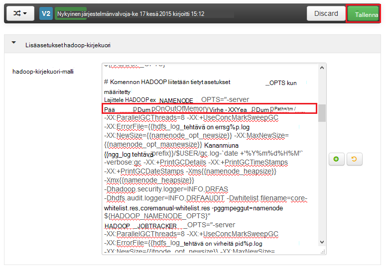

<properties
    pageTitle="Käyttöön keon Vedostaa HDInsight Hadoop-palveluille | Microsoft Azure"
    description="Ota käyttöön keon Vedostaa, Hadoop palvelut Linux-pohjaiset HDInsight klustereiden virheenkorjaus ja analysointia varten."
    services="hdinsight"
    documentationCenter=""
    authors="Blackmist"
    manager="jhubbard"
    editor="cgronlun"
    tags="azure-portal"/>

<tags
    ms.service="hdinsight"
    ms.workload="big-data"
    ms.tgt_pltfrm="na"
    ms.devlang="na"
    ms.topic="article"
    ms.date="09/27/2016"
    ms.author="larryfr"/>

#Ota käyttöön keon Vedostaa Hadoop-palveluille Linux-pohjaiset HDInsight (ennakkoversio)

[AZURE.INCLUDE [heapdump-selector](../../includes/hdinsight-selector-heap-dump.md)]

Keon Vedostaa sisältää tilannevedoksen sovelluksen muistin muuttujan arvot mukaan lukien vedostaminen on luotu aikaan. Jotta ne ovat hyötyä ongelmien, jotka ilmenevät suorituksen aikana.

> [AZURE.NOTE] Tämän artikkelin tiedot koskevat vain Linux-pohjaiset Hdinsightista. Lisätietoja Windows-pohjaisesta Hdinsightista on artikkelissa [keon Vedostaa Hadoop-palveluiden Windows-pohjaisesta HDInsight ottaminen käyttöön](hdinsight-hadoop-collect-debug-heap-dumps.md)

## Palvelut

Voit ottaa keon Vedostaa seuraavat palvelut:

*  **hcatalog** - tempelton
*  **rakenne** - hiveserver2, metastore, derbyserver
*  **mapreduce** - jobhistoryserver
*  **kuitenkaan** - resourcemanager, nodemanager, timelineserver
*  **hdfs** - datanode, secondarynamenode, namenode

Voit myös ottaa keon Vedostaa kartan ja vähentää prosessit suoritettiin HDInsight mukaan.

## Tietoja keon dump määritys

Keon Vedostaa otetaan käyttöön siirtämällä asetukset (joskus kutsutaan valitsee, tai parametreja), JVM palvelun käynnistyksen yhteydessä. Useimmat Hadoop-palveluja varten tämä onnistuu muokkaamalla käytetty-palvelun käynnistäminen shell-komentosarja.

Kukin komentosarja on vientiä varten ** \* \_OPTS**, joka sisältää JVM välitetään asetukset. Esimerkiksi **hadoop env.sh** -komentosarjan rivi, joka alkaa `export HADOOP_NAMENODE_OPTS=` sisältää NameNode-palvelun asetukset.

Yhdistä ja vähentää prosessit ovat hieman erilaiset, ne ovat aliprosessi MapReduce-palvelun. Kunkin yhdistää tai Pienennä prosessi suoritetaan lapsen säilön ja on kaksi merkintää, joka sisältää näitä JVM asetukset. Molemmat sisältyvät **mapred site.xml**:

* **mapreduce.Admin.Map.child.Java.opts**
* **mapreduce.Admin.Reduce.child.Java.opts**

> [AZURE.NOTE] On suositeltavaa käyttämällä Ambari voit muokata sekä komentosarjoja mapred site.xml asetukset Ambari käsittelee replikoiminen muutokset-klusterin solmut yli. Lisätietoja ohjeita [Käyttämällä Ambari](#using-ambari) -osassa.

###Keon Vedostaa ottaminen käyttöön

Seuraavat valinnalla keon Vedostaa OutOfMemoryError yhteydessä:

    -XX:+HeapDumpOnOutOfMemoryError

**+** Ilmaisee, että tämä asetus on käytössä. Oletusarvo on poistettu käytöstä.

> [AZURE.WARNING] Keon Vedostaa eivät ole käytössä HDInsight Hadoop-palveluille oletusarvoisesti kuin dump-tiedostoja voi olla suuri. Jos käyttöön vianmääritystä varten, muista poistaa ne käytöstä, kun olet toistaa ongelman ja kerännyt muistivedoksen tiedostot.

###Dump sijainti

Vedostiedoston oletussijainti on käytön hakemiston. Voit valita, jos tiedosto on tallennettu seuraava asetus:

    -XX:HeapDumpPath=/path

Esimerkiksi `-XX:HeapDumpPath=/tmp` aiheuttaa Vedostaa tallennetaan /tmp hakemistossa.

###Komentosarjojen

Voit myös käynnistää komentosarja **OutOfMemoryError** yhteydessä. Käynnistävä esimerkiksi ilmoituksen, jotta tiedät, että virhe on tapahtunut. Ohjaa käyttämällä seuraavaa vaihtoehtoa:

    -XX:OnOutOfMemoryError=/path/to/script

> [AZURE.NOTE] Koska Hadoop distributed järjestelmän, käytetty komentosarja on asetettava klusteriin, joka suoritetaan palvelun kaikissa solmuissa.
>
> Komentosarja on myös oltava mukaan tili palvelu suoritetaan, ja anna käytettävissä olevaan sijaintiin suoritettava käyttöoikeudet. Esimerkiksi haluta tallentaa komentosarjat `/usr/local/bin` ja käyttää `chmod go+rx /usr/local/bin/filename.sh` tai luku ja suorita käyttöoikeudet.

##Ambari käyttäminen

Voit muokata palvelun määritys noudattamalla seuraavia ohjeita:

1. Avaa yhteyttä klusterin Ambari Internetistä UI. URL-osoite on https://YOURCLUSTERNAME.azurehdinsight.net.

    Pyydettäessä todentaa HTTP-tilin nimi-sivustoa (oletusarvo: järjestelmänvalvoja) ja salasana yhteyttä klusterin.

    > [AZURE.NOTE] Sinua voidaan pyytää toisen kerran mukaan Ambari käyttäjänimeä ja salasanaa. Jos näin on, vain uudelleen Kirjoita saman tilin nimi ja salasana

2. Luettelo vasemmalla, valitse palvelu-alueen haluat muokata. Esimerkki: **ÄÄN**. Valitse center-alueella **kokoonpanomääritysten yhteydessä** -välilehti.

    

3. Käytä **suodattaa...** tapahtuma, anna **valitsee**. Tämä suodattaa määritysten kohteet vain niille, joka sisältää tekstiä ja on nopea tapa löytää liittymän komentosarja tai **malli** , jonka avulla voidaan määrittää nämä asetukset.

    

4. Etsi ** \* \_OPTS** tapahtuma-palvelun haluat ottaa käyttöön keon Vedostaa varten, ja lisää asetukset, jonka haluat ottaa käyttöön. Seuraavassa kuvassa on lisätty `-XX:+HeapDumpOnOutOfMemoryError -XX:HeapDumpPath=/tmp/` , **HADOOP\_NAMENODE\_OPTS** tapahtuma:

    

    > [AZURE.NOTE] Kun ottaminen käyttöön keon kirjoittaa kartan tai vähentää aliprosessi, voit näyttää sen sijaan kenttien labled **mapreduce.admin.map.child.java.opts** ja **mapreduce.admin.reduce.child.java.opts**.

    **Tallenna** -painikkeen avulla voit tallentaa muutokset. Sinulla on oikeus Kirjoita lyhyt Huomautus kuvaava muutokset.

5. Kun muutokset on otettu käyttöön, **uudelleenkäynnistys vaaditaan** -kuvake tulee näkyviin vähintään yhden services vieressä.

    

6. Valitse kaikkien niiden palveluiden tarvitsee uudelleen ja käytä **ottaminen käyttöön ylläpidon**tila **Palvelun toiminnot** -painiketta. Tämä estää ilmoitusten luotavan tämän palvelun, kun se käynnistetään uudelleen.

    

7. Kun olet ottanut ylläpidon tila, käytä **Käynnistä** -painiketta **Uudelleen kaikki tapahtuu** palvelun

    

    > [AZURE.NOTE] **Käynnistä** -painiketta merkintöjä saattavat olla erilaiset muissa palveluissa.

8. Käyttää palveluita käynnistänyt **ottaminen pois käytöstä ylläpidon**tila **Palvelun toiminnot** -painiketta. Tämä Ambari, kun haluat jatkaa valvominen ilmoitusten palvelulle.
