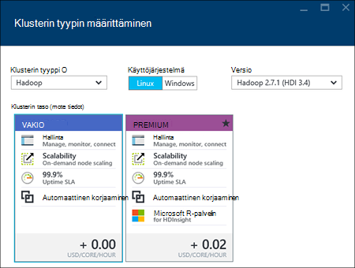

<properties
    pageTitle="Luo Hadoop, HBase, myrsky tai ohjattu klustereiden HDInsight-portaalissa Linux | Microsoft Azure"
    description="Opettele luomaan Hadoop, HBase, myrsky tai ohjattu klustereiden Linux selain ja Azure esikatselu-portaalin HDInsight varten."
    services="hdinsight"
    documentationCenter=""
    authors="nitinme"
    manager="jhubbard"
    editor="cgronlun"
    tags="azure-portal"/>

<tags
    ms.service="hdinsight"
    ms.devlang="na"
    ms.topic="article"
    ms.tgt_pltfrm="na"
    ms.workload="big-data"
    ms.date="10/05/2016"
    ms.author="nitinme"/>

#Luo Linux-pohjaiset klustereiden portaalissa Azure Hdinsightiin

[AZURE.INCLUDE [selector](../../includes/hdinsight-selector-create-clusters.md)]

Azure-portaali on verkkopohjainen hallintatyökalun, palveluista ja pilvessä Microsoft Azure resursseja. Tässä artikkelissa kerrotaan luomisesta Linux-pohjaiset HDInsight klustereiden portaalissa.

## Edellytykset

[AZURE.INCLUDE [delete-cluster-warning](../../includes/hdinsight-delete-cluster-warning.md)]

- **Azure-tilaus**. Katso [Hae Azure maksuttoman kokeiluversion](https://azure.microsoft.com/documentation/videos/get-azure-free-trial-for-testing-hadoop-in-hdinsight/).
- __Nykyaikainen selaimessa__. Azure portaalin käyttää HTML5-versio ja Javascript ja ei ehkä toimi oikein vanhemmat selaimet.

### Access-ohjausobjektin vaatimukset

[AZURE.INCLUDE [access-control](../../includes/hdinsight-access-control-requirements.md)]

##Klustereiden luominen

Azure portaalin paljastaa useimmat klusterin ominaisuudet. Azure Resurssienhallinta-mallin avulla voit piilottaa useita tiedot. Lisätietoja on artikkelissa [Luo Linux-pohjaiset Hadoop klusterit HDInsight Azure Resurssienhallinta mallien avulla](hdinsight-hadoop-create-linux-clusters-arm-templates.md).

1. Kirjautuminen [Azure portal](https://portal.azure.com).

2. **Uusi**ja valitsemalla **Tiedot Analytics** **Hdinsightista**.

    ![Luoda uuden klusterin Azure-portaalissa] (./media/hdinsight-hadoop-create-linux-cluster-portal/HDI.CreateCluster.1.png "Luoda uuden klusterin Azure-portaalissa")
3. **Klusterin**nimi: Tämä nimen on oltava yksilöivä.
4. Valitse **klusterin tyyppi**ja valitse sitten:

    - **Klusterin tyyppi**: Jos et tiedä, mitä voit valita, valitse **Hadoop**. Suosituimpien klusterin tyyppi on.

        > [AZURE.IMPORTANT] HDInsight klustereiden olla erilaisia tyypit, jotka vastaavat työmäärää tai tekniikka, joka on optimoitu klusterin. Ei ole tuettu menetelmä luo klusteriin, joka yhdistää useita tyyppejä, kuten myrsky ja HBase yhden klusterissa. 

    - **Käyttöjärjestelmä**: Valitse **Linux**.
    - **Versio**: Käytä oletusversio, jos et tiedä, mitä voit valita. Lisätietoja on artikkelissa [HDInsight-klusterin versiot](hdinsight-component-versioning.md).
    - **Klusterin taso**: Azure Hdinsightiin tarjoaa kahteen luokkaan big datasta cloud-versioissa: Vakio tason ja Premium taso. Lisätietoja on artikkelissa [klusterin tasoa](hdinsight-hadoop-provision-linux-clusters.md#cluster-tiers).
    
    

4. Valitse **tilaus** , jota käytetään klusterin Azure tilaus.

5. Olemassa olevan resurssiryhmä **Resurssiryhmä** tai valitse **Uusi** ja luo uusi resurssiryhmä

    > [AZURE.NOTE] Tämän arvon oletusarvo johonkin aiemmin resurssi-ryhmistä, jos ne ovat käytettävissä.

6. Valitse **tunnistetiedot** ja kirjoita sitten järjestelmänvalvoja-käyttäjän salasanan. Sinun on kirjoitettava **SSH käyttäjänimi** ja joko **SALASANAN** tai **JULKISELLA AVAIMELLA**, jota käytetään todennetaan SSH. Julkinen avain on suositellaan. **Valitse alalaidassa Tallenna tunnistetiedot-määritys.**

    ![Anna klusterin tunnistetiedot] (./media/hdinsight-hadoop-create-linux-cluster-portal/HDI.CreateCluster.3.png "Anna klusterin tunnistetiedot")

    Lisätietoja SSH käyttämisestä Hdinsightista on seuraavissa artikkeleissa:

    * [Linux-pohjaiset Hadoop HDInsight Linux, Unix tai OS X-SSH käyttäminen](hdinsight-hadoop-linux-use-ssh-unix.md)
    * [SSH käyttäminen Linux-pohjaiset Hadoop-HDInsight Windows](hdinsight-hadoop-linux-use-ssh-windows.md)

7. Jos haluat valita aiemmin luotuun tietolähteeseen klusterin **Tietolähteen** tai luoda uuden.

    ![Tietolähde-sivu] (./media/hdinsight-hadoop-create-linux-cluster-portal/HDI.CreateCluster.4.png "Anna tietolähteen määrittäminen")

    Nyt voit valita Azure-tallennustilan tilin HDInsight-klusterin tietolähteenä. Seuraavat avulla voit selvittää merkintöjä **Tietolähde** -sivu.

    - **Valinnan menetelmää**: asetus **-kaikkien tilausten** käyttöön selaamisen kaikista tilauksistasi tallennustilan tilejä. Määritä tämä **Pikanäppäin** , jos haluat kirjoittaa **Tallennustilan nimi** ja käytössä olevan tallennustilan tilin **Pikanäppäin** .

    - **Tallennustilan tili / uusi**: valitse Selaa ja valitse olemassa olevan tallennustilan tilin haluat liittää klusterin **tallennustilan-tili** . Tai valitse **Uusi** , jos haluat luoda uuden tallennustilan tilin. Käytä kentän, joka näkyy tallennustilan tilin nimi. Vihreä valintamerkki tulee näkyviin, jos se on käytettävissä.

    - **Valitse Oletussäilö**: Tällä komennolla voit klusterin käytettävät oletusarvo-säilö nimi. Samalla, kun kirjoitat sen nimeä, on suositeltavaa käyttää on sama nimi kuin klusterin niin, että on helppo muistaa, että tämä tiettyyn klusteri käytetään säilö.

    - **Sijainti**: maantieteellisen alueen, jolla tallennustilan-tili on tai luodaan.

        > [AZURE.IMPORTANT] Oletus-tietolähteen sijainti myös määrittää HDInsight-klusterin sijainti. Klusterin ja oletusarvo-tietolähde on sijaittava samalla alueella.
        
    - **Klusterin AAD tunnistetietojen**: määrittämällä sen teet klusterin käytettävissä AAD määritysten Azure tietojen järvi stores.

    Valitse Tallenna tietolähteen asetukset **valitsemalla** .

8. Valitse **Solmu hinnat tasoa** , joka luodaan tämän klusterin solmut tiedon. Määritä klusterin varten tarvittava työntekijä solmujen määrän. Klusterin arvioitu kustannus näytetään kuluessa sivu.

    ![Solmun hinnoittelu tasoa-sivu] (./media/hdinsight-hadoop-create-linux-cluster-portal/HDI.CreateCluster.5.png "Määritä klusterisolmujen määrän")
    
    > [AZURE.IMPORTANT] Jos aio yli 32 työntekijä solmut-klusterin luominen tai mukaan skaalaus klusterin luonnin jälkeen, on valittava pään solmu kokoa, ja vähintään 8 sydämiä 14 gt RAM-muistia.
    >
    > Saat lisätietoja solmu kokojen ja niihin liittyvät kustannukset, [HDInsight hinnat](https://azure.microsoft.com/pricing/details/hdinsight/).

    Valitse **Valitse** Tallenna solmu hinnoittelu-määritys.

9. Valitse **Vaihtoehtoinen määritys** klusterin versio sekä määrittää muita valinnaiset asetukset, kuten **VPN**liittyminen, asetusten määrittämisestä **Ulkoinen Metastore** sisältää tietoja rakenne ja Oozie, komentosarjan toimintojen avulla voit mukauttaa klusterin mukautetun osien asentaminen tai lisätallennustilaa tilien käyttäminen klusterin.

    * **VPN**: Valitse Azure virtual verkko- ja aliverkon, jos haluat sijoittaa klusterin virtual verkostoon.  

        ![Virtual verkko-sivu] (./media/hdinsight-hadoop-create-linux-cluster-portal/HDI.CreateCluster.6.png "Määritä VPN-tiedot")

        Tietoja HDInsight käyttämisestä Virtual verkossa, mukaan lukien tietty määritys vaatimukset Virtual Network on [laajentaa HDInsight ominaisuuksia käyttämällä Virtual Azure-verkon](hdinsight-extend-hadoop-virtual-network.md).

    * Valitse **Ulkoinen Metastores** Määritä SQL-tietokanta, jonka haluat Tallenna klusterin rakenne ja Oozie metatietoja.
    
        > [AZURE.NOTE] Metastore määritys ei ole käytettävissä HBase klusterin tyypeissä.

        ![Mukautettu metastores sivu] (./media/hdinsight-hadoop-create-linux-cluster-portal/HDI.CreateCluster.7.png "Määritä ulkoisen metastores")

        **Käytä aiemmin SQL-tietokanta rakenteen** metatietojen, valitse **Kyllä**, valitse SQL-tietokanta ja anna tietokannan käyttäjänimellä ja salasanalla. Toista nämä vaiheet, jos haluat **käyttää aiemmin SQL-tietokanta Oozie metatiedot**. Valitse **Valitse** , kunnes olet takaisin käyttöön **Valinnaisia määritys** -sivu.

        >[AZURE.NOTE] Azure SQL-tietokantaan metastore käytettäviä on sallittava Azure muiden palvelujen, kuten Azure Hdinsightiin yhteys. Valitse oikeassa reunassa Azure SQL-tietokanta-koontinäytön palvelimen nimi. Tämä on palvelin, jossa SQL-tietokannan esiintymää on käynnissä. Kerran server-näkymässä, valitse **Määritä**ja **Azure-palveluja**, valitse **Kyllä**ja valitse sitten **Tallenna**.

        &nbsp;

        > [AZURE.IMPORTANT] Luotaessa metastore Älä käytä tietokannan nimi, joka sisältää katkoviivat tai väliviivoja, sillä tämä aiheuttaa klusterin luontiprosessi epäonnistuu.

    * **Komentosarjatoiminnot** Jos haluat käyttää mukautettua komentosarjaa mukauttaminen-klusterin kuin klusterin luodaan. Saat lisätietoja komentosarjatoiminnot [mukauttaminen HDInsight klustereiden komentosarja-toiminnon avulla](hdinsight-hadoop-customize-cluster-linux.md). Valitse komentosarjatoiminnot-sivu lisätiedot näyttökuvan esitetyllä tavalla.

        ![Komentosarjan toiminto-sivu] (./media/hdinsight-hadoop-create-linux-cluster-portal/HDI.CreateCluster.8.png "Määritä komentosarja-toiminnon")

    * Valitse **Linkitetty tallennustilan tilit** , mitkä klusterin liitettävä lisätallennustilaa tilit. **Azure-tallennustilan näppäimet** , sivu- **Lisää tallennustilaa näppäintä**, valitse käytössä olevan tallennustilan tilin tai Luo uusi tili.

        ![Lisää tallennustilaa sivu] (./media/hdinsight-hadoop-create-linux-cluster-portal/HDI.CreateCluster.9.png "Määritä lisätallennustilaa tilit")

        Voit myös lisätä tallennustilaa tilit klusterin luomisen jälkeen.  Katso [mukauttaminen Linux-pohjaiset HDInsight klustereiden komentosarja-toiminnon avulla](hdinsight-hadoop-customize-cluster-linux.md).

        Valitse **Valitse** , kunnes olet uudelleen käyttöön **uuden HDInsight-klusterin** -sivu.
        
        Lisäksi Blob storage tili voit myös linkittää Azure tietojen järvi stores. Määritykset voidaan määrittää AAD tietolähteestä, johon olet määrittänyt oletusarvon säilö ja tallennustilaa oletustilin.

10. Varmista, että **PIN-tunnuksen Startboard** on valittuna, ja valitse sitten **Luo** **Uuden HDInsight-klusterin** -sivu. Tämä luo klusterin ja ruudun lisääminen sen Azure-portaalin Startboard. Kuvake ilmaisee, että klusterin on valmistelu ja muuttaa näyttämään HDInsight-kuvaketta, kun valmistelu on valmis.

  	| Varattaessa | Valmis valmistelu |
  	| ------------------ | --------------------- |
  	|  |  |

    > [AZURE.NOTE] Kestää jonkin aikaa klusterin luominen yleensä noin 15 minuuttia. Tarkista valmistelu prosessin Startboard tai **ilmoitukset** tapahtuma-sivun vasemmassa reunassa ruudun avulla.

11. Kun sitten luontiprosessi on valmis, valitse klusterin Startboard käynnistää klusterin-sivu-ruutu. Klusterin-sivu sisältää tärkeitä tietoja klusterin, kuten nimi, se kuuluu resurssiryhmä, sijainti ja käyttöjärjestelmän URL-osoite klusterin Raporttinäkymät-ikkunan jne.

    ![Klusterin sivu] (./media/hdinsight-hadoop-create-linux-cluster-portal/HDI.Cluster.Blade.png "Klusterin ominaisuudet")

    Seuraavat avulla voit selvittää kuvaketta näytön yläreunasta tämä sivu ja **Essentials** -osassa:

    * **Ja **Kaikki asetukset**** : Näyttää klusterin, jonka avulla voit käyttää klusterin yksityiskohtaiset määritystietoja **asetukset** -sivu.

    * **Raporttinäkymät-ikkunan**, **Klusterin Raporttinäkymät-ikkunan**ja **URL-osoite**: Nämä ovat kaikki tapoja käyttää klusterin Raporttinäkymät-ikkunan, joka on Web-portaalin suorittamaan töitä klusterin.

    * **Suojattu runko**: on klusterin käyttämällä SSH tarvittavat tiedot.

    * **Poista**: poistaa HDInsight-klusterin.

    * **Pikaopas** (): Näyttää tiedot, jotka auttavat käytön aloittamisessa Hdinsightista.

    * **Käyttäjät** (): Voit määrittää tämän klusterin _portaalin hallinta_ käyttöoikeuksien muiden käyttäjien Azure-tilauksessa.

        > [AZURE.IMPORTANT] Tämä _vain_ vaikuttaa tähän klusteriin Azure-portaalissa käyttöoikeudet, ja kuka voi muodostaa tai lähettää HDInsight-klusterin työt ei vaikuta.

    * **Tunnisteet** (): tunnisteiden avulla voit määrittää voit määrittää mukautetun luokituksen cloud palvelujen avain/arvo-pareina. Voi esimerkiksi avain nimeltä __projektin__luominen ja käyttäminen sitten kaikki palvelujen tiettyyn projektiin liittyvä esiintyvän arvon.

##Klustereiden mukauttaminen

- Katso [mukauttaminen HDInsight klustereiden käyttämällä automaattinen](hdinsight-hadoop-customize-cluster-bootstrap.md).
- Katso [mukauttaminen Linux-pohjaiset HDInsight klustereiden komentosarja-toiminnon avulla](hdinsight-hadoop-customize-cluster-linux.md).

##Klusterin poistaminen

[AZURE.INCLUDE [delete-cluster-warning](../../includes/hdinsight-delete-cluster-warning.md)]

##Seuraavat vaiheet

Nyt kun olet luonut HDInsight-klusterin, avulla opit yhteyttä klusterin käsittelemisestä seuraavasti:

###Hadoop klustereiden

* [Rakenteen käyttäminen Hdinsightiin](hdinsight-use-hive.md)
* [Possu käyttäminen Hdinsightiin](hdinsight-use-pig.md)
* [MapReduce käyttäminen Hdinsightiin](hdinsight-use-mapreduce.md)

###HBase klustereiden

* [HBase HDInsight-käytön aloittaminen](hdinsight-hbase-tutorial-get-started-linux.md)
* [Kehittää Java HBase HDInsight-sovelluksia](hdinsight-hbase-build-java-maven-linux.md)

###Myrsky klustereiden

* [Kehitä Java topologioissa myrsky HDInsight-](hdinsight-storm-develop-java-topology.md)
* [Myrsky HDInsight-Python osien käyttäminen](hdinsight-storm-develop-python-topology.md)
* [Ottaa käyttöön ja topologioissa myrsky HDInsight-ja seuranta](hdinsight-storm-deploy-monitor-topology-linux.md)

###Ohjattu klustereiden

* [Luo erillisen-sovelluksen käyttäminen Scala](hdinsight-apache-spark-create-standalone-application.md)
* [Suorita työt etäyhteyden käyttämällä Livy ohjattu klusterissa](hdinsight-apache-spark-livy-rest-interface.md)
* [Ohjattu BI: vuorovaikutteinen tietojen analysoinnissa ohjattu käyttäminen HDInsight kanssa Liiketoimintatieto-työkaluista](hdinsight-apache-spark-use-bi-tools.md)
* [Ohjattu koneen Learning kanssa: Käytä ohjattu elintarvikkeiden tulokset ennustetaan HDInsight-](hdinsight-apache-spark-machine-learning-mllib-ipython.md)
* [Ohjattu virtautetun median: Käytä ohjattu HDInsight reaaliaikainen streaming sovellusten luomiseen:](hdinsight-apache-spark-eventhub-streaming.md)
