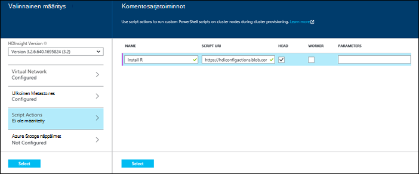
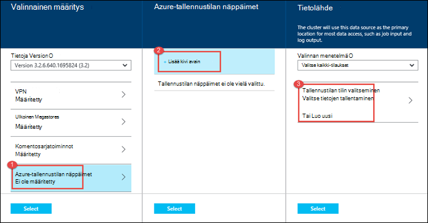

<properties
   pageTitle="Luo Hadoop klustereiden HDInsight | Microsoft Azure"
    description="Opi luomaan Azure Hdinsightiin varausyksiköiden mukaan Azure-portaalissa."
   services="hdinsight"
   documentationCenter=""
   tags="azure-portal"
   authors="mumian"
   manager="jhubbard"
   editor="cgronlun"/>

<tags
   ms.service="hdinsight"
   ms.devlang="na"
   ms.topic="article"
   ms.tgt_pltfrm="na"
   ms.workload="big-data"
   ms.date="09/02/2016"
   ms.author="jgao"/>

# Windows-pohjaisesta Hadoop klustereiden luominen portaalissa Azure Hdinsightiin

[AZURE.INCLUDE [selector](../../includes/hdinsight-selector-create-clusters.md)]

Opettele Hadoop-klusterin luominen portaalissa Azure Hdinsightista. Microsoft [Azure portaalissa](../azure-portal-overview.md) on keskitetysti, jossa voit valmistella ja hallita Azure resursseja. Azure-portaali on jokin seuraavista työkaluista, joita voit käyttää tai Linux-pohjaiset Windows-pohjaisesta Hadoop-klusterin luominen Hdinsightista. Klusterin muiden luontia varten työkaluja ja ominaisuuksia välilehti Valitse sivun ylälaidassa tai saat [klusterin luominen](hdinsight-provision-clusters.md#cluster-creation-methods).

##Edellytykset:

[AZURE.INCLUDE [delete-cluster-warning](../../includes/hdinsight-delete-cluster-warning.md)]

Ennen kuin aloitat tämän artikkelin ohjeita, sinulla on oltava seuraavasti:

- Azure tilaus. Katso [Hae Azure maksuttoman kokeiluversion](https://azure.microsoft.com/documentation/videos/get-azure-free-trial-for-testing-hadoop-in-hdinsight/).

### Access-ohjausobjektin vaatimukset

[AZURE.INCLUDE [access-control](../../includes/hdinsight-access-control-requirements.md)]

## Klustereiden luominen

**HDInsight-klusterin luominen**

1. Kirjautuminen [Azure Portal](https://portal.azure.com).
2. **Uusi**ja valitsemalla **Tiedot Analytics** **Hdinsightista**.

    ![Luoda uuden klusterin Azure-portaalissa] (./media/hdinsight-provision-clusters/HDI.CreateCluster.1.png "Luoda uuden klusterin Azure-portaalissa")

3. Kirjoita tai valitse seuraavat arvot:

    * **Klusterinimi**: klusterin nimi. Vihreä valintamerkki tulee näkyviin klusterin nimen vieressä, jos se on käytettävissä.

    * **Klusterin tyyppi**: Valitse **Hadoop**. Muut vaihtoehdot inclue **HBase**, **myrsky**ja **Ohjattu**.

        > [AZURE.IMPORTANT] HDInsight klustereiden olla erilaisia tyypit, jotka vastaavat työmäärää tai tekniikka, joka on optimoitu klusterin. Ei ole tuettu menetelmä luo klusteriin, joka yhdistää useita tyyppejä, kuten myrsky ja HBase yhden klusterissa.

    * **Klusterin käyttöjärjestelmä**: **ikkunaa**. Luo Linux base-klusterin valitsemalla **Linux**.
    * **Versio**: Katso [HDInsight-versioissa](hdinsight-component-versioning.md).
    * **Tilaus**: Azure tilaus, jota käytetään tämän klusterin luomiseen.
    * **Resurssiryhmä**: Valitse aiemmin luotu tai Luo uusi resurssiryhmä. Tämän arvon oletusarvo johonkin aiemmin resurssi-ryhmistä, jos ne ovat käytettävissä.
    * **Tunnistetietojen**: Määritä käyttäjänimi ja salasana Hadoop käyttäjän (käyttäjän HTTP). Jos otat klusterin Etätyöpöytä, sinun on remote työpöydän käyttäjänimen ja salasanan ja tilin vanhenemispäivämäärä. **Valitse Tallenna muutokset alaosassa.**

        ![Anna klusterin tunnistetiedot] (./media/hdinsight-provision-clusters/HDI.CreateCluster.3.png "Anna klusterin tunnistetiedot")

    * **Tietolähde**: Luo uusi tai valitse aiemmin luotu Azuren tallennustilaan tili voidaan käyttää käyttöjärjestelmän klusterin.

        ![Tietolähde-sivu] (./media/hdinsight-provision-clusters/HDI.CreateCluster.4.png "Anna tietolähteen määrittäminen")

        * **Valinnan menetelmää**: asetus **-kaikkien tilausten** käyttöön selaamisen kaikista tilauksistasi tallennustilan tilejä. Määritä tämä **Pikanäppäin** , jos haluat kirjoittaa **Tallennustilan nimi** ja käytössä olevan tallennustilan tilin **Pikanäppäin** .
        * **Tallennustilan-tili tai Luo uusi**: valitse Selaa ja valitse olemassa olevan tallennustilan tilin haluat liittää klusterin **tallennustilan-tili** . Tai **Luo uusi** Luo uusi tallennustilan-tili. Käytä kentän, joka näkyy tallennustilan tilin nimi. Vihreä valintamerkki tulee näkyviin, jos se on käytettävissä.
        * **Valitse Oletussäilö**: Tällä komennolla voit klusterin käytettävät oletusarvo-säilö nimi. Samalla, kun kirjoitat sen nimeä, on suositeltavaa käyttää on sama nimi kuin klusterin niin, että on helppo muistaa, että tämä tiettyyn klusteri käytetään säilö.
        * **Sijainti**: maantieteellisen alueen, jolla tallennustilan-tili on tai luodaan. Tähän sijaintiin määräävät klusterin sijainti.  Klusterin ja sen tallennustilan oletustili on yhtä Etsi saman Azure tietokeskuksen.
    
    * **Solmun hinnat tasoa**: määrittää klusterin varten tarvittava työntekijä solmujen määrän. Klusterin arvioitu kustannus näytetään kuluessa sivu.
  

        ![Solmun hinnoittelu tasoa-sivu] (./media/hdinsight-provision-clusters/HDI.CreateCluster.5.png "Määritä klusterisolmujen määrän")

    * Valitse klusterin versio sekä muita valinnaisia asetuksia liittyminen **VPN**-asetusten määrittämisestä **Ulkoinen Metastore** sisältää tietoja rakenne ja Oozie, kuten **Vaihtoehtoinen määritys** komentosarjan toimintojen avulla voit mukauttaa klusterin mukautetun osien asentaminen tai lisätallennustilaa tilien käyttäminen klusterin.

    * **HDInsight-versio**: Valitse versio, jota haluat käyttää klusterin. Lisätietoja on artikkelissa [HDInsight-klusterin versiot](hdinsight-component-versioning.md).
    * **VPN**: Valitse Azure virtual verkko- ja aliverkon, jos haluat sijoittaa klusterin virtual verkostoon.  

        ![Virtual verkko-sivu] (./media/hdinsight-provision-clusters/HDI.CreateCluster.6.png "Määritä VPN-tiedot")

        Artikkelissa [laajentaa HDInsight capbilities käyttämällä Virtual Azure-verkon](hdinsight-extend-hadoop-virtual-network.md)tietojen HDInsight käyttämisestä Virtual verkossa, mukaan lukien tietty määritys vaatimukset Virtual Network.
  

        
    * **Ulkoisen Metastores**: Määritä Azure SQL-tietokantaan tallentamiseen klusterin rakenne ja Oozie metatietoja.
 
        > [AZURE.NOTE] Metastore määritys ei ole käytettävissä HBase klusterin tyypeissä.

    ![Mukautettu metastores sivu] (./media/hdinsight-provision-clusters/HDI.CreateCluster.7.png "Määritä ulkoisen metastores")

    **Käytä aiemmin SQL-tietokanta rakenteen** metatietojen, valitse **Kyllä**, valitse SQL-tietokanta ja anna tietokannan käyttäjänimellä ja salasanalla. Toista nämä vaiheet, jos haluat **käyttää aiemmin SQL-tietokanta Oozie metatiedot**. Valitse **Valitse** , kunnes olet takaisin käyttöön **Valinnaisia määritys** -sivu.

    >[AZURE.NOTE] Azure SQL-tietokantaan metastore käytettäviä on sallittava Azure muiden palvelujen, kuten Azure Hdinsightiin yhteys. Valitse oikeassa reunassa Azure SQL-tietokanta-koontinäytön palvelimen nimi. Tämä on palvelin, jossa SQL-tietokannan esiintymää on käynnissä. Kerran server-näkymässä, valitse **Määritä**ja **Azure-palveluja**, valitse **Kyllä**ja valitse sitten **Tallenna**.

            &nbsp;

            > [AZURE.IMPORTANT] Luotaessa metastore Älä käytä tietokannan nimi, joka sisältää katkoviivat tai väliviivoja, sillä tämä aiheuttaa klusterin luontiprosessi epäonnistuu.
        
        * **Script Actions** if you want to use a custom script to customize a cluster, as the cluster is being created. For more information about script actions, see [Customize HDInsight clusters using Script Action](hdinsight-hadoop-customize-cluster.md). On the Script Actions blade provide the details as shown in the screen capture.
    

            

        * **Azure Storage Keys**: Specify additional storage accounts to associate with the cluster. In the **Azure Storage Keys** blade, click **Add a storage key**, and then select an existing storage account or create a new account.
    

            

4. Valitse **Luo**. **Kiinnitä Startboard** valitsemalla Lisää klusterin ruutu portaalin Startboard. Kuvake ilmaisee, että klusterin luodaan ja muutetaan näyttää HDInsight-kuvake, kun luominen on valmis.
    
    Kestää jonkin aikaa klusterin luominen yleensä noin 15 minuuttia. Tarkista valmistelu prosessin Startboard tai **ilmoitukset** tapahtuma-sivun vasemmassa reunassa ruudun avulla.
    

5. Kun luominen on valmis, valitse klusterin Startboard käynnistää klusterin-sivu-ruutu. Klusterin-sivu sisältää tärkeitä tietoja klusterin, kuten nimi, se kuuluu resurssiryhmä, sijainti ja käyttöjärjestelmän URL-osoite klusterin Raporttinäkymät-ikkunan jne.

    ![Klusterin sivu] (./media/hdinsight-provision-clusters/HDI.Cluster.Blade.png "Klusterin ominaisuudet")

    Seuraavat avulla voit selvittää kuvaketta näytön yläreunasta tämä sivu ja **Essentials** -osassa:

    * **Ja **Kaikki asetukset**** : Näyttää klusterin, jonka avulla voit käyttää klusterin yksityiskohtaiset määritystietoja **asetukset** -sivu.
    * **Raporttinäkymät-ikkunan**, **Klusterin Raporttinäkymät-ikkunan**ja **URL-osoite**: Nämä ovat kaikki tapoja käyttää klusterin Raporttinäkymät-ikkunan, joka on Web-portaalin suorittamaan töitä klusterin.
    * **Etätyöpöytä**: Voit ottaa käyttöön/poistaa käytöstä Etätyöpöytä klusterin solmuissa.
    * **Skaalaa-klusterin**: Voit muuttaa tämän klusterin työntekijä solmujen määrän.
    * **Poista**: poistaa HDInsight-klusterin.
    * **Pikaopas** (): Näyttää tiedot, jotka auttavat käytön aloittamisessa Hdinsightista.
    * **Käyttäjät** (): Voit määrittää tämän klusterin _portaalin hallinta_ käyttöoikeuksien muiden käyttäjien Azure-tilauksessa.
    

        > [AZURE.IMPORTANT] Tämä _vain_ vaikuttaa tähän klusteriin portaalissa käyttöoikeudet, ja kuka voi muodostaa tai lähettää HDInsight-klusterin työt ei vaikuta.
        
    * **Tunnisteet** (): tunnisteiden avulla voit määrittää voit määrittää mukautetun luokituksen cloud palvelujen avain/arvo-pareina. Voi esimerkiksi avain nimeltä __projektin__luominen ja käyttäminen sitten kaikki palvelujen tiettyyn projektiin liittyvä esiintyvän arvon.

##Klustereiden mukauttaminen

- Katso [mukauttaminen HDInsight klustereiden käyttämällä automaattinen](hdinsight-hadoop-customize-cluster-bootstrap.md).
- Katso [mukauttaa Windows-pohjaisesta HDInsight klustereiden komentosarja-toiminnon avulla](hdinsight-hadoop-customize-cluster.md).

##Seuraavat vaiheet
Tässä artikkelissa on oppimiasi HDInsight-klusterin luominen eri tavoin. Lisätietoja on seuraavissa artikkeleissa:

* [Azure Hdinsightiin käytön aloittaminen](hdinsight-hadoop-linux-tutorial-get-started.md) - ohjeita aloittamisesta HDInsight-klusterin käsitteleminen
* [Lähetä Hadoop työt ohjelmallisesti](hdinsight-submit-hadoop-jobs-programmatically.md) – Katso, miten voit lähettää ohjelmallisesti työt Hdinsightiin
* [Azure-portaalissa voit hallita Hadoop varausyksiköt Hdinsightiin](hdinsight-administer-use-management-portal.md)

