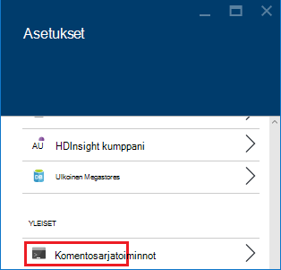
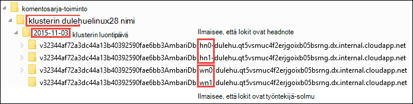

<properties
    pageTitle="Mukauta HDInsight klustereiden komentosarja-toimintojen käyttäminen | Microsoft Azure"
    description="Opettele lisäämään Linux-pohjaiset HDInsight klustereihin komentosarja-toimintojen käyttäminen mukautettujen osien. Komentosarjatoiminnot ovat Bash komentosarjoja, klusterin solmuissa ja avulla voidaan mukauttaa klusterin määrityksissä tai lisätä lisäpalveluja ja apuohjelmia, kuten sävyä, Solr tai R."
    services="hdinsight"
    documentationCenter=""
    authors="Blackmist"
    manager="jhubbard"
    editor="cgronlun"
    tags="azure-portal"/>

<tags
    ms.service="hdinsight"
    ms.workload="big-data"
    ms.tgt_pltfrm="na"
    ms.devlang="na"
    ms.topic="article"
    ms.date="09/06/2016"
    ms.author="larryfr"/>

# Mukauta Linux-pohjaiset HDInsight klustereiden komentosarja-toiminnon käyttäminen

Hdinsightista on nimeltään **Komentosarja-toiminnon** , joka käynnistää mukautettuja komentosarjoja, mukauttaa klusterin määritysvaihtoehto. Komentosarjat voidaan käyttää klusterin luonnin aikana tai jo käynnissä klusterissa ja niitä käytetään asentaminen lisäosat ja muuttaa asetuksia.

> [AZURE.NOTE] Voi käyttää komentosarjatoiminnot jo käynnissä-klusterissa on käytettävissä vain Linux-pohjaiset HDInsight klustereiden. Lisätietoja komentosarjatoiminnot käyttämisestä Windows-pohjaisesta klustereiden on artikkelissa [mukauttaminen HDInsight klustereiden komentosarja-toiminnolla (Windows)](hdinsight-hadoop-customize-cluster.md).

Komentosarjatoiminnot voi julkaista Azure Marketplacesta myös HDInsight-sovelluksena. Osa tämän asiakirjan esimerkeissä Näytä siitä, miten voit asentaa HDInsight-sovellus toiminnon komentosarjan PowerShellistä ja .NET SDK komennoista. Lisätietoja HDInsight-sovellukset on artikkelissa [julkaista HDInsight sovellukset Azure Marketplacesta](hdinsight-apps-publish-applications.md). 

## Tietoja komentosarjatoiminnot

Komentosarja-toiminto on ainoastaan Bash komentosarjan antaisit URL-Osoitetta ja parametrit, ja se on suorittanut HDInsight-klusterin solmuissa. Seuraavassa esitellään ominaisuudet ja toiminnot komentosarjan toiminnoista.

* Täytyy olla tallennettuna URI, joka on käytettävissä olevat HDInsight-klusterin. Mahdollisia tallennuspaikkojen ovat seuraavat:

    * Blob storage-tili, joka on joko ensisijainen tai muita-tallennustilan tilin HDInsight-klusterin. Hdinsightista on myönnetty käyttöoikeus sekä näiden tilityyppien tallennustilan klusterin luonnin aikana, koska nämä lisäämistapaa julkisiksi komentosarja-toiminnolla.
    
    * Julkisesti luettavissa URI, kuten Azure-Blob, GitHub, OneDrive, Dropbox ja niin edelleen.
    
    Esimerkkejä blob-säilö (julkisesti luettavissa) tallennetut komentosarjat URI on [Esimerkki komentosarjan toiminnon komentosarjat](#example-script-action-scripts) -kohdassa.

* Voit rajoittaa __suorittaa vain solmu tietyntyyppisten__, kuten pään solmujen tai työntekijä solmujen.

    > [AZURE.NOTE] HDInsight Premium käytettäessä voit määrittää, että komentosarja käytettyyn reuna-solmu.

* Voi olla __samanlainen__ tai __luonnoslehtiössä__.

    __Persisted__ komentosarjat ovat komentosarjoja tähän tarkoitukseen työntekijä solmujen lisätään ja päivitetään suoritettiin automaattisesti uuden solmuissa luomisen skaalaus klusterin ylöspäin.

    Pysyviä komentosarjan voi myös Ota muutokset käyttöön toisen solmutyyppi, esimerkiksi pää-solmu, mutta toimintoja näkökulmasta jatkuvat komentosarjan ainoa syy on, joten toiminto on uuden työntekijän solmujen luomisen klusteriin on skaalattu ulos.

    > [AZURE.IMPORTANT] Pysyvän komentosarjatoiminnot on oltava yksilöllinen nimi.

    __Ad hoc__ -komentosarjat eivät säily; kuitenkin voit myöhemmin luonnoslehtiössä komentosarjan, joka pysyviä komentosarjan ylemmälle tai alemmalle tasolle luonnoslehtiössä komentosarjan pysyviä komentosarjan.

    > [AZURE.IMPORTANT] Klusterin luonnin aikana käytettävän komentosarjatoiminnot ovat automaattisesti samanlainen.
    >
    > Vaikka erityisesti osoittaa, että ne pitäisi olla komentosarjoja tähän tarkoitukseen virheiden ei ole samanlainen.

* Voit hyväksyä __parametreja__ , joita käytetään komentosarjaa suorituksen aikana.

* Ovat suoritettiin __pääkansio valtuudet__ klusterin solmuissa.

* Voidaan käyttää __Azure portal__, __PowerShellin Azure__, __Azure CLI__tai __HDInsight .NET SDK-paketissa__

    [AZURE.INCLUDE [upgrade-powershell](../../includes/hdinsight-use-latest-powershell-cli-and-dotnet-sdk.md)]

Voit helpottaa ymmärtää, mitä komentosarjat on käytetty klusteriin ja määrittämiseen komentosarjat ylentäminen tai alennus-klusterin tunnus säilyttää kaikki komentosarjat, jotka on suorittanut.

> [AZURE.IMPORTANT] Ei automaattista ei voi kumota komentosarja-toiminnon tekemät muutokset. Jos haluat peruuttaa komentosarjan, on ymmärtää muutokset on tehty ja palauttaa ne (tai manuaalisesti komentosarja-toiminnon, joka kääntää ne Anna.)

### Klusterin luontiprosessi komentosarja-toiminto

Klusterin luonnin aikana käytettävän komentosarjatoiminnot ovat hieman erilaiset komentosarjan aiemmin luodun klusterin toimi toiminnot:

* Komentosarja on __samanlainen automaattisesti__.

* Komentosarjan __Virhe__ voi aiheuttaa klusterin luontiprosessi epäonnistuu.

Seuraavassa kaaviossa on kuvattu kun komentosarja-toiminnon suoritetaan luomisen aikana:

![HDInsight-klusterin mukauttaminen ja vaiheet klusterin luonnin aikana][img-hdi-cluster-states]

Komentosarja on suorittanut samalla, kun HDInsight määritetään. Tässä vaiheessa komentosarja on suorittanut rinnakkain määritetyn solmuissa klusterin ja pääkansion oikeuksilla suoritettiin solmuissa.

> [AZURE.NOTE] Koska komentosarja on suoritettiin pääkansion tason käyttöoikeus klusterin solmuissa, voit suorittaa toimintoja, kuten lopettaminen ja palveluja, kuten Hadoop liittyviä palveluja aloitetaan. Jos lopetat palveluja, sinun on varmistettava, että Ambari-palvelun ja muut Hadoop liittyvät palvelut ovat käytön ennen komentosarjan on päättynyt. Nämä palvelut tarvitaan määrittää terveys- ja tilan klusterin onnistuu, sen luonnin aikana.

Klusterin luonnin aikana voit määrittää useita komentosarjatoimintoja, jotka aktivoidaan siinä järjestyksessä, jossa ne on määritetty.

> [AZURE.IMPORTANT] Komentosarjatoiminnot on suoritettava 60 minuutin kuluessa tai ne on aikakatkaisu. Klusterin valmistelun aikana komentosarja on suorittanut samanaikaisesti muiden asennus ja määritys-prosessien. Resurssit, kuten suorittimen aika tai verkon kaistanleveyden kilpailua saattaa aiheuttaa komentosarjan kestää kauemmin kuin kehittäminen-ympäristössä.
>
> Pienennä komentosarjan suorittamiseen kuluvaa aikaa, vältä tehtäviä, kuten lataamisen ja kääntäminen sovellusten lähteestä. Sen sijaan Käännä valmiiksi sovellus ja tallentaa binaaritiedosto Azure-Blob-säiliö, jotta se voi ladata nopeasti klusteriin.

###Komentosarja-toiminnon suorittaminen klusterissa

Toisin kuin klusterin luominen epäonnistui komentosarjan käytettyä toiminnot suoritettiin jo käynnissä klusterissa komentosarjan automaattisesti aiheuta klusterin muuttaminen epäonnistui tilaan. Kun komentosarja on valmis, klusterin tulee palauttaa "käytössä-tilaan.

> [AZURE.IMPORTANT] Tämä ei tarkoita käynnissä klusterin on immuuni komentosarjoja tähän tarkoitukseen virheelliset toimintoihin. Esimerkiksi komentosarjan voinut poistaa tarvitsemat klusterin, muuta määrittäminen niin, että palvelut jne.
>
> Komentosarjojen toiminnot Suorita pääkansion oikeuksilla, joten varmista, että tietoja ennen sen yhteyttä klusterin mitä komentosarjan.

Käytettäessä komentosarjan klusteriin klusterin tilan muuttaminen __käynnissä__ __hyväksytyt__, valitse __HDInsight-määritys__ja lopuksi takaisin __suorittaminen__ onnistui komentosarjojen. Komentosarjan tila on kirjautunut komentosarja-toiminnon historia ja tämän avulla voit määrittää, onko komentosarja onnistui tai epäonnistui. Esimerkiksi `Get-AzureRmHDInsightScriptActionHistory` PowerShell cmdlet-komennon avulla voidaan komentosarjan tila. Se palauttaa tiedot seuraavankaltaiselta:

    ScriptExecutionId : 635918532516474303
    StartTime         : 2/23/2016 7:40:55 PM
    EndTime           : 2/23/2016 7:41:05 PM
    Status            : Succeeded

> [AZURE.NOTE] Jos olet muuttanut klusterin (järjestelmänvalvojat) käyttäjän salasanan klusterin luomisen jälkeen, tämä saattaa aiheuttaa komentosarjan toiminnot suoritettiin vastaan tämän klusterin epäonnistuu. Jos sinulla on pysyviä komentosarjatoimintoja kyseisen kohteen työntekijä solmujen, nämä saattaa epäonnistua, kun lisäät kautta klusterin solmut kokoa toimintoja.

## Esimerkki komentosarja-toiminnon komentosarjat

Komentosarjan toiminnon komentosarjoja voidaan Azure työkaluportaaliin ja PowerShellin Azure, Azure CLI tai HDInsight .NET SDK-paketissa. Hdinsightista on komentosarjoja asennetaan HDInsight klustereiden seuraavat osat:

Nimi | Komentosarja
----- | -----
**Azure-tallennustilan tilin lisääminen** | https://hdiconfigactions.BLOB.Core.Windows.NET/linuxaddstorageaccountv01/Add-Storage-Account-v01.SH. Katso [Käytä komentosarja-toiminnon suorittaminen klusteriin](#apply-a-script-action-to-a-running-cluster).
**Asenna värisävy** | https://hdiconfigactions.BLOB.Core.Windows.NET/linuxhueconfigactionv02/Install-HUE-uber-v02.SH. Katso [asentaminen ja käyttäminen sävyä HDInsight-klusterit](hdinsight-hadoop-hue-linux.md).
**Asenna R** | https://hdiconfigactions.BLOB.Core.Windows.NET/linuxrconfigactionv01/r-Installer-v01.SH. Katso [asennus ja HDInsight klustereiden R käytössä](hdinsight-hadoop-r-scripts-linux.md).
**Asenna Solr** | https://hdiconfigactions.BLOB.Core.Windows.NET/linuxsolrconfigactionv01/solr-Installer-v01.SH. Katso [asentaminen ja käyttäminen Solr HDInsight-klusterit](hdinsight-hadoop-solr-install-linux.md).
**Asenna Giraph** | https://hdiconfigactions.BLOB.Core.Windows.NET/linuxgiraphconfigactionv01/giraph-Installer-v01.SH. Katso [asentaminen ja käyttäminen Giraph HDInsight-klusterit](hdinsight-hadoop-giraph-install-linux.md).
| **Lataa valmiiksi rakenne-kirjastot** | https://hdiconfigactions.BLOB.Core.Windows.NET/linuxsetupcustomhivelibsv01/Setup-customhivelibs-v01.SH. Katso [HDInsight klustereiden Lisää rakenne kirjastoihin](hdinsight-hadoop-add-hive-libraries.md) |

## Komentosarjan toiminnolla klusterin luonnin aikana

Tässä osassa on esimerkkejä eri tavoista, joilla voit käyttää komentosarjatoiminnot luotaessa HDInsight klusterin - Azure-portaalista Azure Resurssienhallinta-mallin avulla ja käyttämällä PowerShell cmdlet-komentoja käyttämällä .NET SDK.

### Komentosarjan toiminnolla Azure-portaalista klusterin luonnin aikana

1. Aloita luominen klusterin [luominen Hadoop varausyksiköt HDInsight](hdinsight-provision-clusters.md#portal)-palvelussa kuvatulla.

2. __Vaihtoehtoinen määritys__- **Komentosarjatoiminnot** -sivu, kohdasta tietojen näyttäminen komentosarja-toiminnon **lisääminen komentosarja-toiminnon** alla kuvatulla tavalla:

    

  	| Ominaisuus | Arvo |
  	| -------- | ----- |
  	| Nimi | Määritä komentosarja-toiminnon nimi. |
  	| Komentosarjan URI | Määritä komentosarja, joka käynnistyy, voit mukauttaa klusterin URI. |
  	| Pää-/ työntekijä | Määritä solmut (**otsikko**, **Työntekijä**tai **ZooKeeper**) joka mukauttaminen komentosarja suoritetaan. |
  	| Parametrit | Määrittää parametreja, jos vaatii komentosarja. |

    Paina ENTER voit lisätä useita osia asennetaan klusterin useita komentosarja-toiminnon.

3. Valitse **Valitse** Tallenna kokoonpano ja jatka klusterin luominen.

### Käytä komentosarja-toiminnon Azure Resurssienhallinta-malleista

Tässä osassa on mallia Azure Resurssienhallinta HDInsight-klusterin luominen ja mukautettujen osien (Tässä esimerkissä R) asentaminen klusterin myös komentosarja-toiminnon avulla. Tässä osassa on esimerkki mallin luominen klusterin komentosarja-toiminnon avulla.

> [AZURE.NOTE] Tämän osan vaiheet kuvaavat luominen klusterin komentosarja-toiminnon avulla. Esimerkki klusterin luominen mallista HDInsight-sovelluksesta on artikkelissa [mukautetun HDInsight-sovellusten asentaminen](hdinsight-apps-install-custom-applications.md).

#### Ennen aloittamista

* Lisätietoja HDInsight Powershell cmdlet-komentojen suorittamiseen työasema on [asentaminen ja määrittäminen PowerShellin Azure](../powershell-install-configure.md).
* Ohjeita siitä, miten voit luoda malleja on artikkelissa [Azure-Resurssienhallinta yhtä aikaa muiden kanssa malleja](../resource-group-authoring-templates.md).
* Jos et ole aiemmin käyttänyt PowerShellin Azure resurssien hallinta-kohdassa [Azure PowerShellin Azure resurssien hallinta](../powershell-azure-resource-manager.md).

#### Luo klustereiden komentosarja-toiminnon käyttäminen

1. Kopioi seuraavat mallin sijainti tietokoneessa. Tämä malli asentaa Giraph headnodes-klusterin solmut työntekijä sekä. Voit myös varmistaa, jos JSON-malli on voimassa. Mallisisällön liittäminen [JSONLint](http://jsonlint.com/), online JSON vahvistus-työkalu.

            {
            "$schema": "http://schema.management.azure.com/schemas/2015-01-01/deploymentTemplate.json#",
            "contentVersion": "1.0.0.0",
            "parameters": {
                "clusterLocation": {
                    "type": "string",
                    "defaultValue": "West US",
                    "allowedValues": [ "West US" ]
                },
                "clusterName": {
                    "type": "string"
                },
                "clusterUserName": {
                    "type": "string",
                    "defaultValue": "admin"
                },
                "clusterUserPassword": {
                    "type": "securestring"
                },
                "sshUserName": {
                    "type": "string",
                    "defaultValue": "username"
                },
                "sshPassword": {
                    "type": "securestring"
                },
                "clusterStorageAccountName": {
                    "type": "string"
                },
                "clusterStorageAccountResourceGroup": {
                    "type": "string"
                },
                "clusterStorageType": {
                    "type": "string",
                    "defaultValue": "Standard_LRS",
                    "allowedValues": [
                        "Standard_LRS",
                        "Standard_GRS",
                        "Standard_ZRS"
                    ]
                },
                "clusterStorageAccountContainer": {
                    "type": "string"
                },
                "clusterHeadNodeCount": {
                    "type": "int",
                    "defaultValue": 1
                },
                "clusterWorkerNodeCount": {
                    "type": "int",
                    "defaultValue": 2
                }
            },
            "variables": {
            },
            "resources": [
                {
                    "name": "[parameters('clusterStorageAccountName')]",
                    "type": "Microsoft.Storage/storageAccounts",
                    "location": "[parameters('clusterLocation')]",
                    "apiVersion": "2015-05-01-preview",
                    "dependsOn": [ ],
                    "tags": { },
                    "properties": {
                        "accountType": "[parameters('clusterStorageType')]"
                    }
                },
                {
                    "name": "[parameters('clusterName')]",
                    "type": "Microsoft.HDInsight/clusters",
                    "location": "[parameters('clusterLocation')]",
                    "apiVersion": "2015-03-01-preview",
                    "dependsOn": [
                        "[concat('Microsoft.Storage/storageAccounts/', parameters('clusterStorageAccountName'))]"
                    ],
                    "tags": { },
                    "properties": {
                        "clusterVersion": "3.2",
                        "osType": "Linux",
                        "clusterDefinition": {
                            "kind": "hadoop",
                            "configurations": {
                                "gateway": {
                                    "restAuthCredential.isEnabled": true,
                                    "restAuthCredential.username": "[parameters('clusterUserName')]",
                                    "restAuthCredential.password": "[parameters('clusterUserPassword')]"
                                }
                            }
                        },
                        "storageProfile": {
                            "storageaccounts": [
                                {
                                    "name": "[concat(parameters('clusterStorageAccountName'),'.blob.core.windows.net')]",
                                    "isDefault": true,
                                    "container": "[parameters('clusterStorageAccountContainer')]",
                                    "key": "[listKeys(resourceId('Microsoft.Storage/storageAccounts', parameters('clusterStorageAccountName')), '2015-05-01-preview').key1]"
                                }
                            ]
                        },
                        "computeProfile": {
                            "roles": [
                                {
                                    "name": "headnode",
                                    "targetInstanceCount": "[parameters('clusterHeadNodeCount')]",
                                    "hardwareProfile": {
                                        "vmSize": "Large"
                                    },
                                    "osProfile": {
                                        "linuxOperatingSystemProfile": {
                                            "username": "[parameters('sshUserName')]",
                                            "password": "[parameters('sshPassword')]"
                                        }
                                    },
                                    "scriptActions": [
                                        {
                                            "name": "installGiraph",
                                            "uri": "https://hdiconfigactions.blob.core.windows.net/linuxgiraphconfigactionv01/giraph-installer-v01.sh",
                                            "parameters": ""
                                        }
                                    ]
                                },
                                {
                                    "name": "workernode",
                                    "targetInstanceCount": "[parameters('clusterWorkerNodeCount')]",
                                    "hardwareProfile": {
                                        "vmSize": "Large"
                                    },
                                    "osProfile": {
                                        "linuxOperatingSystemProfile": {
                                            "username": "[parameters('sshUserName')]",
                                            "password": "[parameters('sshPassword')]"
                                        }
                                    },
                                    "scriptActions": [
                                        {
                                            "name": "installR",
                                            "uri": "https://hdiconfigactions.blob.core.windows.net/linuxrconfigactionv01/r-installer-v01.sh",
                                            "parameters": ""
                                        }
                                    ]
                                }
                            ]
                        }
                    }
                }
            ],
            "outputs": {
                "cluster":{
                    "type" : "object",
                    "value" : "[reference(resourceId('Microsoft.HDInsight/clusters',parameters('clusterName')))]"
                }
            }
        }

2. Käynnistä PowerShellin Azure ja kirjaudu sisään Azure-tiliisi. Kun olet antanut tunnistetiedot-komento palauttaa tietoa tilistäsi.

        Add-AzureRmAccount

        Id                             Type       ...
        --                             ----
        someone@example.com            User       ...

3. Jos sinulla on useita tilauksia, antaa Tilaustunnus, jota haluat käyttää käyttöönottoa varten.

        Select-AzureRmSubscription -SubscriptionID <YourSubscriptionId>

    > [AZURE.NOTE] Voit käyttää `Get-AzureRmSubscription` saat luettelon kaikkien tilausten tilisi, joka sisältää kullekin tilauksen tunnus.

5. Jos sinulla ei ole olemassa resurssiryhmä, Luo uusi resurssiryhmä. Anna nimi resurssiryhmä ja sijainnin, jotka tarvitset ratkaisu. Uusi resurssiryhmä yhteenveto palautetaan.

        New-AzureRmResourceGroup -Name myresourcegroup -Location "West US"

        ResourceGroupName : myresourcegroup
        Location          : westus
        ProvisioningState : Succeeded
        Tags              :
        Permissions       :
                            Actions  NotActions
                            =======  ==========
                            *
        ResourceId        : /subscriptions/######/resourceGroups/ExampleResourceGroup

6. Jos haluat luoda uuden käyttöympäristön resurssiryhmän, **Uusi AzureRmResourceGroupDeployment** -komennon suorittaminen ja anna sitten tarvittavat parametrit. Parametrien sisällytetään käyttöönoton, resurssi-ryhmässä ja polku tai URL-Osoitteen nimi luomaasi mallia nimi. Jos mallin vaatii parametreja, sinun on välitettävä nämä parametrit. Tässä tapauksessa R asennetaan klusterin komentosarja-toiminto ei edellytä parametreja.

        New-AzureRmResourceGroupDeployment -Name mydeployment -ResourceGroupName myresourcegroup -TemplateFile <PathOrLinkToTemplate>

    Sinun tulee kehotus Anna arvot mallin parametrit.

7. Kun resurssiryhmän on otettu käyttöön, näet käyttöönoton yhteenveto.

          DeploymentName    : mydeployment
          ResourceGroupName : myresourcegroup
          ProvisioningState : Succeeded
          Timestamp         : 8/17/2015 7:00:27 PM
          Mode              : Incremental
          ...

8. Jos käyttöönoton epäonnistuu, voit seuraavat cmdlet-komennot virheet tietoja.

        Get-AzureRmResourceGroupDeployment -ResourceGroupName myresourcegroup -ProvisioningState Failed

### Komentosarjan toiminnolla PowerShellin Azure klusterin luomisen aikana

Tässä osassa Käytämme käynnistää komentosarjoja komentosarja-toiminnon avulla voit mukauttaa klusterin [Lisää AzureRmHDInsightScriptAction](https://msdn.microsoft.com/library/mt603527.aspx) cmdlet-komento. Ennen kuin jatkat, varmista, että olet asentanut ja määrittänyt PowerShellin Azure. Lisätietoja HDInsight PowerShell cmdlet-komentojen suorittamiseen työasema on [asentaminen ja määrittäminen PowerShellin Azure](../powershell-install-configure.md).

Suorita seuraavat vaiheet:

1. Avaa PowerShellin Azure-konsolin ja käyttää Azure-tilaukseen kirjautuminen seuraavasti ja jotkin PowerShell-muuttujat määritettävä:

        # LOGIN TO ZURE
        Login-AzureRmAccount

        # PROVIDE VALUES FOR THESE VARIABLES
        $subscriptionId = "<SubscriptionId>"        # ID of the Azure subscription
        $clusterName = "<HDInsightClusterName>"         # HDInsight cluster name
        $storageAccountName = "<StorageAccountName>"    # Azure storage account that hosts the default container
        $storageAccountKey = "<StorageAccountKey>"      # Key for the storage account
        $containerName = $clusterName
        $location = "<MicrosoftDataCenter>"             # Location of the HDInsight cluster. It must be in the same data center as the storage account.
        $clusterNodes = <ClusterSizeInNumbers>          # The number of nodes in the HDInsight cluster.
        $resourceGroupName = "<ResourceGroupName>"      # The resource group that the HDInsight cluster will be created in

2. Määritä määritysten arvot (kuten klusterin solmut) ja käytettävä oletusarvo-tallennustilan.

        # SPECIFY THE CONFIGURATION OPTIONS
        Select-AzureRmSubscription -SubscriptionId $subscriptionId
        $config = New-AzureRmHDInsightClusterConfig
        $config.DefaultStorageAccountName="$storageAccountName.blob.core.windows.net"
        $config.DefaultStorageAccountKey=$storageAccountKey

3. **Lisää AzureRmHDInsightScriptAction** cmdlet-komennon avulla voit käynnistää komentosarjan. Seuraavassa esimerkissä komentosarjan, joka voidaan asentaa Giraph klusterin:

        # INVOKE THE SCRIPT USING THE SCRIPT ACTION FOR HEADNODE AND WORKERNODE
        $config = Add-AzureRmHDInsightScriptAction -Config $config -Name "Install Giraph"  -NodeType HeadNode -Uri https://hdiconfigactions.blob.core.windows.net/linuxgiraphconfigactionv01/giraph-installer-v01.sh
        $config = Add-AzureRmHDInsightScriptAction -Config $config -Name "Install Giraph"  -NodeType WorkerNode -Uri https://hdiconfigactions.blob.core.windows.net/linuxgiraphconfigactionv01/giraph-installer-v01.sh

    **Lisää AzureRmHDInsightScriptAction** cmdlet-komento tekee seuraavat parametrit:

  	| Parametri | Määritys |
  	| --------- | ---------- |
  	| Config | Mitä komentosarjan toimenpiteen tiedot on lisätty kokoonpano-objekti. |
  	| Nimi | Komentosarja-toiminnon nimi. |
  	| NodeType | Määrittää solmu, jossa mukauttaminen komentosarja suoritetaan. Kelvolliset arvot ovat **HeadNode** (Jos haluat asentaa pään solmu), (Jos haluat asentaa kaikki tiedot solmut) **WorkerNode** tai **ZookeeperNode** (Jos haluat asentaa zookeeper-solmu). |
  	| Parametrit | Komentosarjan vaatii parametrit. |
  	| URI | Määrittää komentosarjan, joka suoritetaan URI. |

4. Määritä klusterin järjestelmänvalvoja/HTTPS-käyttäjä:

        $httpCreds = get-credential

    Kun sinulta kysytään, "Järjestelmänvalvoja" Anna nimeksi ja salasanaa.

5. SSH tunnistetietojen määrittäminen:

        $sshCreds = get-credential

    Kirjoita pyydettäessä SSH käyttäjänimi ja salasana. Jos haluat suojata SSH tilin salasanan sijaan sertifikaatilla, tyhjä salasanalla ja määritä `$sshPublicKey` sisältöön, jota haluat käyttää varmenteen julkinen avain. Esimerkki:

        $sshPublicKey = Get-Content .\path\to\public.key -Raw

4. Luo-klusterin:

        New-AzureRmHDInsightCluster -config $config -clustername $clusterName -DefaultStorageContainer $containerName -Location $location -ResourceGroupName $resourceGroupName -ClusterSizeInNodes $clusterNodes -HttpCredential $httpCreds -SshCredential $sshCreds -OSType Linux

    Jos käytössäsi on julkinen avain suojaamiseen SSH-tilin, sinun on myös määritettävä `-SshPublicKey $sshPublicKey` parametrina.

Voi kestää hetken, ennen kuin klusterin luodaan.

### Komentosarjan toiminnolla HDInsight .NET SDK klusterin luomisen aikana

HDInsight .NET SDK on asiakas-kirjastoja, joissa on helppo käsitellä HDInsight .NET-sovellus. Katso koodin otoksen [luominen Linux-pohjaiset varausyksiköt käyttämällä .NET SDK Hdinsightista](hdinsight-hadoop-create-linux-clusters-dotnet-sdk.md#use-script-action).

## Lisää komentosarja-toiminto käytössä klusteriin

Tässä osassa on esimerkkejä eri tavoista, joilla voit käyttää komentosarjatoiminnot suoritetaan HDInsight-klusterin; Azure-portaalista käyttämällä PowerShell-cmdlet-Office kaikissa ympäristöissä Azure CLI, ja .NET SDK avulla. Tässä osassa käytetyn pysyviä komentosarja-toiminnon Lisää aiemmin luodun Azure-tallennustilan tilin käynnissä klusterin. Voit käyttää myös muiden komentosarja-toiminnot, katso [Esimerkki komentosarja-toiminnon komentosarjoja](#example-script-action-scripts).

### Lisää komentosarja-toiminto käytössä klusteriin Azure-portaalista

1. [Azure-portaaliin](https://portal.azure.com)ja valitse HDInsight-klusterin.

2. Valitse HDInsight-klusterin sivu- __Komentosarjatoiminnot__ -ruutu.

    

    > [AZURE.NOTE] Voit myös valita __kaikki asetukset__ ja valitse __Komentosarjatoiminnot__ asetukset-sivu.

4. Yläreunasta komentosarjatoiminnot-sivu Valitse __Lähetä uusi__.

    

5. -Komentosarja-toiminnon lisääminen-sivu Anna seuraavat tiedot.

    * __Nimi__: kutsumanimi komentosarja-toiminnon käyttäminen. Tässä esimerkissä `Add Storage account`.
    * __KOMENTOSARJAN URI__: URI komentosarjan. Tässä esimerkissä`https://hdiconfigactions.blob.core.windows.net/linuxaddstorageaccountv01/add-storage-account-v01.sh`
    * __Päätä__, __työntekijöiden__ja __Zookeeper__: Tarkista solmut, jotka tämä komentosarja kohteeseen. Tässä esimerkissä Head, työntekijöiden ja Zookeeper ovat valittuina.
    * __Parametrit__: Jos komentosarja hyväksyy parametreja, kirjoita ne tähän. Tässä esimerkissä Kirjoita tallennustilan tilin nimi ja tallennustilaa tili-näppäintä:

        

        Valitse näyttökuvan `contosodata` on käytössä olevan Azure-tallennustilan tilin toinen rivi on tallennustilan tilin-näppäintä.
    * __PERSISTED__: Tarkista tässä vaihtoehdossa, jos haluat jatkuvat komentosarja, jotta sitä käytetään uuden työntekijän solmujen voit skaalata klusterin ylöspäin.

6. Lisätä komentosarja klusterin lopuksi käyttämällä __Luo__ -painiketta.

### Käynnissä olevat klusterin komentosarja-toiminnon käyttäminen PowerShellin Azure

Ennen kuin jatkat, varmista, että olet asentanut ja määrittänyt PowerShellin Azure. Lisätietoja HDInsight PowerShell cmdlet-komentojen suorittamiseen työasema on [asentaminen ja määrittäminen PowerShellin Azure](../powershell-install-configure.md).

1. Avaa PowerShellin Azure-konsolin ja käyttää Azure-tilaukseen kirjautuminen seuraavasti ja jotkin PowerShell-muuttujat määritettävä:

        # LOGIN TO ZURE
        Login-AzureRmAccount

        # PROVIDE VALUES FOR THESE VARIABLES
        $clusterName = "<HDInsightClusterName>"         # HDInsight cluster name
        $saName = "<ScriptActionName>"                  # Name of the script action
        $saURI = "<URI to the script>"                  # The URI where the script is located
        $nodeTypes = "headnode", "workernode"
        
    > [AZURE.NOTE] Jos HDInsight Premium-klusterin, voit käyttää nodetype, `"edgenode"` suorittamaan komentosarja reuna-solmu.

2. Käytä seuraavaa komentoa Ota komentosarja klusterin:

        Submit-AzureRmHDInsightScriptAction -ClusterName $clusterName -Name $saName -Uri $saURI -NodeTypes $nodeTypes -PersistOnSuccess

    Kun työ on valmis, näyttöön tulee tietoja seuraavankaltaiselta:

        OperationState  : Succeeded
        ErrorMessage    :
        Name            : Giraph
        Uri             : https://hdiconfigactions.blob.core.windows.net/linuxgiraphconfigactionv01/giraph-installer-v01.sh
        Parameters      :
        NodeTypes       : {HeadNode, WorkerNode}

### Käynnissä olevat klusterin komentosarja-toiminnon käyttäminen Azure-CLI

Ennen kuin jatkat, varmista, että olet asentanut ja määrittänyt Azure-CLI. Lisätietoja on artikkelissa [Azure-CLI asentaminen](../xplat-cli-install.md).

    [AZURE.INCLUDE [use-latest-version](../../includes/hdinsight-use-latest-cli.md)] 

1. Avaa shell-istunnon, terminaalissa, komentorivi- tai muita komentorivin järjestelmän ja seuraavalla komennolla Siirry Azure Resurssienhallinta-tilassa.

        azure config mode arm

2. Seuraavat avulla voit todentaa Azure-tilaukseen.

        azure login

3. Käytä seuraavaa komentoa Lisää komentosarja-toiminto käytössä klusteriin

        azure hdinsight script-action create <clustername> -g <resourcegroupname> -n <scriptname> -u <scriptURI> -t <nodetypes>

    Jos tämä komento parametrit, jonka pyydetään niiden. Jos komentosarja Määritä kanssa `-u` hyväksyy parametrit, voit määrittää niiden avulla `-p` parametrin.

    Kelvollinen __nodetypes__ ovat __headnode__, __workernode__ja __zookeeper__. Jos komentosarja käytetään useita solmutyypit, Määritä erotettu tyypit ";". Esimerkiksi `-n headnode;workernode`.

    Poistu komentosarja, lisätä `--persistOnSuccess`. Sinulla voi myös jatkuvat komentosarja myöhemmin käyttämällä `azure hdinsight script-action persisted set`.
    
    Kun työ on valmis, näyttöön tulee tulosteen seuraavankaltaiselta.
    
        info:    Executing command hdinsight script-action create
        + Executing Script Action on HDInsight cluster
        data:    Operation Info
        data:    ---------------
        data:    Operation status:
        data:    Operation ID:  b707b10e-e633-45c0-baa9-8aed3d348c13
        info:    hdinsight script-action create command OK

### Lisää komentosarja-toiminto käytössä klusteriin REST-Ohjelmointirajapinnan käyttäminen

Katso [Suorittamalla komentosarjatoiminnot suoritetaan klusterissa](https://msdn.microsoft.com/library/azure/mt668441.aspx).
### Käynnissä olevat klusterin komentosarja-toiminnon käyttäminen HDInsight .NET SDK-paketissa

Esimerkki komentosarjoja koskevat klusterin .NET SDK avulla on artikkelissa [https://github.com/Azure-Samples/hdinsight-dotnet-script-action](https://github.com/Azure-Samples/hdinsight-dotnet-script-action).

## Näytä historia, Siirrä ylemmälle tasolle ja Siirrä alemmalle tasolle komentosarjatoiminnot

### Azure-portaalissa

1. [Azure-portaaliin](https://portal.azure.com)ja valitse HDInsight-klusterin.

2. Valitse HDInsight-klusterin sivu- __asetukset__.

    

3. Valitse asetukset-sivu __Komentosarjatoiminnot__.

    

4. Pysyvän komentosarjoja sekä komentosarjoja käytetty klusteriin, historiatiedot luettelo näkyy komentosarjatoiminnot-sivu. Seuraavassa näyttökuvassa näet, että komentosarja on poistettu Solr suoritettiin tässä klusterissa, mutta komentosarjatoimintoja ei ole samanlainen.

    

5. Komentosarjan valitsemalla historian näyttäminen tämän komentosarjan ominaisuudet-sivu. Sivu yläreunasta suorittamalla komentosarja tai korottaa sen.

    

6. Voit myös käyttää __...__ toistuvat tapahtumat-komentosarjatoiminnot-sivu oikeuden suorittaa toimintoja, kuten uudelleen, ja (pysyviä toimintoja varten,) poistaminen.

    

### Azure PowerShellin avulla

| Käyttää seuraavaa... | Jos haluat... |
| ----- | ----- |
| Hae AzureRmHDInsightPersistedScriptAction | Hakea tietoa pysyviä komentosarjatoiminnot |
| Hae AzureRmHDInsightScriptActionHistory | Noutaa klusterin tai tiedot tietyn komentosarja script toiminnot historiatiedot |
| Määritä AzureRmHDInsightPersistedScriptAction | Voit siirtää luonnoslehtiössä komentosarjatoiminnon pysyviä komentosarja-toiminto |
| Poista AzureRmHDInsightPersistedScriptAction | Kirjoittaminen siirtää alempaan luokkaan pysyviä komentosarja-toiminnon ad hoc-toiminto |

> [AZURE.IMPORTANT] Käyttämällä `Remove-AzureRmHDInsightPersistedScriptAction` ei ole Kumoa toiminnot maksettavan korvauksen komentosarjan, se vain poistaa pysyviä merkintää, niin, että komentosarja suorittanut ei uuden työntekijän solmuissa klusterin lisätään.

Seuraava esimerkkikomentosarja osoittaa, Siirrä ylemmälle tasolle ja Siirrä alemmalle tasolle komentosarjan Cmdlet-komentoja avulla.

    # Get a history of scripts
    Get-AzureRmHDInsightScriptActionHistory -ClusterName mycluster

    # From the list, we want to get information on a specific script
    Get-AzureRmHDInsightScriptActionHistory -ClusterName mycluster -ScriptExecutionId 635920937765978529

    # Promote this to a persisted script
    # Note: the script must have a unique name to be promoted
    # if the name is not unique, you will receive an error
    Set-AzureRmHDInsightPersistedScriptAction -ClusterName mycluster -ScriptExecutionId 635920937765978529

    # Demote the script back to ad hoc
    # Note that demotion uses the unique script name instead of
    # execution ID.
    Remove-AzureRmHDInsightPersistedScriptAction -ClusterName mycluster -Name "Install Giraph"

### Azure CLI käyttäminen

| Käyttää seuraavaa... | Jos haluat... |
| ----- | ----- |
| `azure hdinsight script-action persisted list <clustername>` | Noutaa pysyviä komentosarjan toimintojen luettelo |
| `azure hdinsight script-action persisted show <clustername> <scriptname>` | Hakea tietoa tietyn pysyviä komentosarja-toiminto |
| `azure hdinsight script-action history list <clustername>` | Noutaa historia on käytetty klusteriin komentosarjatoiminnot |
| `azure hdinsight script-action history show <clustername> <scriptname>` | Hakea tietoa tietyn komentosarja-toiminto |
| `azure hdinsight script action persisted set <clustername> <scriptexecutionid>` | Voit siirtää luonnoslehtiössä komentosarjatoiminnon pysyviä komentosarja-toiminto |
| `azure hdinsight script-action persisted delete <clustername> <scriptname>` | Kirjoittaminen siirtää alempaan luokkaan pysyviä komentosarja-toiminnon ad hoc-toiminto |

> [AZURE.IMPORTANT] Käyttämällä `azure hdinsight script-action persisted delete` ei ole Kumoa toiminnot maksettavan korvauksen komentosarjan, pysyviä lippu poistaa vain niin, että komentosarja suorittanut ei uuden työntekijän solmuissa klusterin lisätään.

### HDInsight .NET SDK: N avulla

Esimerkki .NET SDK avulla voit noutaa klusterin komentosarjahistoria-ylemmälle tai alemmalle tasolle komentosarjoja on artikkelissa [https://github.com/Azure-Samples/hdinsight-dotnet-script-action](https://github.com/Azure-Samples/hdinsight-dotnet-script-action).

> [AZURE.NOTE] Tässä esimerkissä näytetään myös käyttämällä .NET SDK HDInsight-sovelluksen asentaminen.

## Vianmääritys

Ambari web Käyttöliittymän avulla voit tarkastella komentosarjatoiminnot tallentamat tiedot. Jos komentosarja on käytetty aikana klusterin luominen ja klusterin luominen epäonnistui virheen komentosarja-lokit ovat käytettävissä myös liittyvän klusterin tallennustilan oletustilin. Tässä osassa on tietoja siitä, miten voit hakea lokit sekä näiden asetusten avulla.

### Ambari Internet-Käyttöliittymä

1. Siirry selaimella https://CLUSTERNAME.azurehdinsight.net. Korvaa CLUSTERNAME HDInsight-klusterin nimen.

    Kun sinulta kysytään, kirjoita klusterin järjestelmänvalvojan tilin nimen (järjestelmänvalvojat) ja salasana. On ehkä annettava uudelleen järjestelmänvalvojan tunnistetietoja web-lomakkeessa.

2. Valitse sivun yläosassa olevassa palkissa __ops__ tapahtuma. Tämä näyttää nykyisen ja edellisen suorittaa Ambari klusterissa toimintojen luettelo.

    

3. Etsi tapahtumat, joissa on __suorittaa\_customscriptaction__ __Toiminnot__ -sarakkeessa. Nämä luodaan, kun komentosarja-toiminnot ovat suoritettiin.

    

    Valitsemalla tämän vaihtoehdon ja voit tarkastella STDOUT ja STDERR tulos, kun komentosarja on luotu linkkien kautta alirakenteen suoritettiin klusterin.

### Access-tallennustilan oletustilin lokit

Jos klusterin luominen epäonnistuu komentosarja-toiminnon virheen vuoksi, komentosarja-toiminnon lokeja voi käyttää edelleen suoraan liittyvät klusterin oletustilin tallennustilan.

* Tallennustilan lokit on osoitteessa `\STORAGE_ACOCUNT_NAME\DEFAULT_CONTAINER_NAME\custom-scriptaction-logs\CLUSTER_NAME\DATE`.

    

    Valitse tämän lokit järjestetään erikseen headnode, workernode ja zookeeper solmujen. On joitakin esimerkkejä:
    * **Headnode** - `<uniqueidentifier>AmbariDb-hn0-<generated_value>.cloudapp.net`
    * **Työntekijän solmu** - `<uniqueidentifier>AmbariDb-wn0-<generated_value>.cloudapp.net`
    * **Zookeeper solmu** - `<uniqueidentifier>AmbariDb-zk0-<generated_value>.cloudapp.net`

* Kaikki stdout ja stderr vastaavan isännän ladataan tallennustilan-tilille. On yksi **tulostus -\*.txt** ja **virheet -\*.txt** kunkin komentosarja-toiminnon. Tulosteen *.txt tiedosto sisältää tietoja komentosarjan, joka saatiin Suorita isännän URI. Esimerkki

        'Start downloading script locally: ', u'https://hdiconfigactions.blob.core.windows.net/linuxrconfigactionv01/r-installer-v01.sh'

* Se on mahdollista, että luot saman niminen komentosarjan toiminnon klusterin toistuvasti. Tässä tapauksessa voit erottaa asiaa lokit päivämäärä-kansion nimen perusteella. Klusterin (mycluster) luotu eri päivämäärät kansiorakenne on esimerkiksi seuraavat:
    * `\STORAGE_ACOCUNT_NAME\DEFAULT_CONTAINER_NAME\custom-scriptaction-logs\mycluster\2015-10-04`
    * `\STORAGE_ACOCUNT_NAME\DEFAULT_CONTAINER_NAME\custom-scriptaction-logs\mycluster\2015-10-05`

* Jos luot komentosarjan toiminnon klusterin saman niminen samana päivänä, voit tunnistaa asiaa lokitiedostojen yksilöllinen etuliite.

* Jos luot klusterin päivän lopussa, on mahdollista, että lokitiedostojen ulottuvat useille kaksi päivää. Tällöin näet samassa klusterissa kansioilla muuna päivänä.

* Lokitiedostojen lataaminen oletusarvo-säilö voi kestää 5 minuuttia, erityisesti niiden suuri klustereiden ylöspäin. Jos haluat käyttää lokit, älä heti Poista klusterin Jos komentosarja-toiminnon epäonnistuu.

## Avaa lähde-ohjelmiston HDInsight klustereiden käytettyyn tuki

Microsoft Azure HDInsight-palvelu on joustava ympäristö, jonka avulla voit luoda big datasta sovelluksia pilvipalveluun käyttämällä ekosysteemiin Avaa lähde-tekniikoiden muotoiltu Hadoop ympärille. Microsoft Azure tarjoaa tuen Yleiset taso Avaa lähde tekniikoita, kuten edellä [Azure tukevat usein kysytyt kysymykset sivuston](https://azure.microsoft.com/support/faq/) **Tukevat oletusalue** -osassa. HDInsight-palvelu sisältää tuki joitakin osia, Lisää taso seuraavalla tavalla.

Avaa lähde-osat, jotka ovat käytettävissä HDInsight-palvelussa on kahdenlaisia:

- **Valmiit osat** - komponentit on asennettu valmiiksi HDInsight klustereiden ja anna klusterin perustoiminnot. Esimerkiksi kuitenkaan Resurssienhallinta, rakenne-kyselykieltä (HiveQL) ja Mahout kirjaston kuuluvat tähän luokkaan. Klusterin osat täydellinen luettelo on käytettävissä [uudet myöntämä HDInsight Hadoop-klusterin versioissa?](hdinsight-component-versioning.md).

- **Mukautettu osat** -, klusterin-käyttäjänä voit asentaa tai käyttää havainnollistamiseen osan yhteisön tai luotu itse.

> [AZURE.WARNING] Osien HDInsight-klusterin mukana tuetaan täysin ja Microsoft Support auttavat eristämään ja ratkaista ongelmat, jotka liittyvät komponentit.
>
> Mukautettujen osien saa järkevän tukea helpottavat edelleen ongelman vianmäärityksen. Tämä saattaa aiheuttaa ratkaisemiseksi tai sinulta kysytään, haluatko osallistuminen käytettävissä olevat kanavat Avaa lähde-tekniikoiden laaja osaamisalueet, tekniikkaa löytyi. Esimerkiksi ovat yhteisön sivustoja, joita voidaan käyttää, kuten: [HDInsight MSDN-keskustelupalsta](https://social.msdn.microsoft.com/Forums/azure/en-US/home?forum=hdinsight), [http://stackoverflow.com](http://stackoverflow.com). Myös Apache projektien on projektisivustojen [http://apache.org](http://apache.org), esimerkiksi: [Hadoop](http://hadoop.apache.org/).

HDInsight-palvelun tarjoaa useita tapoja käyttää mukautettuja osia. Riippumatta siitä, miten osaa on käytetty tai klusterin asennettuihin koskee tuki samalla tasolla. Alla on luettelo yleisimmistä tavalla, että mukautettuja osia voidaan käyttää HDInsight klustereiden:

1. Lähetys - Hadoop tai muun tyyppisiä suorittaa tai käyttää mukautettuja osia töitä projektin voidaan lähettää klusterin.

2. Klusterin mukauttaminen - klusterin luonnin aikana voit määrittää Lisäasetukset ja mukautetun osat, jotka asennetaan klusterisolmut.

3. Objektit - Suositut mukautettuja osia, Microsoftin ja muiden voi antaa esimerkkejä siitä, miten näitä osia voidaan käyttää HDInsight-klustereiden. Mallit toimitetaan ilman tukea.

##Vianmääritys

###Historia ei näy komentosarjojen käyttää klusterin luonnin aikana

Jos yhteyttä klusterin on luotu ennen maaliskuussa 15: nnen, 2016, et ehkä näe komentosarja-toiminnon historiaa klusterin luonnin aikana käytettävän komentosarjat-merkinnän. Jos klusterin kokoa maaliskuussa 15: nnen, 2016, kun klusterin luonnin aikana käyttämällä komentosarjoja näkyy kuitenkin historiatietoihin, kun niitä käytetään uusien solmujen klusterin osana koonmuutto-toimintoa.

On kaksi poikkeus:

* Jos yhteyttä klusterin on luotu ennen 2015 1st syyskuu. Tämä on komentosarjatoiminnot on otettu käyttöön, kun, joten luotu ennen tätä päivää klusterin ei ole käyttää komentosarjatoiminnot klusterin luontia varten.

* Jos käytetyt useita komentosarjan klusterin luonnin aikana ja käyttää useita komentosarjoja sama nimi tai sama nimi, samaan URI mutta parametrien useita komentosarjoja. Tällöin näyttöön tulee seuraava virhe.

    Uusi komentosarja-toimintoja ei voi suorittaa tämän vuoksi ristiriitaiset komentosarjan nimet aiemmin komentosarjat-klusterissa. Komentosarjan nimet annettu osoitteessa klusterin luominen on oltava yksilöiviä. Aiemmin luotujen komentosarjojen edelleen suoritetaan koon.

## Seuraavat vaiheet

Näet seuraavat tiedot ja esimerkit luominen ja mukauttaminen klusterin komentosarjojen avulla toimimalla seuraavasti:

- [Kehitä komentosarja-toiminnon komentosarjojen Hdinsightiin](hdinsight-hadoop-script-actions-linux.md)
- [Asentaminen ja käyttäminen Solr HDInsight klustereiden](hdinsight-hadoop-solr-install-linux.md)
- [Asentaminen ja käyttäminen Giraph HDInsight klustereiden](hdinsight-hadoop-giraph-install-linux.md)

[img-hdi-cluster-states]: ./media/hdinsight-hadoop-customize-cluster-linux/HDI-Cluster-state.png "Vaiheet klusterin luonnin aikana"
