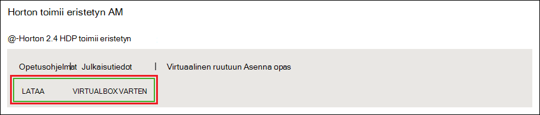
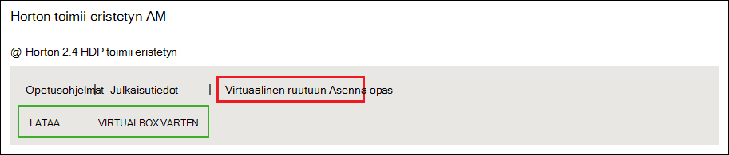
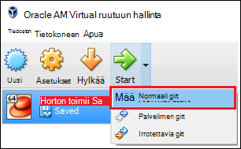

<properties
    pageTitle="Lisätietoja Hadoop Hadoop eristyksen avulla | Microsoft Azure"
    description="Aloita Koulujen käyttämisestä Hadoop ekosysteemissä, voit määrittää Hadoop eristyksen Hortonworks-Azure virtual-laitteeseen. "
    keywords="hadoop emulaattorin hadoop eristetyn"
    editor="cgronlun"
    manager="jhubbard"
    services="hdinsight"
    authors="nitinme"
    documentationCenter=""
    tags="azure-portal"/>

<tags
    ms.service="hdinsight"
    ms.workload="big-data"
    ms.tgt_pltfrm="na"
    ms.devlang="na"
    ms.topic="article"
    ms.date="08/24/2016"
    ms.author="nitinme"/>

# Aloita Hadoop ekosysteemissä Hadoop eristyksen virtual tietokoneen kanssa

Lue, miten Asenna Hadoop-eristetyn Hortonworks virtual Hadoop ekosysteemissä lisätietoja koneeseen. Eristyksen on paikallinen kehitysympäristö Hadoop, Hadoop Distributed (HDFS)-järjestelmän ja työn lisätietoja.

## Edellytykset

* [Oracle VirtualBox](https://www.virtualbox.org/)

Kun olet tutustunut Hadoop, voit aloittaa Hadoop käyttäminen Azure HDInsight-klusterin luomalla. Lisätietoja aloittamisesta on artikkelissa [Hadoop-HDInsight käytön aloittaminen](hdinsight-hadoop-linux-tutorial-get-started.md).

## Lataa ja asenna virtuaalikoneen

1. Valitse __Lataa VIRTUALBOX__ kohteen [http://hortonworks.com/downloads/#sandbox](http://hortonworks.com/downloads/#sandbox), valitse Hortonworks eristetyn HDP 2.4. Voit pyydetään Rekisteröi Hortonworks ennen lataus alkaa.

    

2. Saman verkkosivun Valitse __VirtualBox Asenna opas__ HDP 2.4 Hortonworks eristetyn käyttöön. Tämä Lataa PDF-tiedoston sisältävä virtuaalikoneen asennusohjeet.

    

## Käynnistä virtuaalikoneen

1. Aloita VirtualBox, valitse Hortonworks eristetyn, __Käynnistä-painiketta__ja valitse sitten __Normaali Käynnistä-painiketta__.

    

2. Kun virtuaalikoneen on valmis käynnistyksen, se näkyy kirjautuminen ohjeita. Avaa selain ja siirry URL-osoite näyttää (yleensä http://127.0.0.1:8888).

## Salasanojen määrittäminen

1. Valitse __Aloita__ vaihe Hortonworks eristetyn sivun __Näkymän Lisäasetukset__. Käytä tietoja käyttämällä SSH eristetyn kirjautuessasi tällä sivulla. Käytä nimi ja salasana.

    > [AZURE.NOTE] Jos sinulla ei ole asennettu SSH-asiakas, voit käyttää osoitteessa myöntämä virtuaalikoneen verkkopohjaisia SSH __http://localhost:4200 /__.

    Ensimmäisen kerran, voit muodostaa yhteyden SSH, jonka pyydetään pääkansion tilin salasanan vaihtaminen. Kirjoita uusi salasana, joita käytetään, kun kirjaudut sisään käyttämällä SSH myöhemmin.

2. Kun kirjautunut sisään, kirjoita seuraava komento:

        ambari-admin-password-reset
    
    Anna kehotettaessa Ambari järjestelmänvalvojatilin salasana. Tämä käytetään, kun käytät Ambari Web-Käyttöliittymä.

## Rakenne-komennolla

1. Käytä SSH yhteyttä eristyksen, käynnistämiseen rakenne-liittymän seuraava komento:

        hive

2. Kun käyttöliittymä on alkanut, voit tarkastella eristyksen mukana toimitettuja taulukoita käyttämällä seuraavaa:

        show tables;

3. Seuraavat avulla voit hakea 10 rivit `sample_07` taulukkoon:

        select * from sample_07 limit 10;

## Seuraavat vaiheet

* [Lue, miten voit käyttää Visual Studio Hortonworks eristetyn](hdinsight-hadoop-emulator-visual-studio.md)
* [Oppimiskeskuksen Hortonworks eristetyn köydet](http://hortonworks.com/hadoop-tutorial/learning-the-ropes-of-the-hortonworks-sandbox/)
* [Hadoop-opetusohjelma – HDP käytön aloittaminen](http://hortonworks.com/hadoop-tutorial/hello-world-an-introduction-to-hadoop-hcatalog-hive-and-pig/)