<properties
pageTitle="Microsoft Azure tietojen järvi työkaluilla Visual Studio kanssa Hortonworks eristetyn | Microsoft Azure"
description="Opettele käyttämään Azure Datatyökalut järvi VIsual Studio kanssa Hortonworks eristyksen (käynnissä paikallisen AM). Näillä työkaluilla voit luoda ja suorittaa rakenne ja Possu työt eristetyn ja tarkastella projektin tulostus ja historia."
services="hdinsight"
documentationCenter=""
authors="Blackmist"
manager="paulettm"
editor="cgronlun"/>

<tags
ms.service="hdinsight"
ms.devlang="na"
ms.topic="article"
ms.tgt_pltfrm="na"
ms.workload="big-data"
ms.date="08/26/2016"
ms.author="larryfr"/>

# Visual Studiossa Hortonworks eristetyn Azure Datatyökalut järvi käyttäminen

Visual Studio Azure tietojen järvi-Työkalut sisältävät Työkalut käsittelyyn yleinen Hadoop klustereiden lisäksi Azure tietojen järvi ja HDInsight-työkalut. Tässä tiedostossa on Azure tietojen järvi työkalujen käyttäminen Hortonworks eristetyn vaiheet virtual paikallisesta käynnissä.

Hortonworks eristetyn avulla voit käsitellä Hadoop paikallisesti kehittäminen-ympäristöön. Kun olet kehittänyt ratkaisun ja haluat ottaa käyttöön tasolla, voit siirtää sitten HDInsight-klusterin.

## Edellytykset

* Hortonworks eristyksen oman kehitysympäristö virtual machine käytössä. Tämä asiakirja on kirjoitettu ja testattu eristetyn Oracle VirtualBox, joka on määritetty tietojen avulla [pääset alkuun Hadoop ekosysteemissä](hdinsight-hadoop-emulator-get-started.md) asiakirjan käynnissä.

* Visual Studio 2013 tai 2015, mikä tahansa versio.

* [Azure SDK.NET](https://azure.microsoft.com/downloads/) 2.7.1 tai uudempi versio

* [Azure tietojen järvi Tools for Visual Studio](https://www.microsoft.com/download/details.aspx?id=49504)

## Eristyksen salasanojen määrittäminen

Varmista, että Hortonworks eristetyn on käynnissä ja noudata ohjeita voit määrittää salasanan SSH [Aloita Hadoop ekosysteemissä](hdinsight-hadoop-emulator-get-started.md#set-passwords) `root` tiliä ja Ambari `admin` tili. Nämä salasanat käytetään, kun muodostaa yhteyden eristyksen Visual Studio.

## Yhteyden muodostaminen eristyksen Työkalut

1. Avaa Visual Studio ja valitse __Näytä__ja sitten __Palvelimen Explorer__.

2. __Palvelimen Explorer__ __HDInsight__ -merkinnän hiiren kakkospainikkeella ja valitse sitten __Yhdistä HDInsight emulaattorin__.

    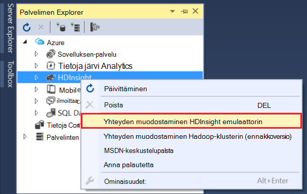

3. __HDInsight emulaattorin muodostaminen__ -valintaikkunassa salasana, jonka määritit Ambari varten.

    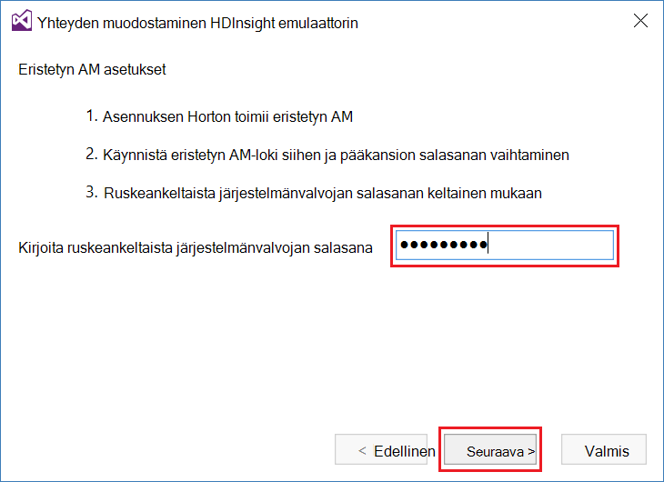

    Valitse __Seuraava__ ja jatka.

4. Käytä voit määritetty salasana __salasana__ -kenttään `root` tili. Jättää muut kentät oletusarvo.

    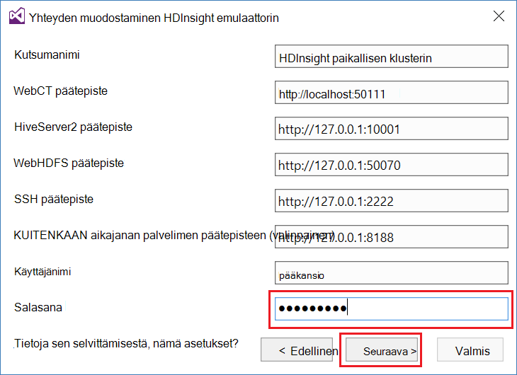

    Valitse __Seuraava__ ja jatka.

5. Odottaa vahvistusta suorittamiseen palveluja varten. Joissakin tapauksissa vahvistus saattaa epäonnistua ja pyytää päivittämään määritykset. Jos näin tapahtuu, __Päivitä__ -painiketta ja odota määritys ja todentaminen palveluun, jotta voit suorittaa.

    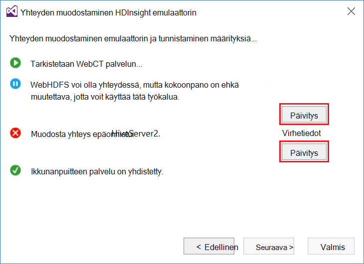

    > [AZURE.NOTE] Päivitä käyttää Ambari voit muokata mitä Azure tietojen järvi Työkalut odotetaan Visual Studio Hortonworks eristetyn määritykset.

    Kun vahvistus on valmis, valitse Valmis määritysten __Valmis__ .

    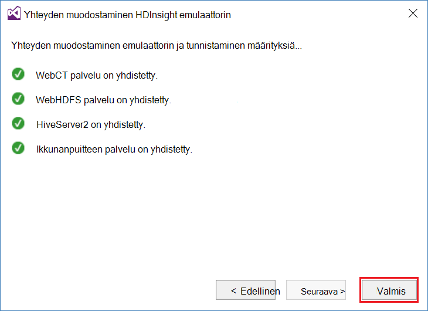

    > [AZURE.NOTE] Mukaan kehittämistä ympäristön ja muistin kohdistettu virtuaalikoneen nopeutta se voi kestää useita minuutteja ja vahvista palvelut.

Edellä kuvattujen toimenpiteiden jälkeen on nyt "HDInsight paikallisen klusterin"-merkinnän palvelimen Resurssienhallinnassa HDInsight-osassa.

## Kirjoita kyselyn rakenne

Rakenne on SQL kaltaisessa kyselykielen (HiveQL) jäsenneltyjen tietojen käsittelyyn. Seuraavien vaiheiden avulla voit Opi suorittamaan paikallisen klusterin itsenäisen kyselyitä.

1. __Server Exploreria__Napsauta paikallisen klusterin, jonka lisäsit aiemmin merkintää hiiren kakkospainikkeella ja valitse sitten __kirjoittaa kyselyn rakenne__.

    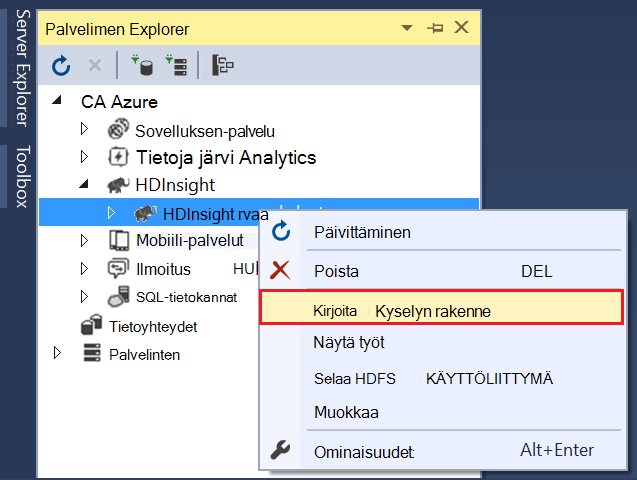

    Näyttöön avautuu uusi kyselyikkuna, jonka avulla voit nopeasti kirjoittaa ylös ja lähettää paikallisen klusterin kyselyn.

2. Kirjoita uusi kysely-ikkunassa seuraavasti:

        select count(*) from sample_08;
    
    Kyselyikkunan yläreunasta Varmista, että määritysten paikallisen klusterin on valittuna ja valitse sitten __Lähetä__. Jättää muut arvot (__erä__ ja palvelimen nimi-) oletusarvot.

    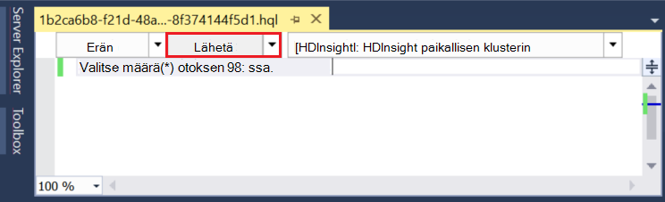

    Huomaa, että voit käyttää myös kohdan viereisessä avattavassa valikossa __Lähetä__ , valitse __Lisäasetukset__. Näyttöön tulee valintaikkuna, jonka avulla voit tarjoavat lisävaihtoehtoja, kun lähettänyt työn.

    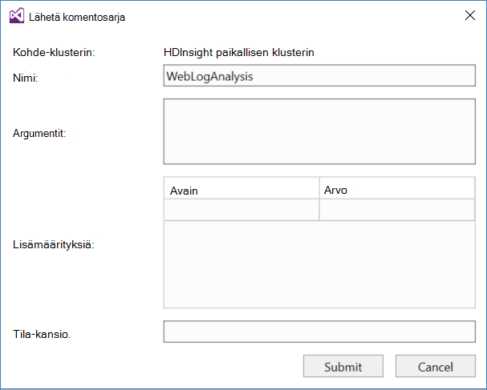

3. Kun teet kyselyn, työn tilaksi tulee näkyviin. Tämä on tietoja työn, kun se käsittelee Hadoop. __Työn tila__ -merkintä sisältää työn nykyisen tilan. Valtion päivitetään säännöllisesti tai päivitä-kuvake avulla voit päivittää manuaalisesti tila.

    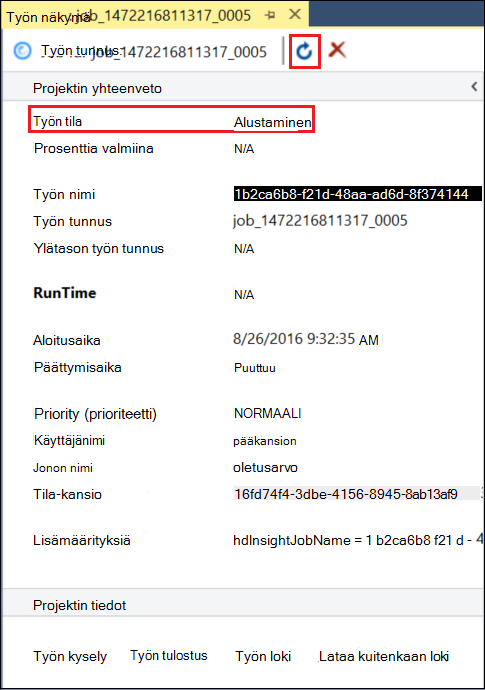

    Kun __Tila__ muuttuu __valmiiksi__, ohjataan asykliset Graph (DAG) tulee näkyviin. Tämä kuvaa suorittamisen polku, joka on määräytyy Tez (oletus suorittamisen moduulin rakenne, paikallisen klusterin.) 
    
    > [AZURE.NOTE] Tez on myös oletusasetus Linux-pohjaiset HDInsight klustereiden käytettäessä. Se ei ole Windows-pohjaisesta HDInsight oletusarvo Voit käyttää sitä, sinun on lisättävä rivin `set hive.execution.engine = tez;` rakenteen kyselyn alkuun. 

    __Työn tulostus__ -linkin avulla voit tarkastella tulos. Tässä tapauksessa on __823__; sample_08 taulukon rivien määrä. Voit tarkastella projektin diagnostiikkatietoja __Työn loki__ ja __Lataa kuitenkaan Kirjaudu__ linkkien avulla.

4. Voit myös suorittaa rakenteen töitä vuorovaikutteisesti muuttamalla __Vuorovaikutteinen__ __erä__ -kentässä ja valitse sitten __Suorita__. 

    

    Tämä virtauttaa lokiin __HiveServer2__ tulostusikkunassa käsittelyn aikana.
    
    > [AZURE.NOTE] Tämä on samat tiedot, joka on käytettävissä __Työhön Log__ -linkistä, projektin päätyttyä.

    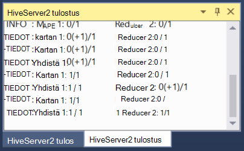

## Rakenne-projektin luominen

Voit myös luoda projektin, joka sisältää useita rakenne-komentosarjoja. Tästä on hyötyä, kun sinulla on toisiinsa liittyviä komentosarjoja, jotka haluat säilyttää samassa paikassa tai säilyttää versio ohjausjärjestelmät avulla.

1. Visual Studiossa Valitse __Tiedosto__, __Uusi__ja then__Project__.

2. Projektit-luettelosta __Mallit__- __Azure tietojen järvi__ ja valitse sitten __rakenne (HDInsight)__. Valitse __Rakenne otoksen__mallit-luettelosta. Kirjoita nimi ja sijainti ja valitse sitten __OK__.

    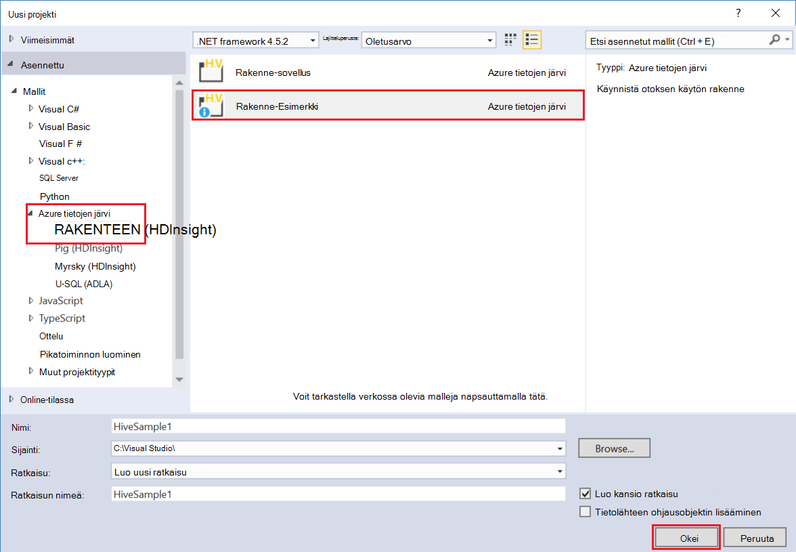

Projekti, __Rakenne malli__ sisältää __WebLogAnalysis.hql__ ja __SensorDataAnalysis.hql__komentosarjoja. Voit lähettää nämä käyttämällä samaa __Lähetä__ -painiketta ikkunan yläreunassa.

## Possu projektin luominen

Rakenteen tarjoaa kaltaisessa SQL-kielen jäsenneltyjen tietojen käsittelyyn, Possu on language (Possu latinalainen), jonka avulla voit kehittää putkijohto muunnoksia, joita käytetään tietoihin. Seuraavien vaiheiden avulla voit käyttää Possu paikallisen klusterin.

1. Avaa Visual Studio ja valitse __Tiedosto__, __Uusi__ja valitse sitten __Projekti__. Projektit-luettelosta __Mallit__- __Azure tietojen järvi__, ja valitse sitten __Possu (HDInsight)__. Valitse Mallit-luettelosta __Possu sovelluksen__. Kirjoita nimi, sijainti, ja valitse sitten __OK__.

    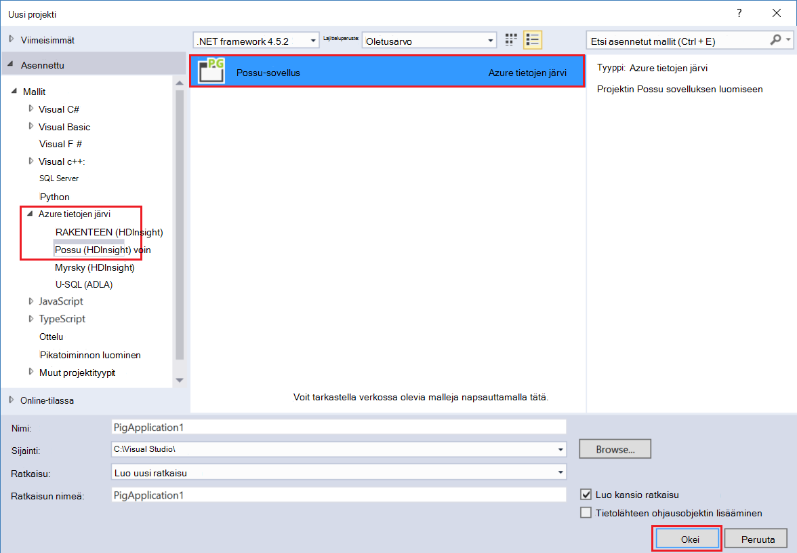

2. Anna seuraavat __script.pig__ -tiedosto, joka on luotu projektin sisällön.

        a = LOAD '/demo/data/Website/Website-Logs' AS (
            log_id:int, 
            ip_address:chararray, 
            date:chararray, 
            time:chararray, 
            landing_page:chararray, 
            source:chararray);
        b = FILTER a BY (log_id > 100);
        c = GROUP b BY ip_address;
        DUMP c;

    Possu käyttää eri kielellä kuin rakenne, miten suoritat ovat yhdenmukaisia – __Lähetä__ -painike sekä kielten välillä. Lähetä lisäasetukset-valintaikkuna valitsemalla avattavassa alaspäin __Lähetä__ vieressä näkyy Possu.

    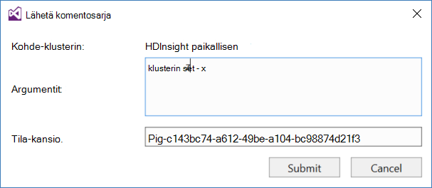
    
3. Tilan ja tulos on myös näytetään saman kyselyn rakenne.

    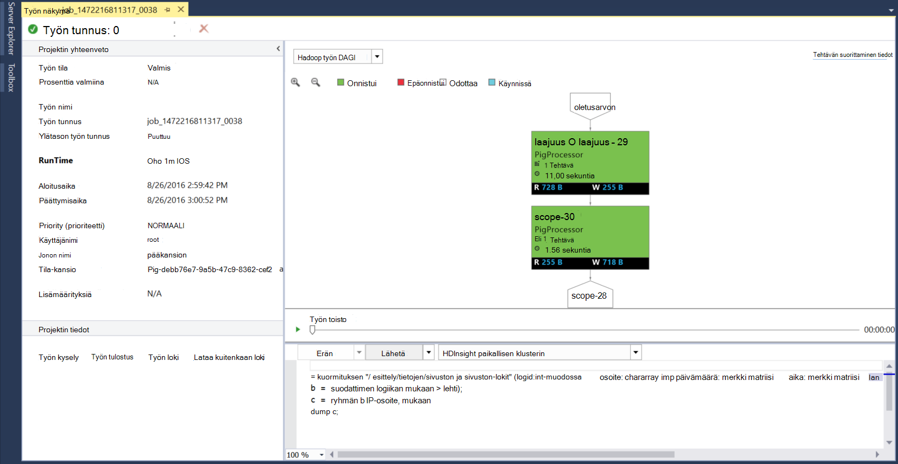

## Näytä työt

Azure järvi Datatyökalut myös avulla voit helposti tarkastelutietoja työt, jotka on suorittanut Hadoop. Seuraavien vaiheiden avulla voit tarkastella työt, jotka on suorittanut paikallisen klusterin.

1. __Server Exploreria__Napsauta paikallisen klusterin hiiren kakkospainikkeella ja valitse sitten __Näytä työt__. Tämä näyttää luettelon työt, jotka on lähetetty klusterin.

    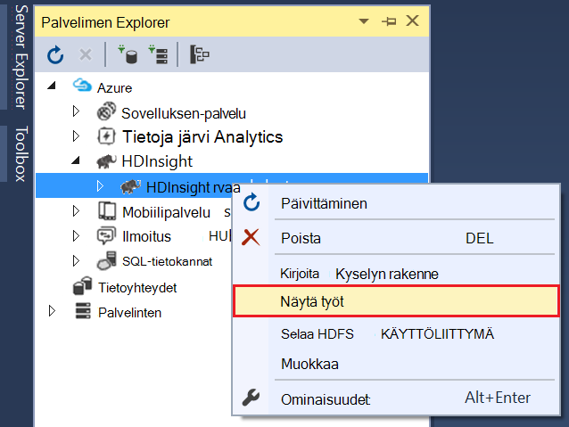

2. Valitse jokin voit tarkastella projektin työt-luettelosta.

    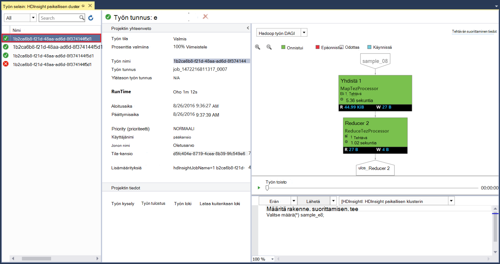

    Voit tarkastella rakennetta tai Possu kyselyn, ja lisää siihen linkkien tarkasteleminen tulos ja lokitiedot suorittamisen jälkeen eroaa näytettävät tiedot.

3. Voit myös muokata ja Lähetä uudelleen tästä työn.

## Näkymän rakenteen tietokannat

1. __Palvelimen Explorer__Laajenna __HDInsight paikallisen klusterin__ tapahtuma ja laajenna sitten __Rakenne tietokannat__. Tämä paljastaa paikallisen klusterin __Oletus__ ja __xademo__ tietokannat. Tietokannan laajentaminen paljastaa tietokannan taulukoista.

    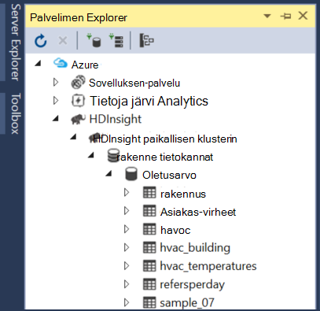

2. Taulukon laajentaminen näyttää taulukon sarakkeet. Voit taulukkoa hiiren kakkospainikkeella ja valitse __Näytä ylimmät 100 riviä__ nopeasti voit tarkastella tietoja.

    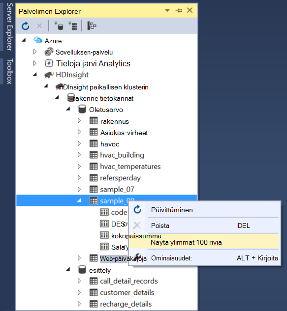

### Tietokanta ja taulukko-ominaisuudet

Olet ehkä jo huomannut, että valitset tietokannan tai taulukon __ominaisuuksien__ tarkastelemiseen. Valitun kohteen tiedot näkyvät ominaisuudet-ikkuna.

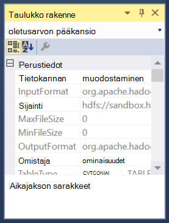

### Taulukon luominen

Jos haluat luoda uuden taulukon, tietokannan hiiren kakkospainikkeella ja valitse sitten __Luo taulukko__.

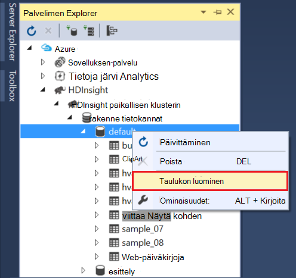

Voit luoda taulukkoa, jossa lomakkeeseen. Näet raaka HiveQL, jota käytetään luomaan taulukon tämän sivun alareunassa.

## Seuraavat vaiheet

* [Oppimiskeskuksen Hortonworks eristetyn köydet](http://hortonworks.com/hadoop-tutorial/learning-the-ropes-of-the-hortonworks-sandbox/)
* [Hadoop-opetusohjelma – HDP käytön aloittaminen](http://hortonworks.com/hadoop-tutorial/hello-world-an-introduction-to-hadoop-hcatalog-hive-and-pig/)