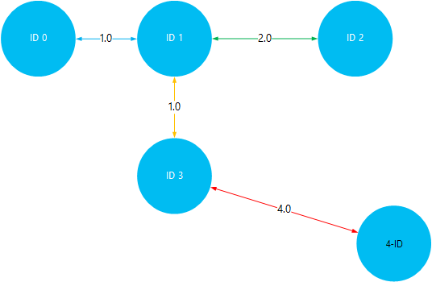

<properties
    pageTitle="Asentaminen ja käyttäminen Giraph Linux-pohjaiset HDInsight (Hadoop) | Microsoft Azure"
    description="Opettele Giraph asentaminen Linux-pohjaiset HDInsight klustereiden komentosarja-toimintojen käyttäminen. Komentosarjatoiminnot avulla voit mukauttaa klusterin luotaessa tai muuttamalla klusterin kokoonpano services ja apuohjelmat."
    services="hdinsight"
    documentationCenter=""
    authors="Blackmist"
    manager="jhubbard"
    editor="cgronlun"
    tags="azure-portal"/>

<tags
    ms.service="hdinsight"
    ms.workload="big-data"
    ms.tgt_pltfrm="na"
    ms.devlang="na"
    ms.topic="article"
    ms.date="10/17/2016"
    ms.author="larryfr"/>

# Asenna Giraph HDInsight Hadoop klustereiden ja Giraph avulla voit käsitellä suurissa kaaviot

Voit asentaa Giraph kaikentyyppisissä Hadoop klusterin Azure HDInsight- **Komentosarja-toiminnon** avulla voit mukauttaa klusterin.

Tässä ohjeaiheessa kerrotaan asentaminen Giraph komentosarja-toiminnon avulla. Kun olet asentanut Giraph, Opit myös käyttämisestä Giraph yleisimmät sovelluksia, joka on käyttänyt suurissa kaaviot.

> [AZURE.NOTE] Tämän artikkelin tiedot on Linux-pohjaiset HDInsight klustereiden. Lisätietoja Windows-pohjaisesta klustereiden käsittelemisestä on artikkelissa [Asentaa Giraph-HDInsight Hadoop varausyksiköt (Windows)](hdinsight-hadoop-giraph-install.md)

## Mikä on Giraph?

[Apache Giraph](http://giraph.apache.org/) avulla voit suorittaa käsittelyn käyttämällä Hadoop graph ja Azure Hdinsightiin kanssa voidaan käyttää. Kaavioiden mallin objektit, kuten reitittimen, kuten Internet suuret verkon tai käyttäjien kanssa (joskus kutsutaan sosiaalisen kaaviona) yhteisöpalveluihin suhteita välisten yhteyksien välisiä suhteita. Kaavion käsittely mahdollistavat syy graph-objektien välisistä yhteyksistä seuraavasti:

- Tunnistaa mahdolliset ystävien nykyisen yhteydet perusteella.
- Tunnistaa lyhyimmän reitin kaksi verkon tietokoneiden välillä.
- Laskeminen verkkosivujen sivun tietojoukon.

> [AZURE.WARNING] Osien HDInsight-klusterin mukana tuetaan täysin ja Microsoft Support auttavat eristämään ja ratkaista ongelmat, jotka liittyvät komponentit.
>
> Mukautettujen osien, kuten Giraph, saavat järkevän tukea helpottavat edelleen ongelman vianmäärityksen. Tämä saattaa aiheuttaa ratkaisemiseksi tai sinulta kysytään, haluatko osallistuminen käytettävissä olevat kanavat Avaa lähde-tekniikoiden laaja osaamisalueet, tekniikkaa löytyi. Esimerkiksi ovat yhteisön sivustoja, joita voidaan käyttää, kuten: [HDInsight MSDN-keskustelupalsta](https://social.msdn.microsoft.com/Forums/azure/en-US/home?forum=hdinsight), [http://stackoverflow.com](http://stackoverflow.com). Myös Apache projektien on projektisivustojen [http://apache.org](http://apache.org), esimerkiksi: [Hadoop](http://hadoop.apache.org/).

##Komentosarjan mitä

Tämä komentosarja tekee seuraavat toimet:

* Jos haluat asentaa Giraph`/usr/hdp/current/giraph`
* Kopioi `giraph-examples.jar` yhteyttä klusterin oletusarvon storage (WASB)-tiedoston:`/example/jars/giraph-examples.jar`

## Asenna Giraph komentosarja-toimintojen käyttäminen

Esimerkki komentosarjan Giraph asennetaan HDInsight-klusterin on käytettävissä seuraavassa sijainnissa.

    https://hdiconfigactions.blob.core.windows.net/linuxgiraphconfigactionv01/giraph-installer-v01.sh

Tässä osassa on ohjeet käyttämisestä komentosarjan aikana klusterin luominen Azure-portaalissa. 

> [AZURE.NOTE] Azure PowerShell, Azure-CLI, HDInsight .NET SDK tai Azure Resurssienhallinta malleja myös voidaan lisätä komentosarjatoiminnot. Voit myös käyttää komentosarjatoiminnot klustereiden jo käytössä. Lisätietoja on artikkelissa [mukauttaminen HDInsight klustereiden komentosarjan toimintojen](hdinsight-hadoop-customize-cluster-linux.md).

1. Aloita luominen klusterin [luominen Linux-pohjaiset HDInsight](hdinsight-hadoop-create-linux-clusters-portal.md)klustereissa ohjeiden mukaisesti, mutta älä tee luominen.

2. Valitse **Vaihtoehtoinen määritys** -sivu **Komentosarjatoiminnot**ja anna seuraavat tiedot:

    * __Nimi__: Kirjoita kutsumanimi komentosarja-toiminnon.
    * __KOMENTOSARJAN URI__: https://hdiconfigactions.blob.core.windows.net/linuxgiraphconfigactionv01/giraph-installer-v01.sh
    * __HEAD__: Valitse tämä vaihtoehto
    * __Työntekijän__: Jätä valitsematta
    * __ZOOKEEPER__: Jätä valitsematta
    * __Parametrit__: Jätä tämä kenttä tyhjäksi

3. **Komentosarjatoiminnot**alareunassa Tallenna kokoonpano **valinta** -painikkeen avulla. Lopuksi painikkeella **Valitse** **Vaihtoehtoinen määritys** -sivu alareunassa Tallenna valinnainen kokoonpanotietoja.

4. Jatka klusterin luominen kuvatulla tavalla [luominen Linux-pohjaiset HDInsight klustereiden](hdinsight-hadoop-create-linux-clusters-portal.md).

## Miten Giraph käytetään HDInsight?

Kun klusterin on luonut, suorita Giraph mukana SimpleShortestPathsComputation Esimerkki seuraavien vaiheiden avulla. Ottaa käyttöön basic <a href = "http://people.apache.org/~edwardyoon/documents/pregel.pdf">Pregel</a> käyttöönoton etsiessään lyhyimmän polku kaaviossa objektista toiseen.

1. Yhdistä käyttäen SSH HDInsight-klusterin:

        ssh USERNAME@CLUSTERNAME-ssh.azurehdinsight.net

    Lisätietoja HDInsight SSH käyttämisestä on seuraavissa artikkeleissa:

    * [Linux-pohjaiset Hadoop HDInsight Linux, Unix tai OS X-SSH käyttäminen](hdinsight-hadoop-linux-use-ssh-unix.md)

    * [SSH käyttäminen Linux-pohjaiset Hadoop-HDInsight Windows](hdinsight-hadoop-linux-use-ssh-windows.md)

1. Voit luoda uuden tiedoston nimeltä __tiny_graph.txt__käyttämällä seuraavaa:

        nano tiny_graph.txt

    Käyttää tämän tiedoston sisällön seuraavasti:

        [0,0,[[1,1],[3,3]]]
        [1,0,[[0,1],[2,2],[3,1]]]
        [2,0,[[1,2],[4,4]]]
        [3,0,[[0,3],[1,1],[4,4]]]
        [4,0,[[3,4],[2,4]]]

    Nämä tiedot kuvataan objektien ohjattu kaaviona muodossa suhteen [lähde\_tunnus ja lähde\_arvo, [[dest\_tunnus], [reunan\_arvo],...]]. Kunkin rivin edustaa suhteen **lähteen\_tunnus** objekti ja vähintään yhden **dest\_tunnus** objekteja. **Reunan\_arvo** (tai leveyden) Voit ajatella voimakkuus tai etäisyys **source_id** välisen yhteyden ja **dest\_tunnus**.

    Piirretty, ja käytä arvo (tai paino) objektien välistä etäisyyttä, edellä esitettyjä tietoja voi näyttää tältä:

    

2. Jos haluat tallentaa tiedoston, Hyväksy tiedostonimi __Ctrl + X__ja __Y__ja lopuksi __Enter__ avulla.

3. Tiedot tallennetaan HDInsight-klusterin ensisijainen varastoon käyttämällä seuraavaa:

        hdfs dfs -put tiny_graph.txt /example/data/tiny_graph.txt

4. Suorita seuraava komento käyttämällä SimpleShortestPathsComputation esimerkki.

         yarn jar /usr/hdp/current/giraph/giraph-examples.jar org.apache.giraph.GiraphRunner org.apache.giraph.examples.SimpleShortestPathsComputation -ca mapred.job.tracker=headnodehost:9010 -vif org.apache.giraph.io.formats.JsonLongDoubleFloatDoubleVertexInputFormat -vip /example/data/tiny_graph.txt -vof org.apache.giraph.io.formats.IdWithValueTextOutputFormat -op /example/output/shortestpaths -w 2

    Tällä komennolla parametrit on kuvattu seuraavassa taulukossa.

  	| Parametri | Kuvaus |
  	| --------- | ------------ |
  	| `jar /usr/hdp/current/giraph/giraph-examples.jar` | Esimerkkejä sisältävä purkki tiedosto. |
  	| `org.apache.giraph.GiraphRunner` | Luokka, jota käytetään Käynnistä esimerkkejä. |
  	| `org.apache.giraph.examples.SimpleShortestPathsCoputation` | Esimerkki, joka on suorittanut. Tässä tapauksessa se Laske lyhyimmän polku tunnus 1 – muut Graphiin tunnukset. |
  	| `-ca mapred.job.tracker=headnodehost:9010` | Klusterin headnode. |
  	| `-vif org.apache.giraph.io.formats.JsonLongDoubleFloatDoubleVertexInputFromat` | Käytettävä syöttötiedot syötteen muoto. |
  	| `-vip /example/data/tiny_graph.txt` | Syöttötiedot-tiedosto. |
  	| `-vof org.apache.giraph.io.formats.IdWithValueTextOutputFormat` | Siirtomuoto. Tässä tapauksessa tunnus ja arvojen pelkkänä tekstinä. |
  	| `-op /example/output/shortestpaths` | Tulosteen sijainti. |
  	| `-w 2` | Jos haluat käyttää työntekijöiden määrä. Tässä tapauksessa 2. |

    Lisätietoja näiden ja muut parametrit Giraph näytteiden käyttämisestä on artikkelissa [Giraph pikaopas](http://giraph.apache.org/quick_start.html).

5. Kun työ on valmis, tulokset tallennetaan __wasbs: / / / esimerkki/out/shotestpaths__ hakemisto. Luodut tiedostot alkavat __osa-m -__ ja päättyy luvun, joka ilmaisee ensimmäinen, toinen, tiedoston jne. Seuraavat avulla voit tarkastella tulos:

        hdfs dfs -text /example/output/shortestpaths/*

    Tulosteen pitäisi näyttää seuraavankaltaiselta:

        0   1.0
        4   5.0
        2   2.0
        1   0.0
        3   1.0

    Esimerkki on vaikeaa koodattu aloittaa SimpleShortestPathComputation objektin tunnus 1 ja Etsi lyhyimmän polku toisiin kohteisiin. Jotta tulos olisi luetaan `destination_id distance`, jossa etäisyys on ottanut objektin tunnus 1 ja kohde-tunnuksen välillä reunat arvo (tai paino)

    Kesäolympialaisten visualisointi, voit tarkistaa tulokset matkustaminen lyhyimmän polut tunnus 1 ja muiden objektien välillä. Huomaa, että tunnus 1 – 4 tunnus lyhyimmän polku on 5. Tämä on yhteensä tunnus 1 – 3, ja valitse tunnus 3 ja 4välistä etäisyyttä.

    

## Seuraavat vaiheet

- [Asentaminen ja käyttäminen sävyä HDInsight-klusterit](hdinsight-hadoop-hue-linux.md). Värisävy on sivuston Käyttöliittymä, joka on helppo luoda, suorittaa ja Tallenna Possu ja rakenteen työt sekä oman HDInsight Selaa oletusarvo-tallennustilan klusterin.

- [Asenna R-HDInsight klustereiden](hdinsight-hadoop-r-scripts-linux.md): ohjeita siitä, miten voit käyttää klusterin asentaminen ja käyttäminen HDInsight Hadoop klustereiden R mukauttaminen. R on Avaa lähde ja tilastollisia tietojenkäsittely ympäristössä. Se on satoja valmiin tilastolliset funktiot ja oma ohjelmointikieli, joka yhdistää toiminnalliset ja Käytä olio-ohjelmoinnin ominaisuuksia. Se sisältää myös monipuolisia graafisia ominaisuuksia.

- [Asenna Solr-HDInsight klustereiden](hdinsight-hadoop-solr-install-linux.md). Klusterin mukauttaminen avulla voit asentaa Solr HDInsight Hadoop klustereiden. Solr avulla voit suorittaa toimintoja tehokas haku tallennettuja tietoja.
