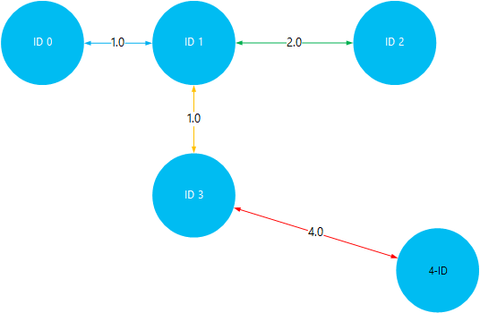

<properties
    pageTitle="Asentaminen ja käyttäminen Giraph Hadoop varausyksiköt HDInsight | Microsoft Azure"
    description="Katso, miten voit mukauttaa HDInsight klusteri ja Giraph ja käyttämisestä Giraph."
    services="hdinsight"
    documentationCenter=""
    authors="nitinme"
    manager="jhubbard"
    editor="cgronlun"
    tags="azure-portal"/>

<tags
    ms.service="hdinsight"
    ms.workload="big-data"
    ms.tgt_pltfrm="na"
    ms.devlang="na"
    ms.topic="article"
    ms.date="02/05/2016"
    ms.author="nitinme"/>

# Asenna ja käytä Giraph Hdinsightiin

Opettele mukauttaa Windows perustuvat HDInsight-klusterin Giraph komentosarja-toiminnon avulla ja Giraph avulla voit käsitellä suurissa kaaviot. Lisätietoja Linux-pohjaiset klusterin Giraph käyttämisestä on artikkelissa [Asentaa Giraph-HDInsight Hadoop varausyksiköt (Linux)](hdinsight-hadoop-giraph-install-linux.md).
 
Voit asentaa Giraph kaikentyyppisissä klusterin (Hadoop, myrsky, HBase, ohjattu) Azure Hdinsightiin *Komentosarja-toiminnon*avulla. Esimerkki komentosarjan Giraph asennetaan HDInsight-klusterin on käytettävissä vain luku-Azure tallennustilan Blob-objektien [https://hdiconfigactions.blob.core.windows.net/giraphconfigactionv01/giraph-installer-v01.ps1](https://hdiconfigactions.blob.core.windows.net/giraphconfigactionv01/giraph-installer-v01.ps1)-palvelussa. Esimerkki komentosarja toimii vain HDInsight klusterin versio 3.1. Katso lisätietoja HDInsight-klusterin versioissa, [HDInsight-klusterin versiot](hdinsight-component-versioning.md).

**Aiheeseen liittyviä artikkeleita**

- [Asenna Giraph HDInsight Hadoop varausyksiköt (Linux)](hdinsight-hadoop-giraph-install-linux.md)
- [Luo Hadoop varausyksiköt HDInsight](hdinsight-provision-clusters.md): yleisiä tietoja HDInsight klustereiden luomisesta.
- [Mukauta HDInsight-klusterin komentosarja-toiminnon käyttäminen][hdinsight-cluster-customize]: yleisiä tietoja mukauttamisesta HDInsight klustereiden komentosarja-toiminnon avulla.
- [Kehittää komentosarja-toiminnon komentosarjojen Hdinsightista](hdinsight-hadoop-script-actions.md).

## Mikä on Giraph?

<a href="http://giraph.apache.org/" target="_blank">Apache Giraph</a> avulla voit suorittaa käsittelyn käyttämällä Hadoop graph ja Azure Hdinsightiin kanssa voidaan käyttää. Kaavioiden mallin objektit, kuten reitittimen, kuten Internet suuret verkon tai käyttäjien kanssa (joskus kutsutaan sosiaalisen kaaviona) yhteisöpalveluihin suhteita välisten yhteyksien välisiä suhteita. Kaavion käsittely mahdollistavat syy graph-objektien välisistä yhteyksistä seuraavasti:

- Tunnistaa mahdolliset ystävien nykyisen yhteydet perusteella.
- Tunnistaa lyhyimmän reitin kaksi verkon tietokoneiden välillä.
- Laskeminen verkkosivujen sivun tietojoukon.

## Asenna Giraph-portaalissa

1. Aloita luominen klusterin valitsemalla **Luo mukautettu** -vaihtoehdon, [Luo Hadoop varausyksiköt HDInsight](hdinsight-provision-clusters.md#portal)-palvelussa kuvatulla.
2. Valitse ohjatun toiminnon **Komentosarjatoiminnot** -sivulla tietojen näyttäminen komentosarja-toiminnon **lisääminen komentosarja-toiminnon** , alla kuvatulla tavalla:

    ![Käytä komentosarja-toiminnon klusterin mukauttamiseen] (./media/hdinsight-hadoop-giraph-install/hdi-script-action-giraph.png "Käytä komentosarja-toiminnon klusterin mukauttamiseen")

    <table border='1'>
        <tr><th>Ominaisuus</th><th>Arvo</th></tr>
        <tr><td>Nimi</td>
            <td>Määritä komentosarja-toiminnon nimi. Esimerkiksi <b>Asentaa Giraph</b>.</td></tr>
        <tr><td>Komentosarjan URI</td>
            <td>Määritä-tunniste URI (Uniform Resource) komentosarjan, joka suoritetaan klusterin mukauttamiseen. Esimerkiksi <i>https://hdiconfigactions.blob.core.windows.net/giraphconfigactionv01/giraph-installer-v01.ps1</i></td></tr>
        <tr><td>Solmutyyppi</td>
            <td>Määritä solmujen, jossa mukauttaminen komentosarja suoritetaan. Voit valita <b>kaikki solmut</b>, <b>vain Head solmujen</b>tai <b>vain työntekijä solmujen</b>.
        <tr><td>Parametrit</td>
            <td>Määritä parametreja, jos vaatii komentosarja. Asenna Giraph komentosarja ei edellytä parametreja, niin voit jättää tämän tyhjäksi.</td></tr>
    </table>

    Voit lisätä useita komentosarja-toiminnon asentamisesta klusterin useita osia. Kun olet lisännyt komentosarjat, napsauta Aloita klusterin luominen valintamerkkiä.

## Käytä Giraph

Esimerkki SimpleShortestPathsComputation avulla, basic <a href = "http://people.apache.org/~edwardyoon/documents/pregel.pdf">Pregel</a> käyttöönoton etsiessään lyhyimmän polku kaaviossa objektista toiseen. Seuraavien vaiheiden avulla voit ladata mallitiedot ja otoksen purkkiin, suorita projektin SimpleShortestPathsComputation esimerkin ja Tarkastele tuloksia.

1. Lataa Azure-Blob-säiliö mallitietoja. Luo uusi tiedosto nimeltä **tiny_graph.txt**paikallisen työasemaan. Sen pitäisi olla seuraavat rivit:

        [0,0,[[1,1],[3,3]]]
        [1,0,[[0,1],[2,2],[3,1]]]
        [2,0,[[1,2],[4,4]]]
        [3,0,[[0,3],[1,1],[4,4]]]
        [4,0,[[3,4],[2,4]]]

    Tiny_graph.txt-tiedoston lataaminen ensisijainen tallennustilan HDInsight-klusterin. Ohjeita siitä, miten voit ladata tiedostoja on artikkelissa [Lataa tiedot Hadoop projekteille Hdinsightista](hdinsight-upload-data.md).

    Nämä tiedot kuvataan objektien ohjattu kaaviona muodossa suhteen [lähde\_tunnus ja lähde\_arvo, [[dest\_tunnus], [reunan\_arvo],...]]. Kunkin rivin edustaa suhteen **lähteen\_tunnus** objekti ja vähintään yhden **dest\_tunnus** objekteja. **Reunan\_arvo** (tai leveyden) Voit ajatella voimakkuus tai etäisyys **source_id** välisen yhteyden ja **dest\_tunnus**.

    Piirretty, ja käytä arvo (tai paino) objektien välistä etäisyyttä, edellä esitettyjä tietoja voi näyttää tältä:

    

4. Suorita SimpleShortestPathsComputation esimerkki. Seuraavat Azure PowerShell cmdlet-komentojen avulla voit suorittaa esimerkin syötteeksi tiny_graph.txt-tiedoston avulla. 

    [AZURE.INCLUDE [upgrade-powershell](../../includes/hdinsight-use-latest-powershell.md)]

        $clusterName = "clustername"
        # Giraph examples jar
        $jarFile = "wasbs:///example/jars/giraph-examples.jar"
        # Arguments for this job
        $jobArguments = "org.apache.giraph.examples.SimpleShortestPathsComputation",
                        "-ca", "mapred.job.tracker=headnodehost:9010",
                        "-vif", "org.apache.giraph.io.formats.JsonLongDoubleFloatDoubleVertexInputFormat",
                        "-vip", "wasbs:///example/data/tiny_graph.txt",
                        "-vof", "org.apache.giraph.io.formats.IdWithValueTextOutputFormat",
                        "-op",  "wasbs:///example/output/shortestpaths",
                        "-w", "2"
        # Create the definition
        $jobDefinition = New-AzureHDInsightMapReduceJobDefinition
          -JarFile $jarFile
          -ClassName "org.apache.giraph.GiraphRunner"
          -Arguments $jobArguments

        # Run the job, write output to the Azure PowerShell window
        $job = Start-AzureHDInsightJob -Cluster $clusterName -JobDefinition $jobDefinition
        Write-Host "Wait for the job to complete ..." -ForegroundColor Green
        Wait-AzureHDInsightJob -Job $job
        Write-Host "STDERR"
        Get-AzureHDInsightJobOutput -Cluster $clusterName -JobId $job.JobId -StandardError
        Write-Host "Display the standard output ..." -ForegroundColor Green
        Get-AzureHDInsightJobOutput -Cluster $clusterName -JobId $job.JobId -StandardOutput

    Edellä olevassa esimerkissä korvaa **clustername** , jossa on asennettu Giraph HDInsight yhteyttä klusterin nimen.

5. Tarkastele tuloksia. Kun työ on valmis, tulokset tallennetaan kaksi tulosteen tiedostot __wasbs: / / / esimerkki/out/shotestpaths__ kansio. Tiedostojen kutsutaan __osan m-00001__ ja __osa-m-00002__. Seuraavien toimien voit ladata ja katsella tulos:

        $subscriptionName = "<SubscriptionName>"       # Azure subscription name
        $storageAccountName = "<StorageAccountName>"   # Azure Storage account name
        $containerName = "<ContainerName>"             # Blob storage container name

        # Select the current subscription
        Select-AzureSubscription $subscriptionName

        # Create the Storage account context object
        $storageAccountKey = Get-AzureStorageKey $storageAccountName | %{ $_.Primary }
        $storageContext = New-AzureStorageContext -StorageAccountName $storageAccountName -StorageAccountKey $storageAccountKey

        # Download the job output to the workstation
        Get-AzureStorageBlobContent -Container $containerName -Blob example/output/shortestpaths/part-m-00001 -Context $storageContext -Force
        Get-AzureStorageBlobContent -Container $containerName -Blob example/output/shortestpaths/part-m-00002 -Context $storageContext -Force

    Tämä luo __esimerkki/tulosteen/shortestpaths__ kansiorakenne työasemalle nykyiseen kansioon, ja kaksi tulostus-tiedostojen lataaminen kyseiseen sijaintiin.

    Tiedostojen sisällön näyttäminen __kissa__ -cmdlet-komennolla:

        Cat example/output/shortestpaths/part*

    Tulosteen pitäisi näyttää seuraavankaltaiselta:

        0   1.0
        4   5.0
        2   2.0
        1   0.0
        3   1.0

    Esimerkki on vaikeaa koodattu aloittaa SimpleShortestPathComputation objektin tunnus 1 ja Etsi lyhyimmän polku toisiin kohteisiin. Jotta tulos olisi luetaan `destination_id distance`, jossa etäisyys on ottanut objektin tunnus 1 ja kohde-tunnuksen välillä reunat arvo (tai paino)

    Kesäolympialaisten visualisointi, voit tarkistaa tulokset matkustaminen lyhyimmän polut tunnus 1 ja muiden objektien välillä. Huomaa, että tunnus 1 – 4 tunnus lyhyimmän polku on 5. Tämä on yhteensä tunnus 1 – 3, ja valitse tunnus 3 ja 4välistä etäisyyttä.

    

## Asenna Giraph Aure PowerShellin avulla

Katso [mukauttaminen HDInsight klustereiden komentosarja-toiminnon avulla](hdinsight-hadoop-customize-cluster.md#call_scripts_using_powershell).  Esimerkki havainnollistaa ohjattu Azure PowerShellin asennusohjeet. Haluat mukauttaa komentosarja käyttämään [https://hdiconfigactions.blob.core.windows.net/giraphconfigactionv01/giraph-installer-v01.ps1](https://hdiconfigactions.blob.core.windows.net/giraphconfigactionv01/giraph-installer-v01.ps1).

## Asenna Giraph .NET SDK: N avulla

Katso [mukauttaminen HDInsight klustereiden komentosarja-toiminnon avulla](hdinsight-hadoop-customize-cluster.md#call_scripts_using_azure_powershell). Esimerkki havainnollistaa käyttämällä .NET SDK ohjattu asentaminen. Haluat mukauttaa komentosarja käyttämään [https://hdiconfigactions.blob.core.windows.net/giraphconfigactionv01/giraph-installer-v01.ps1](https://hdiconfigactions.blob.core.windows.net/giraphconfigactionv01/giraph-installer-v01.ps1).

## Katso myös

- [Asenna Giraph HDInsight Hadoop varausyksiköt (Linux)](hdinsight-hadoop-giraph-install-linux.md)
- [Luo Hadoop varausyksiköt HDInsight](hdinsight-provision-clusters.md): yleisiä tietoja HDInsight klustereiden luomisesta.
- [Mukauta HDInsight-klusterin komentosarja-toiminnon käyttäminen][hdinsight-cluster-customize]: yleisiä tietoja mukauttamisesta HDInsight klustereiden komentosarja-toiminnon avulla.
- [Kehittää komentosarja-toiminnon komentosarjojen Hdinsightista](hdinsight-hadoop-script-actions.md).
- [Asentaminen ja käyttäminen ohjattu HDInsight klustereiden][hdinsight-install-spark]: asentamisesta ohjattu otoksen komentosarja-toiminnon.
- [R asentaminen HDInsight klustereiden][hdinsight-install-r]: komentosarja-toiminnon otoksen asentamisesta R.
- [Asenna Solr-HDInsight klustereiden](hdinsight-hadoop-solr-install.md): komentosarja-toiminnon otoksen asentamisesta Solr.

[tools]: https://github.com/Blackmist/hdinsight-tools
[aps]: http://azure.microsoft.com/documentation/articles/install-configure-powershell/

[powershell-install]: ../powershell-install-configure.md
[hdinsight-provision]: hdinsight-provision-clusters.md
[hdinsight-install-r]: hdinsight-hadoop-r-scripts.md
[hdinsight-install-spark]: hdinsight-hadoop-spark-install.md
[hdinsight-cluster-customize]: hdinsight-hadoop-customize-cluster.md
