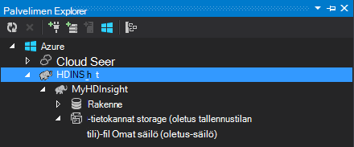

<properties
    pageTitle="Käyttää C# rakenne ja Possu Hadoop HDInsight | Microsoft Azure"
    description="Opettele käyttämään rakenne ja Azure Hdinsightista streaming Possu C# käyttäjän määrittämiä funktioita (UDF)."
    services="hdinsight"
    documentationCenter=""
    authors="Blackmist"
    manager="jhubbard"
    editor="cgronlun"
    tags="azure-portal"/>

<tags
    ms.service="hdinsight"
    ms.workload="big-data"
    ms.tgt_pltfrm="na"
    ms.devlang="dotnet"
    ms.topic="article"
    ms.date="10/28/2016"
    ms.author="larryfr"/>

#Rakenne ja Possu Hadoop HDInsight-tietovirta C#: n käyttäjän määrittämien funktioiden käyttäminen

Rakenne ja Possu soveltuvat erinomaisesti Azure Hdinsightiin tietojen käsitteleminen, mutta joskus tarvitset lisää yleinen kieli. Rakenne- ja Possu avulla voit soittaa ulkoisen käyttäjän määrittämiä funktioita (UDF) tai streaming koodin.

Tässä asiakirjassa Opettele käyttämään C# rakenne ja Possu.

##Edellytykset

* Windows 7 tai uudempi.

* Visual Studio seuraavia versioita:

    * Visual Studio 2012 Professional ja Premium/Ultimate ja [Päivitä 4](http://www.microsoft.com/download/details.aspx?id=39305)

    * Visual Studio 2013 yhteisön/Professional ja Premium/Ultimate ja [Päivitä 4](https://www.microsoft.com/download/details.aspx?id=44921)

    * Visual Studio 2015

* Hadoop HDInsight-klusterissa - kohdassa [säännöstä HDInsight-klusterin](hdinsight-provision-clusters.md) vaiheet klusterin luominen

* Hadoop Tools for Visual Studio. Saat ohjeet asennuksesta ja määrityksestä työkalujen [käyttäminen HDInsight Hadoop Tools for Visual Studio](hdinsight-hadoop-visual-studio-tools-get-started.md) .

##.NET-Hdinsightiin

.NET common language Runtimen (CLR) ja kehysten asennetaan oletusarvoisesti Windows-pohjaisesta HDInsight klustereiden. Näin voit käyttää C# sovellusten rakenne ja Possu streaming (tietojen välitetään rakenne ja Possu ja C#-sovelluksen välillä stdout/stdin kautta).

> [AZURE.NOTE] Ei tällä hetkellä ei ole tukea .NET Framework UDF käytössä Linux-pohjaiset HDInsight klustereiden. 

##.NET ja streaming

Streaming tehdään rakenne ja Possu siirtämällä tietoja ulkoiseen sovellukseen stdout päälle ja vastaanottamiseen tulokset stdin päälle. C#-sovelluksia, tämä hakea helposti tehdään kautta `Console.ReadLine()` ja `Console.WriteLine()`.

Koska rakenne ja Possu tarvitse käynnistää suorituksen aikana, **Console-sovelluksen** malli pitäisi käyttää projektien C#.

##Rakenne- ja C# 35;

###C#-projektin luominen

1. Avaa Visual Studio ja luo uusi ratkaisu. Projektin tyyppi- **Konsolin**-sovellus ja uuden projektin **HiveCSharp**nimi.

2. Korvaa **Program.cs** sisällön seuraavasti:

        using System;
        using System.Security.Cryptography;
        using System.Text;
        using System.Threading.Tasks;

        namespace HiveCSharp
        {
            class Program
            {
                static void Main(string[] args)
                {
                    string line;
                    // Read stdin in a loop
                    while ((line = Console.ReadLine()) != null)
                    {
                        // Parse the string, trimming line feeds
                        // and splitting fields at tabs
                        line = line.TrimEnd('\n');
                        string[] field = line.Split('\t');
                        string phoneLabel = field[1] + ' ' + field[2];
                        // Emit new data to stdout, delimited by tabs
                        Console.WriteLine("{0}\t{1}\t{2}", field[0], phoneLabel, GetMD5Hash(phoneLabel));
                    }
                }
                /// 

                /// Returns an MD5 hash for the given string
                /// 

                /// <param name="input">string value</param>
                /// <returns>an MD5 hash</returns>
                static string GetMD5Hash(string input)
                {
                    // Step 1, calculate MD5 hash from input
                    MD5 md5 = System.Security.Cryptography.MD5.Create();
                    byte[] inputBytes = System.Text.Encoding.ASCII.GetBytes(input);
                    byte[] hash = md5.ComputeHash(inputBytes);

                    // Step 2, convert byte array to hex string
                    StringBuilder sb = new StringBuilder();
                    for (int i = 0; i < hash.Length; i++)
                    {
                        sb.Append(hash[i].ToString("x2"));
                    }
                    return sb.ToString();
                }
            }
        }

3. Luo projekti.

###Tallennustilan lataaminen

1. Avaa Visual Studion **Palvelimen Explorer**.

3. Laajenna **Azure**ja laajenna sitten **Hdinsightista**.

4. Pyydettäessä Azure tilauksen tunnistetietosi ja valitse sitten **Kirjaudu sisään**.

5. Laajenna, johon haluat asentaa tämän sovelluksen HDInsight-klusterin ja laajenna sitten **Tallennustilan oletustili**.

    

6. Kaksoisnapsauta klusterin **Oletus säilö** . Tämä Avaa uudessa ikkunassa, jossa näkyy oletusarvo-säilön sisältöä.

7. Lataa-kuvaketta ja Etsi **HiveCSharp** projektin **bin\debug** -kansioon. Lopuksi **HiveCSharp.exe** tiedosto ja valitse **Ok**.

    

8. Kun lataus on valmis, osaat käyttää sovelluksen kyselyn rakenne.

###Kyselyn rakenne

1. Avaa Visual Studion **Palvelimen Explorer**.

2. Laajenna **Azure**ja laajenna sitten **Hdinsightista**.

5. Klusterin joka **HiveCSharp** sovelluksen käyttöön hiiren kakkospainikkeella ja valitse sitten **kirjoittaa kyselyn rakenne**.

6. Käytä rakenne-kyselyn seuraavasti:

        add file wasbs:///HiveCSharp.exe;

        SELECT TRANSFORM (clientid, devicemake, devicemodel)
        USING 'HiveCSharp.exe' AS
        (clientid string, phoneLabel string, phoneHash string)
        FROM hivesampletable
        ORDER BY clientid LIMIT 50;

    Tämä valitsee `clientid`, `devicemake`, ja `devicemodel` kenttien arvon `hivesampletable`, ja välittää kentät HiveCSharp.exe-sovellukseen. Kysely palauttaa kolme kenttää, joka tallennetaan sovelluksen odottaa `clientid`, `phoneLabel`, ja `phoneHash`. Kyselyn odottaa myös Etsi HiveCSharp.exe oletusarvon tallennustilan säiliön ylimmällä (`add file wasbs:///HiveCSharp.exe`).

5. Valitse **Lähetä** lähettää työn HDInsight-klusterin. **Rakenne projektin yhteenveto** -ikkuna avautuu.

6. Valitse **Päivitä** päivittämiseen yhteenvetoon **Työn tilaksi** muuttuu **Valmis**. Voit tarkastella projektin tulosteen valitsemalla **Työn tulos**.

##Possu ja C# 35;

###C#-projektin luominen

1. Avaa Visual Studio ja luo uusi ratkaisu. Projektin tyyppi- **Konsolin**-sovellus ja uuden projektin **PigUDF**nimi.

2. Korvaa **Program.cs** -tiedoston sisällön seuraavasti:

        using System;

        namespace PigUDF
        {
            class Program
            {
                static void Main(string[] args)
                {
                    string line;
                    // Read stdin in a loop
                    while ((line = Console.ReadLine()) != null)
                    {
                        // Fix formatting on lines that begin with an exception
                        if(line.StartsWith("java.lang.Exception"))
                        {
                            // Trim the error info off the beginning and add a note to the end of the line
                            line = line.Remove(0, 21) + " - java.lang.Exception";
                        }
                        // Split the fields apart at tab characters
                        string[] field = line.Split('\t');
                        // Put fields back together for writing
                        Console.WriteLine(String.Join("\t",field));
                    }
                }
            }
        }

    Tämän sovelluksen jäsentää lähetetyt Possu ja alustaa rivit, jotka alkavat rivit `java.lang.Exception`.

3. Tallenna **Program.cs**ja luo sitten projekti.

###Lataa sovellus

1. Possu streaming odottaa sovelluksen paikallisen klusterin tiedostojärjestelmässä. Etätyöpöytä käyttöön HDInsight-klusterin ja liitä siihen voidaan [muodostaa käyttämällä RDP HDInsight klustereihin](hdinsight-administer-use-management-portal.md#rdp)ohjeita noudattamalla.

2. Kun yhteys on muodostettu, kopioi **PigUDF.exe** PigUDF projektin paikallisessa tietokoneessa **bin/virheenkorjaus** -hakemistosta ja liitä se klusterin **PIG_HOME %** -kansio.

###Possu latinalainen-sovelluksen avulla

1. Etätyöpöytä istunnosta käynnistää Hadoop-komentoriviltä **Hadoop komentorivi** -kuvakkeen käyttäminen työpöydällä.

2. Käynnistä Possu komentoriville seuraava avulla:

        cd %PIG_HOME%
        bin\pig

    Voit valita jommankumman kanssa `grunt>` kehote.

3. Kirjoita yksinkertainen Possu työn .NET Framework-sovelluksen avulla seuraavasti:

        DEFINE streamer `pigudf.exe` SHIP('pigudf.exe');
        LOGS = LOAD 'wasbs:///example/data/sample.log' as (LINE:chararray);
        LOG = FILTER LOGS by LINE is not null;
        DETAILS = STREAM LOG through streamer as (col1, col2, col3, col4, col5);
        DUMP DETAILS;

    `DEFINE` Lause luo sähköpostitunnus, `streamer` pigudf.exe-sovellusten ja `SHIP` jakaa sen-klusterin solmut. Myöhemmin `streamer` on käytössä `STREAM` operaattori Käsittele yksittäisen rivin sisältämät LOG ja palauttaa tiedot joukkona sarakkeet.

> [AZURE.NOTE] Sovelluksen nimi, jota käytetään streaming on kirjoitettava \` (backtick) kun-merkki viittaama, ja ' (heittomerkki) käytettäessä `SHIP`.

3. Kun olet lisännyt viimeisen rivin, Käynnistä työ. Tekstin palauttaa tulosteen seuraavankaltaiselta:

        (2012-02-03 20:11:56 SampleClass5 [WARN] problem finding id 1358451042 - java.lang.Exception)
        (2012-02-03 20:11:56 SampleClass5 [DEBUG] detail for id 1976092771)
        (2012-02-03 20:11:56 SampleClass5 [TRACE] verbose detail for id 1317358561)
        (2012-02-03 20:11:56 SampleClass5 [TRACE] verbose detail for id 1737534798)
        (2012-02-03 20:11:56 SampleClass7 [DEBUG] detail for id 1475865947)

##Yhteenveto

Tässä asiakirjassa on opit .NET Framework-sovellus rakenne ja Possu käyttämisestä Hdinsightista. Jos haluat lisätietoja Python käyttäminen rakenne ja Possu, katso [Käytä Python rakenne ja HDInsight Possu](hdinsight-python.md).

Muita tapoja käyttää Possu ja rakenteen ja MapReduce käyttämisestä on seuraavissa ohjeaiheissa:

* [Rakenteen käyttäminen Hdinsightiin](hdinsight-use-hive.md)

* [Possu käyttäminen Hdinsightiin](hdinsight-use-pig.md)

* [MapReduce käyttäminen Hdinsightiin](hdinsight-use-mapreduce.md)
