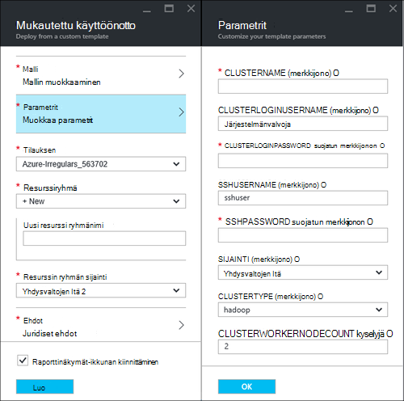
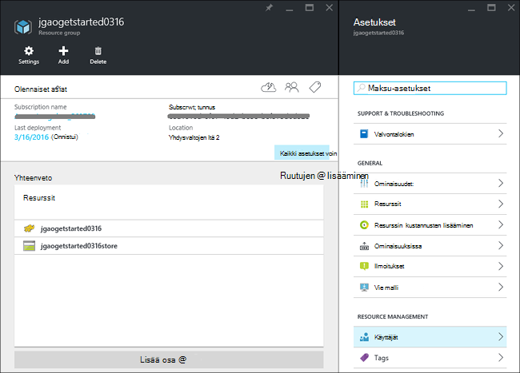
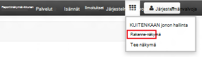
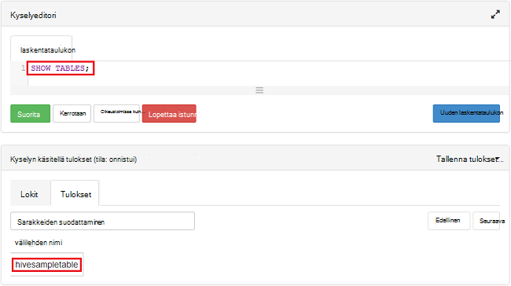

<properties
    pageTitle="Linux opetusohjelma: Hadoop ja rakenteen aloittaminen | Microsoft Azure"
    description="Katso tämä Linux-opetusohjelma, jotta Hadoop käyttämisestä Hdinsightista. Lue, miten voit valmistella klustereiden Linux ja kyselyn rakenne-tietojasi."
    services="hdinsight"
    documentationCenter=""
    authors="mumian"
    manager="jhubbard"
    editor="cgronlun"
    tags="azure-portal"/>

<tags
    ms.service="hdinsight"
    ms.devlang="na"
    ms.topic="hero-article"
    ms.tgt_pltfrm="na"
    ms.workload="big-data"
    ms.date="09/14/2016"
    ms.author="jgao"/>

# Hadoop-opetusohjelma: Linux-pohjaiset Hadoop käyttämisestä Hdinsightiin

> [AZURE.SELECTOR]
- [Linux-pohjaiset](hdinsight-hadoop-linux-tutorial-get-started.md)
- [Windows-pohjaisesta](hdinsight-hadoop-tutorial-get-started-windows.md)

Opettele Linux-pohjaiset [Hadoop](http://hadoop.apache.org/) klustereiden luominen HDInsight ja rakenteen töiden suorittaminen Hdinsightista. [Apache rakenne](https://hive.apache.org/) on Hadoop ekosysteemissä suosituimpia osa. Tällä hetkellä HDInsight sisältyy 4 eri klusterin tyypit: [Hadoop](hdinsight-hadoop-introduction.md), [Ohjattu](hdinsight-apache-spark-overview.md), [HBase](hdinsight-hbase-overview.md) ja [myrsky](hdinsight-storm-overview.md).  Klusterin kunkin tyyppiselle tukee on erilaisia osia. Kaikki 4 klusterin tue rakenne. Tuetut osat HDInsight-luettelo on artikkelissa [uudet myöntämä HDInsight Hadoop-klusterin versioissa?](hdinsight-component-versioning.md)  

[AZURE.INCLUDE [delete-cluster-warning](../../includes/hdinsight-delete-cluster-warning.md)]

## Edellytykset

Ennen kuin aloitat Tässä opetusohjelmassa, sinun on oltava:

- **Azure tilaus**: Voit luoda yhden kuukauden ilmainen kokeiluversio tili, siirry [azure.microsoft.com/free](https://azure.microsoft.com/free).

### Access-ohjausobjektin vaatimukset

[AZURE.INCLUDE [access-control](../../includes/hdinsight-access-control-requirements.md)]

## Klusterin luominen

Hadoop työt on Ehdota. Luo klusterin, suorittaa joitakin töitä ja poista sitten klusterin. Tässä osiossa luot Linux-pohjaiset Hadoop-klusterin-HDInsight [Azure Resurssienhallinta-mallin](../resource-group-template-deploy.md)avulla. Resurssienhallinta-malli on täysin mukautettavissa; se on helppo luoda Azure Hdinsightiin resursseja. Resurssienhallinta mallin kokemus ei edellytä tämä opetusohjelma. Muiden klusterin luominen kautta ja tietoja ominaisuuksia, joilla Tässä opetusohjelmassa on artikkelissa [Luo HDInsight klustereiden](hdinsight-hadoop-provision-linux-clusters.md). Tässä opetusohjelmassa Resurssienhallinta malli sijaitsee julkisen blob säilön, [https://hditutorialdata.blob.core.windows.net/armtemplates/create-linux-based-hadoop-cluster-in-hdinsight.json](https://hditutorialdata.blob.core.windows.net/armtemplates/create-linux-based-hadoop-cluster-in-hdinsight.json). 

1. Valitse seuraavassa kuvassa Azure kirjautuminen ja avaa Resurssienhallinta-malli Azure-portaalissa. 

    

2. Valitse **Parametrit** -sivu Anna seuraavat tiedot:

    .

    - **ClusterName**: nimi, jonka aiot luoda Hadoop-klusterin.
    - **Klusterin käyttäjätunnus ja salasana**: Kirjautuminen oletusnimi on **järjestelmänvalvoja**.
    - **SSH käyttäjänimi ja salasana**: oletusarvo-käyttäjänimi on **sshuser**.  Voit nimetä sen uudelleen. 
    
    Muut parametrit ovat valinnaisia tämä opetusohjelma. Voit jättää ne sellaisina kuin ne ovat. 
    
    Kunkin klusterin on Azure Blob storage tili-riippuvuus. Se on yleensä tarkoitettu tallennustilan oletustiliksi. HDInsight-klusterin ja sen tallennustilan oletustili on yhtä sijaittava samalla Azure alueella. Klustereiden poistaminen ei poista tallennustilan tilin. Mallin tallennustilan oletusnimi on määritetty klusterin nimeksi "store" perään. 
    
3. Valitse **OK** , jos haluat tallentaa parametrit.
4. **Mukautettu käyttöönotto** -sivu-Anna **Uusi resurssiryhmän nimi** Luo uusi resurssiryhmä.  Resurssiryhmä on säilö, joka ryhmittelee klusterin, riippuvaiset tallennustilan tilin ja muut s. Resurssin ryhmän sijainti voi olla eri klusterin sijainnista.
5. Valitse **ehdot**ja valitse sitten **Luo**.
6. Tarkista **raporttinäkymät-ikkunan kiinnittäminen** -valintaruutu on valittuna ja valitse sitten **Luo**. Liittyvä **käyttöönotto mallin käyttöönottoa**uusi ruutu tulee näkyviin. Kestää noin 20 minuutin klusterin luomiseen. 
7.  Klusterin luomiasi ruudun kuvateksti muutetaan määrittämäsi resurssinimi. Ja portaalin Avaa kaksi lavat automaattisesti klusterin ja klusterin-asetukset. 

    .

    On kaksi luetellut resurssit, klusterin ja tallennustilaa oletustilin.

##Rakenne-kyselyt

[Apache rakenne](hdinsight-use-hive.md) on käytetty HDInsight suosituimpia osa. Voit suorittaa rakenteen työt HDInsight monella tavalla. Tässä opetusohjelmassa suorittaa joitakin rakenne-portaalista Ambari rakenne-näkymän avulla. Muista tavoista rakenteen työt lähettämistä varten katso [Käytä rakenne HDInsight](hdinsight-use-hive.md).

1. Siirry **https://&lt;ClusterName >. azurehdinsight.net**, jossa &lt;ClusterName > on klusterin Ambari Avaa edellisessä osassa luomasi.
2. Kirjoita Hadoop käyttäjänimi ja salasana, jonka olet määrittänyt edellisessä osassa. Oletuskäyttäjänimi ei ole **järjestelmänvalvoja**.
3. Avaa **Rakenne-näkymä** , kuten seuraavassa näyttökuvassa:

    .
4. Liitä HiveQL seuraavista väittämistä laskentataulukkoon sivun __Kyselyeditori__ -osassa:

        SHOW TABLES;

    >[AZURE.NOTE] Puolipiste tarvitaan rakenne.       
        
5. Valitse __Suorita__. __Prosessin kyselytulokset__ osan olisi tulevat näkyviin Kyselyeditorin alapuolella ja tuoda tietoja työstä. 

    Kun kysely on valmis, __Prosessi kyselytulokset__ -kohta näkyy toiminnon tulokset. Näet on nimeltään **hivesampletable**yhdestä taulukosta. Tämän rakenteen mallitaulukon sisältyy HDInsight klustereiden.

    .

6. Toista vaiheet 4 ja 5 suorittamalla seuraava kysely:

        SELECT * FROM hivesampletable;

    > [AZURE.TIP] Huomautus __Prosessin kyselytulokset__ ; osan vasemmassa yläkulmassa __Tallenna tulokset__ -valikko Tämän avulla voit ladata tulokset tai tallentaa ne HDInsight tallennustilan CSV-tiedostona.

7. Valitse **historia** töiden luettelo.

Kun olet suorittanut rakenteen työn, voit [viedä tulokset Azure SQL-tietokantaan tai SQL Server-tietokantaan](hdinsight-use-sqoop-mac-linux.md), voit myös [esittää tulokset, käyttämällä Excel](hdinsight-connect-excel-power-query.md). Lisätietoja HDInsight-rakenne-kohdassa [Käytä rakenne- ja HiveQL HDInsight analysointiin Apache log4j mallitiedosto Hadoop kanssa](hdinsight-use-hive.md).

##Puhdista opetusohjelma

Kun olet suorittanut opetusohjelman, haluat ehkä poistaa klusterin. HDInsight, jossa tiedot on tallennettu Azure-tallennustilan, joten voit poistaa klusterin turvallisesti, kun se ei ole käytössä. Myös perittävän HDInsight-klusterin, vaikka se ei ole käytössä. Koska klusterin kulut on monta kertaa enemmän kuin tallennustilan kulut, kannattaa taloudellisen poistaa klustereiden, kun he eivät ole käytössä. 

>[AZURE.NOTE] Käytä [Azure Data Factory](hdinsight-hadoop-create-linux-clusters-adf.md), voit luoda HDInsight klustereiden pyydettäessä ja määritä TimeToLive-asetuksen poistaminen varausyksiköiden automaattisesti. 

**Jos haluat poistaa klusterin ja/tai tallennustilan oletustilin**

1. Kirjautuminen [Azure portal](https://portal.azure.com).
2. Portaalin koontinäytöstä Napsauta käytit, kun olet luonut klusterin resurssin ryhmän nimi-ruutua.
3. Valitse resurssi-sivu, voit poistaa resurssiryhmä, jossa on klusterin ja tallennustilaa oletustilin; **poistaminen** tai klusterin nimeä **resurssit** -ruutu ja valitse sitten klusterin-sivu valitsemalla **Poista** . Ota Huomautus, resurssiryhmän poistaminen poistaa tallennustilan tilin. Jos haluat säilyttää tallennustilan tilin, valitse poistettava klusterin vain.

## Seuraavat vaiheet

Tässä opetusohjelmassa on opit Resurssienhallinta mallin avulla Linux-pohjaiset HDInsight-klusterin luominen ja suorittaminen basic rakenteen kyselyt.

Saat lisätietoja HDInsight tietojen analysoiminen on seuraavissa artikkeleissa:

- Lisätietoja rakenteen käyttäminen HDInsight-rakenne-kyselyiden suorittaminen Visual Studio on kohdassa [Käyttö rakenne ja HDInsight][hdinsight-use-hive].

- Lisätietoja Possu kieli, jota käytetään tietojen, muuntamiseen artikkelissa [Käytön Possu HDInsight][hdinsight-use-pig].

- Lisätietoja MapReduce voi kirjoittaa ohjelmia, jotka käsitellä tietoja Hadoop-artikkelissa [Käyttäminen MapReduce kanssa HDInsight][hdinsight-use-mapreduce].

- Lisätietoja Visual Studio HDInsight-työkalujen avulla voit analysoida tietoja Hdinsightista on artikkelissa [käyttäminen Visual Studio Hadoop työkaluja Hdinsightista](hdinsight-hadoop-visual-studio-tools-get-started.md).

Jos olet valmis, voit aloittaa omien tietojesi kanssa ja haluat lisätietoja kuinka HDInsight tallentaa tietoja tai hankkiminen tietojen tuominen HDInsight, on seuraavissa artikkeleissa:

- Lisätietoja siitä, miten HDInsight käyttää Azure-blob-säiliö on artikkelissa [Käytä Azure-Blob-säiliö HDInsight kanssa](hdinsight-hadoop-use-blob-storage.md).

- Lisätietoja tietojen lataaminen Hdinsightista on kohdassa [Lataa tiedot HDInsight][hdinsight-upload-data].

Jos haluat lisätietoja luominen ja hallinta HDInsight-klusterin, on seuraavissa artikkeleissa:

- Tietoja Linux-pohjaiset HDInsight-klusterin hallinta-kohdassa [Hallitse HDInsight klustereiden käyttämällä Ambari](hdinsight-hadoop-manage-ambari.md).

- Lisätietoja asetukset, voit valita HDInsight-klusterin luotaessa on artikkelissa [Luominen HDInsight Linux käyttämällä mukautettuja asetuksia](hdinsight-hadoop-provision-linux-clusters.md).

- Jos tunnet Linux ja Hadoop, mutta haluat tietää, yksityiskohtia Hadoop HDInsight-tietoja, katso [HDInsight Linux käsitteleminen](hdinsight-hadoop-linux-information.md). Tämä on tietoja seuraavasti:

    * Klusterin, kuten Ambari ja WebHCat maksuttomien palveluiden URL-osoitteet
    * Sijainnin Hadoop-tiedostot ja esimerkkejä paikallisen tiedostojärjestelmässä
    * Oletustiedot käyttöä, Azure Storage (WASB niin) sen sijaan, että HDFS tallentaminen

[1]: ../HDInsight/hdinsight-hadoop-visual-studio-tools-get-started.md

[hdinsight-provision]: hdinsight-provision-clusters.md
[hdinsight-admin-powershell]: hdinsight-administer-use-powershell.md
[hdinsight-upload-data]: hdinsight-upload-data.md
[hdinsight-use-mapreduce]: hdinsight-use-mapreduce.md
[hdinsight-use-hive]: hdinsight-use-hive.md
[hdinsight-use-pig]: hdinsight-use-pig.md

[powershell-download]: http://go.microsoft.com/fwlink/p/?linkid=320376&clcid=0x409
[powershell-install-configure]: powershell-install-configure.md
[powershell-open]: powershell-install-configure.md#Install

[img-hdi-dashboard]: ./media/hdinsight-hadoop-tutorial-get-started-windows/HDI.dashboard.png
[img-hdi-dashboard-query-select]: ./media/hdinsight-hadoop-tutorial-get-started-windows/HDI.dashboard.query.select.png
[img-hdi-dashboard-query-select-result]: ./media/hdinsight-hadoop-tutorial-get-started-windows/HDI.dashboard.query.select.result.png
[img-hdi-dashboard-query-select-result-output]: ./media/hdinsight-hadoop-tutorial-get-started-windows/HDI.dashboard.query.select.result.output.png
[img-hdi-dashboard-query-browse-output]: ./media/hdinsight-hadoop-tutorial-get-started-windows/HDI.dashboard.query.browse.output.png
[image-hdi-clusterstatus]: ./media/hdinsight-hadoop-tutorial-get-started-windows/HDI.ClusterStatus.png
[image-hdi-gettingstarted-powerquery-importdata]: ./media/hdinsight-hadoop-tutorial-get-started-windows/HDI.GettingStarted.PowerQuery.ImportData.png
[image-hdi-gettingstarted-powerquery-importdata2]: ./media/hdinsight-hadoop-tutorial-get-started-windows/HDI.GettingStarted.PowerQuery.ImportData2.png
