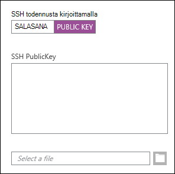
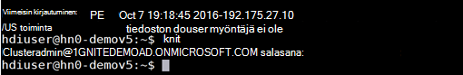
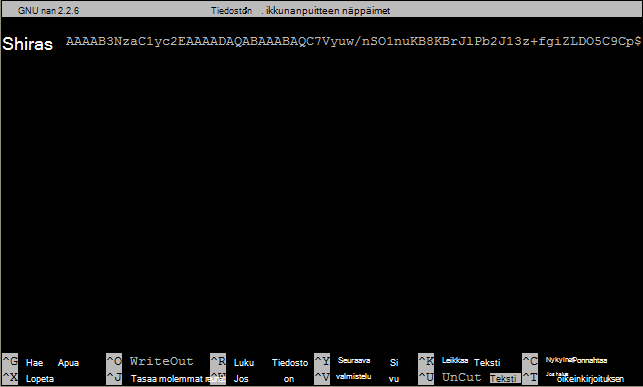

<properties
   pageTitle="SSH-avainten käyttäminen Linux, Unix tai OS X Linux-pohjaiset Hadoop | Microsoftin Azure"
   description=" Voit käyttää Linux-pohjaiset HDInsight käyttämällä Secure Shell (SSH). Tämä asiakirja sisältää tietoja käyttämällä SSH Linux, Unix ja OS X-asiakkaiden kanssa HDInsight."
   services="hdinsight"
   documentationCenter=""
   authors="Blackmist"
   manager="jhubbard"
   editor="cgronlun"
    tags="azure-portal"/>

<tags
   ms.service="hdinsight"
   ms.devlang="na"
   ms.topic="get-started-article"
   ms.tgt_pltfrm="na"
   ms.workload="big-data"
   ms.date="09/13/2016"
   ms.author="larryfr"/>

#<a name="use-ssh-with-linux-based-hadoop-on-hdinsight-from-linux-unix-or-os-x"></a>Käyttää SSH-HDInsight, Linux, Unix tai OS X Linux-pohjaiset Hadoop

> [AZURE.SELECTOR]
- [Windows](hdinsight-hadoop-linux-use-ssh-windows.md)
- [Linux, Unix, OS X](hdinsight-hadoop-linux-use-ssh-unix.md)

[Secure Shell (SSH)](https://en.wikipedia.org/wiki/Secure_Shell) avulla voit suorittaa toimintoja komentoriviliittymän avulla Linux-pohjaiset HDInsight klusterien etäyhteyden kautta. Tämä asiakirja sisältää tietoja käyttämällä SSH Linux, Unix ja OS X-asiakkaiden kanssa HDInsight.

> [AZURE.NOTE] Tämän artikkelin ohjeissa käytät Linux, Unix ja OS X-asiakasohjelmaa. Seuraavasti voidaan suorittaa Windows-työasemassa Jos asennettuna on paketti, joka mahdollistaa `ssh` ja `ssh-keygen`, kuten [Ubuntu Windows-Bash](https://msdn.microsoft.com/commandline/wsl/about).
>
> Jos sinulla ei ole SSH Windows-pohjaiseen tietokoneeseen, vaiheiden avulla [Käyttää SSH Linux-pohjaiset HDInsight (Hadoop) Windowsin kanssa](hdinsight-hadoop-linux-use-ssh-windows.md) Lisätietoja asentamisesta ja käyttämisestä painovärit, muste.

##<a name="prerequisites"></a>Edellytykset

* **ssh-keygen** ja **ssh** Unix, Linux ja OS X-asiakkaat. Tämä apuohjelmien toimitetaan yleensä käyttöjärjestelmän tai paketti hallintajärjestelmän kautta.

* Moderni selain, joka tukee HTML5: n.

TAI

* [Azure CLI](../xplat-cli-install.md).

    [AZURE.INCLUDE [use-latest-version](../../includes/hdinsight-use-latest-cli.md)] 

##<a name="what-is-ssh"></a>Mikä on SSH?

SSH on apuohjelma kirjautumiseen ja etäyhteyden kautta suoritetaan etäpalvelimessa komentoja. Linux-pohjaiset HDInsight SSH muodostaa suojatun yhteyden muodostaminen klusterin headnode ja tarjoaa komentorivi, jonka avulla voit kirjoittaa komentoja. Komennot suoritetaan sitten suoraan palvelimessa.

###<a name="ssh-user-name"></a>SSH käyttäjänimi

SSH-käyttäjänimi on HDInsight klusterin todennukseen käyttämäsi nimi. Kun määrität SSH käyttäjänimi on klusterin luonnin aikana, tämä käyttäjä luodaan kaikissa klusterin solmuissa. Kun klusteri on luotu, voit muodostaa HDInsight klusterin headnodes käyttäjänimen. Headnodes, josta muodostamista yksittäisten työntekijöiden solmut.

###<a name="ssh-password-or-public-key"></a>SSH salasana tai julkisen avaimen

SSH-käyttäjät voivat käyttää salasanan tai julkisen avaimen todennusta varten. Salasana on merkkijono teksti teet, kun tunnistaa yksilöllisesti luotu salausavainparin julkisen avaimen kuuluu.

Avain on turvallisempi kuin salasanan, mutta se edellyttää lisätoimia avaimen luomiseen ja on ylläpidettävä tiedostoja, jotka sisältävät avain turvalliseen paikkaan. Jos joku pääsee käyttämään tärkeitä tiedostoja, ne käyttämään tiliäsi. Tai jos unohdat tärkeitä tiedostoja, ei voi kirjautua sisään tilillesi.

Avaimen parin, joka koostuu julkinen avain (joka lähetetään palvelimelle HDInsight) ja yksityisen avaimen (joka pidetään asiakastietokoneeseesi.) Muodostaessasi yhteyden HDInsight palvelimeen SSH SSH-asiakas käyttää yksityistä avainta tietokoneeseen palvelimen todennukseen.

##<a name="create-an-ssh-key"></a>SSH-avaimen luominen

Käytä seuraavia tietoja, jos aiot käyttää SSH-avainten klusterisi kanssa. Jos aiot käyttää salasanaa, voit ohittaa tämän osan.

1. Avaa pääteistuntoa ja onko sinulla SSH näppäinten seuraavan komennon avulla:

        ls -al ~/.ssh

    Etsi seuraavat tiedostot levyn sisältö. Nämä ovat yhteinen julkinen SSH-avainten nimet.

    * ID\_dsa.pub
    * ID\_ecdsa.pub
    * ID\_ed25519.pub
    * ID\_rsa.pub

2. Jos et halua käyttää aiemmin luotuun tiedostoon tai sinulla ei ole SSH-avaimet, Luo uusi tiedosto käyttämällä seuraavaa:

        ssh-keygen -t rsa

    Sinua pyydetään seuraavat tiedot:

    * Tiedoston - sijainnin postit, ~/.ssh/id\_rsa.
    * A - salasana pyydetään kirjoittamaan uudelleen tätä.

        > [AZURE.NOTE] On erittäin suositeltavaa käyttää suojattua tunnuslause avaimen. Kuitenkin unohtuu tunnuslause, onko mitään keinoa palauttaa se.

    Kun komento on suoritettu, sinulla on kaksi uutta tiedostoa, yksityisen avaimen (esimerkiksi **id\_rsa**) ja julkinen avain (esimerkiksi **id\_rsa.pub**).

##<a name="create-a-linux-based-hdinsight-cluster"></a>Luo HDInsight Linux-pohjainen klusteri

HDInsight Linux-pohjainen klusteri luotaessa on annettava aiemmin luodun julkisen avaimen. Linux, Unix ja OS X-asiakkaiden kahdella HDInsight-klusterin luominen:

* **Azure-Portal** - Luo-klusteri käyttää web-pohjainen portaali.

* **Mac, Linux ja Windows azure-CLI** - Luo-klusteri käyttää komentorivin komennot.

Näiden menetelmien vaatii salasanan tai julkisen avaimen. Saat täydelliset tiedot luomalla HDInsight Linux-pohjainen klusteri [tarjotaan Linux-pohjaiset HDInsight klustereita](hdinsight-hadoop-provision-linux-clusters.md).

###<a name="azure-portal"></a>Azure-Portal

[Azure-portaalin] käytettäessä[ preview-portal] Luo HDInsight Linux-pohjainen klusteri, sinun on **SSH käyttäjänimi**ja anna **salasana** tai **SSH JULKISELLA AVAIMELLA**valitsemalla.

Jos **SSH JULKISELLA AVAIMELLA**, jonka voi liittää julkisen avaimen ( **.pub** -tiedostotunniste tiedoston sisältämän) __SSH-PublicKey__ -kenttään tai selata ja julkisen avaimen tiedosto valitsemalla __Valitse tiedosto__ .



> [AZURE.NOTE] Avaimen tiedosto on pelkkä tekstitiedosto. Sisällön tulee olla seuraavanlainen:
> ```
ssh-rsa AAAAB3NzaC1yc2EAAAADAQABAAABAQCelfkjrpYHYiks4TM+r1LVsTYQ4jAXXGeOAF9Vv/KGz90pgMk3VRJk4PEUSELfXKxP3NtsVwLVPN1l09utI/tKHQ6WL3qy89WVVVLiwzL7tfJ2B08Gmcw8mC/YoieT/YG+4I4oAgPEmim+6/F9S0lU2I2CuFBX9JzauX8n1Y9kWzTARST+ERx2hysyA5ObLv97Xe4C2CQvGE01LGAXkw2ffP9vI+emUM+VeYrf0q3w/b1o/COKbFVZ2IpEcJ8G2SLlNsHWXofWhOKQRi64TMxT7LLoohD61q2aWNKdaE4oQdiuo8TGnt4zWLEPjzjIYIEIZGk00HiQD+KCB5pxoVtp user@system
> ```

Tämä luo määritetyn käyttäjän kirjautumistunnuksen salasana tai annat julkisen avaimen avulla.

###<a name="azure-command-line-interface-for-mac-linux-and-windows"></a>Mac, Linux ja Windows Azure komentorivikäyttöliittymä

[Mac, Linux ja Windows Azure-CLI](../xplat-cli-install.md) avulla voit luoda uuden klusterin avulla `azure hdinsight cluster create` komento.

Saat lisätietoja tämän komennon [tarjotaan Hadoop Linux varausyksiköitä HDInsight käyttämällä mukautettuja asetuksia](hdinsight-hadoop-provision-linux-clusters.md).

##<a name="connect-to-a-linux-based-hdinsight-cluster"></a>Muodostaa HDInsight Linux-pohjainen klusteri

Muodosta yhteys klusterin headnode antamalla sen osoitteen ja käyttäjän nimen pääteistunnon, SSH-komennon avulla:

* **Osoite: SSH** - on kaksi osoitetta, joita käytetään muodostamaan yhteys klusterin käyttäen SSH:

    * **Headnode muodostaminen**: klusterinimi ja sen jälkeen **-ssh.azurehdinsight.net**. Esimerkiksi **mycluster-ssh.azurehdinsight.net**.
    
    * **Yhdistä reunan solmuun**: Jos klusterisi HDInsight R-palvelin, klusteri sisältää myös reuna-solmun, joka voi käyttää **RServer.CLUSTERNAME.ssh.azurehdinsight.net**, jossa __CLUSTERNAME__ on klusterin nimi.

* **Käyttäjänimi** - SSH käyttäjänimi klusterin luonnin yhteydessä.

Seuraavassa esimerkissä muodostaa ensisijaisen headnode, **mycluster** käyttäjän **minulle**:

    ssh me@mycluster-ssh.azurehdinsight.net

Jos olet käyttänyt salasanaa, käyttäjätilin, sinun pyydetään kirjoittamaan salasana.

Jos käytät SSH-avain, joka on suojattu kanssa tunnuslauseen, sinun pyydetään kirjoittamaan tunnuslause. Muussa tapauksessa SSH yrittää automaattisesti tunnistaa jollakin paikallisten yksityisten avainten työasemaasi.

> [AZURE.NOTE] Jos SSH ei automaattisesti Todenna oikealla yksityisellä avaimella, käytä parametria **-i** ja määritä yksityisen avaimen polkua. Seuraavassa esimerkissä Lataa yksityinen avain `~/.ssh/id_rsa`:
>
> `ssh -i ~/.ssh/id_rsa me@mycluster-ssh.azurehdinsight.net`

Jos muodostat yhteyden käyttämällä osoite headnode ja porttia ei ole määritetty, SSH oletusarvo on portti 22, joka muodostaa HDInsight klusterin ensisijainen headnode. Jos portti 23, voit muodostaa yhteyden toissijaisen. Saat lisätietoja headnodes, [käytettävyyden ja luotettavuuden parantamiseen HDInsight Hadoop varausyksiköitä](hdinsight-high-availability-linux.md).

###<a name="connect-to-worker-nodes"></a>Yhdistä työntekijä solmut

Työntekijän solmut eivät ole suoraan käytettävissä ulkopuolelta Azure datacenter, mutta niitä voidaan käyttää kautta SSH cluster-headnode.

Käyttäjänimen SSH-avaimen avulla, jos työasemaasi täytyy tehdä seuraavat toimet:

1. Avaa tekstieditorilla, `~/.ssh/config`. Jos tätä tiedostoa ei ole, voit luoda sen kirjoittamalla `touch ~/.ssh/config` terminaalin.

2. Lisää tiedostoon seuraava. Korvaa *CLUSTERNAME* HDInsight-klusterin nimi.

        Host CLUSTERNAME-ssh.azurehdinsight.net
          ForwardAgent yes

    Tämä määrittää HDInsight-klusterin välittäminen SSH-agentti.

3. Testaa SSH-agentti välittäminen kulkunsa seuraavan komennon avulla:

        echo "$SSH_AUTH_SOCK"

    Tämän komennon pitäisi palauttaa tiedot seuraavanlainen:

        /tmp/ssh-rfSUL1ldCldQ/agent.1792

    Jos palautetaan ei mitään, osoittaa, että **ssh-agentti** ei toimi. Käyttöjärjestelmän ohjeista saat ohjeita asentamisesta ja määrittämisestä **ssh-agentti**tai Katso [ssh-agentti kanssa ssh](http://mah.everybody.org/docs/ssh).

4. Kun olet varmistanut, että **ssh-agentti** on käynnissä, seuraava avulla voit lisätä agentti SSH yksityistä avainta:

        ssh-add ~/.ssh/id_rsa

    Jos yksityinen avain on tallennettu eri tiedostoa, Vaihda `~/.ssh/id_rsa` tiedoston polku.

Seuraavien vaiheiden avulla voit muodostaa työntekijän oman klusterin solmut.

> [AZURE.IMPORTANT] Jos käytät SSH-avaimen todentamaan tilisi, sinun on täytettävä edelliset vaiheet, tarkista, että välität agentti toimii.

1. Muodostaa HDInsight klusterin avulla SSH, kuten yllä on kuvattu.

2. Kun yhteys on muodostettu, seuraava avulla voit noutaa luettelo-yhteyttä klusterin solmut. Korvaa klusterin Järjestelmänvalvoja-tilin salasanan *AdminPassword-avaimen arvo* . Korvaa *CLUSTERNAME* klusterin oman nimen.

        curl --user admin:ADMINPASSWORD https://CLUSTERNAME.azurehdinsight.net/api/v1/hosts

    Tämä palauttaa JSON-muodossa, klusterin solmujen tiedot mukaan lukien `host_name`, joka sisältää kunkin solmun täydellinen toimialuenimi (FQDN). Seuraavassa on esimerkki `host_name` **curl** -komennon palauttama tapahtuma:

        "host_name" : "workernode0.workernode-0-e2f35e63355b4f15a31c460b6d4e1230.j1.internal.cloudapp.net"

3. Kun haluat muodostaa työntekijän solmut luettelo, Avaa Työntekijä-solmun yhteyden palvelimeen SSH-istunto seuraava komento avulla:

        ssh USERNAME@FQDN

    Korvaa *KÄYTTÄJÄTUNNUS* SSH käyttäjänimi ja työntekijän solmun FQDN *täydellinen toimialuenimi* . Esimerkiksi `workernode0.workernode-0-e2f35e63355b4f15a31c460b6d4e1230.j1.internal.cloudapp.net`.

    > [AZURE.NOTE] Jos kirjoitat salasanan todennus SSH-istunto pyydetään antamaan salasana uudelleen. Jos käytät SSH-avain, yhteys on valmis ilman kehotteita.

4. Kun istunto on muodostettu, pääte kehote vaihtuu `username@hn#-clustername` , `username@wk#-clustername` osoittamaan, että olet muodostanut yhteyden työntekijän solmu. Tässä vaiheessa suorita komennot suoritetaan työntekijän solmussa.

4. Kun olet lopettanut toimintojen suorittamista työntekijän solmussa, `exit` komennon Sulje istunto työntekijän solmuun. Tämä palauttaa sinut, `username@hn#-clustername` Kysy.

## <a name="connect-to-a-domain-joined-hdinsight-cluster"></a>Muodosta yhteys toimialueeseen liittymistä HDInsight klusteri

[Toimialueeseen liittymistä HDInsight](hdinsight-domain-joined-introduction.md) integroituu Kerberos-HDInsight Hadoop. SSH käyttäjä on ei aktiivinen Direcotry toimialuekäyttäjä, koska tämä käyttäjätili ei voi suorittaa Hadoop komennot SSH shell-toimialueeseen liittymistä klusterin suoraan. *Kinit* on suoritettava ensin. 

**Jos haluat suorittaa rakenteen kyselee toimialueeseen liittymistä HDInsight-klusterissa käyttämällä SSH**

1. Muodosta yhteys toimialueeseen liittymistä HDInsight klusterin avulla SSH.  On instrocutions- [yhteyden muodostaminen HDInsight Linux-pohjainen klusteri](#connect-to-a-linux-based-hdinsight-cluster).
2. Suorita kinit. Se Kysy toimialueen käyttäjänimen ja toimialueen käyttäjän salasanan. Lisätietoja määrittäminen Toimialuekäyttäjät HDInsight klustereita toimialueeseen liittymistä varten on ohjeaiheessa [määrittää toimialueeseen liittymistä HDInisight klustereita](hdinsight-domain-joined-configure.md).

    
3. Avaa konsoli, kirjoita rakenne:

        hive

    Sitten voit suorittaa komentoja rakenne.

##<a name="add-more-accounts"></a>Lisää tilejä

1. Luo uusi julkinen avain ja yksityinen avain uuden käyttäjätilin, [SSH-avaimen luominen](#create-an-ssh-key-optional) -osassa kuvatulla tavalla.

    > [AZURE.NOTE] Yksityinen avain joko tulisi luoda asiakkaan käyttäjän muodostaa klusteri käyttää tai siirtää turvallisesti tällainen asiakas luonnin jälkeen.

1. Klusteriin SSH-istunto lisätä uuden käyttäjän seuraavalla komennolla:

        sudo adduser --disabled-password <username>

    Luo uusi käyttäjätili, mutta poistaa salasanan tarkistus käytöstä.

2. Luo kansio ja tiedostot pitämällä näppäintä käyttämällä seuraavia komentoja:

        sudo mkdir -p /home/<username>/.ssh
        sudo touch /home/<username>/.ssh/authorized_keys
        sudo nano /home/<username>/.ssh/authorized_keys

3. Nano editori avautuu, kun kopioi ja liitä sisällön julkinen avain uuden käyttäjätilin. Lopuksi voit käyttää **Ctrl-X** Tallenna tiedosto ja sulje editori.

    

4. Seuraavan komennon avulla muuttaa .ssh kansio ja sisältö, uusi käyttäjätili:

        sudo chown -hR <username>:<username> /home/<username>/.ssh

5. Pitäisi nyt pystyä palvelintodennuksen kanssa uuden käyttäjätilin ja yksityinen avain.

##<a id="tunnel"></a>SSH tunnelointi

Avulla voidaan SSH tunnelin paikallisen pyynnöistä, esimerkiksi web-pyynnöistä, HDInsight-klusteri. Pyyntö reititetään sitten Pyydettyä resurssia on ikään kuin se oli peräisin HDInsight-klusterin headnode.

> [AZURE.IMPORTANT] SSH-tunneli on web-Käyttöliittymä Hadoop Joissakin palveluissa käyttöä varten. Esimerkiksi työn historia Käyttöliittymä tai Resurssienhallinta Käyttöliittymän voi käyttää vain käyttämällä SSH-tunneli.

Saat lisätietoja luomisesta ja käyttämisestä SSH-tunneli, [Käytä SSH Tunneling Ambari web-Käyttöliittymä, Resurssienhallinta, JobHistory, NameNode, Oozie, ja muut web-Käyttöliittymä on pääsy](hdinsight-linux-ambari-ssh-tunnel.md).

##<a name="next-steps"></a>Seuraavat vaiheet

Nyt kun tiedät, kuinka SSH-avaimen avulla todennetaan, opetella käyttämään MapReduce Hadoop-HDInsight kanssa.

* [Rakenteen käyttäminen HDInsight](hdinsight-use-hive.md)

* [Sika käyttäminen HDInsight](hdinsight-use-pig.md)

* [Käytä MapReduce töiden HDInsight](hdinsight-use-mapreduce.md)

[preview-portal]: https://portal.azure.com/
