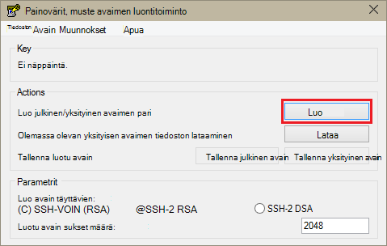
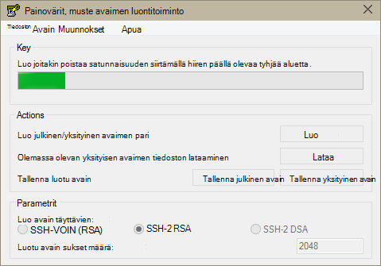
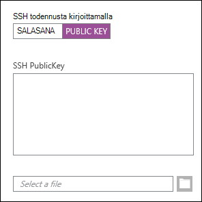
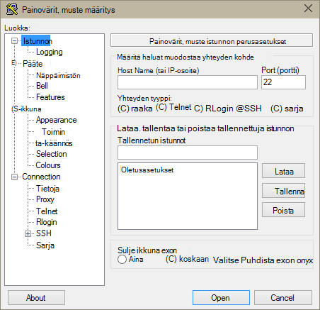
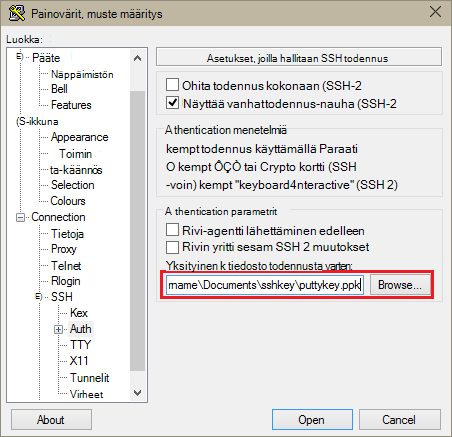
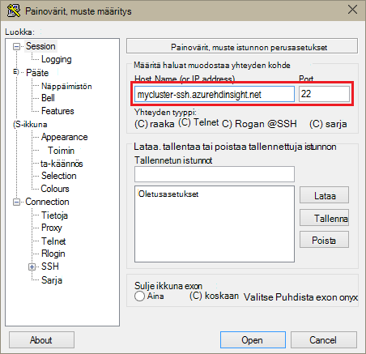
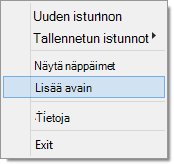
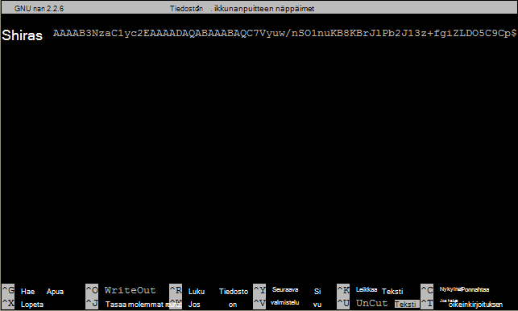

<properties
   pageTitle="Käyttää SSH näppäimet Hadoop Linux-pohjaiset klustereiden Windows | Microsoft Azure"
   description="Lue, miten voit luoda ja käyttää SSH avaimet tarkistamiseen Linux-pohjaiset HDInsight klustereihin. Kytke klustereiden Windows-asiakkaat painovärit, muste SSH-asiakasohjelman avulla."
   services="hdinsight"
   documentationCenter=""
   authors="Blackmist"
   manager="jhubbard"
   editor="cgronlun"
    tags="azure-portal"/>

<tags
   ms.service="hdinsight"
   ms.devlang="na"
   ms.topic="get-started-article"
   ms.tgt_pltfrm="na"
   ms.workload="big-data"
   ms.date="08/30/2016"
   ms.author="larryfr"/>

#SSH käyttäminen Linux-pohjaiset Hadoop-HDInsight Windows

> [AZURE.SELECTOR]
- [Windows](hdinsight-hadoop-linux-use-ssh-windows.md)
- [Linux, Unix-OS x: ssä](hdinsight-hadoop-linux-use-ssh-unix.md)

[Suojattu runko (SSH)](https://en.wikipedia.org/wiki/Secure_Shell) voit etäyhteyden Suorita oman Linux-pohjaiset HDInsight klustereiden komentorivivalitsimet käyttöliittymän avulla. Tässä asiakirjassa on tietoja muodostamisesta HDInsight Windows-asiakkaat painovärit, muste SSH-asiakasohjelman avulla.

> [AZURE.NOTE] Tämän artikkelin vaiheissa oletetaan, että käytössäsi on Windows-asiakasohjelma. Jos käytät Linux, Unix tai OS X-asiakas, katso [Käytä SSH Linux-pohjaiset Hadoop HDInsight Linux, Unix-tai OS X-ja](hdinsight-hadoop-linux-use-ssh-unix.md).
>
> Jos käytössäsi on Windows 10: ssä ja käyttävät [Bash Ubuntu Windows-](https://msdn.microsoft.com/commandline/wsl/about), voit käyttää ohjeita [Käyttämällä SSH kanssa Linux-pohjaiset Hadoop-HDInsight Linux, Unix-tai OS X](hdinsight-hadoop-linux-use-ssh-unix.md) -asiakirjassa.

##Edellytykset

* **Painovärit, muste** ja Windows-pohjaisten asiakkaiden **PuTTYGen** . Näiden apuohjelmien on saatavissa [http://www.chiark.greenend.org.uk/~sgtatham/putty/download.html](http://www.chiark.greenend.org.uk/~sgtatham/putty/download.html).

* Uusi web-selaimessa, joka tukee HTML5-versiossa.

TAI

* [Azure CLI](../xplat-cli-install.md).

    [AZURE.INCLUDE [use-latest-version](../../includes/hdinsight-use-latest-cli.md)] 

##Mikä on SSH?

SSH on apuohjelma kirjautuminen ja etäyhteyden suoritetaan komentoja etäpalvelimeen. Linux-pohjaiset HDInsight SSH muodostaa salattua yhteyttä klusterin pää-solmu ja tarjoaa komentorivin, jonka avulla Kirjoita komennot. Valitse komennot suoritetaan, kun suoraan palvelimessa.

###SSH käyttäjänimi

SSH-käyttäjänimi on nimi, jota käytät HDInsight-klusterin tarkistamiseen. Määrittäessäsi klusteri luonnin aikana SSH-käyttäjänimi, käyttäjälle luodaan klusterin kaikissa solmuissa. Kun klusterin on luotu, voit HDInsight-klusterin pään solmujen yhdistäminen käyttäjänimi. Pään solmut-muodostamista yksittäisten työntekijöiden solmut.

###SSH salasanan tai julkinen avain

SSH käyttäjä käyttää salasanan tai julkisella avaimella todennusta varten. Salasana on merkkijono teet, kun julkinen avain on osa luo yksilöivät voit salausavainparin tekstin.

Avain on paremmin suojattu salasanalla, kuin, mutta se vaatii lisätoimia avaimen luomiseen ja sinulla on tiedostoja, jotka sisältävät avain turvalliseen paikkaan. Jos kuka tahansa pääsee avaimen tiedostoihin, ne käyttämään tiliäsi. Tai jos kadotat avaimen tiedostoja, voit voi kirjautua tiliisi.

Avaimen pari koostuu julkinen avain (joka lähetetään HDInsight-palvelin) ja yksityinen avain (joka on käytettävissä asiakaskoneen.) Kun muodostat yhteyden käyttämällä SSH HDInsight-palvelimeen, SSH asiakas käyttää tietokoneessa yksityinen avain todennetaan palvelimen kanssa.

##Luo SSH-avain

Käytä seuraavia tietoja, jos aiot käyttää SSH näppäimet yhteyttä klusterin kanssa. Jos aio salasanalla, voit ohittaa tämän osion.

1. Avaa PuTTYGen.

2. **Luo avain tyyppi**Valitse **SSH 2 RSA**ja valitse sitten **Luo**.

    

3. Siirtyminen hiiren tilanneilmaisin, alapuolella olevaan alueeseen, kunnes palkin täyttää. Siirtämällä hiirtä Luo satunnaisia tietoja, joita käytetään avaimen luomiseen.

    

    Kun avain on luotu, julkinen avain näkyvät.

4. Suojauksen **avaimen salasana** -kenttään salasana ja kirjoita sitten **Vahvista salasana** -kenttään on sama arvo.

    

    > [AZURE.NOTE] Suosittelemme, että käytät suojatun salasana-näppäimen. Jos unohdat salasana, käytettävissä on kuitenkin ei voi palauttaa sitä enää myöhemmin.

5. Valitse Tallenna avain **.ppk** tiedostoon **Tallenna yksityinen avain** . Tätä näppäintä käytetään tarkistamiseen Linux-pohjaiset HDInsight-klusterin.

    > [AZURE.NOTE] Tallenna avaimeen turvalliseen paikkaan, kun sen avulla voidaan käyttää Linux-pohjaiset HDInsight-klusterin.

6. Valitse **Tallenna julkisella avaimella** avaimen tallentaminen **.txt** -tiedosto. Voit käyttää julkinen avain myöhemmin, kun luot uusia Linux-pohjaiset HDInsight klustereiden.

    > [AZURE.NOTE] Julkinen avain näkyy myös PuTTYGen yläosassa. Voit tätä kenttää hiiren kakkospainikkeella, arvoa kopioida ja liittää sen lomakkeeseen Azure-portaalissa klusterin luotaessa.

##Linux-pohjaiset HDInsight-klusterin luominen

Luodessasi Linux-pohjaiset HDInsight-klusterin, sinun on määritettävä aiemmin luotu julkinen avain. Windows-pohjaisten asiakkaiden on voi luoda Linux-pohjaiset HDInsight-klusterin kahdella tavalla:

* **Azure Portal** - käyttää verkkopohjaisia portal klusterin luomiseen.

* **Mac-, Linux-ja Windows azure CLI** - käytetään luomaan klusterin komentorivin komentoja.

Näitä edellyttävät julkisella avaimella. Lisätietoja Linux-pohjaiset HDInsight-klusterin luomisesta on artikkelissa [säännöstä Linux-pohjaiset HDInsight klustereiden](hdinsight-hadoop-provision-linux-clusters.md).

###Azure Portal

Kun [Azure Portal] [ preview-portal] luomiseen Linux-pohjaiset HDInsight-klusterin, sinun täytyy kirjoittaa **SSH käyttäjänimi**, ja valita Anna **salasana** tai **SSH julkinen avain**.

Jos valitset **SSH JULKISELLA AVAIMELLA**, voit liittää julkinen avain (näkyvät __julkinen avain valtuutettuja OpenSSH liittäminen\_näppäimet tiedoston__ PuttyGen-kentästä) __SSH PublicKey__ kenttään tai valitse __Valitse tiedosto__ ja valitse tiedosto, joka sisältää julkinen avain.

Tämä luo määritetyn käyttäjän kirjautumistunnus ja salasana-todennuksen tai SSH avaimen todennuksen avulla.

###(Mac), Linux ja Windows Azure käyttöliittymä

[Mac-, Linux-ja Windows Azure CLI](../xplat-cli-install.md) avulla voit luoda uuden klusterin käyttämällä `azure hdinsight cluster create` komento.

Saat lisätietoja tällä komennolla [säännöstä Hadoop Linux varausyksiköt HDInsight käyttämällä mukautettuja asetuksia](hdinsight-hadoop-provision-linux-clusters.md).

##Yhteyden muodostaminen Linux-pohjaiset HDInsight-klusterin

1. Avaa painovärit, muste.

    

2. Jos antamasi SSH avain luodessasi käyttäjätili, sinun on tehtävä seuraavat toimet voit valita kun todennustapa klusterin yksityinen avain:

    **Luokka**Laajenna **yhteys**, laajenna **SSH**ja valitse **todennus**. Lopuksi Valitse **Selaa** ja valitse .ppk tiedosto, joka sisältää yksityinen avain.

    

3. Valitse **luokka**- **istunnon**. **Painovärit, muste istunnon perusasetukset** -näytöstä Kirjoita SSH HDInsight-palvelimen osoitteen **Host name (tai IP-osoite)** -kenttään. On kaksi mahdollista SSH osoitteet voivat käyttää muodostettaessa yhteyttä klusterin:

    * __Päätä solmuosoite__: muodostaa klusterin pään solmu käyttää klusterin nimesi, valitse **-ssh.azurehdinsight.net**. Esimerkiksi **mycluster ssh.azurehdinsight.net**.
    
    * __Reunan solmuosoite__: Jos olet muodostamassa yhteyttä klusterin HDInsight R-palvelimelle, voit muodostaa yhteyden R palvelimen reuna-solmu osoitteella __RServer.CLUSTERNAME.ssh.azurehdinsight.net__, missä CLUSTERNAME yhteyttä klusterin nimen. Esimerkiksi __RServer.mycluster.ssh.azurehdinsight.net__.

    

4. Jos haluat tallentaa yhteystiedot myöhempää käyttöä varten, valitse **Tallennettu istuntojen**yhteyden nimi ja valitse sitten **Tallenna**. Yhteys lisätään tallennetun istuntojen luetteloa.

5. Valitse **Avaa** muodostaa yhteyttä klusterin.

    > [AZURE.NOTE] Jos olet aiemmin muodostanut yhteyden klusterin ensimmäistä kertaa, saat suojausvaroituksen. Tämä on Normaali. Valitse **Kyllä** välimuistiin palvelimen RSA2-näppäintä ja jatka.

6. Anna käyttäjän luodessasi klusterin edistymistietojen mukainen. Jos olet käyttäjän salasanan, voit pyydetään antamaan se myös.

> [AZURE.NOTE] Edellä vaiheissa oletetaan, käytössäsi on porttia 22, joka muodostaa yhteyden ensisijainen headnode HDInsight-klusterin. Jos käytät portti 23, voit muodostaa yhteyden toissijaisen. Katso lisätietoja pään solmuissa, [käytettävyys ja luotettavuutta Hadoop varausyksiköt Hdinsightista](hdinsight-high-availability-linux.md).

###Työntekijän solmujen yhdistäminen

Työntekijän solmut eivät ole suoraan käytettävissä olevat Azure palvelinkeskuksen ulkopuolella, mutta niitä voi käyttää klusterin pään solmun SSH kautta.

Jos olet SSH avain luodessasi käyttäjätili, on suoritettava yksityinen avain avulla voit työntekijöiden solmujen yhdistäminen klusterin todennuksen seuraavasti.

1. Asenna Paraati [http://www.chiark.greenend.org.uk/~sgtatham/putty/download.html](http://www.chiark.greenend.org.uk/~sgtatham/putty/download.html). Tämän apuohjelman käytetään välimuistiin SSH näppäimet painovärit, muste varten.

2. Suorita Paraati. Se pienentää tila ilmaisinalueen kuvakkeeksi. Napsauta kuvaketta hiiren kakkospainikkeella ja valitse **Uusi avain**.

    

3. Kun Selaa-valintaikkuna tulee näkyviin, valitse .ppk tiedosto, joka sisältää avain ja valitse sitten **Avaa**. Tämä lisää Paraati, joka toimittaa sen painovärit, muste muodostettaessa yhteyttä klusterin avain.

    > [AZURE.IMPORTANT] Jos olet käyttänyt SSH avain suojaamiseen tilisi, edelliset vaiheet on suoritettava, ennen osaat työntekijä solmujen yhdistäminen.

4. Avaa painovärit, muste.

5. Jos todennusta, valitse **luokka** -osassa SSH-näppäimen avulla Laajenna **yhteys**, laajenna **SSH**ja valitse sitten **todennus**.

    **Todennusparametrit** -osassa Ota käyttöön **Salli agentti lähettäminen edelleen**. Näin painovärit, muste välittää automaattisesti yhteyden kautta todennus klusterin pään solmu työntekijä solmujen yhdistettäessä.

    

6. Yhteyden muodostaminen klusterin suorittimessa aiemmassa versiossa. Jos käytät SSH avaimen todennusta varten, sinun ei tarvitse Valitse avain - Paraati lisätään SSH avain käytetään klusterin todentamiseen.

7. Kun yhteys on muodostettu, seuraavat avulla voit noutaa yhteyttä klusterin solmujen luettelo. Korvaa *ADMINPASSWORD* klusterin järjestelmänvalvojan tilin salasana. Korvaa *CLUSTERNAME* yhteyttä klusterin nimen.

        curl --user admin:ADMINPASSWORD https://CLUSTERNAME.azurehdinsight.net/api/v1/hosts

    Tämä palauttaa tiedot JSON-muodossa solmujen klusterin, mukaan lukien `host_name`, joka sisältää kunkin solmun täydellinen toimialuenimi (FQDN). Seuraavassa on esimerkki `host_name` tapahtuma palauttama **curl** -komennon:

        "host_name" : "workernode0.workernode-0-e2f35e63355b4f15a31c460b6d4e1230.j1.internal.cloudapp.net"

8. Kun haluat muodostaa yhteyden työntekijä solmujen luettelo, Avaa Työntekijä-solmu yhteyden seuraava komento painovärit, muste istunnosta avulla:

        ssh USERNAME@FQDN

    Korvaa *käyttäjänimi* SSH käyttäjänimesi ja työntekijä solmun FQDN *täydellinen toimialuenimi* . Esimerkiksi `workernode0.workernode-0-e2f35e63355b4f15a31c460b6d4e1230.j1.internal.cloudapp.net`.

    > [AZURE.NOTE] Jos käytät salasanaa todentamiseen SSH istunto pyydetään antamaan salasana uudelleen. Jos käytät SSH-näppäintä, yhteys olisi valmis ilman kehotteita.

9. Kun istunto on muodostettu, painovärit, muste istunnon Kysy vaihtuu `username@hn#-clustername` , `username@wn#-clustername` osoittamaan, että olet muodostanut yhteyden työntekijä-solmu. Voit suorittaa tässä vaiheessa komennot suoritetaan työntekijä-solmu.

10. Kun olet tehnyt työntekijä solmun toimintojen tekemistä, `exit` Sulje istunto työntekijä-solmu-komennon. Näin voit palauttaa `username@hn#-clustername` kehote.

##Lisää tilien lisääminen

Jos haluat lisätä Lisää tilejä yhteyttä klusterin, toimi seuraavasti:

1. Luo uusi julkinen avain ja yksityinen avain uuden käyttäjätilin kuvatulla.

2. SSH istunnosta klusteriin Lisää uusi käyttäjä, jolla seuraava komento:

        sudo adduser --disabled-password <username>

    Luo uusi käyttäjätili, mutta poistaa salasanan tarkistus käytöstä.

3. Luo kansio ja tiedostoja, pidä-näppäintä käyttämällä seuraavia komentoja:

        sudo mkdir -p /home/<username>/.ssh
        sudo touch /home/<username>/.ssh/authorized_keys
        sudo nano /home/<username>/.ssh/authorized_keys

4. Kun nano editor avautuu, kopioi ja liitä uuden käyttäjätilin julkisella avaimella sisällön. Tallenna tiedosto ja poistu editorin lopuksi, käyttää **CTRL + X** .

    

5. Käytä seuraavaa komentoa uuden käyttäjätilin omistajuuden .ssh kansion ja sisällön muuttaminen:

        sudo chown -hR <username>:<username> /home/<username>/.ssh

6. Tiedostojen pitäisi nyt näkyä tarkistamiseen palvelimeen uuden käyttäjätilin ja yksityinen avain.

##SSH tunneling

SSH avulla voidaan tunnelin paikallisen pyynnöt, kuten web-pyyntöjen HDInsight-klusterin. Pyyntö sitten reititetty Pyydetty resurssi, ikään kuin se oli luotu HDInsight-klusterin pään solmun.

> [AZURE.IMPORTANT] SSH tunnelin on web-Käyttöliittymä Hadoop joidenkin palvelujen käyttöä varten. Esimerkiksi projektin historia-Käyttöliittymän tai Resurssienhallinta Käyttöliittymän voi käyttää vain SSH tunnelin avulla.

Lisätietoja luomisesta ja käyttämisestä SSH tunnelin kohdassa [Käyttö SSH Tunneling käyttämään Ambari web-Käyttöliittymä, Resurssienhallinta, JobHistory, NameNode, Oozie, ja muut web-Käyttöliittymä päivän](hdinsight-linux-ambari-ssh-tunnel.md).

##Seuraavat vaiheet

Nyt kun osaat todennetaan SSH avaimen avulla, lue MapReduce käyttäminen Hadoop-Hdinsightista.

* [Rakenteen käyttäminen Hdinsightiin](hdinsight-use-hive.md)

* [Possu käyttäminen Hdinsightiin](hdinsight-use-pig.md)

* [MapReduce työt käyttäminen Hdinsightiin](hdinsight-use-mapreduce.md)

[preview-portal]: https://portal.azure.com/
