<properties
   pageTitle="Seurata ja hallita HDInsight klustereiden Apache Ambari Web-Käyttöliittymän avulla | Microsoft Azure"
   description="Opettele Ambari avulla voit seurata ja hallita Linux-pohjaiset HDInsight klustereiden. Tässä asiakirjassa kerrotaan käyttämisestä Ambari Web-Käyttöliittymän HDInsight klustereiden mukana."
   services="hdinsight"
   documentationCenter=""
   authors="Blackmist"
   manager="jhubbard"
   editor="cgronlun"
    tags="azure-portal"/>

<tags
   ms.service="hdinsight"
   ms.devlang="na"
   ms.topic="article"
   ms.tgt_pltfrm="na"
   ms.workload="big-data"
   ms.date="09/27/2016"
   ms.author="larryfr"/>

#Hallinta HDInsight klustereiden Ambari Web-Käyttöliittymän avulla

[AZURE.INCLUDE [ambari-selector](../../includes/hdinsight-ambari-selector.md)]

Apache Ambari yksinkertaistaa hallintaa ja antamalla helposti web-Käyttöliittymä ja REST API Hadoop-klusterin seuranta. Ambari sisältyy Linux-pohjaiset HDInsight klustereiden ja käytetään klusterin ja tekemällä määritysmuutoksia.

Tässä asiakirjassa kerrotaan Ambari Web-Käyttöliittymän käyttäminen HDInsight-klusterin.

##Mikä on Ambari?

<a href="http://ambari.apache.org" target="_blank">Apache Ambari</a> tekee Hadoop hallinta yksinkertaisempi antamalla helposti käytettävällä luodun sivuston Käyttöliittymän, jonka avulla voidaan valmistella, hallita ja seurata Hadoop klustereiden. Kehittäjät integroida näiden ominaisuuksien verkkosovelluksistaan <a href="https://github.com/apache/ambari/blob/trunk/ambari-server/docs/api/v1/index.md" target="_blank">Ambari REST API</a>avulla.

Ambari Web-Käyttöliittymän annetaan Linux-pohjaiset HDInsight klustereiden oletusarvoisesti. 

##Yhteys

Ambari Web-Käyttöliittymän on käytettävissä HDInsight-klusterin osoitteessa HTTPS://CLUSTERNAME.azurehdidnsight.net, missä __CLUSTERNAME__ yhteyttä klusterin nimen. 

> [AZURE.IMPORTANT] Yhteyden muodostaminen Ambari HDInsight-edellyttää HTTPS. On myös todentaa Ambari järjestelmänvalvojan tilin nimi (oletus on __järjestelmänvalvoja__) ja-salasanalla antamasi klusterin luonnin yhteydessä.

##SSH välityspalvelin

> [AZURE.NOTE] Kun Ambari yhteyttä klusterin pääsee suoraan Internetin välityksellä, jotkin linkit Ambari Web-Käyttöliittymän (esimerkiksi JobTracker,) eikä niitä julkaista Internetissä. Niin näyttöön tulee "server ei löydy-virheitä, kun yrität käyttää näitä ominaisuuksia, ellet käytä välityspalvelinta web-liikenne paikalliseen klusterin pään solmu tunnelin suojattu runko (SSH).

Lisätietoja SSH-tunnelin toimimaan Ambari luomisesta on artikkelissa [Käytä SSH Tunneling käyttämään Ambari web-Käyttöliittymä, Resurssienhallinta, JobHistory, NameNode, Oozie, ja muut web-Käyttöliittymä päivän](hdinsight-linux-ambari-ssh-tunnel.md).

##Ambari Web-Käyttöliittymä

Kun muodostat Ambari Web-Käyttöliittymä, voit pyydetään tarkistamiseen sivulle. Käytä klusterin järjestelmänvalvojan käyttäjän (oletus järjestelmänvalvoja) ja salasana, jota käytetään klusterin luonnin aikana.

Kun sivu avautuu, Huomaa yläosassa olevaa palkkia. Tämä sisältää seuraavat tiedot ja ohjausobjekteja:

* **Ambari logo** - Avaa raporttinäkymät-ikkuna, jonka avulla voidaan valvoa klusterin.

* **Klusterin nimi # ops** - näyttää jatkuvaa Ambari toimintoja. Klusterinimi tai **# ops** valitseminen näyttää luettelon tausta-toimintoa.

* **# ilmoitukset** - varoituksia tai kriittinen ilmoitukset-klusterin mahdolliset. Valitsemalla tämän näkyy ilmoitusten luettelo.

* **Dashboard** - näyttää raporttinäkymiä.

* **Services** - palveluiden klusterin tiedot ja määritykset asetukset.

* **Isännät** - klusterin solmujen tiedot ja määritykset asetukset.

* **Ilmoitukset** - tiedot, varoitukset ja kriittinen ilmoitusten loki.

* **Järjestelmänvalvoja** - pino ja-palvelut, jotka on asennettu klusterin, palvelun tilitiedot ja Kerberos-suojaus.

* **Järjestelmänvalvoja-painike** – Ambari hallinnointi, käyttäjäasetusten ja kirjaudu ulos.

##Seuranta

###Ilmoitukset

Ambari tarjoaa useita ilmoituksia, on kuin tilan seuraavasti:

* **Okei**

* **Varoitus**

* **KRIITTINEN**

* **TUNTEMATON**

Ilmoitusten kuin **OK** aiheuttavat **# ilmoitusten** tapahtuma ilmoitusten määrää näytettävän sivun yläreunassa. Valitsemalla tämän vaihtoehdon näkyy, ilmoituksia ja niiden tiloista.

Ilmoitukset on järjestetty useita oletusryhmiä, jotka voi tarkastella **ilmoitukset** -sivulle.

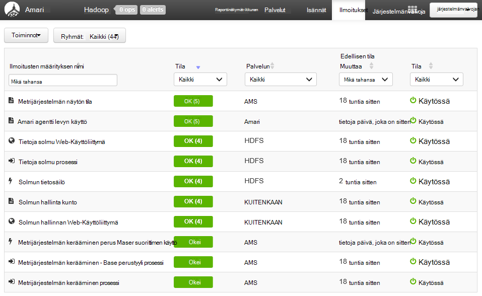

Voit hallita **Toiminnot** -valikosta ja **Ilmoitusten ryhmien hallinta**valitsemalla ryhmät. Näin voit muokata olemassa olevia ryhmiä tai luoda uusia ryhmiä.

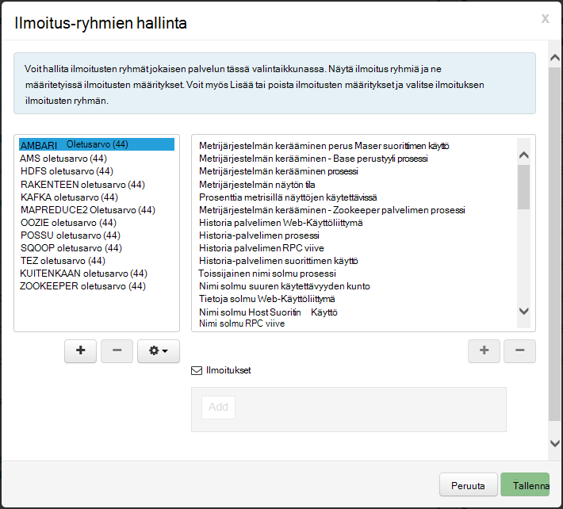

Voit myös luoda ilmoitusten **Toiminnot** -valikosta. Voit luoda käynnistimien, joka lähettää ilmoituksia **SÄHKÖPOSTILLA** tai **SNMP** tietyn ilmoitus/vakavuus kombinaatioiden toteutuessa. Voit esimerkiksi lähettää ilmoituksen, kun jokin ilmoituksia **Kuitenkaan oletusarvo** -ryhmässä on määritetty **Kriittinen**.

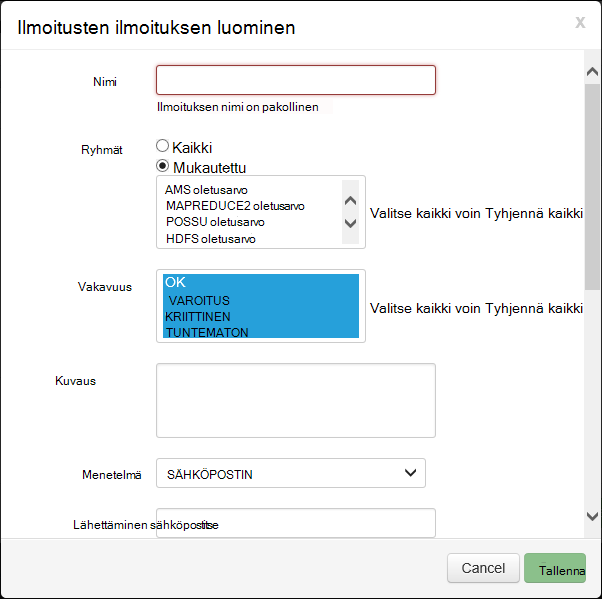

###Klusterin

Koontinäytön **arvot** -välilehti sisältää pienoisohjelmat, joiden avulla on helppo seurata tilaa yhteyttä klusterin yhdellä silmäyksellä sarjaa. Useita pienoisohjelmat, kuten **Suorittimen käyttö**on lisätietoja napsautettaessa.

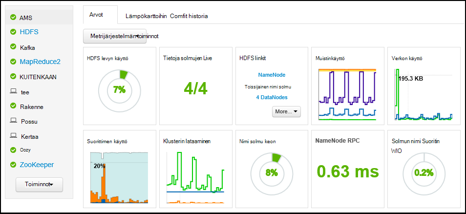

**Heatmaps** -välilehden näyttää arvot värillinen heatmaps, vihreä siirtymällä punainen.

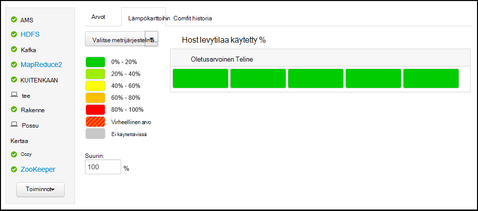

Valitse **isännät**klusterin sijaitsevien solmujen tarkempia tietoja, ja valitse kiinnostavan solmun.

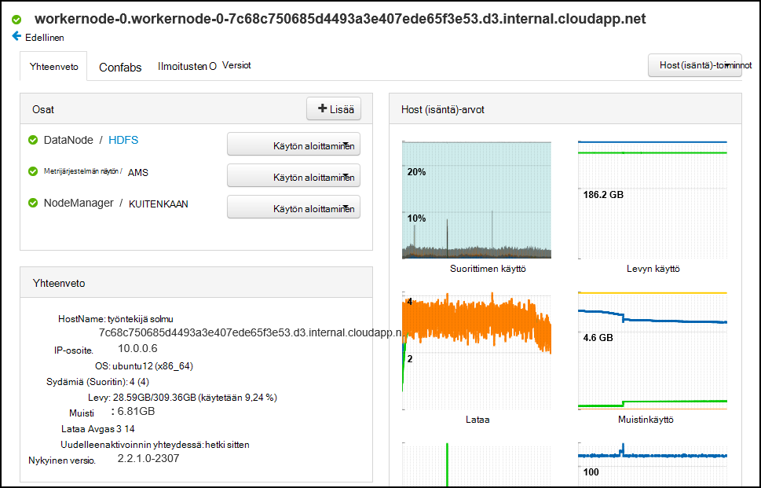

###Palvelut

**Services** -sivupalkki koontinäytössä on nopeasti tarkastaa klusterin palveluita tila. Eri kuvakkeita käytetään osoittamaan tila tai toiminnot, jotka on otettava, esimerkiksi keltainen Roskakori-merkin, jos palvelu on oltava kuluessa.

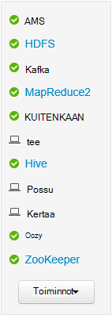

Palvelun näyttää yksityiskohtaisempia tietoja-palvelusta.

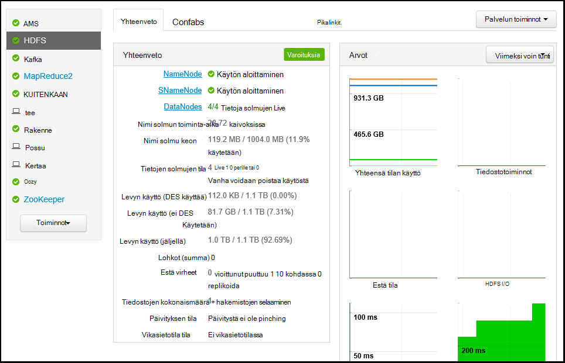

####Pikalinkit

Joidenkin palvelujen Näytä **Pikalinkit** -linkki sivun yläreunassa. Tämä voidaan käyttää palvelukohtaisia web monimuotomediakokemuksia, kuten:

* **Työhistoria** - MapReduce Työhistoria.

* **Resurssienhallinta** - kuitenkaan ResourceManager UI.

* **NameNode** - Hadoop Distributed tiedosto (HDFS) järjestelmän NameNode Käyttöliittymän.

* **Oozie Web-Käyttöliittymä** - Oozie Käyttöliittymän.

Valitseminen on seuraavissa linkeissä Avaa uudessa välilehdessä selaimessa, jossa näkyy valitun sivun.

> [AZURE.NOTE] Valitsemalla minkä tahansa palvelun **Pikalinkit** linkki johtaa "server ei löydy"-Virhe Jollet käytä välityspalvelinta web-liikenne paikalliseen klusterin tunnelin Secure Sockets Layer (SSL). Tämä johtuu siitä näyttävän näitä tietoja käytetään verkkosovellusten eikä niitä julkaista Internetissä.
>
> SSL-tunnelia käyttämisestä Hdinsightista on artikkelissa tietojen [Käytön SSH Tunneling käyttämään Ambari web-Käyttöliittymä, Resurssienhallinta, JobHistory, NameNode, Oozie, ja muut web-Käyttöliittymä on](hdinsight-linux-ambari-ssh-tunnel.md)

##Hallinta

###Ambari käyttäjät, ryhmät ja käyttöoikeudet

Käyttäjät, ryhmät ja käyttöoikeuksien hallinnasta olisi ei voi käyttää HDInsight klustereiden.

###Isännät

**Isännät** -sivulla näkyvät kaikki isännät klusterin. Voit hallita isännät, toimimalla seuraavasti.

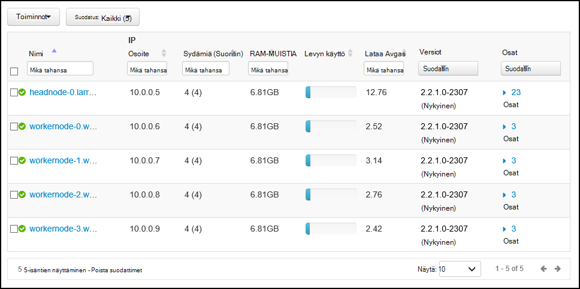

> [AZURE.NOTE] Lisäämällä, vanha voidaan poistaa käytöstä tai recommissioning isäntä olisi ei voi käyttää HDInsight klustereiden.

1. Valitse isäntien käyttöön, jota haluat hallita.

2. Valitse toiminto, jonka haluat suorittaa **Toiminnot** -valikon avulla:

    * **Aloita kaikki osat** - Aloita kaikki komponentit isännän.

    * **Lopeta kaikki osat** - lopettaa kaikki komponentit isännän.

    * **Kaikki komponentit uudelleen** - Lopeta ja Käynnistä kaikki komponentit isännän.

    * **Käyttöön ylläpito** - estää ilmoitusten isännän. Olisi otettava käyttöön, jos olet suorittamassa toiminnot, joka luo ilmoituksia, kuten uudelleenkäynnistyksen palvelu, jotka perustuvat palveluista.

    * Tavallinen ilmoitat isännän **Ylläpitotilan käytöstä** - palauttaa.

    * **Lopeta** - lopettaa DataNode tai NodeManagers isännän.

    * **Käynnistä** - alkaa DataNode tai NodeManagers isännän.

    * **Käynnistä** - pysähtyy ja aloittaa DataNode tai NodeManagers isännän.

    * **Decommission** - poistaa isäntä klusterin.

        > [AZURE.NOTE] Älä käytä tämän toiminnon HDInsight klustereiden.

    * **Recommission** - Lisää aiemmin menetelmiä host klusteriin.

        > [AZURE.NOTE] Älä käytä tämän toiminnon HDInsight klustereiden.

###Palvelut

**Raporttinäkymät-ikkunan** tai **palvelut** -sivulla Käytä **Toiminnot** -painike palveluluetteloon alareunassa Lopeta ja Käynnistä kaikki.

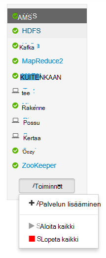

> [AZURE.WARNING] __Lisää palvelun__ näkyy valikossa, kun sitä käytetään ei Lisää palveluita HDInsight-klusterin. Uusia palveluita lisätään aikana klusteri valmisteleminen komentosarja-toiminnon avulla. Saat lisätietoja komentosarja-toimintojen käyttäminen [mukauttaminen HDInsight klustereiden komentosarja-toimintojen käyttäminen](hdinsight-hadoop-customize-cluster-linux.md).

Kun **Toiminnot** -painiketta voit käynnistää uudelleen kaikki palvelut, usein haluat aloittaa, lopettaa tai tietyn palvelun uudelleen. Seuraavien vaiheiden avulla voit suorittaa toimintoja yksittäisten palvelujen:

1. Valitse palvelu **raporttinäkymät-ikkunan** tai **palvelut** -sivulla.

2. **Yhteenveto** -välilehden yläreunasta **Palvelun toiminnot** -painiketta ja valitse toiminto, joka suoritetaan. Tämä käynnistää palvelun kaikissa solmuissa.

    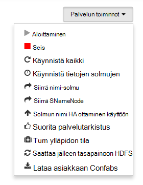

    > [AZURE.NOTE] Joidenkin palvelujen uudelleenkäynnistyksen klusterin ollessa käynnissä voi luoda ilmoituksia. Voit välttää tämän käyttöön **ylläpidon tila** palvelun ennen kuin suoritat uudelleenkäynnistyksen **Palvelun toiminnot** -painikkeen avulla.

3. Kun toiminto on valittu, sivun yläreunassa näkyvää **# a** kasvattaa näyttämään tausta-toiminto on käynnissä. Jos määritetty näyttämään, tausta toimintojen luettelo tulee näkyviin.

    > [AZURE.NOTE] Jos ottanut **ylläpidon tila** palvelun, muista poistaa sen käytöstä **Palvelun toiminnot** -painiketta, kun toiminto on valmis.

Voit määrittää palvelu noudattamalla seuraavia ohjeita:

1. Valitse palvelu **raporttinäkymät-ikkunan** tai **palvelut** -sivulla.

2. Valitse **kokoonpanomääritysten yhteydessä** -välilehti. Nykyiset määritykset näkyvät. Edellisen määritykset näkyy myös.

    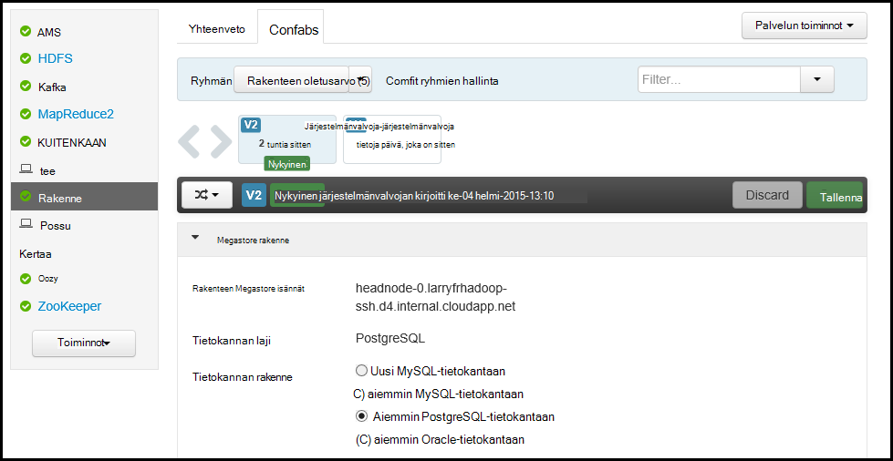

3. Voit muokata määritykset näkyvät kentät ja valitse sitten **Tallenna**. Tai valitse Edellinen määritystä, ja valitse sitten **nykyiseksi** , voit palata edellisiin asetuksiin.

##Ambari näkymät

Ambari näkymien avulla ohjelmistokehittäjät voivat Kytke Käyttöliittymän osat Ambari Web-Käyttöliittymän [Ambari näkymien Framework](https://cwiki.apache.org/confluence/display/AMBARI/Views)avulla. Hdinsightista on Hadoop klusterin käyttämällä seuraavista näkymistä:

* Kuitenkaan jonon hallinta: jonon hallintatoiminto on yksinkertainen Käyttöliittymän tarkasteleminen ja muokkaaminen kuitenkaan olevien.
* Rakenteen näkymä: Rakenne-näkymän avulla voit suorittaa rakenteen kyselyjä suoraan selaimessa. Voit tallentaa kyselyiden, näet tulokset, Tallenna tulokset klusterin tallennustilan tai lataa tulokset paikalliseen järjestelmään. Lisätietoja näkymien rakenne on näyttöön [Käytä rakenne näkymiä HDInsight kanssa](hdinsight-hadoop-use-hive-ambari-view.md).
* Tez näkymä: Tez näkymässä paremmin ymmärtää ja optimoi tarkastelemalla tietoja siitä, miten Tez työt suoritetaan ja mitä resursseja voi käyttää projektin työt.
