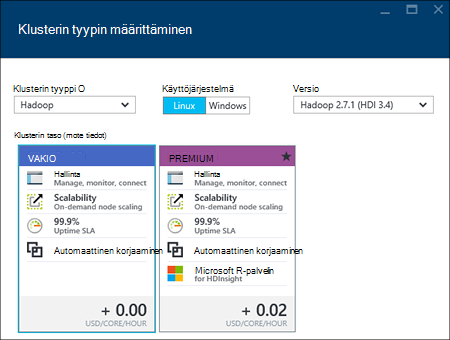
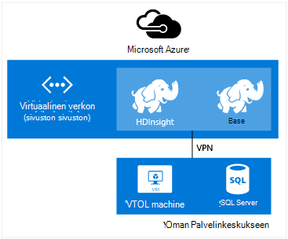

<properties
    pageTitle="Luo Hadoop, HBase, myrsky tai ohjattu klustereiden HDInsight Linux | Microsoft Azure"
    description="Lue, miten voit luoda Hadoop, HBase, myrsky tai Linux klustereiden tiedostojen käyttäminen selaimessa Azure CLI, PowerShellin Azure, REST-HDInsight tai SDK: N kautta."
    services="hdinsight"
    documentationCenter=""
    authors="mumian"
    manager="jhubbard"
    editor="cgronlun"
    tags="azure-portal"/>

<tags
    ms.service="hdinsight"
    ms.devlang="na"
    ms.topic="article"
    ms.tgt_pltfrm="na"
    ms.workload="big-data"
    ms.date="10/18/2016"
    ms.author="jgao"/>

# Luo Linux-pohjaiset Hadoop klustereiden Hdinsightiin

[AZURE.INCLUDE [selector](../../includes/hdinsight-selector-create-clusters.md)]

Hadoop-klusterin koostuu useita näennäiskoneiden (solmujen), joita käytetään tehtävien klusterin hajautettu käsittely. Azure käsittelee asennuksen käyttöönottotiedot ja määritykset yksittäisiä solmujen, eli tarjolla on nyt vain yleisten määritysten tietoja. Tässä artikkelissa kerrotaan määritys-asetuksista.

## Access-ohjausobjektin vaatimukset

[AZURE.INCLUDE [access-control](../../includes/hdinsight-access-control-requirements.md)]

## Klusterin tyypit

Tällä hetkellä Azure Hdinsightiin on viidenlaisia klustereiden, joissa joukon osia tiettyjen toimintojen tarjoamista varten.

| Klusterin tyyppi | Toiminto |
| ------------ | ----------------------------- |
| Hadoop       | Kyselyn ja analysointi (erätyöt)     |
| HBase        | NoSQL tietojen tallentaminen            |
| Myrsky        | Reaaliaikainen käsittely |
| Ohjattu        | Ladatun käsittely, vuorovaikutteinen kyselyiden mikro erä stream käsittely |
| [Vuorovaikutteinen rakenne (ennakkoversio)](hdinsight-hadoop-use-interactive-hive.md) | Ladatun välimuistiasetukset nopeampi ja vuorovaikutteinen rakenne-kyselyt|
| R palvelimelle ohjattu (ennakkoversio) | Erilaisia big datasta tilastotiedot, ennakoivan mallinnus ja konepohjaisten oppimistekniikoiden ominaisuudet |

Klusterin kullakin virhelajilla on oma klusterin sijaitsevien solmujen, klusterin sijaitsevien solmujen termejä ja AM oletuskoko solmu mistäkin määrä. Seuraavassa taulukossa on solmu mistäkin solmujen määrän sulkeissa.

| Tyyppi| Solmujen | Kaavio|
|-----|------|--------|
|Hadoop| Pää-solmu (2), tietojen solmu (1 +)||
|HBase|Pää palvelin (2)-alueen (1 +), Master/Zookeeper solmu (3)||
|Myrsky|Nimbus solmu (2), valvojan server (1 +), Zookeeper solmu (3)||
|Ohjattu|HEAD solmu (2), työntekijän solmu (1 +), Zookeeper solmu (3) (A1 Zookeepers AM koon vapaa)||

Seuraavassa taulukossa on lueteltu AM oletuskoko HDInsight:

- Kaikki tuetut alueet lukuun ottamatta Brasilia Etelä- ja japani:

  	|Klusterin tyyppi                     | Hadoop               | HBase                | Myrsky                | Ohjattu                                                                 | R-palvelin |
  	|---------------------------------|----------------------|----------------------|----------------------|-----------------------------------------------------------------------|-----------------------------------------------------------------------|
  	|Päätä – oletus AM kokoa           | D3 v2                | D3 v2                | A3                   | D12 v2                                                                | D12 v2                                                                |
  	|Päätä – suositellut AM koot      | D3 v2, D4 v2, D12 v2 | D3 v2, D4 v2, D12 v2 | A3, A4, A5           | D12 v2, D13 v2, D14 v2                                                | D12 v2, D13 v2, D14 v2                                                |
  	|Työntekijä – oletusarvon AM kokoa         | D3 v2                | D3 v2                | D3 v2                | Windows: D12 v2; Linux: D4 v2                                         | Windows: D12 v2; Linux: D4 v2                                         |
  	|Työntekijä – suositellut AM koot    | D3 v2, D4 v2, D12 v2 | D3 v2, D4 v2, D12 v2 | D3 v2, D4 v2, D12 v2 | Windows: D12 v2, D13 v2, D14 v2; Linux: D4 v2, D12 v2, D13 v2, D14 v2 | Windows: D12 v2, D13 v2, D14 v2; Linux: D4 v2, D12 v2, D13 v2, D14 v2 |
  	|Zookeeper – oletusarvon AM kokoa      |                      | A3                   | A2                   |                                                                       |
  	|Zookeeper – suositellut AM koot |                      | A3, A4, A5           | A2, A3, A4           |                                                                       |
  	|Reuna - oletus AM kokoa           |                      |                      |                      |                                                                       | Windows: D12 v2; Linux: D4 v2                                         |
  	|Reuna - suositeltu AM koko       |                      |                      |                      |                                                                       | Windows: D12 v2, D13 v2, D14 v2; Linux: D4 v2, D12 v2, D13 v2, D14 v2 |

- Brasilia Etelä ja vain japani Länsi (ei v2 koot tässä):

  	|Klusterin tyyppi                     | Hadoop      | HBase       | Myrsky      | Ohjattu                                          |R-palvelin|
  	|---------------------------------|-------------|-------------|------------|------------------------------------------------|--------|
  	|Päätä – oletus AM kokoa           | D3          | D3          | A3         | D12                                            | D12|
  	|Päätä – suositellut AM koot      | D3, D4, D12 | D3, D4, D12 | A3, A4, A5 | D12, D13, D14                                  | D12, D13, D14|
  	|Työntekijä – oletusarvon AM kokoa         | D3          | D3          | D3         | Windows: D12; Linux: D4                        | Windows: D12; Linux: D4|
  	|Työntekijä – suositellut AM koot    | D3, D4, D12 | D3, D4, D12 | D3, D4, D12| Windows: D12, D13, D14; Linux: D4, D12, D13, D14| Windows: D12, D13, D14; Linux: D4, D12, D13, D14|
  	|Zookeeper – oletusarvon AM kokoa      |             | A2          | A2         |                                                | |
  	|Zookeeper – suositellut AM koot |             | A2, A3, A4  | A2, A3, A4 |                                                | |
  	|Reunan – oletus AM koot          |             |             |            |                                                | Windows: D12; Linux: D4 |
  	|Reunan – suositellut AM koot      |             |             |            |                                                | Windows: D12, D13, D14; Linux: D4, D12, D13, D14 |

Huomaa, että pää kutsutaan *Nimbus* myrsky klusterin osalta. Työntekijän kutsutaan *alueen* HBase klusterin tyypin ja *valvojan* myrsky klusterin osalta.

> [AZURE.IMPORTANT] Jos aio on enemmän kuin 32 työntekijä solmujen joko klusterin luominen tai skaalauksen klusterin luonnin jälkeen, on valittava vähintään 8 Sydämiä ja 14 Gigatavua RAM-Muistia pään solmu koon.

Voit lisätä muita osia, kuten sävyä tai R nämä perustyyppiä käyttämällä [Komentosarja-toimintoja](#customize-clusters-using-script-action).

> [AZURE.IMPORTANT] HDInsight klustereiden olla erilaisia tyypit, jotka vastaavat työmäärää tai tekniikka, joka on optimoitu klusterin. Ei ole tuettu menetelmä luo klusteriin, joka yhdistää useita tyyppejä, kuten myrsky ja HBase yhden klusterissa. 

Jos ratkaisu edellyttää tekniikoita, jotka leviävät useita HDInsight-klusterin välillä, luotava Virtual Azure-verkon ja luoda virtuaalisen verkoston klusterin tarvittavia. Näin varausyksiköiden ja niihin suoraan yhteydessä toisiinsa käyttöönottoa koodia.

Katso lisätietoja käyttämisestä Virtual Azure-verkon HDInsight- [Laajentaa HDInsight Azure Virtual verkkojen kanssa](hdinsight-extend-hadoop-virtual-network.md).

Esimerkki klusterin kahdenlaisia Virtual Azure-verkon käyttämisestä on artikkelissa [Analysoi tunnistimen tietojen myrsky ja HBase](hdinsight-storm-sensor-data-analysis.md).

## Klusterin tasoa

Azure Hdinsightiin tarjoaa kahteen luokkaan big datasta cloud-tarjouksista: Vakio- ja [Premium](hdinsight-component-versioning.md#hdinsight-standard-and-hdinsight-premium). HDInsight Premium on R ja muita lisäosia. HDInsight Premium tuetaan vain HDInsight versio 3.4.

Seuraavassa taulukossa on lueteltu HDInsight-klusterin tyyppi ja HDInsight Premium tuki matriisissa.

| Klusterin tyyppi | Vakio | Premium  |
|--------------|---------------|--------------|
| Hadoop       | Kyllä           | Kyllä          |
| Ohjattu        | Kyllä           | Kyllä          |
| HBase        | Kyllä           | Ei           |
| Myrsky        | Kyllä           | Ei           |
| Ohjattu R-palvelimelle | Ei | Kyllä |

Tässä taulukossa päivitetään Lisää klusterin tyypit, jotka sisältyvät HDInsight Premium. Seuraavassa näyttökuvassa näkyy Azure portaalin tiedot valitsemalla klusterin tyyppejä.

## Peruskokoonpano asetukset

Seuraavassa on HDInsight-klusterin luomiseen käytetyt peruskokoonpano asetukset.

### Klusterinimi ###

Klusterinimeä käytetään klusterin. Klusterin nimen on oltava yksilöivä ja se on noudatettava seuraavia nimeämiseen liittyviä ohjeita:

- Kentän on oltava merkkijono, joka sisältää 3 ja 63 merkkien välillä.
- Kentässä voi olla vain kirjaimia, numeroita ja väliviivoja.

### Klusterin tyyppi###

Katso [klusterin tiedostotyypit](#cluster-types) ja - [klusterin tasoa](#cluster-tiers).

### Käyttöjärjestelmä ###

Voit luoda HDInsight klustereiden johonkin seuraavat kaksi käyttöjärjestelmät:

- Linux Hdinsightista.  Hdinsightista on määrittämisestä Linux klustereiden Azure-vaihtoehto. Määritä Linux-klusterin, jos olet tutustunut Linux tai Unix-siirtyminen aiemman Linux-pohjaiset Hadoop-ratkaisun, tai haluat helposti integrointi Hadoop ekosysteemiin osia laadittuihin ratkaisuihin Linux. Lisätietoja on artikkelissa [Hadoop HDInsight Linux käytön aloittaminen](hdinsight-hadoop-linux-tutorial-get-started.md).
- HDInsight Windows (Windows Server 2012 R2 palvelinkeskuksen).

### HDInsight-versio###

Tätä käytetään tämän klusterin tarvittavat HDInsight-version selvittäminen. Lisätietoja on artikkelissa [Hadoop klusterin versiot ja HDInsight-osat](https://go.microsoft.com/fwLink/?LinkID=320896&clcid=0x409).

### Tilauksen nimi###

Kunkin HDInsight-klusterin on yhdistetty yksi Azure tilaus.

### Resurssiryhmän nimi ###

Azure-resurssiryhmä kutsutaan [Azure resurssien hallinta](../azure-resource-manager/resource-group-overview.md) auttaa työskentelet resursseihin sovelluksesi ryhmänä. Voit ottaa käyttöön, Päivitä, valvoa tai poistaa kaikkien resurssien sovelluksen koordinoidun yhdellä kertaa.

### Tunnistetiedot###

Voit määrittää kaksi käyttäjätiliä HDInsight klustereiden klusterin luonnin aikana:

- HTTP-käyttäjä. Käyttäjän oletusnimi on käyttämällä perusasetukset Azure-portaalissa *järjestelmänvalvoja* . Joskus sanotaan "Klusterin käyttäjän."
- SSH käyttäjä (Linux klustereiden). Tätä käytetään muodostaa yhteyttä klusterin SSH avulla. Voit luoda uusia SSH käyttäjätilien noudattamalla [Käyttäminen SSH kanssa Linux-pohjaiset Hadoop HDInsight Linux, Unix-tai OS X-](hdinsight-hadoop-linux-use-ssh-unix.md) tai [Käytä SSH kanssa Linux-pohjaiset Hadoop HDInsight Windows-](hdinsight-hadoop-linux-use-ssh-unix.md)klusterin luomisen jälkeen.

    >[AZURE.NOTE] Windows-pohjaisesta klustereiden voit luoda RDP-käyttäjä, voi muodostaa yhteyden käyttämällä RDP klusterin.

### Tietolähde###

Alkuperäisen Hadoop distributed tiedostojärjestelmän (HDFS) käyttää monia paikallisten levyjen klusterin. HDInsight käyttää Azure-Blob-säiliö tietojen tallentamista varten. Azure-Blob-säiliö on tehokkaat, yleinen tallennustilan ratkaisun, joka integroituu saumattomasti Hdinsightista. HDFS-liittymän kautta täydellisen luettelon osia HDInsight toimii suoraan-Blob-objektien tallennustilaan rakenteellisia tai rakenteeton tiedoista. Tietojen tallentaminen Blob-objektien tallennustilaan avulla voit poistaa turvallisesti HDInsight-klustereiden, joita käytetään laskenta käyttäjätietoja menettämättä.

Konfiguroinnin aikana on määritettävä Azure-tallennustilan tilin ja Azure-Blob-tallennustilan säiliön Azure-tallennustilan tilin. Jotkin luominen prosessit edellyttävät Azure-tallennustilan tilin ja Blob-objektien tallennustilan säilö luodaan etukäteen. Blob-tallennustilan säiliön käytetään oletuskansio klusterin mukaan. Vaihtoehtoisesti voit määrittää Azuren tallennustilaan tilejä (linkitetyn tallennus), jotka ovat käytettävissä klusterin. Klusterin käyttää Blob tallennustilan säiliöiden, joka on määritetty täydellinen julkisen lukuoikeus tai julkinen BLOB vain lukuoikeudet.  Lisätietoja on artikkelissa [Azure-tallennustilan resurssien hallinta käytön](../storage/storage-manage-access-to-resources.md).

>[AZURE.NOTE] Blob storage säilön on joukko BLOB ryhmittely seuraavassa kuvassa esitetyllä tavalla.

Emme suosittele käyttämällä oletusarvo-Blob-objektien säilytykseen yritystietojen tallentamiseen. Poistaminen oletusarvon Blob tallennustilan säilö, kun jokaisen käytön tallennustilan pienentää on hyvä. Huomautus oletusarvoisesti säilö sisältää sovellus ja lokitiedot. Varmista, että hakemiseen lokit ennen poistamista säilö.

>[AZURE.WARNING] Useita klustereiden yksi Blob storage säilö jakaminen ei ole tuettu.

Saat lisätietoja toissijainen Blob-objektien tallennustilaan [Käyttämällä Azure Blob-objektien tallennustilaan HDInsight kanssa](hdinsight-hadoop-use-blob-storage.md).

Azure-Blob-säiliö lisäksi voit käyttää myös [Azure järvi tietovaraston](../data-lake-store/data-lake-store-overview.md) tallennustilan oletustiliksi HBase klusterin HDInsight- ja kaikki neljä HDInsight-klusterin tyypit linkitetyn tallennustila. Lisätietoja on artikkelissa [Luo HDInsight-klusterin tietojen järvi kaupan Azure portal](../data-lake-store/data-lake-store-hdinsight-hadoop-use-portal.md).

### Sijainti (alue) ###

HDInsight-klusterin ja sen tallennustilan oletustili on sijaittava Azure samassa paikassa.

Tuettujen alueiden luetteloon valitse [HDInsight hinnoittelua](https://go.microsoft.com/fwLink/?LinkID=282635&clcid=0x409) **alueen** avattavasta luettelosta.

### Solmun hinnat tasoa###

Näiden solmujen käytön laskuttaa asiakkaat klusterin elinkaaren ajaksi. Laskutus alkaa, kun klusterin luodaan ja lopettaa klusterin poistamisen yhteydessä. Klustereiden ei voi poistaa varattu tai pitoon.

Eri klusterin on eri solmutyypit solmujen ja solmu koot määrä. Esimerkiksi Hadoop-klusterin tyyppi on kaksi _pään solmujen_ ja oletusarvo on neljä _tietojen solmujen_myrsky klusterin tyyppi ei _nimbus solmujen_kaksi, kolme _zookeeper solmujen_ja oletusarvo on neljä _valvojan solmujen_. Kustannukset HDInsight klustereiden määritetään solmujen ja näennäiskoneiden koot solmujen määrän mukaan. Esimerkiksi jos tiedät, että suoritat toiminnoista, joita on paljon muistia, haluat ehkä Valitse Laske resurssi muistia kanssa. Käyttöön liittyviä tarkoituksiin, on suositeltavaa käyttää yksi tietojen solmu. Saat lisätietoja HDInsight hinnat [HDInsight hinnat](https://go.microsoft.com/fwLink/?LinkID=282635&clcid=0x409).

>[AZURE.NOTE] Klusterin kokorajoitus vaihtelee Azure tilaukset. Laskutuksen tuelta niin, että rajoitus.

>Käyttää yhteyttä klusterin solmut ei saavat arvon näennäiskoneiden, koska käytetään solmujen virtuaalikoneen kuvat ovat käyttöönoton yksityiskohtaiset tiedot HDInsight-palvelun. Solmut käyttämä Laske sydämiä lasketaan mukaan käytettävissä tilauksessa Laske sydämiä kokonaismäärän. Näet käytettävissä Sydämiä ja sydämiä, jota käytetään mukaan klusterin solmu hinnat tasoa sivu yhteenveto-kohdassa HDInsight-klusterin luotaessa.

Kun käytät Azure portaalin määrittäminen klusterin, solmun koon on saatavana __Solmu hinnat taso__ -sivu. Näet myös eri solmu koot liittyvät kustannukset. Seuraavassa näyttökuvassa näkyy Linux base Hadoop-klusterin kuvaamiseksi.

Seuraavissa taulukoissa on HDInsight klustereiden ja ne sisältävät valmiuksia tukevat koot.

#### Vakio taso: A sarja####

Perinteinen käyttöönotto-mallissa joitakin AM koot ovat hieman erilaiset PowerShell ja CLI.
* Standard_A3 on suuri
* Standard_A4 on ExtraLarge

|Kokoa |Suorittimen sydämiä|Muisti|NIC (Max)|Maks. levyn koko|Maks. tietoja levyjen (1023 gt kunkin)|Maks. IOPS (500 levy)|
|---|---|---|---|---|---|---|
|Standard_A3\Large|4|7 GIGATAVUA|2|Tilapäinen = 285 gt |8|8 x 500|
|Standard_A4\ExtraLarge|8|14 GT|4|Tilapäinen = 605 gt |16|16 x 500|
|Standard_A6|4|28 GT|2|Tilapäinen = 285 gt |8|8 x 500|
|Standard_A7|8|56 GT|4|Tilapäinen = 605 gt |16|16 x 500|

#### Vakio taso: D-sarjan####

|Kokoa |Suorittimen sydämiä|Muisti|NIC (Max)|Maks. levyn koko|Maks. tietoja levyjen (1023 gt kunkin)|Maks. IOPS (500 levy)|
|---|---|---|---|---|---|---|
|Standard_D3 |4|14 GT|4|Tilapäinen (Suoritettaessa) = 200 gt |8|8 x 500|
|Standard_D4 |8|28 GT|8|Tilapäinen (Suoritettaessa) = 400 gt |16|16 x 500|
|Standard_D12 |4|28 GT|4|Tilapäinen (Suoritettaessa) = 200 gt |8|8 x 500|
|Standard_D13 |8|56 GT|8|Tilapäinen (Suoritettaessa) = 400 gt |16|16 x 500|
|Standard_D14 |16|112 GT|8|Tilapäinen (Suoritettaessa) = 800 gt |32|32-x 500|

#### Vakio taso: Dv2 sarja####

|Kokoa |Suorittimen sydämiä|Muisti|NIC (Max)|Maks. levyn koko|Maks. tietoja levyjen (1023 gt kunkin)|Maks. IOPS (500 levy)|
|---|---|---|---|---|---|---|
|Standard_D3_v2 |4|14 GT|4|Tilapäinen (Suoritettaessa) = 200 gt |8|8 x 500|
|Standard_D4_v2 |8|28 GT|8|Tilapäinen (Suoritettaessa) = 400 gt |16|16 x 500|
|Standard_D12_v2 |4|28 GT|4|Tilapäinen (Suoritettaessa) = 200 gt |8|8 x 500|
|Standard_D13_v2 |8|56 GT|8|Tilapäinen (Suoritettaessa) = 400 gt |16|16 x 500|
|Standard_D14_v2 |16|112 GT|8|Tilapäinen (Suoritettaessa) = 800 gt |32|32-x 500|    

Katso käyttöönottoon liittyviä huomioita pitää mielessä, kun suunnittelet näiden resurssien, [näennäiskoneiden koot](../virtual-machines/virtual-machines-windows-sizes.md). Lisätietoja hinnat erikokoisia artikkelissa [HDInsight hinnat](https://azure.microsoft.com/pricing/details/hdinsight).   

> [AZURE.IMPORTANT] Jos aio on enemmän kuin 32 työntekijä solmujen joko klusterin luominen tai skaalauksen klusterin luonnin jälkeen, on valittava vähintään 8 Sydämiä ja 14 Gigatavua RAM-Muistia pään solmu koon.

Laskutus alkaa, kun klusterin luodaan, ja lopettaa klusterin poistamisen yhteydessä. Saat lisätietoja hinnat [HDInsight hinnoittelutiedot](https://azure.microsoft.com/pricing/details/hdinsight/).

## Käytä lisätallennustilaa

Joissakin tilanteissa haluat ehkä lisätä tallennustilaa klusterin. Esimerkiksi voi olla useita eri maantieteellisillä alueilla tai eri palvelujen Azure tallennustilan tilejä, mutta haluat analysoida ne kaikki HDInsight kanssa.

Tallennustilan tilejä voi lisätä, kun luot HDInsight-klusterin tai klusterin luomisen jälkeen.  Katso [mukauttaminen Linux-pohjaiset HDInsight klustereiden komentosarja-toiminnon avulla](hdinsight-hadoop-customize-cluster-linux.md).

Saat lisätietoja toissijainen Blob-objektien tallennustilaan [käyttämällä Azure-Blob-säiliö HDInsight kanssa](hdinsight-hadoop-use-blob-storage.md). Lisätietoja toissijaisen järvi tietosäilö on [luoda HDInsight klustereiden tietojen järvi kaupan Azure-portaalissa](../data-lake-store/data-lake-store-hdinsight-hadoop-use-portal.md).

## Käytä rakenne ja Oozie metastore

Suosittelemme, että käytät mukautettuja metastore, jos haluat säilyttää rakenne-taulukot, kun olet poistanut HDInsight-klusterin. Osaat kyseisen metastore liittäminen toiseen HDInsight-klusteriin.

> [AZURE.IMPORTANT] Yksi HDInsight-klusterin versio, ohjelma luo HDInsight metastore ei voi jakaa HDInsight-klusterin versioiden välillä. Katso HDInsight-versioiden luettelo on [tuettu HDInsight-versioissa](hdinsight-component-versioning.md#supported-hdinsight-versions).

Metastore sisältää rakenne ja Oozie metatietoja, kuten taulukoiden rakennetta, osioita, mallit ja sarakkeet. Metastore avulla voit säilyttää rakenne ja Oozie metatietojen, joten sinun ei tarvitse luoda uudelleen rakenteen taulukoita tai Oozie työt, kun luot uuden klusterin. Rakenteen käyttää oletusarvon mukaan upotetun Azure SQL-tietokantaan voit tallentaa nämä tiedot. Upotettu tietokannan et voi säilyttää metatietoja, kun klusterin poistetaan. Kun luot rakennetaulukko HDInsight-klusterin määritetty rakenne-metastore, kyseisten taulukoiden säilytetään, kun käyttämällä samaa rakenteen metastore klusterin uudelleen.

Metastore määritys ei ole käytettävissä HBase klusterin tyypeissä.

> [AZURE.IMPORTANT] Kun luot mukautetun metastore, älä käytä tietokannan nimi, joka sisältää katkoviivat tai väliviivoja. Tämä voi aiheuttaa klusterin luontiprosessi epäonnistuu.

## Käytä Azure virtual verkot

[Azure virtual verkkoon](https://azure.microsoft.com/documentation/services/virtual-network/)voit luoda suojatun, pysyvä verkon tarvittavat resurssit-ratkaisun, joka sisältää. Virtuaalinen verkkoon voit:

* Yhdistä cloud resurssien yhdessä (vain cloud) yksityisverkon.

    

* Yhdistäminen pilveen resurssien paikallisen palvelinkeskuksen verkkoon (sivusto sivusto tai pisteen sivuston) näennäisen yksityisverkon (VPN).

| Sivusto määritys | Pisteen sivuston määrittäminen |
| -------------------------- | --------------------------- |
| Sivusto kokoonpanoa voit muodostaa useita resursseja-että palvelinkeskuksen Azure virtual verkkoon laitteiston VPN tai reititys ja etäkäyttö-palvelu.  | Pisteen sivuston kokoonpanoa voit muodostaa tietyn resurssin Azure virtual verkkoon ohjelmiston VPN avulla.  |

Windows-pohjaisesta klustereiden edellyttävät v1 (perinteinen) virtual verkkoon, kun Linux-pohjaiset klustereiden käytettävä virtual v2 (Azure Resurssinhallinta)-verkkoon. Jos sinulla ei ole tyyppi on oikea verkon, se ei voi käyttää klusterin luodessasi.

Katso lisätietoja käyttämisestä virtual verkossa, mukaan lukien tietty määritys vaatimukset virtual verkon HDInsight [laajentaa HDInsight ominaisuuksia käyttämällä Azure virtual verkkoon](hdinsight-extend-hadoop-virtual-network.md).

## Mukauta klustereiden käyttämällä HDInsight-klusterin mukauttaminen (käynnistyksen)

Joskus haluat määrittää määritysten seuraavat tiedostot:

- clusterIdentity.xml
- Core site.xml
- Gateway.XML
- hbase env.xml
- hbase site.xml
- hdfs site.xml
- rakenne-env.xml
- rakenne-site.xml
- mapred-sivusto
- oozie site.xml
- oozie env.xml
- myrsky site.xml
- tez site.xml
- webhcat site.xml
- kuitenkaan site.xml

Voit säilyttää muutokset klusterin elinkaaren kautta voit käyttää HDInsight-klusterin mukauttaminen luomisen aikana tai voit käyttää Ambari Linux-pohjaiset klustereissa. Lisätietoja on artikkelissa [mukauttaminen HDInsight klustereiden käyttämällä automaattinen](hdinsight-hadoop-customize-cluster-bootstrap.md).

>[AZURE.NOTE] Windows-pohjaisesta klustereiden ei voi säilyttää muutoksia kuvan uudelleen. Lisätietoja on artikkelissa [Roolin esiintymän käynnistyy määräpäivän OS päivityksiä](http://blogs.msdn.com/b/kwill/archive/2012/09/19/role-instance-restarts-due-to-os-upgrades.aspx).  Säilytä muutokset klustereiden elinaika kautta, sinun on käytettävä HDInsight-klusterin mukauttaminen luomisen aikana.

## Mukauta klustereiden komentosarja-toiminnon käyttäminen

Voit asentaa lisäosat tai mukauttaa klusterin kokoonpano käyttämällä komentosarjoja luonnin aikana. Komentosarjoja ovat kutsua **Komentosarja-toiminnon**, joka on määritysvaihtoehto, joita voidaan käyttää Azure portaalin, HDInsight Windows PowerShellin cmdlet-komennot tai HDInsight .NET SDK-paketissa. Lisätietoja on artikkelissa [mukauttaminen HDInsight-klusterin komentosarja-toiminnon avulla](hdinsight-hadoop-customize-cluster-linux.md).

Joitakin alkuperäisen Java-osia, kuten Mahout ja Cascading, voidaan suorittaa klusterin Java-arkisto (JAR)-tiedostoina. PURKKI nämä tiedostot voidaan jakaa Azure-Blob-säiliö ja HDInsight klustereihin lähetettyjä Hadoop työn lähetyksen järjestelmiä. Lisätietoja on artikkelissa [Lähetä Hadoop työt ohjelmallisesti](hdinsight-submit-hadoop-jobs-programmatically.md).

>[AZURE.NOTE] Jos sinulla on ongelmia käyttöönotto PURKKI tiedostojen HDInsight klustereihin tai soittamista PURKKI tiedostojen HDInsight klustereiden, ota yhteyttä [Microsoftin tuotetukeen](https://azure.microsoft.com/support/options/).

> CSS-ei tue HDInsight ja ei oikeuta Microsoft Support. Katso luettelo tuetuista osien [uudet HDInsight myöntämä klusterin versioissa?](hdinsight-component-versioning.md)

## Reuna-solmun avulla

 Tyhjä reuna-solmu on sama asiakastyökalut asentanut ja määrittänyt headnodes kuten Linux virtual konetta. Voit käyttää klusterin, asiakas-sovellusten testaaminen ja isännöinnin asiakassovelluksissa verkkosovellusten reuna-solmu. Lisätietoja on artikkelissa [Käytä tyhjä reunan solmujen Hdinsightista](hdinsight-apps-use-edge-node.md).
 
## Klusterin luominen menetelmät

Tässä artikkelissa on opit perustiedot Linux-pohjaiset HDInsight-klusterin luominen. Seuraavan taulukon avulla voit löytää tiettyjä tietoja menetelmällä tarpeitasi parhaiten sopiva klusterin luomisesta.

| Klustereiden, joka on luotu käyttämällä | Web-selaimessa | Komentorivin | REST-OHJELMOINTIRAJAPINNALLA | SDK-PAKETISSA | Linux, Mac OS X tai Unix | Windows |
| ------------------------------- |:----------------------:|:--------------------:|:------------------:|:------------:|:-----------------------------:|:------------:|
| [Azure-portaalissa](hdinsight-hadoop-create-linux-clusters-portal.md) | ✔     | &nbsp; | &nbsp; | &nbsp; | ✔      | ✔ |
| [Azure Data Factory](hdinsight-hadoop-create-linux-clusters-adf.md) | ✔     | ✔  | ✔  |✔  | ✔      | ✔ |
| [Azure CLI](hdinsight-hadoop-create-linux-clusters-azure-cli.md)         | &nbsp; | ✔     | &nbsp; | &nbsp; | ✔      | ✔ |
| [Azure PowerShell](hdinsight-hadoop-create-linux-clusters-azure-powershell.md) | &nbsp; | ✔     | &nbsp; | &nbsp; | ✔ | ✔ |
| [Kääntö](hdinsight-hadoop-create-linux-clusters-curl-rest.md) | &nbsp; | ✔     | ✔ | &nbsp; | ✔      | ✔ |
| [.NET SDK-PAKETISSA](hdinsight-hadoop-create-linux-clusters-dotnet-sdk.md) | &nbsp; | &nbsp; | &nbsp; | ✔ | ✔      | ✔ |
| [Azure Resurssienhallinta-mallit](hdinsight-hadoop-create-linux-clusters-arm-templates.md) | &nbsp; | ✔     | &nbsp; | &nbsp; | ✔      | ✔ |
