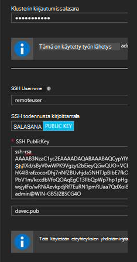
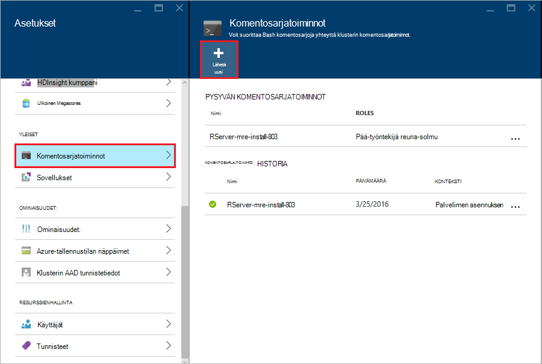

<properties
   pageTitle="Aloita R palvelimelle HDInsight (ennakkoversio) | Azure"
   description="Opettele luomaan Apache ohjattu HDInsight (Hadoop)-klusterissa, joka sisältää R Server (ennakkoversio) ja Lähetä R-komentosarjan klusterin."
   services="HDInsight"
   documentationCenter=""
   authors="jeffstokes72"
   manager="jhubbard"
   editor="cgronlun"
/>

<tags
   ms.service="HDInsight"
   ms.devlang="R"
   ms.topic="article"
   ms.tgt_pltfrm="na"
   ms.workload="data-services"
   ms.date="08/19/2016"
   ms.author="jeffstok"
/>

# Aloita Serverissä R HDInsight (ennakkoversio)

Ojentamassa Hdinsightista varten premium taso sisältää R Server (ennakkoversio) HDInsight-klusterin osana. Näin R-komentosarjojen käyttää MapReduce ja ohjattu hajautettu funktiolauseita. Tässä asiakirjassa kerrotaan, miten voit luoda uuden R palvelimen HDInsight ja suorita R-komentosarja, joka esittelee käyttämällä Ohjattu hajautettu R funktiolauseita.

## Edellytykset

* __Azure tilaus__: ennen kuin aloitat Tässä opetusohjelmassa, sinulla on oltava Azure tilaus. Lisätietoja on kohdassa [Hae Azure maksuttoman kokeiluversion](https://azure.microsoft.com/documentation/videos/get-azure-free-trial-for-testing-hadoop-in-hdinsight/) .

* __A suojattu runko (SSH)-asiakasohjelman__: SSH-asiakasohjelmaa käytetään etäyhteyden HDInsight-klusterin yhdistäminen ja suorittamisesta komennot suoraan klusterin. Linux, Unix ja OS X-järjestelmiä antaa SSH-asiakasohjelman kautta `ssh` komento. Windows-järjestelmiä Suosittelemme [painovärit, muste](http://www.chiark.greenend.org.uk/~sgtatham/putty/download.html).

    * __SSH näppäimet (valinnainen)__: Voit suojata SSH-tili, jota käytetään muodostaa yhteyttä klusterin salasanan tai julkinen avain. Salasanalla on helpompaa ja voit aloittaa eikä sinun tarvitse luoda julkisen ja yksityisen avaimen turvalliseen paikkaan. kuitenkin avaimen avulla on turvallisempi.
    
        Tämän asiakirjan vaiheissa oletetaan, että käytät salasanaa. Lisätietoja luominen ja käyttäminen SSH näppäimet Hdinsightista on artikkelissa seuraavat asiakirjat:
        
        * [SSH käyttäminen HDInsight Linux, Unix tai OS X-asiakkaat](hdinsight-hadoop-linux-use-ssh-unix.md)
        
        * [SSH käyttäminen HDInsight Windows-asiakkaiden](hdinsight-hadoop-linux-use-ssh-windows.md)

### Access-ohjausobjektin vaatimukset

[AZURE.INCLUDE [access-control](../../includes/hdinsight-access-control-requirements.md)]

## Klusterin luominen

> [AZURE.NOTE] Ohjeita tämän asiakirjan luoda R-palvelimen HDInsight peruskokoonpano tietojen avulla. Katso muiden klusterin kokoonpanoasetusten (esimerkiksi lisätallennustilaa tilien lisäämisestä, Virtual Azure-verkon käyttäminen tai luomisesta metastore rakenne), [Luo Linux-pohjaiset HDInsight klustereiden](hdinsight-hadoop-provision-linux-clusters.md).

1. Kirjautuminen [Azure portal](https://portal.azure.com).

2. Valitse __Uusi__, __tietojen + Analytics__- ja __Hdinsightista__.

    

3. Kirjoita nimi klusterin __Klusterinimi__ -kenttään. Jos sinulla on useita Azure tilauksia, valitse haluamasi vaihtoehto, jota haluat käyttää __tilauksen__ tapahtuma avulla.

    

4. Valitse __Valitse klusterin tyyppi__. __Klusterin tyyppi__ , sivu valitsemalla seuraavat vaihtoehdot:

    * __Klusterin tyyppi__: Ohjattu R-palvelimelle
    
    * __Klusterin taso__: Premium

    Muut vaihtoehdot jättää oletusarvot ja valitse __valinta__ -painikkeen avulla voit tallentaa klusterin tyyppi.
    
    
    
    > [AZURE.NOTE] Voit lisätä R palvelimen muiden HDInsight-klusterin tyyppeihin (esimerkiksi Hadoop tai HBase,) valitsemalla haluamasi klusteri ja valitsemalla sitten __Premium__.

5. Valitse **Resurssiryhmä** aiemmin resurssiryhmien luettelo ja valitse sitten haluamasi vaihtoehto-klusterin luominen. Vaihtoehtoisesti voit valita **Luo uusi** ja kirjoita sitten uusi resurssiryhmä nimi. Osoittamassa, että uuden ryhmänimi on käytettävissä näkyy vihreä valintamerkki.

    > [AZURE.NOTE] Tämän arvon oletusarvo johonkin aiemmin resurssi-ryhmistä, jos ne ovat käytettävissä.
    
    __Valitse__ -painikkeen avulla voit tallentaa resurssiryhmän.

6. Valitse **tunnistetiedot**ja **Klusterin kirjautumisen käyttäjänimi** ja **Klusterin kirjautumissalasana**.

    Kirjoita __SSH käyttäjänimi__.  SSH käytetään muodostaa etäyhteyden klusterin __Suojattu runko (SSH)__ -asiakasohjelman avulla. Voit joko määrittää SSH käyttäjän tässä valintaikkunassa tai kun klusterin on luotu (klusterin määritys-välilehti). R palvelin on määritetty toiminta "remoteuser" __SSH käyttäjänimi__ .  Jos käytät eri käyttäjänimi, sinun on suorittaa lisätoimia klusterin luomisen jälkeen.
    
    

    __SSH todennustyyppi__: Valitse __salasana__ todennustyyppi, ellei käyttäminen julkisella avaimella laite.  Tarvitset julkinen/yksityinen avaimen pari, jos haluat käyttää R-palvelimen kautta remote asiakas, kuten RTVS, RStudio tai toisen työpöydän IDE klusterin.   

    Voit luoda ja käyttää julkinen/yksityinen avain pari Valitse 'JULKISELLA AVAIMELLA' ja jatka seuraavasti.  Nämä ohjeet oletetaan, että Cygwin ssh-keygen tai vastaavalla, jotka on asennettu.

    -    Luo julkinen/yksityinen avaimen pari komentokehote kannettavassa tietokoneessa:
      
            ssh-keygen - t rsa -b 2048 – f < yksityinen-avain-filename >
      
    -    Tämä vaihtoehto Luo yksityinen avain-tiedosto ja julkisen avaimen tiedoston nimi < yksityinen-avain-tiedostonimi >-.pub-kohdassa esimerkiksi  davec ja davec.pub.  Määritä julkinen avaimen tiedosto (* .pub) kun HDI klusterin tunnistetiedot liittäminen:
      
          
      
    -    Valitse yksityinen keyfile kannettavalla tietokoneellasi käyttöoikeuksien muuttaminen
      
            chmod 600 < yksityinen-avain-filename >
      
    -    Käyttää yksityinen avain-tiedosto SSH remote kirjautuminen, kuten
      
            ssh – i < yksityinen-avain-filename >remoteuser@<hostname public ip>
      
      tai kun osa Hadoop ohjattu Laske-kontekstin määritelmän R palvelimen asiakastietokoneeseen (Katso käyttämällä Microsoft R Serverin online- [RevoScaleR Hadoop ohjattu Aloitusoppaasta](https://msdn.microsoft.com/microsoft-r/scaler-spark-getting-started) [luominen Ohjattu Laske konteksti](https://msdn.microsoft.com/microsoft-r/scaler-spark-getting-started#creating-a-compute-context-for-spark) -osassa Hadoop-asiakkaaksi.)

7. Valitse **Tietolähde** tietolähde klusterin. Valitse käytössä olevan tallennustilan tilin valitsemalla __Valitse tallennustilan tilin__ ja valitsemalla sitten tilin tai luoda uuden tilin __tallennustilan tili__ -kohdassa __Uusi__ -linkin avulla.

    Jos valitset __Uusi__, sinun on annettava uusi tallennustilan tilin nimi. Vihreä valintamerkki tulee näkyviin, jos se hyväksytään.

    Klusterin nimi oletusarvo on __Oletusarvoinen säilö__ . Jätä tämä arvo.
    
    Valitse __sijainti__ , Luo tallennustilan tilin alue.
    
    > [AZURE.IMPORTANT] Oletus-tietolähteen sijainti myös määrittää HDInsight-klusterin sijainti. Klusterin ja oletusarvo-tietolähde on sijaittava samalla alueella.

    **Valitse** -painikkeen avulla voit tallentaa tietolähteen asetukset.
    
    

8. Valitse **Solmu hinnat tasoa** , joka luodaan tämän klusterin solmut tiedon. Jos et tiedä, että sinun on suurempi klusterin, jättää työntekijä solmujen määrän oletusarvo `4`. Klusterin arvioitu kustannus näytetään kuluessa sivu.

    > [AZURE.NOTE] Tarvittaessa uudelleen yhteyttä klusterin myöhemmin portaalin kautta voit muuttaa kokoa (klusterin -> Asetukset -> mittakaava-klusterin) voit suurentaa tai pienentää työntekijän solmujen määrän.  Tämä on hyvä joutokäynnillä alaspäin klusterin, kun ne eivät ole käytössä tai lisäämällä kapasiteetin tarpeiden suurempia tehtäviä.

    Jotkin kannattaa pitää mielessä, kun yhteyttä klusterin ja tietojen solmut reuna-solmu koon tekijöitä ovat seuraavat:  
   
    - Hajautettu R palvelimen analyysien ohjattu-suorituskyky on suhteellisten työntekijä solmujen määrän, kun tiedot on suuri.  
    - R palvelimen analyysien suorituskyky on lineaarinen parhaillaan analysoida tietoja kokoa. Esimerkki:  
        - Pieni vähän tietojen suorituskyky on parhaiten, kun analysoida paikallisen Laske reuna-solmun kontekstissa.  Lisätietoja kohdassa käyttötavoista ohjattu Laske kontekstit toimivat parhaiten ja paikallinen artikkelissa Laske konteksti asetusten R palvelimen HDInsight. 
        - Jos Kirjaudu reuna-solmu ja suorita sitten R-komentosarja on kaikki, mutta ScaleR vastaanotto-funktio suorittaa <strong>paikallisesti</strong> reuna-solmun niin muistin ja sydämiä reuna-solmun määrä olisi voi muuttaa vastaavasti. Sama koskee, jos käytät R Server-HDI remote Laske kontekstin kannettavasta tietokoneesta.
    
    

    **Valitse** -painikkeen avulla voit tallentaa hinnat määritysten solmu.
    
9. Valitse **Uuden HDInsight-klusterin** -sivu Varmista, että **Startboard Kiinnitä** on valittuna ja valitse sitten **Luo**. Tämä luo klusterin ja ruudun lisääminen sen Azure-portaalin Startboard. Kuvake ilmaisee, että klusterin luodaan ja muutetaan näyttää HDInsight-kuvake, kun luominen on valmis.

  	| Luomisen aikana | Luotu |
  	| ------------------ | --------------------- |
  	|  |  |

    > [AZURE.NOTE] Kestää jonkin aikaa klusterin luominen yleensä noin 15 minuuttia. Tarkasta luontia Startboard tai sivun vasemmassa reunassa **ilmoitukset** -merkinnän ruudun avulla.

## Yhteyden muodostaminen R palvelimen reuna-solmu

Yhdistä R palvelimen reunan solmu HDInsight-klusterin SSH avulla:

    ssh USERNAME@r-server.CLUSTERNAME-ssh.azurehdinsight.net
    
> [AZURE.NOTE] Voit myös etsiä `R-Server.CLUSTERNAME-ssh.azurehdinsight.net` osoite valitsemalla klusterin, valitse __Kaikki asetukset__, __sovellusten__ja __RServer__Azure-portaalissa. Tässä näkyvät reuna-solmu SSH päätepisteen tiedot.
>
> 
    
Jos olet käyttänyt suojaamiseen SSH käyttäjätilin salasanan, voit pyydetään antamaan sitä. Jos olet käyttänyt julkisella avaimella, saatat joutua käyttämään `-i` parametri, voit määrittää vastaava yksityinen avain. Esimerkiksi `ssh -i ~/.ssh/id_rsa USERNAME@R-Server.CLUSTERNAME-ssh.azurehdinsight.net`.
    
Lisätietoja Linux-pohjaiset HDInsight SSH käyttämisestä on seuraavissa artikkeleissa:

* [Linux-pohjaiset Hadoop HDInsight Linux, Unix tai OS X-SSH käyttäminen](hdinsight-hadoop-linux-use-ssh-unix.md)

* [SSH käyttäminen Linux-pohjaiset Hadoop-HDInsight Windows](hdinsight-hadoop-linux-use-ssh-windows.md)

Kun yhteys on muodostettu, seuraavankaltaiselta kehote vuoroon.

    username@ed00-myrser:~$

## Käyttää R

1. SSH istunnosta seuraavalla komennolla voit käynnistää R-konsolin.

        R
    
    Näet tulosteen seuraavankaltaiselta.
    
        R version 3.2.2 (2015-08-14) -- "Fire Safety"
        Copyright (C) 2015 The R Foundation for Statistical Computing
        Platform: x86_64-pc-linux-gnu (64-bit)

        R is free software and comes with ABSOLUTELY NO WARRANTY.
        You are welcome to redistribute it under certain conditions.
        Type 'license()' or 'licence()' for distribution details.

        Natural language support but running in an English locale

        R is a collaborative project with many contributors.
        Type 'contributors()' for more information and
        'citation()' on how to cite R or R packages in publications.

        Type 'demo()' for some demos, 'help()' for on-line help, or
        'help.start()' for an HTML browser interface to help.
        Type 'q()' to quit R.

        Microsoft R Server version 8.0: an enhanced distribution of R
        Microsoft packages Copyright (C) 2016 Microsoft Corporation

        Type 'readme()' for release notes.

        >

2. Kohteesta `>` kehote, voit syöttää R-koodin. R server sisältää paketteja, jotta voit käsitellä Hadoop ja suorita hajautettu funktiolauseita helposti. Esimerkiksi seuraavalla komennolla voit tarkastella HDInsight-klusterin käyttöjärjestelmän ylimmällä.

        rxHadoopListFiles("/")
    
    Voit käyttää myös WASB-tyyli-osoitteet.
    
        rxHadoopListFiles("wasbs:///")

## R-palvelimen käyttäminen HDI remote esiintymästä Microsoft R Server tai Microsoft R-asiakas

Kussakin julkinen/yksityinen avaimen paria on klusterin käyttöä koskeva osassa on mahdollista asennuksen Accessiin HDI Hadoop ohjattu Laske kontekstiin remote esiintymästä Microsoft R Server tai Microsoft R Client pöytätietokoneessa tai kannettavassa tietokoneessa (Katso käyttämällä Microsoft R Serverin online- [RevoScaleR Hadoop ohjattu Aloitusoppaasta](https://msdn.microsoft.com/microsoft-r/scaler-spark-getting-started) [luominen Ohjattu Laske konteksti](https://msdn.microsoft.com/microsoft-r/scaler-spark-getting-started#creating-a-compute-context-for-spark) -osassa Hadoop-asiakkaaksi).  Jos haluat tehdä, jos haluat määrittää seuraavat asetukset RxSpark määritettäessä Laske kontekstin kannettavassa tietokoneessa: hdfsShareDir, shareDir, sshUsername, sshHostname, sshSwitches, ja sshProfileScript. Esimerkki:

    
    myNameNode <- "default"
    myPort <- 0 
 
    mySshHostname  <- 'rkrrehdi1-ssh.azurehdinsight.net'  # HDI secure shell hostname
    mySshUsername  <- 'remoteuser'# HDI SSH username
    mySshSwitches  <- '-i /cygdrive/c/Data/R/davec'   # HDI SSH private key
 
    myhdfsShareDir <- paste("/user/RevoShare", mySshUsername, sep="/")
    myShareDir <- paste("/var/RevoShare" , mySshUsername, sep="/")
 
    mySparkCluster <- RxSpark(
      hdfsShareDir = myhdfsShareDir,
      shareDir     = myShareDir,
      sshUsername  = mySshUsername,
      sshHostname  = mySshHostname,
      sshSwitches  = mySshSwitches,
      sshProfileScript = '/etc/profile',
      nameNode     = myNameNode,
      port         = myPort,
      consoleOutput= TRUE
    )

    
 
## Käytä Laske-yhteydessä

Laske kontekstin avulla voit määrittää, onko laskenta suoritetaan paikallisesti reuna-solmun tai onko se jaetaan HDInsight-klusterin solmujen välillä.
        
1. R-konsolin ladata esimerkkitietoja oletusarvon varastoon HDInsight seuraavat avulla.

        # Set the HDFS (WASB) location of example data
        bigDataDirRoot <- "/example/data"
        # create a local folder for storaging data temporarily
        source <- "/tmp/AirOnTimeCSV2012"
        dir.create(source)
        # Download data to the tmp folder
        remoteDir <- "http://packages.revolutionanalytics.com/datasets/AirOnTimeCSV2012"
        download.file(file.path(remoteDir, "airOT201201.csv"), file.path(source, "airOT201201.csv"))
        download.file(file.path(remoteDir, "airOT201202.csv"), file.path(source, "airOT201202.csv"))
        download.file(file.path(remoteDir, "airOT201203.csv"), file.path(source, "airOT201203.csv"))
        download.file(file.path(remoteDir, "airOT201204.csv"), file.path(source, "airOT201204.csv"))
        download.file(file.path(remoteDir, "airOT201205.csv"), file.path(source, "airOT201205.csv"))
        download.file(file.path(remoteDir, "airOT201206.csv"), file.path(source, "airOT201206.csv"))
        download.file(file.path(remoteDir, "airOT201207.csv"), file.path(source, "airOT201207.csv"))
        download.file(file.path(remoteDir, "airOT201208.csv"), file.path(source, "airOT201208.csv"))
        download.file(file.path(remoteDir, "airOT201209.csv"), file.path(source, "airOT201209.csv"))
        download.file(file.path(remoteDir, "airOT201210.csv"), file.path(source, "airOT201210.csv"))
        download.file(file.path(remoteDir, "airOT201211.csv"), file.path(source, "airOT201211.csv"))
        download.file(file.path(remoteDir, "airOT201212.csv"), file.path(source, "airOT201212.csv"))
        # Set directory in bigDataDirRoot to load the data into
        inputDir <- file.path(bigDataDirRoot,"AirOnTimeCSV2012") 
        # Make the directory
        rxHadoopMakeDir(inputDir)
        # Copy the data from source to input
        rxHadoopCopyFromLocal(source, bigDataDirRoot)

2. Seuraavaksi luodaan joidenkin tietojen tiedot ja määrittää kahden tietolähteiden niin, että olemme voit käsitellä tietoja.

        # Define the HDFS (WASB) file system
        hdfsFS <- RxHdfsFileSystem()
        # Create info list for the airline data
        airlineColInfo <- list(
            DAY_OF_WEEK = list(type = "factor"),
            ORIGIN = list(type = "factor"),
            DEST = list(type = "factor"),
            DEP_TIME = list(type = "integer"),
            ARR_DEL15 = list(type = "logical"))

        # get all the column names
        varNames <- names(airlineColInfo)

        # Define the text data source in hdfs
        airOnTimeData <- RxTextData(inputDir, colInfo = airlineColInfo, varsToKeep = varNames, fileSystem = hdfsFS)
        # Define the text data source in local system
        airOnTimeDataLocal <- RxTextData(source, colInfo = airlineColInfo, varsToKeep = varNames)

        # formula to use
        formula = "ARR_DEL15 ~ ORIGIN + DAY_OF_WEEK + DEP_TIME + DEST"

3. Oletetaan, että Suorita logistista regressiota käyttämällä paikallisen tietojen Laske kontekstissa.

        # Set a local compute context
        rxSetComputeContext("local")
        # Run a logistic regression
        system.time(
            modelLocal <- rxLogit(formula, data = airOnTimeDataLocal)
        )
        # Display a summary 
        summary(modelLocal)

    Raportissa pitäisi näkyä tulos, joka päättyy seuraavankaltaiselta rivit.

        Data: airOnTimeDataLocal (RxTextData Data Source)
        File name: /tmp/AirOnTimeCSV2012
        Dependent variable(s): ARR_DEL15
        Total independent variables: 634 (Including number dropped: 3)
        Number of valid observations: 6005381
        Number of missing observations: 91381
        -2*LogLikelihood: 5143814.1504 (Residual deviance on 6004750 degrees of freedom)

        Coefficients:
                        Estimate Std. Error z value Pr(>|z|)
        (Intercept)   -3.370e+00  1.051e+00  -3.208  0.00134 **
        ORIGIN=JFK     4.549e-01  7.915e-01   0.575  0.56548
        ORIGIN=LAX     5.265e-01  7.915e-01   0.665  0.50590
        ......
        DEST=SHD       5.975e-01  9.371e-01   0.638  0.52377
        DEST=TTN       4.563e-01  9.520e-01   0.479  0.63172
        DEST=LAR      -1.270e+00  7.575e-01  -1.676  0.09364 .
        DEST=BPT         Dropped    Dropped Dropped  Dropped
        ---
        Signif. codes:  0 ‘***’ 0.001 ‘**’ 0.01 ‘*’ 0.05 ‘.’ 0.1 ‘ ’ 1

        Condition number of final variance-covariance matrix: 11904202
        Number of iterations: 7

4. Seuraava, suorita oletetaan, että sama logistista regressiota käyttämällä Ohjattu yhteydessä. Ohjattu yhteydessä Jaa käsittelyn kaikki työntekijä HDInsight-klusterin solmut päälle.

        # Define the Spark compute context 
        mySparkCluster <- RxSpark()
        # Set the compute context 
        rxSetComputeContext(mySparkCluster)
        # Run a logistic regression 
        system.time(  
            modelSpark <- rxLogit(formula, data = airOnTimeData)
        )
        # Display a summary
        summary(modelSpark)

    > [AZURE.NOTE] Voit myös jakaa laskenta klusterin MapReduce. Lisätietoja Laske konteksti on kohdassa [Laske HDInsight premium R-palvelimen asetusten kontekstissa](hdinsight-hadoop-r-server-compute-contexts.md).

## Jakaa useita solmujen R-koodi

R-palvelimen kanssa voit helposti siirtää aiemmin R-koodin ja suorittaa useita klusterin solmut välillä käyttämällä `rxExec`. Tästä on hyötyä, kun teet parametrin Puhdista tai simulaatioita. Seuraavassa on esimerkki käyttämisestä `rxExec`.

    rxExec( function() {Sys.info()["nodename"]}, timesToRun = 4 )
    
Jos käytössäsi on edelleen ohjattu tai MapReduce yhteydessä, tämä palauttaa työntekijän solmujen nodename-arvo, joka koodin (`Sys.info()["nodename"]`) suoritettiin. Esimerkiksi neljän solmun klusterissa, näyttöön voi tulla tulosteen seuraavankaltaiselta.

    $rxElem1
        nodename
    "wn3-myrser"

    $rxElem2
        nodename
    "wn0-myrser"

    $rxElem3
        nodename
    "wn3-myrser"

    $rxElem4
        nodename
    "wn3-myrser"

## Asenna R-paketit

Jos haluat asentaa muita R-pakettien reuna-solmu, voit käyttää `install.packages()` suoraan sisällä R konsoli kautta SSH reuna-solmu yhteydessä. Jos haluat asentaa R pakettien klusterin työntekijän solmut, sinun on käytettävä komentosarja-toiminnon.

Komentosarjatoiminnot ovat Bash komentosarjoja, joita käytetään tekemällä määritysmuutoksia HDInsight-klusterin tai lisäohjelmistoa. Tässä tapauksessa asentaa muita R pakkaa. Asenna muita pakettien komentosarja-toiminnon avulla noudattamalla seuraavia ohjeita.

> [AZURE.IMPORTANT] Komentosarja-toimintojen käyttäminen asentaa muita R-paketteja voi käyttää vain klusterin luomisen jälkeen. Se olisi ei käytetä klusterin luonnin aikana, kun komentosarja on riippuvainen R palvelin on asennettu ja määritetty kokonaan.

1. [Azure-portaaliin](https://portal.azure.com)ja valitse R-palvelimelle HDInsight-klusterin.

2. Valitse __Kaikki asetukset__ja sitten __Komentosarjatoiminnot__klusterin-sivu. Valitse __Lähetä uusi__ Lähetä uusi komentosarja-toiminnon __Komentosarjatoiminnot__ -sivu.

    

3. Anna seuraavat tiedot __komentosarjan lähetystoiminto__ -sivu.

  - __Nimi__: Tämä komentosarja tunnistavan kutsumanimi
  - __Komentosarjan URI bash__:`http://mrsactionscripts.blob.core.windows.net/rpackages-v01/InstallRPackages.sh`
  - __HEAD__: tulisi olla __valitsematta__
  - __Työntekijän__: Tämä on oltava __valittuna__
  - __Zookeeper__: tulisi olla __valitsematta__
  - __Parametrit__: R-pakettien asentamista. Esimerkiksi`bitops stringr arules`
  - __Pysyvä tämän lauseeseen..__: Tämä on oltava __valittu__  

    > [AZURE.NOTE] 1. oletusarvoisesti kaikki R-paketit on asennettu tilannevedoksen Microsoft MRAN säilö, joka on asennettu R Server-version kanssa.  Jos haluat asentaa pakettien uudempia versioita sitten on tiettyjä riskejä eivät ole yhteensopivia, mutta tämä on mahdollista määrittämällä `useCRAN` kuin ensimmäinen elementti paketin luettelon, kuten  `useCRAN bitops, stringr, arules`.  
    > 2. Jotkin R-paketit edellyttävät Linux-järjestelmän kirjastoja. Asiasta on asennettu valmiiksi ylimmät 100 suosituimpia R paketit tarvitsemia riippuvuudet. Jos asennat R-paketit edellyttävät lisäksi nämä kirjastot, valitse Lataa käytetty tähän perus-komentosarja ja ohjeiden avulla voit asentaa järjestelmän kirjastojen lisääminen. On sitten muokattu komentosarja lataaminen julkisen blob-säilö Azuren tallennustilaan ja muokattu komentosarjan avulla voit asentaa paketit.
    > Katso lisätietoja kehittämisestä komentosarjatoiminnot- [komentosarja-toiminnon kehittäminen](hdinsight-hadoop-script-actions-linux.md).  

    

4. Valitse __Luo__ komentosarjan suorittamista. Kun komentosarja on valmis, R-paketit ovat käytettävissä kaikissa työntekijä solmuissa.
    
## Seuraavat vaiheet

Nyt kun osaat luoda uuden HDInsight-klusterin, joka sisältää R-palvelimen nimen ja R-konsolin SSH istunnosta käytön perusteet, tutustu muita tapoja HDInsight R-palvelimen käyttäminen seuraavat avulla.

- [Lisää RStudio palvelin HDInsight premium](hdinsight-hadoop-r-server-install-r-studio.md)

- [Laske kontekstin asetukset R palvelimen HDInsight premium](hdinsight-hadoop-r-server-compute-contexts.md)

- [Azure tallennustilan asetukset R palvelimen HDInsight premium](hdinsight-hadoop-r-server-storage.md)

### Azure Resurssienhallinta-mallit

Jos olet kiinnostunut automaattinen luominen R palvelimen HDInsight Azure Resurssienhallinta mallien avulla, Katso seuraavat Esimerkki mallit.

* [Luo R-palvelimen HDInsight-klusterin julkisen SSH-avaimen avulla](http://go.microsoft.com/fwlink/p/?LinkID=780809)
* [Luo R-palvelimen HDInsight-klusterin SSH salasanalla](http://go.microsoft.com/fwlink/p/?LinkID=780810)

Molemmat malleja uuden HDInsight-klusterin ja liittyvän tallennustilan tilin luominen ja voidaan käyttää Azure-CLI PowerShellin Azure ja Azure-portaalissa.

Yleisiä tietoja Azure Resurssienhallinta mallien avulla on artikkelissa [Luo Linux-pohjaiset Hadoop klusterit HDInsight Azure Resurssienhallinta mallien avulla](hdinsight-hadoop-create-linux-clusters-arm-templates.md).
