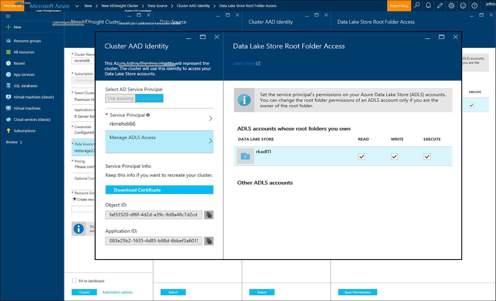

<properties
   pageTitle="Azure tallennustilan asetukset R palvelimen HDInsight (ennakkoversio) | Microsoft Azure"
   description="Lisätietoja eri tallennustilan käytettävissä olevat asetukset käyttäjille, R-palvelimen kanssa HDInsight (ennakkoversio)"
   services="HDInsight"
   documentationCenter=""
   authors="jeffstokes72"
   manager="jhubbard"
   editor="cgronlun"
/>

<tags
   ms.service="HDInsight"
   ms.devlang="R"
   ms.topic="article"
   ms.tgt_pltfrm="na"
   ms.workload="data-services"
   ms.date="09/01/2016"
   ms.author="jeffstok"
/>

# <a name="azure-storage-options-for-r-server-on-hdinsight-preview"></a>Azure tallennustilan asetukset R palvelimen HDInsight (ennakkoversio)

Microsoft R Server (ennakkoversio) HDInsight-käyttää sekä Azure-Blob-objektien ja [Azure järvi tietosäilö](https://azure.microsoft.com/services/data-lake-store/), pysyvä tiedot-koodia, maksuvälineenä aiheuttaa objektien Analysis ja niin edelleen.

Kun luot Hadoop-klusterin HDInsight, voit määrittää Azure-tallennustilan tilin. Tietyn Blob storage säilön kyseiseltä tililtä pitää tiedostojärjestelmän klusterin, voit luoda (esimerkiksi Hadoop Distributed File System). HDInsight-klusterin luodaan samaan data Centerissä ensisijainen tallennustilan-tili, voit määrittää suorituskyvyn parantamiseksi. Katso lisätietoja, [Käytä Azure-Blob-säiliö ja HDInsight](hdinsight-hadoop-use-blob-storage.md "käytön Azure-Blob-säiliö HDInsight kanssa").   


## <a name="use-multiple-azure-blob-storage-accounts"></a>Useita Azure Blob storage tilien käyttäminen

Tarvittaessa voit käyttää useita Azure tallennustilan asiakkaat- tai säilöjen HDI-klusterin. Voit tehdä haluat määrittää lisätallennustilaa tilit Käyttöliittymän, kun luot klusterin ja noudata sitten seuraavia ohjeita, jos niitä käytetään R.  

1.  Luoda HDInsight-klusterin **storage1** ja kutsua **container1**oletusarvon säilön tallennustilan tilin nimi.
2. Määritä lisätallennustilaa tili nimeltä **storage2**.  
3. / Share hakemiston mycsv.csv-tiedoston kopioiminen ja analysoida tiedostoon.  

    ````
    hadoop fs –mkdir /share
    hadoop fs –copyFromLocal myscsv.scv /share  
    ````

3.  R koodissa määritetty nimi-solmu **oletusarvon mukaan** ja määritä kansion ja käsitellä tiedostoa.  

    ````
    myNameNode <- "default"
    myPort <- 0
    ````

  Tietojen sijainti:  

    bigDataDirRoot <-"/ share"  

  Määritä ohjattu Laske yhteydessä:

    mySparkCluster <-RxSpark(consoleOutput=TRUE)

  Määritä Laske yhteydessä:

    rxSetComputeContext(mySparkCluster)

  Määritä Hadoop Distributed (HDFS)-järjestelmän tiedostojärjestelmän:

    hdfsFS <-RxHdfsFileSystem (hostName = myNameNode-portin = myPort)

  Määritä analysointiin HDFS-tiedostosta:

    Lähdetiedosto <-file.path(bigDataDirRoot,"mycsv.csv")

Kaikki hakemiston ja tiedoston viittaus osoittamalla tallennustilan tilin wasbs://container1@storage1.blob.core.windows.net. Tämä on **tallennustilan oletustilin** , johon on liitetty HDInsight-klusterin.

Oletetaan, käsiteltävä tiedosto nimeltä mySpecial.csv, joka sijaitsee /private **container2** **storage2**-hakemistoon.

Osoita **storage2** tallennustilan tilin nimi solmu viittaus R-koodisi.

    myNameNode <- "wasbs://container2@storage2.blob.core.windows.net"
    myPort <- 0

  Tietojen sijainti:

    bigDataDirRoot <- "/private"

  Määritä ohjattu Laske yhteydessä:

    mySparkCluster <- RxSpark(consoleOutput=TRUE, nameNode=myNameNode, port=myPort)

  Määritä Laske yhteydessä:

    rxSetComputeContext(mySparkCluster)

  Määritä HDFS tiedostojärjestelmässä:

    hdfsFS <- RxHdfsFileSystem(hostName=myNameNode, port=myPort)

  Määritä analysointiin HDFS-tiedostosta:

    inputFile <-file.path(bigDataDirRoot,"mySpecial.csv")

Kaikki hakemiston ja tiedoston viittaus nyt osoittamalla tallennustilan tilin wasbs://container2@storage2.blob.core.windows.net. Tämä on **Solmun nimi** , jonka olet määrittänyt.

Huomaa, että sinun on määritettävä/käyttäjä/RevoShare/<SSH username> hakemiston **storage2** seuraavasti:

    hadoop fs -mkdir wasbs://container2@storage2.blob.core.windows.net/user
    hadoop fs -mkdir wasbs://container2@storage2.blob.core.windows.net/user/RevoShare
    hadoop fs -mkdir wasbs://container2@storage2.blob.core.windows.net/user/RevoShare/<RDP username>

## <a name="use-an-azure-data-lake-store"></a>Käytä Azure tietojen järvi-säilö

Jos haluat käyttää tietojen järvi stores HDInsight-tilin, sinun täytyy klusterin tietosuojatasolla kunkin Azure tietojen järvi säilöön, jota haluat käyttää. Voit käyttää säilön R-komentosarja paljon kuin käytät toissijainen tallennusväline-tiliä (edellä kuvatun).

## <a name="add-cluster-access-to-your-azure-data-lake-stores"></a>Klusterin access lisääminen Azure tietojen järvi säilöt

Voit käyttää tietojen järvi kaupan Azure Active Directory (Azure AD)-palvelun lyhennys, johon on liitetty HDInsight-klusterin avulla.

### <a name="to-add-a-service-principal"></a>Jos haluat lisätä palvelun lyhennyksen.
1. Kun luot HDInsight-klusterin, valitse **Klusterin AAD käyttäjätiedot** **Tietolähde** -välilehti.
2. **Klusterin AAD tunnistetiedot** -valintaikkunassa **Valitse AD palvelun lyhennys**, valitse **Luo uusi**.

Kun Anna palvelun lyhennys nimi ja luoda salasanan, uusi välilehti avautuu kohtaa, johon voit liittää palvelun lyhennys tietojen järvi stores.

Huomaa, että voit myös lisätä Accessin tietojen järvi Store myöhemmin tietojen järvi myymälän avaamiseen Azure-portaalissa ja siirtymällä **Tietoresurssien** > **Access**.  Seuraavassa on esimerkki valintaikkuna, jossa kerrotaan, miten voit luoda palvelun lyhennys ja liittää sen "rkadl11" tietojen järvi kaupan.




## <a name="use-the-data-lake-store-with-r-server"></a>Käytä tietojen järvi säilön R-palvelimen kanssa
Kun olet antanut Accessin tietojen järvi säilöön, voit käyttää R Serverissä kaupan HDInsight toissijainen Azure-tallennustilan tilin tapaan. Ainoa ero on se, että etuliite **wasb: / /** muutoksista **adl: / /** seuraavasti:

````
# Point to the ADL store (e.g. ADLtest)
myNameNode <- "adl://rkadl1.azuredatalakestore.net"
myPort <- 0

# Location of the data (assumes a /share directory on the ADL account)
bigDataDirRoot <- "/share"  

# Define Spark compute context
mySparkCluster <- RxSpark(consoleOutput=TRUE, nameNode=myNameNode, port=myPort)

# Set compute context
rxSetComputeContext(mySparkCluster)

# Define HDFS file system
hdfsFS <- RxHdfsFileSystem(hostName=myNameNode, port=myPort)

# Specify the input file in HDFS to analyze
inputFile <-file.path(bigDataDirRoot,"AirlineDemoSmall.csv")

# Create factors for days of the week
colInfo <- list(DayOfWeek = list(type = "factor",
               levels = c("Monday", "Tuesday", "Wednesday", "Thursday",
                          "Friday", "Saturday", "Sunday")))

# Define the data source
airDS <- RxTextData(file = inputFile, missingValueString = "M",
                    colInfo  = colInfo, fileSystem = hdfsFS)

# Run a linear regression
model <- rxLinMod(ArrDelay~CRSDepTime+DayOfWeek, data = airDS)
````

Komennot, joita käytetään tietojen järvi-tallennustilan tilin määrittäminen RevoShare Directory-hakemistosta ja otoksen .csv-tiedoston lisääminen edellisessä esimerkissä ovat seuraavat:

````
hadoop fs -mkdir adl://rkadl1.azuredatalakestore.net/user
hadoop fs -mkdir adl://rkadl1.azuredatalakestore.net/user/RevoShare
hadoop fs -mkdir adl://rkadl1.azuredatalakestore.net/user/RevoShare/<user>

hadoop fs -mkdir adl://rkadl1.azuredatalakestore.net/share

hadoop fs -copyFromLocal /usr/lib64/R Server-7.4.1/library/RevoScaleR/SampleData/AirlineDemoSmall.csv adl://rkadl1.azuredatalakestore.net/share

hadoop fs –ls adl://rkadl1.azuredatalakestore.net/share
````

## <a name="use-azure-files-on-the-edge-node"></a>Reuna-solmu Azure tiedostojen käyttäminen

On myös helposti tietojen-tallennustilan-asetusten käyttöä varten, valitse reuna-solmu nimeltä [Azure tiedostot](../storage/storage-how-to-use-files-linux.md "Azure-tiedostoja"). Sen avulla voit ottaa käyttöön Azuren tallennustilaan tiedostoresurssin Linux-tiedostojärjestelmässä. Tämä on kätevä projektiin datatiedostot, R-komentosarjojen ja tuloksena-objekteja, jotka voivat olla tarpeen myöhemmin kun kannattaa käyttää alkuperäisen tiedostojärjestelmää reunan solmu HDFS sijaan.

Azure tiedostojen pää etuna on että jaettujen tiedostojen voidaan ottaa käyttöön ja käyttää järjestelmällä, jossa on tuettu OS, kuten Windows- tai Linux. Esimerkiksi se voidaan toiseen HDInsight-klusteriin, jossa on sinun tai jonkun työryhmän, Azure-AM tai edes paikalliseen järjestelmään.


## <a name="next-steps"></a>Seuraavat vaiheet

Nyt kun ymmärrät käyttämisestä SSH istunnosta R-konsolin ja miten voit luoda uuden HDInsight-klusterin, joka sisältää R-palvelin, tutustu muita tapoja HDInsight R-palvelimen käyttäminen on seuraavissa linkeissä avulla.

- [Yleistä R HDInsight-palvelimelle](hdinsight-hadoop-r-server-overview.md)
- [Hadoop R-palvelimelle käytön aloittaminen](hdinsight-hadoop-r-server-get-started.md)
- [Lisää RStudio palvelin HDInsight premium](hdinsight-hadoop-r-server-install-r-studio.md)
- [Laske kontekstin asetukset R palvelimen Hdinsightiin](hdinsight-hadoop-r-server-compute-contexts.md)
