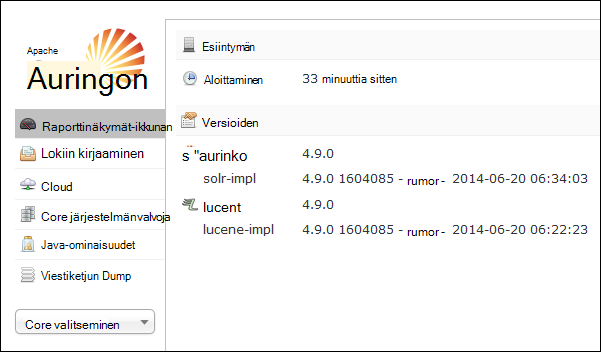
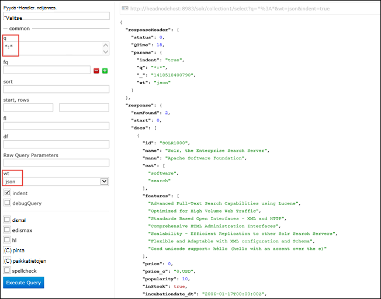

<properties
    pageTitle="Komentosarja-toiminnon avulla voit asentaa Solr Linux-pohjaiset HDInsight | Microsoft Azure"
    description="Opettele Solr asentaminen Linux-pohjaiset HDInsight Hadoop klustereiden komentosarja-toimintojen käyttäminen."
    services="hdinsight"
    documentationCenter=""
    authors="Blackmist"
    manager="jhubbard"
    editor="cgronlun"
    tags="azure-portal"/>

<tags
    ms.service="hdinsight"
    ms.workload="big-data"
    ms.tgt_pltfrm="na"
    ms.devlang="na"
    ms.topic="article"
    ms.date="10/03/2016"
    ms.author="larryfr"/>

# Asentaminen ja käyttäminen Solr HDInsight Hadoop klustereiden

Tässä ohjeaiheessa kerrotaan Solr asentamisesta Azure Hdinsightiin komentosarja-toiminnon avulla. Solr on tehokas haku-ympäristö, ja annetaan yritystason hakuominaisuuksia hallitsee Hadoop tiedot. Kun olet asentanut Solr HDInsight-klusterissa, myös opit tietojen hakua käyttämällä Solr.

> [AZURE.NOTE] Tässä asiakirjassa vaiheet pätevät Linux-pohjaiset HDInsight-klusterin. Lisätietoja Solr käyttämisestä Windows-pohjaisesta klusterin on artikkelissa [asentaminen ja käyttäminen Solr-HDinsight Hadoop varausyksiköt (Windows)](hdinsight-hadoop-solr-install.md)

Tämän artikkelin käytetty mallikomentosarja Luo Solr-klusterin tietty määritys. Jos haluat määrittää Solr-klusterin eri sivustokokoelmat, shards, mallit, replikoiden, jne., Solr binaaritiedostot ja komentosarja on muokattava vastaavasti.

## Mikä on Solr?

[Apache Solr](http://lucene.apache.org/solr/features.html) on enterprise-haku-ympäristö, jonka avulla tehokas tietojen teksti-haku. Kun Hadoop mahdollistaa tallentaminen ja hallinta suuria määriä tietoja, Apache Solr on hakutoimintojen nopeasti tietojen hakemiseen. Tämä artikkeli sisältää ohjeita siitä, miten voit mukauttaa HDInsight-klusterin asentaminen Solr.

> [AZURE.WARNING] Osien HDInsight-klusterin mukana tuetaan täysin ja Microsoft Support auttavat eristämään ja ratkaista ongelmat, jotka liittyvät komponentit.
>
> Mukautettujen osien, kuten Solr, saavat järkevän tukea helpottavat edelleen ongelman vianmäärityksen. Tämä saattaa aiheuttaa ratkaisemiseksi tai sinulta kysytään, haluatko osallistuminen käytettävissä olevat kanavat Avaa lähde-tekniikoiden laaja osaamisalueet, tekniikkaa löytyi. Esimerkiksi ovat yhteisön sivustoja, joita voidaan käyttää, kuten: [HDInsight MSDN-keskustelupalsta](https://social.msdn.microsoft.com/Forums/azure/en-US/home?forum=hdinsight), [http://stackoverflow.com](http://stackoverflow.com). Myös Apache projektien on projektisivustojen [http://apache.org](http://apache.org), esimerkiksi: [Hadoop](http://hadoop.apache.org/).

## Komentosarjan mitä

Tämä komentosarja tekee HDInsight-klusterin seuraavat muutokset:

* Asentaa Solr tuominen`/usr/hdp/current/solr`
* Luo uusi käyttäjä, __solrusr__, jolla voidaan suorittaa Solr-palvelu
* Määrittää __solruser__ omistajaksi`/usr/hdp/current/solr`
* Lisää [Upstart](http://upstart.ubuntu.com/) -määrityksen, joka alkaa Solr, jos klusterisolmu käynnistyy. Solr myös käynnistyy automaattisesti klusterin solmuissa asennuksen jälkeen

## Asenna Solr komentosarja-toimintojen käyttäminen

Esimerkki komentosarjan Solr asennetaan HDInsight-klusterin on käytettävissä seuraavassa sijainnissa.

    https://hdiconfigactions.blob.core.windows.net/linuxsolrconfigactionv01/solr-installer-v01.sh

Tässä osassa on ohjeet käyttämisestä komentosarjan, kun luot uuden klusterin Azure-portaalissa. 

> [AZURE.NOTE] Azure PowerShell, Azure-CLI, HDInsight .NET SDK tai Azure Resurssienhallinta malleja myös voidaan lisätä komentosarjatoiminnot. Voit myös käyttää komentosarjatoiminnot klustereiden jo käytössä. Lisätietoja on artikkelissa [mukauttaminen HDInsight klustereiden komentosarjan toimintojen](hdinsight-hadoop-customize-cluster-linux.md).

1. Käynnistä valmistelu klusteri [valmisteleminen Linux-pohjaiset HDInsight](hdinsight-hadoop-create-linux-clusters-portal.md)klustereissa ohjeiden mukaisesti, mutta älä tee valmistelu.

2. Valitse **Vaihtoehtoinen määritys** -sivu **Komentosarjatoiminnot**ja anna seuraavat tiedot:

    * __Nimi__: Kirjoita kutsumanimi komentosarja-toiminnon.
    * __KOMENTOSARJAN URI__: https://hdiconfigactions.blob.core.windows.net/linuxsolrconfigactionv01/solr-installer-v01.sh
    * __HEAD__: Valitse tämä vaihtoehto
    * __Työntekijän__: Valitse tämä vaihtoehto
    * __ZOOKEEPER__: Valitse tämä vaihtoehto, jos asennetaan Zookeeper-solmu
    * __Parametrit__: Jätä tämä kenttä tyhjäksi

3. **Komentosarjatoiminnot**alareunassa Tallenna kokoonpano **valinta** -painikkeen avulla. Lopuksi painikkeella **Valitse** **Vaihtoehtoinen määritys** -sivu alareunassa Tallenna valinnainen kokoonpanotietoja.

4. Jatka valmistelu klusterin kuvatulla tavalla [säännöstä Linux-pohjaiset HDInsight klustereiden](hdinsight-hadoop-create-linux-clusters-portal.md).

## Miten Solr käytetään HDInsight?

### Indeksoinnin tiedot

On aloitettava indeksoinnin Solr tietojen joidenkin tiedostojen kanssa. Voit käyttää Solr suorittaa hakuja indeksoidut tiedot. Seuraavien vaiheiden avulla voit lisätä joitakin esimerkkitietoja Solr ja tehdä kyselyjä:

1. Yhdistä käyttäen SSH HDInsight-klusterin:

        ssh USERNAME@CLUSTERNAME-ssh.azurehdinsight.net

    Lisätietoja HDInsight SSH käyttämisestä on seuraavissa artikkeleissa:

    * [Linux-pohjaiset Hadoop HDInsight Linux, Unix tai OS X-SSH käyttäminen](hdinsight-hadoop-linux-use-ssh-unix.md)

    * [SSH käyttäminen Linux-pohjaiset Hadoop-HDInsight Windows](hdinsight-hadoop-linux-use-ssh-windows.md)

    > [AZURE.IMPORTANT] Vaiheet jäljempänä tässä asiakirjassa-tilaan muodostaa SSL-tunnelin Solr web-Käyttöliittymä. Jotta voit käyttää näitä ohjeita, on SSL-tunnelia muodostaa ja määritä sitten selaimen sitä käytetään.
    >
    > Katso lisätietoja, [Käytä SSH Tunneling käyttämään Ambari web-Käyttöliittymä, Resurssienhallinta, JobHistory, NameNode, Oozie, ja muut web-Käyttöliittymä 's](hdinsight-linux-ambari-ssh-tunnel.md)

2. On Solr indeksi mallitiedot käyttää seuraavia komentoja:

        cd /usr/hdp/current/solr/example/exampledocs
        java -jar post.jar solr.xml monitor.xml

    Näkyviin tulee seuraava tulos konsolissa:

        POSTing file solr.xml
        POSTing file monitor.xml
        2 files indexed.
        COMMITting Solr index changes to http://localhost:8983/solr/update..
        Time spent: 0:00:01.624

    Post.jar-apuohjelman indeksoi Solr kahden otoksen asiakirjoja, **solr.xml** ja **monitor.xml**. Nämä tallennetaan __collection1__ Solr kuluessa.

3. Kyselyn Solr näyttämiä REST-Ohjelmointirajapinnalla käyttämällä seuraavaa:

        curl "http://localhost:8983/solr/collection1/select?q=*%3A*&wt=json&indent=true"

    Tämä ongelmat kysely __collection1__ varten asiakirjoja, jotka vastaavat __ \*:\* __ (koodattu \*3 % a\* kyselymerkkijonon,) ja vastaus palautettavan JSON nimellä. Vastauksen pitäisi näyttää seuraavankaltaiselta:

            "response": {
                "numFound": 2,
                "start": 0,
                "maxScore": 1,
                "docs": [
                  {
                    "id": "SOLR1000",
                    "name": "Solr, the Enterprise Search Server",
                    "manu": "Apache Software Foundation",
                    "cat": [
                      "software",
                      "search"
                    ],
                    "features": [
                      "Advanced Full-Text Search Capabilities using Lucene",
                      "Optimized for High Volume Web Traffic",
                      "Standards Based Open Interfaces - XML and HTTP",
                      "Comprehensive HTML Administration Interfaces",
                      "Scalability - Efficient Replication to other Solr Search Servers",
                      "Flexible and Adaptable with XML configuration and Schema",
                      "Good unicode support: héllo (hello with an accent over the e)"
                    ],
                    "price": 0,
                    "price_c": "0,USD",
                    "popularity": 10,
                    "inStock": true,
                    "incubationdate_dt": "2006-01-17T00:00:00Z",
                    "_version_": 1486960636996878300
                  },
                  {
                    "id": "3007WFP",
                    "name": "Dell Widescreen UltraSharp 3007WFP",
                    "manu": "Dell, Inc.",
                    "manu_id_s": "dell",
                    "cat": [
                      "electronics and computer1"
                    ],
                    "features": [
                      "30\" TFT active matrix LCD, 2560 x 1600, .25mm dot pitch, 700:1 contrast"
                    ],
                    "includes": "USB cable",
                    "weight": 401.6,
                    "price": 2199,
                    "price_c": "2199,USD",
                    "popularity": 6,
                    "inStock": true,
                    "store": "43.17614,-90.57341",
                    "_version_": 1486960637584081000
                  }
                ]
              }

### Solr Raporttinäkymät-ikkunan avulla

Solr Raporttinäkymät-ikkunan on sivuston Käyttöliittymä, jossa voit käsitellä Solr selaimen kautta. Solr Raporttinäkymät-ikkunan ei näy suoraan HDInsight-klusterin Internet-, mutta se on voi käyttää SSH tunnelin. Katso lisätietoja käyttämisestä SSH tunnelin [Käyttö SSH Tunneling käyttämään Ambari web-Käyttöliittymä, Resurssienhallinta, JobHistory, NameNode, Oozie, ja muut web-Käyttöliittymä 's](hdinsight-linux-ambari-ssh-tunnel.md)

Kun olet muodostanut SSH tunnelin, käytä Solr Raporttinäkymät-ikkunan seuraavien vaiheiden avulla:

1. Määritä ensisijainen headnode isäntänimi:

    1. SSH avulla voit muodostaa yhteyttä klusterin porttiin 22. Esimerkiksi `ssh USERNAME@CLUSTERNAME-ssh.azurehdinsight.net` jossa __käyttäjänimi__ on SSH käyttäjänimi ja __CLUSTERNAME__ on yhteyttä klusterin nimen.

        Lisätietoja SSH käyttämisestä on artikkelissa seuraavat asiakirjat:

        * [SSH käyttäminen Linux-pohjaiset HDInsight Linux-, Unix- tai Mac OS X-asiakasohjelma](hdinsight-hadoop-linux-use-ssh-unix.md)

        * [Windows-asiakasohjelmassa Linux-pohjaiset HDInsight SSH käyttäminen](hdinsight-hadoop-linux-use-ssh-windows.md)
    
    3. Käytä seuraavaa komentoa saat täydellinen isäntänimi:

            hostname -f

        Tämä palauttaa nimi seuraavankaltaiselta:

            hn0-myhdi-nfebtpfdv1nubcidphpap2eq2b.ex.internal.cloudapp.net
    
        Tämä on isäntänimi, jota käytetään alla kuvatulla tavalla.
    
1. Selaimella yhdistäminen __http://HOSTNAME:8983/solr / #/__, jossa __ISÄNTÄNIMI__ on aiemmissa vaiheissa määritetään nimi. 

    Pyyntö reititetään SSH tunnelissa pään solmun HDInsight-klusterin. Näyttöön tulee sivu, joka on seuraavankaltaiselta:

    

2. Vasemmassa ruudussa Valitse **collection1** **Core valitseminen** avattavan luettelon avulla. Useita tapahtumia olisi ne näkyvät __collection1__alapuolella.

3. Valitse __kyselyn__alla __collection1__tapahtumat. Käytä seuraavia arvoja täytä haun sivulle:

    * Kirjoita **q** -tekstiruutuun ** \*:**\*. Tämä palauttavat kaikki tiedostot, jotka on indeksoitu Solr. Jos haluat etsiä tietyn merkkijonossa asiakirjat, voit syöttää kyseisen merkkijonon.

    * Valitse **wt** teksti-ruutuun muodossa. Oletusarvo on **json**.

    Valitse-haun pate alareunassa **Suorittaa kyselyä** -painike.

    

    Tulosteen palauttaa kahden asiakirjoja, jotka on käytetty indeksoinnin Solr. Tulos näyttää jotakuinkin seuraavasti:

            "response": {
                "numFound": 2,
                "start": 0,
                "maxScore": 1,
                "docs": [
                  {
                    "id": "SOLR1000",
                    "name": "Solr, the Enterprise Search Server",
                    "manu": "Apache Software Foundation",
                    "cat": [
                      "software",
                      "search"
                    ],
                    "features": [
                      "Advanced Full-Text Search Capabilities using Lucene",
                      "Optimized for High Volume Web Traffic",
                      "Standards Based Open Interfaces - XML and HTTP",
                      "Comprehensive HTML Administration Interfaces",
                      "Scalability - Efficient Replication to other Solr Search Servers",
                      "Flexible and Adaptable with XML configuration and Schema",
                      "Good unicode support: héllo (hello with an accent over the e)"
                    ],
                    "price": 0,
                    "price_c": "0,USD",
                    "popularity": 10,
                    "inStock": true,
                    "incubationdate_dt": "2006-01-17T00:00:00Z",
                    "_version_": 1486960636996878300
                  },
                  {
                    "id": "3007WFP",
                    "name": "Dell Widescreen UltraSharp 3007WFP",
                    "manu": "Dell, Inc.",
                    "manu_id_s": "dell",
                    "cat": [
                      "electronics and computer1"
                    ],
                    "features": [
                      "30\" TFT active matrix LCD, 2560 x 1600, .25mm dot pitch, 700:1 contrast"
                    ],
                    "includes": "USB cable",
                    "weight": 401.6,
                    "price": 2199,
                    "price_c": "2199,USD",
                    "popularity": 6,
                    "inStock": true,
                    "store": "43.17614,-90.57341",
                    "_version_": 1486960637584081000
                  }
                ]
              }

### Aloitus- ja Solr pysäyttäminen

Jos haluat pysäyttää tai käynnistää Solar manuaalisesti, käytä seuraavia komentoja:

    sudo stop solr

    sudo start solr

## Indeksoidut varmuuskopiotiedot

Hyvä käytäntö on Varmuuskopioi indeksoidut tiedot-sivulle Azure-Blob-säiliö Solr klusterisolmut. Seuraavien toimien tarvittaessa:

1. Yhteyden muodostaminen käyttämällä SSH klusterin ja sitten seuraavalla komennolla isännän nimen pään solmun:

        hostname -f
        
2. Seuraavat avulla voit luoda tilannevedoksen indeksoidut tiedot. Vaihda __HOSTNAME__ palauttama edellisen komennon nimi:

        curl http://HOSTNAME:8983/solr/replication?command=backup

    Pitäisi näkyä vastausta seuraavasti:

        <?xml version="1.0" encoding="UTF-8"?>
        <response>
          <lst name="responseHeader">
            <int name="status">0</int>
            <int name="QTime">9</int>
          </lst>
          <str name="status">OK</str>
        </response>

2. Muuta seuraavaksi __/usr/hdp/current/solr/example/solr__kansioita. Ole tässä alikansion kunkin keräämistä varten. Kunkin sivustokokoelman hakemisto sisältää __datakansiossa, joka on, että tilannevedoksen missä__ sijaitsee.

    Esimerkiksi jos käytit vaiheet aiemmin indeksoida otoksen asiakirjat, __/usr/hdp/current/solr/example/solr/collection1/data__ -kansion pitäisi nyt näkyä hakemiston __tilannevedoksen. ###__ # nollien sijainti päivämäärän ja kellonajan tilannevedoksen.

3. Luo pakattu arkisto tilannevedoksen kansion komennolla seuraavankaltaiselta:

        tar -zcf snapshot.20150806185338855.tgz snapshot.20150806185338855

    Tämä luo uuden arkisto, nimeltä __snapshot.20150806185338855.tgz__, joka sisältää __snapshot.20150806185338855__ -kansion sisältö.

3. Voit tallentaa sitten arkisto klusterin ensisijainen säilöön käyttämällä seuraava komento:

    hadoop fs - copyFromLocal snapshot.20150806185338855.tgz/Esimerkki/tiedot

    > [AZURE.NOTE] Haluat ehkä projektiin Solr tilannevedoksia erillinen hakemiston luominen. Esimerkiksi `hadoop fs -mkdir /solrbackup`.

Lisätietoja Solr varmuuskopiointi- ja palauttaa käsittelemisestä on artikkelissa [tekeminen ja SolrCores varmuuskopioista palauttaminen](https://cwiki.apache.org/confluence/display/solr/Making+and+Restoring+Backups+of+SolrCores).

## Katso myös

- [Asentaminen ja käyttäminen sävyä HDInsight-klusterit](hdinsight-hadoop-hue-linux.md). Värisävy on sivuston Käyttöliittymä, joka on helppo luoda, suorittaa ja Tallenna Possu ja rakenteen työt sekä oman HDInsight Selaa oletusarvo-tallennustilan klusterin.

- [R asentaminen HDInsight klustereiden][hdinsight-install-r]. Klusterin mukauttaminen avulla voit asentaa R HDInsight Hadoop klustereiden. R on Avaa lähde ja tilastollisia tietojenkäsittely ympäristössä. Se on satoja valmiin tilastolliset funktiot ja oma ohjelmointikieli, joka yhdistää toiminnalliset ja Käytä olio-ohjelmoinnin ominaisuuksia. Se sisältää myös monipuolisia graafisia ominaisuuksia.

- [Asenna Giraph-HDInsight klustereiden](hdinsight-hadoop-giraph-install-linux.md). Klusterin mukauttaminen avulla voit asentaa Giraph HDInsight Hadoop klustereiden. Giraph voit suorittaa käsittelyn käyttämällä Hadoop graph ja Azure Hdinsightiin kanssa voidaan käyttää.

- [Asenna värisävy-HDInsight klustereiden](hdinsight-hadoop-hue-linux.md). Klusterin mukauttaminen avulla voit asentaa sävyä HDInsight Hadoop klustereiden. Värisävy on käytettävä Hadoop-klusterin käsitellä Web-sovellusten.

[hdinsight-install-r]: hdinsight-hadoop-r-scripts-linux.md
[hdinsight-cluster-customize]: hdinsight-hadoop-customize-cluster-linux.md
