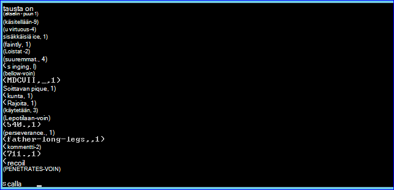
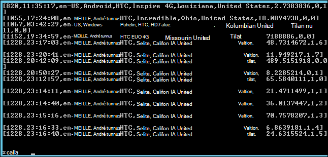

<properties
    pageTitle="Komentosarja-toiminnon avulla voit asentaa ohjattu Hadoop-klusterin | Microsoft Azure"
    description="Opettele mukauttamaan ohjattu käyttämällä komentosarja-toiminnon kanssa HDInsight-klusterin."
    services="hdinsight"
    documentationCenter=""
    authors="nitinme"
    manager="jhubbard"
    editor="cgronlun"/>

<tags
    ms.service="hdinsight"
    ms.workload="big-data"
    ms.tgt_pltfrm="na"
    ms.devlang="na"
    ms.topic="article"
    ms.date="02/05/2016"
    ms.author="nitinme"/>

# Asentaminen ja käyttäminen ohjattu HDInsight Hadoop klustereiden komentosarja-toiminnon käyttäminen

> [AZURE.IMPORTANT] Tässä artikkelissa on nyt poistettu. Hdinsightista on nyt ohjattu Windows-pohjaisesta klustereiden, mikä tarkoittaa voit nyt suoraan luoda Ohjattu klusterin muuttamatta komentosarja-toiminnon käyttäminen Hadoop-klusterin pääosin klusterin tyypiksi. Käytä Ohjattu klusterin tyyppi, sisältämistä HDInsight-versiota 3.2 klusterin ohjattu 1.3.1 versio.  Asenna ohjattu eri versioita, voit käyttää komentosarja-toiminnon. Hdinsightista on esimerkki komentosarja-toiminnon komentosarjan.

Katso ohjattu asentamisesta Windows-pohjaisten HDInsight komentosarja-toiminnon avulla ja suorittamisesta ohjattu kyselyjen HDInsight klusterit.

**Aiheeseen liittyviä artikkeleita**

- [Luo Hadoop varausyksiköt HDInsight](hdinsight-provision-clusters.md): yleisiä tietoja HDInsight klustereiden luomisesta.

- [Apache ohjattu HDInsight-käytön aloittaminen](hdinsight-apache-spark-jupyter-spark-sql.md): Ohjattu HDInsight-klusterin luominen.

- [Mukauta HDInsight-klusterin komentosarja-toiminnon käyttäminen][hdinsight-cluster-customize]: yleisiä tietoja mukauttamisesta HDInsight klustereiden komentosarja-toiminnon avulla.

- [Kehittää komentosarja-toiminnon komentosarjojen Hdinsightista](hdinsight-hadoop-script-actions.md).

## Mikä ohjattu?

<a href="http://spark.apache.org/docs/latest/index.html" target="_blank">Apache ohjattu</a> on käsittelyn framework, joka tukee ladatun käsittelyn edistää big datasta analyyttisten sovellusten suorituskykyä Avaa lähde-rinnakkain. Ohjattu päivän ladatun laskenta ominaisuuksia Varmista on hyvä iteratiivinen algoritmien koneen opiskelu- ja kaavion funktiolauseita.

Ohjattu voidaan myös tavalliseen levylle tietojen käsittely suorittavan. Ohjattu parantaa perinteinen MapReduce framework välttäminen kirjoituksia levylle keskitason vaiheisiin. Ohjattu on myös Hadoop Distributed (HDFS)-järjestelmän ja Azure Blob storage-yhteensopiva, joten olemassa olevia tietoja voidaan käsitellä helposti ohjattu kautta.

Tämä artikkeli sisältää ohjeita siitä, miten voit mukauttaa HDInsight-klusterin asentaminen ohjattu.

## Asenna ohjattu Azure-portaalissa

Esimerkki komentosarjan ohjattu asennetaan HDInsight-klusterin on käytettävissä vain luku-Azure tallennustilan Blob-objektien [https://hdiconfigactions.blob.core.windows.net/sparkconfigactionv03/spark-installer-v03.ps1](https://hdiconfigactions.blob.core.windows.net/sparkconfigactionv03/spark-installer-v03.ps1)-palvelussa. Tämä komentosarja asentaa ohjattu 1.2.0 tai ohjattu 1.0.2 HDInsight-klusterin, voit luoda version mukaan.

- Jos käytät komentosarja **HDInsight 3,2** -klusterin luomisen aikana, se asentaa **Ohjattu 1.2.0**.
- Jos käytät komentosarja **HDInsight 3.1** -klusterin luomisen aikana, se asentaa **Ohjattu 1.0.2**.

Voit muokata tätä komentosarjaa tai muiden ohjattu-versioiden asentaminen oman komentosarjan luominen.

> [AZURE.NOTE] Esimerkki komentosarja toimii vain HDInsight 3.1 ja 3.2 klustereiden. Katso lisätietoja HDInsight-klusterin versioissa, [HDInsight-klusterin versiot](hdinsight-component-versioning.md).

1. Aloita luominen klusterin valitsemalla **Luo mukautettu** -vaihtoehdon, [Luo Hadoop varausyksiköt HDInsight](hdinsight-provision-clusters.md#portal)-palvelussa kuvatulla. Valitse klusterin-version mukaan seuraavasti:

    - Jos haluat asentaa **Ohjattu 1.2.0**, Luo HDInsight-3,2-klusterin.
    - Jos haluat asentaa **Ohjattu 1.0.2**, luoda HDInsight 3.1-klusterin.

2. Valitse ohjatun toiminnon **Komentosarjatoiminnot** -sivulla tietojen näyttäminen komentosarja-toiminnon **lisääminen komentosarja-toiminnon** , alla kuvatulla tavalla:

    ![Käytä komentosarja-toiminnon klusterin mukauttamiseen] (./media/hdinsight-hadoop-spark-install/HDI.CustomProvision.Page6.png "Käytä komentosarja-toiminnon klusterin mukauttamiseen")

    <table border='1'>
        <tr><th>Ominaisuus</th><th>Arvo</th></tr>
        <tr><td>Nimi</td>
            <td>Määritä komentosarja-toiminnon nimi. Esimerkiksi <b>Ohjattu asennus</b>.</td></tr>
        <tr><td>Komentosarjan URI</td>
            <td>Määritä-tunniste URI (Uniform Resource) komentosarjan, joka suoritetaan klusterin mukauttamiseen. Esimerkiksi <i>https://hdiconfigactions.blob.core.windows.net/sparkconfigactionv03/spark-installer-v03.ps1</i></td></tr>
        <tr><td>Solmutyyppi</td>
            <td>Määritä solmujen, jossa mukauttaminen komentosarja suoritetaan. Voit valita <b>kaikki solmut</b>, <b>vain Head solmujen</b>tai <b>vain työntekijä solmujen</b>.
        <tr><td>Parametrit</td>
            <td>Määrittää parametreja, jos vaatii komentosarja. Asenna ohjattu komentosarja ei tarvita parametreja, joten voit jättää tämän tyhjäksi.</td></tr>
    </table>

    Voit lisätä useita komentosarja-toiminnon asentamisesta klusterin useita osia. Kun olet lisännyt komentosarjat, napsauta Aloita klusterin luominen valintamerkkiä.

Voit myös asentaa ohjattu HDInsight käyttämällä tai PowerShellin Azure Hdinsightiin .NET SDK komentosarja. Ohjeet näitä ohjeita on tämän artikkelin.

## Ohjattu käyttäminen Hdinsightiin
Ohjattu sisältää API Scala, Python ja Java. Voit myös suorittaa ohjattu kyselyjä vuorovaikutteinen ohjattu-käyttöliittymä. Tässä osassa on ohjeet käyttämisestä eri tavoista ohjattu käyttöä varten:

- [Ohjattu-liittymän avulla voit suorittaa vuorovaikutteinen kyselyt](#sparkshell)
- [Suorita ohjattu SQL-kyselyjä ohjattu-liittymän avulla](#sparksql)
- [Käytä erillinen Scala ohjelma](#standalone)

###Ohjattu-liittymän avulla voit suorittaa vuorovaikutteinen kyselyt
Seuraavien toimien suorittaminen ohjattu kyselyjen vuorovaikutteinen ohjattu-käyttöliittymä. Tässä osassa on suorittaa ohjattu kyselyn mallitiedosto (/ example/data/gutenberg/davinci.txt), joka on oletusarvoisesti klustereiden Hdinsightista.

1. Azure-portaalista käyttöön luomasi ohjattu asennettu ja sitten etäyhteyksien kyselyjä klusterin klusterin etätyöpöydän kautta. Ohjeita on artikkelissa [etäyhteyden muodostaminen HDInsight klustereiden RDP avulla](hdinsight-administer-use-management-portal.md#rdp).

2. Avaa Hadoop komentoriviltä (-pikakuvakkeen työpöydälle) Remote Desktop Protocol (RDP)-istunnon työpöydältä, ja siirry sijaintiin, johon on asennettu ohjattu; esimerkiksi **C:\apps\dist\spark-1.2.0**.

3. Suorita seuraava komento Käynnistä ohjattu runko:

         .\bin\spark-shell --master yarn

    Kun komento on päättynyt, saat Scala kehote:

         scala>

5. Kirjoita alla Ohjattu kyselyn Scala niitä pyydettäessä. Tämä kysely laskee kunkin davinci.txt-tiedosto, joka on käytettävissä sijainnissa/Esimerkki/tietojen/gutenberg /-klusterin liittyvät Azure-Blob-säiliö sanan esiintymien.

        val file = sc.textFile("/example/data/gutenberg/davinci.txt")
        val counts = file.flatMap(line => line.split(" ")).map(word => (word, 1)).reduceByKey(_ + _)
        counts.toArray().foreach(println)

6. Tulosteen pitäisi näyttää seuraavankaltaiselta:

    

7. Kirjoita: q Lopeta Scala kehotteen.

        :q

###Suorita ohjattu SQL-kyselyjä ohjattu-liittymän avulla

Ohjattu SQL avulla voit käyttää Ohjattu relaatio kyselyt Structured Query Language (SQL), HiveQL tai Scala ilmaistuna. Tässä osassa on Tarkista ohjattu avulla voit suorittaa rakenteen kyselyn rakenne-mallitaulukkoa. Käytetään tässä osassa (eli **hivesampletable**) rakennetaulukko on oletusarvon mukaan käytettävissä, kun luot klusterin.

>[AZURE.NOTE] Esimerkki alla on luotu vastaan **tiedostojen 1.2.0**, johon on asennettu, jos suoritat luotaessa HDInsight 3,2 klusterin komentosarja-toiminnon.

1. Azure-portaalista käyttöön luomasi ohjattu asennettu ja sitten etäyhteyksien kyselyjä klusterin klusterin etätyöpöydän kautta. Ohjeita on artikkelissa [etäyhteyden muodostaminen HDInsight klustereiden RDP avulla](hdinsight-administer-use-management-portal.md#rdp).

2. Avaa Hadoop komentorivin (-pikakuvakkeen työpöydälle) RDP-istunnon työpöydältä, ja siirry sijaintiin, johon on asennettu ohjattu; esimerkiksi **C:\apps\dist\spark-1.2.0**.

3. Suorita seuraava komento Käynnistä ohjattu runko:

         .\bin\spark-shell --master yarn

    Kun komento on päättynyt, saat Scala kehote:

         scala>

4. Määritä Scala kehotettaessa rakenteen yhteydessä. Tämä on pakollinen käyttämällä Ohjattu rakenteen kyselyt-käyttöä varten.

        val hiveContext = new org.apache.spark.sql.hive.HiveContext(sc)

    Huomaa, että **sc** ohjattu oletussijainnin, joka on määritetty, kun käynnistät ohjattu shell.

5. Suorita rakenteen kyselyn rakenne yhteydessä käyttämällä ja tulostustapa konsoliin. Kyselyn noutaa tiedot tietyn luovan laitteissa, ja rajoittaa noudettu 20 tietueiden määrän.

        hiveContext.sql("""SELECT * FROM hivesampletable WHERE devicemake LIKE "HTC%" LIMIT 20""").collect().foreach(println)

6. Pitäisi näkyä tulos seuraavalla tavalla:

    

7. Kirjoita: q Lopeta Scala kehotteen.

        :q

### Käytä erillinen Scala ohjelma

Tässä osassa on Kirjoita Scala sovellus, joka laskee rivimäärän, joka sisältää kirjaimet "a" ja "b" mallitietoja (/ example/data/gutenberg/davinci.txt), joka on oletusarvoisesti klustereiden Hdinsightista. Kirjoittaminen ja erillinen Scala ohjelma käyttämisestä klusterin ohjattu asennus on mukautettu, on suoritettava seuraavat toimet:

- Kirjoita Scala-ohjelmasta
- Luo .jar tiedoston Scala-ohjelma
- Suorita työ klusterin

#### Kirjoita Scala-ohjelmasta
Tässä osassa voit kirjoittaa Scala ohjelmaan, joka laskee, kuinka monta riviä sisältävä "a" ja "b" tietojen mallitiedostossa.

1. Avaa tekstieditorissa ja liitä seuraava koodi:

        /* SimpleApp.scala */
        import org.apache.spark.SparkContext
        import org.apache.spark.SparkContext._
        import org.apache.spark.SparkConf

        object SimpleApp {
          def main(args: Array[String]) {
            val logFile = "/example/data/gutenberg/davinci.txt"         //Location of the sample data file on Azure Blob storage
            val conf = new SparkConf().setAppName("SimpleApplication")
            val sc = new SparkContext(conf)
            val logData = sc.textFile(logFile, 2).cache()
            val numAs = logData.filter(line => line.contains("a")).count()
            val numBs = logData.filter(line => line.contains("b")).count()
            println("Lines with a: %s, Lines with b: %s".format(numAs, numBs))
          }
        }

2. Tallenna tiedosto nimellä **SimpleApp.scala**.

#### Luo Scala-ohjelma
Tässä osassa voit <a href="http://www.scala-sbt.org/0.13/docs/index.html" target="_blank">Luoda yksinkertaisen työkalun</a> (tai sbt) luonnissa käytettävien Scala-ohjelman. SBT edellyttää Java 1,6 tai uudempi versio, joten varmista, että sinulla on asennettu ennen jatkamista tässä osassa Java oikean version.

1. Asenna sbt http://www.scala-sbt.org/0.13/tutorial/Installing-sbt-on-Windows.html.
2. Luo kansio nimeltä **SimpleScalaApp**ja kansion Luo tiedosto nimeltä **simple.sbt**. Tämä on kokoonpanotiedosto, joka sisältää tietoja Scala versio, kirjaston riippuvuudet jne. Liitä seuraava simple.sbt-tiedosto ja tallenna se:

        name := "SimpleApp"

        version := "1.0"

        scalaVersion := "2.10.4"

        libraryDependencies += "org.apache.spark" %% "spark-core" % "1.2.0"

    >[AZURE.NOTE] Varmista, että voit säilyttää tiedostossa tyhjät rivit.

3. **SimpleScalaApp** -kansion luominen kansion rakenteen **\src\main\scala** ja liitä Scala ohjelma (**SimpleApp.scala**) \src\main\scala-kansion aiemmin luotu.
4. Avaa komentorivi-ikkuna, siirry kansioon, SimpleScalaApp ja kirjoita seuraava komento:

        sbt package

    Kun sovellus käännetään, näkyviin tulee **simpleapp_2.10 1.0.jar** luodulla **\target\scala-2.10** hakemiston SimpleScalaApp pääkansio kuluessa.

#### Suorita työ klusterin
Tässä osassa voit remote kyselyjä, jotka on Ohjattu klusterin asennettu ja kopioi sitten SimpleScalaApp projektin kohdekansio. Lähetä klusterin työn käytä sitten **Ohjattu Lähetä** -komennon.

1. Etäyhteyksien kyselyjä, jotka on asennettu Ohjattu klusterin. Tietokoneesta, johon kirjoittamasi ja sisäisten SimpleApp.scala ohjelma kopioi **SimpleScalaApp\target** -kansio ja liitä se uuteen paikkaan klusterin.
2. Avaa Hadoop-komentoriviltä RDP-istunnon työpöydältä, ja siirry sijaintiin, johon liittämäsi **kohdekansio** .
3. Kirjoita SimpleApp.scala Suorita seuraava komento:

        C:\apps\dist\spark-1.2.0\bin\spark-submit --class "SimpleApp" --master local target/scala-2.10/simpleapp_2.10-1.0.jar

4. Kun ohjelma on päättynyt, tulos näkyy konsolissa.

        Lines with a: 21374, Lines with b: 11430

## Asenna ohjattu Azure PowerShellin avulla

Tässä osassa Käytämme käynnistää komentosarjoja komentosarja-toiminnon avulla voit mukauttaa klusterin **<a href = "http://msdn.microsoft.com/library/dn858088.aspx" target="_blank">Lisää AzureHDInsightScriptAction</a>** cmdlet-komento. Ennen kuin jatkat, varmista, että olet asentanut ja määrittänyt PowerShellin Azure. Lisätietoja Azure PowerShellin cmdlet-komennot käytettävien HDInsight työasemassa määrittämisestä on artikkelissa [asentaminen ja määrittäminen PowerShellin Azure](../powershell-install-configure.md).

Suorita seuraavat vaiheet:

1. Avaa PowerShellin Azure-ikkuna ja määritä seuraavat muuttujat:

        # Provide values for these variables
        $subscriptionName = "<SubscriptionName>"        # Name of the Azure subscription
        $clusterName = "<HDInsightClusterName>"         # HDInsight cluster name
        $storageAccountName = "<StorageAccountName>"    # Azure Storage account that hosts the default container
        $storageAccountKey = "<StorageAccountKey>"      # Key for the Storage account
        $containerName = $clusterName
        $location = "<MicrosoftDataCenter>"             # Location of the HDInsight cluster. It must be in the same data center as the Storage account.
        $clusterNodes = <ClusterSizeInNumbers>          # Number of nodes in the HDInsight cluster
        $version = "<HDInsightClusterVersion>"          # For example, "3.2"

2. Määritä määritysarvoja, kuten solmujen klusterin ja käytetään oletusarvon-tallennustilan.

        # Specify the configuration options
        Select-AzureSubscription $subscriptionName
        $config = New-AzureHDInsightClusterConfig -ClusterSizeInNodes $clusterNodes
        $config.DefaultStorageAccount.StorageAccountName="$storageAccountName.blob.core.windows.net"
        $config.DefaultStorageAccount.StorageAccountKey=$storageAccountKey
        $config.DefaultStorageAccount.StorageContainerName=$containerName

3. **Lisää AzureHDInsightScriptAction** cmdlet-komennon avulla voit lisätä komentosarja-toiminnon palvelinklusterin määritykset. Myöhemmin klusterin luotaessa komentosarja-toiminnon saa suorittaa.

        # Add a script action to the cluster configuration
        $config = Add-AzureHDInsightScriptAction -Config $config -Name "Install Spark" -ClusterRoleCollection HeadNode -Uri https://hdiconfigactions.blob.core.windows.net/sparkconfigactionv03/spark-installer-v03.ps1

    **Lisää AzureHDInsightScriptAction** cmdlet-komento tekee seuraavat parametrit:

    <table style="border-color: #c6c6c6; border-width: 2px; border-style: solid; border-collapse: collapse;">
    <tr>
    <th style="border-color: #c6c6c6; border-width: 2px; border-style: solid; border-collapse: collapse; width:90px; padding-left:5px; padding-right:5px;">Parametri</th>
    <th style="border-color: #c6c6c6; border-width: 2px; border-style: solid; border-collapse: collapse; width:550px; padding-left:5px; padding-right:5px;">Määritys</th></tr>
    <tr>
    <td style="border-color: #c6c6c6; border-width: 2px; border-style: solid; border-collapse: collapse; padding-left:5px;">Config</td>
    <td style="border-color: #c6c6c6; border-width: 2px; border-style: solid; border-collapse: collapse; padding-left:5px; padding-right:5px;">Mitä komentosarjan toimenpiteen tiedot on lisätty kokoonpano-objekti.</td></tr>
    <tr>
    <td style="border-color: #c6c6c6; border-width: 2px; border-style: solid; border-collapse: collapse; padding-left:5px;">Nimi</td>
    <td style="border-color: #c6c6c6; border-width: 2px; border-style: solid; border-collapse: collapse; padding-left:5px;">Komentosarja-toiminnon nimi.</td></tr>
    <tr>
    <td style="border-color: #c6c6c6; border-width: 2px; border-style: solid; border-collapse: collapse; padding-left:5px;">ClusterRoleCollection</td>
    <td style="border-color: #c6c6c6; border-width: 2px; border-style: solid; border-collapse: collapse; padding-left:5px;">Määrittää solmujen, jossa mukauttaminen komentosarja suoritetaan. Kelvolliset arvot ovat HeadNode (Jos haluat asentaa pään solmu) tai DataNode (Jos haluat asentaa kaikki tiedot solmut). Voit käyttää toisen tai molempien arvoja.</td></tr>
    <tr>
    <td style="border-color: #c6c6c6; border-width: 2px; border-style: solid; border-collapse: collapse; padding-left:5px;">URI</td>
    <td style="border-color: #c6c6c6; border-width: 2px; border-style: solid; border-collapse: collapse; padding-left:5px;">Määrittää komentosarjan, joka suoritetaan URI.</td></tr>
    <tr>
    <td style="border-color: #c6c6c6; border-width: 2px; border-style: solid; border-collapse: collapse; padding-left:5px;">Parametrit</td>
    <td style="border-color: #c6c6c6; border-width: 2px; border-style: solid; border-collapse: collapse; padding-left:5px;">Komentosarjan vaatii parametrit. Tämän artikkelin käytetty mallikomentosarja ei edellytä parametreja ja näin ollen ei ole näkyvissä yllä koodikatkelman tämä parametri.
    </td></tr>
    </table>

4. Käynnistä lopuksi luomalla mukautetun klusterin ohjattu asennettuna.  

        # Start creating a cluster with Spark installed
        New-AzureHDInsightCluster -Config $config -Name $clusterName -Location $location -Version $version

Kirjoita pyydettäessä klusterin tunnistetiedot. Voi kestää hetken, ennen kuin klusterin luodaan.

## Asenna ohjattu PowerShellin avulla

Katso [mukauttaminen HDInsight klustereiden komentosarja-toiminnon avulla](hdinsight-hadoop-customize-cluster.md#call_scripts_using_powershell).

## Asenna ohjattu .NET SDK: N avulla

Katso [mukauttaminen HDInsight klustereiden komentosarja-toiminnon avulla](hdinsight-hadoop-customize-cluster.md#call_scripts_using_azure_powershell).

## Katso myös

- [Luo Hadoop varausyksiköt HDInsight](hdinsight-provision-clusters.md): Luo HDInsight klustereiden.
- [Apache ohjattu HDInsight-käytön aloittaminen](hdinsight-apache-spark-jupyter-spark-sql.md): Ohjattu HDInsight-käytön aloittaminen.
- [Mukauta HDInsight-klusterin komentosarja-toiminnon käyttäminen][hdinsight-cluster-customize]: mukauttaminen HDInsight klustereiden komentosarja-toiminnon avulla.
- [Kehittää komentosarja-toiminnon komentosarjat HDInsight](hdinsight-hadoop-script-actions.md): komentosarja-toiminnon kehittämiseen.
- [R asentaminen HDInsight klustereiden] [ hdinsight-install-r] klusterin mukauttaminen avulla voit asentaa ja käyttää R HDInsight Hadoop klustereiden ohjeet. R on Avaa lähde ja tilastollisia tietojenkäsittely ympäristössä. Se on satoja valmiin tilastolliset funktiot ja oma ohjelmointikieli, joka yhdistää toiminnalliset ja Käytä olio-ohjelmoinnin ominaisuuksia. Se sisältää myös monipuolisia graafisia ominaisuuksia.
- [Asenna Giraph-HDInsight klustereiden](hdinsight-hadoop-giraph-install.md). Klusterin mukauttaminen avulla voit asentaa Giraph HDInsight Hadoop klustereiden. Giraph voit suorittaa käsittelyn käyttämällä Hadoop graph ja Azure Hdinsightiin kanssa voidaan käyttää.
- [Asenna Solr-HDInsight klustereiden](hdinsight-hadoop-solr-install.md). Klusterin mukauttaminen avulla voit asentaa Solr HDInsight Hadoop klustereiden. Solr avulla voit suorittaa toimintoja tehokas haku tallennettuja tietoja.

[hdinsight-provision]: hdinsight-provision-clusters.md
[hdinsight-install-r]: hdinsight-hadoop-r-scripts.md
[hdinsight-cluster-customize]: hdinsight-hadoop-customize-cluster.md
[powershell-install-configure]: powershell-install-configure.md
