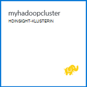

<properties
   pageTitle="Hadoop-opetusohjelma: käytön aloittaminen Windows Hadoop | Microsoft Azure"
   description="Aloittaminen Hadoop HDInsight. Lue, miten voit luoda Hadoop klustereiden Windows ja rakenteen kyselyn suorittaminen tietojen analysointi Excelin tulosteen."
   keywords="hadoop opetusohjelmassa hadoop Windows-klusterin hadoop tietoja hadoop-rakenne-kysely"
   services="hdinsight"
   documentationCenter=""
   authors="nitinme"
   manager="jhubbard"
   editor="cgronlun"
   tags="azure-portal"/>

<tags
   ms.service="hdinsight"
   ms.devlang="na"
   ms.topic="article"
   ms.tgt_pltfrm="na"
   ms.workload="big-data"
   ms.date="03/07/2016"
   ms.author="nitinme"/>

# Hadoop-opetusohjelma: Hadoop käyttämisestä Windows Hdinsightiin

> [AZURE.SELECTOR]
- [Linux-pohjaiset](../hdinsight-hadoop-linux-tutorial-get-started.md)
- [Windows-pohjaisesta](../hdinsight-hadoop-tutorial-get-started-windows.md)

Jotta näet lisätietoja Hadoop Windows ja HDInsight käytön aloittaminen Tässä opetusohjelmassa kerrotaan, miten rakenne kyselyn suorittaminen rakenteeton tietojen Hadoop-klusterin ja analysointi Microsoft Excelin tulokset.

>[AZURE.NOTE] Windows-pohjaisesta HDInsight klustereiden on tämän asiakirjan tiedot. Lisätietoja Linux-pohjaiset klustereiden on artikkelissa [Hadoop-opetusohjelma: Linux-pohjaiset Hadoop käyttämisestä HDInsight](hdinsight-hadoop-linux-tutorial-get-started.md).

Oletetaan, että sinulla on suuri tai rakenteeton tietojoukon ja haluat suorittaa kyselyn rakenne Pura kuvaava tietoja. Tämä on täsmälleen mistä on kyse voit tehdä tässä opetusohjelmassa. Näin miten tämä saavuttaa:

   !["Hadoop-opetusohjelma: Luo tili; Luo Hadoop-klusterin; Tee rakenne; kysely Analysoi tietoja Excelissä.][image-hdi-getstarted-flow]

Katso esittelyvideo Tässä opetusohjelmassa kerrotaan Hadoop-HDInsight:

![Videon ensimmäisen Hadoop-opetusohjelman: Lähetä rakenteen kyselyn Hadoop-klusterissa ja analysoiminen Excelissä.][img-hdi-getstarted-video]

**[Katso HDInsight YouTubessa Hadoop-opetusohjelma](https://www.youtube.com/watch?v=Y4aNjnoeaHA&list=PLDrz-Fkcb9WWdY-Yp6D4fTC1ll_3lU-QS)**

Microsoft toimittaa yhdessä Azure Hdinsightiin yleiseen käyttöön HDInsight emulointikone Azure-tunnettiin aiemmin nimellä *Microsoft HDInsight Developer esikatselu*. Emulaattori developer skenaariot on tarkoitettu ja tukee vain yhden solmun ominaisuuksissa. Lisätietoja HDInsight emulaattorin käyttämisestä on artikkelissa [HDInsight-emulaattorin käytön aloittaminen][hdinsight-emulator].

[AZURE.INCLUDE [delete-cluster-warning](../../includes/hdinsight-delete-cluster-warning.md)]

## Edellytykset

Ennen kuin aloitat, Hadoop Windows Tässä opetusohjelmassa, sinulla on oltava seuraavasti:

- **Azure-tilaus**. Katso [Hae Azure maksuttoman kokeiluversion](https://azure.microsoft.com/documentation/videos/get-azure-free-trial-for-testing-hadoop-in-hdinsight/).
- Office 2013 Professional Plus, Office 365 Pro Plus, Excel 2013: n erillisversio tai Office 2010 Professional Plus **A tietokoneeseen** .

### Access-ohjausobjektin vaatimukset

[AZURE.INCLUDE [access-control](../../includes/hdinsight-access-control-requirements.md)]

##Luo Hadoop klustereiden

Kun luot klusterin, voit luoda Azure Laske resurssit, jotka sisältävät Hadoop ja sovelluksista. Tässä osassa voit luoda HDInsight-versiota 3.2 klusterin. Voit myös luoda Hadoop klustereiden muut versiot. Katso ohjeet [luominen HDInsight klustereiden käyttämällä mukautettuja asetuksia][hdinsight-provision]. Katso tietoja HDInsight-versioista ja niiden palvelutasosopimuksia [HDInsight osan versiotiedot](hdinsight-component-versioning.md).

**Hadoop-klusterin luominen**

1. Kirjautuminen [Azure Portal](https://portal.azure.com/).
2. **Uusi**ja valitsemalla **Tiedot Analytics** **Hdinsightista**. Portaalin Avaa **Uuden HDInsight-klusterin** -sivu.

    ![Luo uuden klusterin Azure-portaalissa] (./media/hdinsight-hadoop-tutorial-get-started-windows/HDI.CreateCluster.1.png "Luo uuden klusterin Azure-portaalissa")

3. Kirjoita tai valitse seuraavasti:

    ![Kirjoita klusterinimi ja tyyppi] (./media/hdinsight-hadoop-tutorial-get-started-windows/HDI.CreateCluster.2.png "Kirjoita klusterinimi ja tyyppi")
    
  	|Kenttänimi| Arvo|
  	|----------|------|
  	|Klusterinimi| Paikallisen klusterin yksilöllinen nimi|
  	|Klusterin tyyppi| Valitse **Hadoop** Tässä opetusohjelmassa. |
  	|Klusterin käyttöjärjestelmä| Valitse **Windows Server 2012 R2 palvelinkeskuksen** Tässä opetusohjelmassa.|
  	|HDInsight-versio| Valitse tässä opetusohjelmassa uusimpaan versioon.|
  	|Tilauksen| Valitse Azure tilaus, jota käytetään klusterin.|
  	|Resurssiryhmä | Valitse aiemmin luotu Azure resurssiryhmä tai Luo uusi resurssiryhmä. Tavallinen HDInsight-klusterin sisältää klusterin ja sen tallennustilan oletustilin.  Voit ryhmitellä kahden resurssin ryhmään asetusten hallinta.|
  	|Tunnistetiedot| Kirjoita klusterin kirjautumisen käyttäjänimi ja salasana. Windows-pohjaisten klusterin voi olla 2 käyttäjätilit.  Voit hallita klusterin ja lähettää työt käytetään klusterin käyttäjän (tai käyttäjän HTTP).  Voit halutessasi luoda Etätyöpöytä (RDP) etäyhteyksien käyttäjätili muodostaa yhteyttä klusterin. Jos haluat ottaa käyttöön etätyöpöytä, luot RDP-käyttäjätilin.|
  	|Tietolähde| Valitse Luo uusi voit luoda uuden Azure tallennustilan oletustilin. Määritä säilö oletusnimen klusterinimeä. Jokaisen HDinsight-klusterin ei oletusarvoisesti Blob-säilö Azure tallennustilan työyhteyshenkilötietueet.  Azure-tallennustilan oletustilin sijainti määrittää HDInsight-klusterin sijainti.|
  	|Solmun hinnat tasoa| Käyttää 1 tai 2 työntekijä solmujen oletusarvoinen työntekijä solmu ja head Huomautus hinnat taso opetusohjelmassa.|
  	|Valinnainen määritys| Voit ohittaa tämän osan.|

9. Varmista, että **PIN-tunnuksen Startboard** on valittuna, ja valitse sitten **Luo** **Uuden HDInsight-klusterin** -sivu. Tämä luo klusterin ja ruudun lisääminen sen Azure-portaalin Startboard. Kuvake ilmaisee, että klusterin luodaan ja muutetaan näyttää HDInsight-kuvake, kun luominen on valmis.

  	| Luonnin aikana | Luotu |
  	| ------------------ | --------------------- |
  	|  |  |

    > [AZURE.NOTE] Kestää jonkin aikaa klusterin luominen yleensä noin 15 minuuttia. Tarkasta luontia Startboard tai sivun vasemmassa reunassa **ilmoitukset** -merkinnän ruudun avulla.

10. Kun luominen on valmis, valitse klusterin Startboard käynnistää klusterin-sivu-ruutu.

## Suorittaa kyselyn rakenne-portaalista
Nyt kun olet luonut HDInsight-klusterin, seuraava vaihe on rakenteen työn kyselyn rakenne esimerkkitaulukko suorittaminen. Käytämme *hivesampletable*, joka sisältää HDInsight klustereiden. Seuraavassa taulukossa on tietoja mobiililaitteen valmistajien, ympäristöjen ja malleja. Tämä taulukko rakenne-kyselyyn noutaa tiedot tietyn valmistajan mobiililaitteille.

> [AZURE.NOTE] HDInsight Tools for Visual Studio sisältyy Azure SDK-paketissa, .NET 2.5 tai uudempi versio. Visual Studio työkalujen avulla voit muodostaa HDInsight-klusterin, rakenne taulukoiden luominen ja rakenteen kyselyjen suorittaminen. Lisätietoja on artikkelissa [käyttäminen HDInsight Hadoop Tools for Visual Studio][1].

**Klusterin Raporttinäkymät-ikkunan rakenne-projektin suorittaminen**

1. Kirjautuminen [Azure Portal](https://portal.azure.com/).
2. **SELAA** kaikki ja valitse sitten **HDInsight klustereiden** klustereiden, mukaan lukien klusterin edellisessä osassa juuri luomasi luettelo.
3. Klusterin, jota haluat käyttää rakennetta projektin nimeä ja valitse sitten **Dashboard** sivu yläreunassa.
4. WWW-sivu avautuu eri selaimen-välilehti. Kirjoita Hadoop käyttäjänimi ja salasana. Käyttäjän oletusnimi on **järjestelmänvalvoja**; salasana on kirjoitettu klusterin luomisen aikana.
5. Raporttinäkymät-ikkunan Valitse **Rakenne-editori** -välilehti. Web-sivu avautuu.

    ![Rakenteen HDInsight-klusterin raporttinäkymien editori-välilehti.][img-hdi-dashboard]

    On useita välilehtiä sivun yläreunassa. Oletusvälilehti on **Rakenne-editori**ja muut välilehdet ovat **Työhistoria** ja **Tiedosto selaimessa**. Käyttämällä raporttinäkymät-Lähetä kyselyt rakenne, Hadoop-työ lokista ja Selaa tiedostoja.

    > [AZURE.NOTE] Huomaa, että sivusto URL-osoite on * &lt;ClusterName&gt;. azurehdinsight.net*. Niin sijaan avaaminen koontinäyttö-portaalista, voit avata koontinäyttö selaimessa URL-Osoitteen avulla.

6. Kirjoita **Kyselyn nimi**- **Editorin rakenne** -välilehden **HTC20**.  Kyselyn nimi on tehtävänimike. Kirjoita kysely-ruudussa kyselyn rakenne kuvassa esitetyllä tavalla:

    ![Rakenteen kysely, joka on syötetty kysely-ruudussa rakenne-editorin.][img-hdi-dashboard-query-select]

4. Valitse **Lähetä**. Kestää jonkin aikaa, voit siirtyä takaisin tulokset. Näytön päivittää 30 sekunnin välein. Voit myös napsauttaa Päivitä näytön **päivittäminen** .

    ![Rakenteen kyselyn tulokset-luettelossa klusterin Raporttinäkymät-ikkunan alareunassa.][img-hdi-dashboard-query-select-result]

5. Kun tilana näkyy työ on valmis, napsauta kyselyn nimeä nähdä tulosteen näytössä. Pane merkille **Työn käynnistäminen aika (UTC -ajan)**. Tarvitset sen myöhemmin.

    ![Työn aloitusaika HDInsight-klusterin raporttinäkymästä Työhistoria-välilehdessä.][img-hdi-dashboard-query-select-result-output]

    Sivulla näkyy myös **Työn tulostus** ja **Työn loki**. Käytössä on myös asetus, jos haluat ladata kohdetiedosto (\_stdout) ja lokitiedosto \(_stderr).

**Siirry kohdetiedosto**

1. Valitse klusterin Raporttinäkymät-ikkunan **Tiedosto selaimessa**.
2. Valitse tallennustilan tilin nimi ja sitten säilön nimi (joka on sama kuin klusterinimi) **käyttäjä**.
3. Valitse **järjestelmänvalvoja** ja valitse sitten GUID-tunnus, jolla on edellisen muokkauksen ajankohdan (kun hieman työn aloitusaika kirjoittamasi). Kopioi tämä GUID-tunnus. Tarvitset sitä seuraavan osion.

    ![Rakenne-kyselyn tulosteen tiedostoa GUID Tiedostoselaimen-välilehti.][img-hdi-dashboard-query-browse-output]

##Muodosta yhteys Microsoftin yritystietotyökalujen Exceliin

Power Query-apuohjelma Microsoft Excel avulla voit tuoda työn tulosteen HDInsight Exceliin, jossa Microsoftin yritystietotyökalujen avulla voidaan analysoida tulokset.

Sinulla on Excel 2013: ssa tai 2010: n asennuksen suorittamiseen tämän opetusohjelman-osan.

**Voit ladata Microsoft Power Query for Excel**

- Lataa Microsoft Power Query for Microsoft Excelin [Microsoft Download Centeristä](http://www.microsoft.com/download/details.aspx?id=39379) ja asenna se.

**Voit tuoda tietoja Hdinsightiin**

1. Avaa Excelissä ja luo uusi työkirja.
3. Valitse **Power Query** -valikko, **muista**lähteistä ja valitse sitten **Azure Hdinsightista**.

    ![Excel-PowerQuery tuonti-valikosta Avaa Azure Hdinsightiin.][image-hdi-gettingstarted-powerquery-importdata]

3. Azure-Blob-säiliö-tili, joka on liitetty yhteyttä klusterin **Tilin nimi** ja valitse sitten **OK**. (Tämä on tallennustilan-tili, jonka loit aiemmin opetusohjelman.)
4. Kirjoita **Tilin avain** Azure-Blob-säiliö tilin ja valitse sitten **Tallenna**.
5. Kaksoisnapsauta oikeanpuoleisen ruudun blob-nimi. Oletusarvoisesti blob nimi on sama kuin klusterinimeä.

6. Etsi **stdout** **nimi** -sarakkeessa. Varmista, että **Polku** vastaavan sarakkeen GUID-tunnus vastaa aiemmin kopioitu GUID-tunnus. Vastaava ehdottaa, että tiedot vastaa lähettämäsi työn. Valitse **binaarinen** **stdout**vasemmassa sarakkeessa.

    ![Löydä GUID-tunnus tietojen tuloste sisällön luettelo.][image-hdi-gettingstarted-powerquery-importdata2]

9. Napsauta vasemmassa yläkulmassa, voit tuoda Exceliin tulosteen rakenteen työn **Sulje ja lataa** .

##Esimerkkejä, joiden suorittaminen

HDInsight-klusterin on kysely-konsolin, joka sisältää suorittaa näytteiden suoraan portaalin käytön aloittaminen-valikoimassa. Voit käyttää mallit opit kävelemällä havainnollistetaan basic tilanteita HDInsight-käyttöä varten. Näitä esimerkkejä sisältää kaikki tarvittavat osat, kuten voit analysoida tietoja ja suorittaa tietojen kyselyt. Lisätietoja käytön aloittaminen-valikoiman mallit, katso [Lisätietoja Hadoop-HDInsight HDInsight käytön aloittaminen-valikoimassa](hdinsight-learn-hadoop-use-sample-gallery.md).

**Jos haluat suorittaa otosten**

1. Valitse juuri luomasi klusterin ruutu Azure Portal-startboard.
 
2. Valitse uusi klusterin-sivu **raporttinäkymät-ikkunan**. Kun sinulta kysytään, kirjoita klusterin järjestelmänvalvojan käyttäjänimi ja salasana.

    ![Käynnistä klusterin Raporttinäkymät-ikkunan] (./media/hdinsight-hadoop-tutorial-get-started-windows/HDI.Cluster.Dashboard.png "Käynnistä klusterin Raporttinäkymät-ikkunan")
 
3. WWW-sivu, joka avautuu Valitse **Käytön aloittaminen valikoima** -välilehti ja **ratkaisujen esimerkkitiedoilla** , luokka-kohdassa malli, jonka haluat suorittaa. Web-sivulla Viimeistele otosten ohjeiden mukaisesti. Seuraavassa taulukossa on lueteltu pari näytteiden ja on lisätietoja mitä otosten onko.

Esimerkki | Mitä se tarkoittaa?
------ | ---------------
[Tunnistimen tietojen analysointi][hdinsight-sensor-data-sample] | Opettele HDInsight avulla voit käsitellä historiatietoja, joka tuottaa lämmitys, tuuletus ja ilmastointi (LVI) järjestelmät järjestelmien, jotka eivät ole voivat ylläpitää luotettavasti määrittäminen lämpötilan selvittäminen.
[Sivuston lokin analysointi][hdinsight-weblogs-sample] | Opettele HDInsight avulla voit analysoida sivuston lokitiedostojen saat sivuston päivän ulkoisten sivustojen vierailut korkojakso ja sivuston virheitä, joita käyttäjät kohdata yhteenveto.
[Twitter-trendi analyysi](hdinsight-analyze-twitter-data.md) | Opi käyttämään HDInsight Twitter suuntausten analysoiminen.

##Klusterin poistaminen

[AZURE.INCLUDE [delete-cluster-warning](../../includes/hdinsight-delete-cluster-warning.md)]

##Seuraavat vaiheet
Hadoop Tässä opetusohjelmassa opit, miten voit luoda Hadoop-klusterin HDInsight-rakenne kyselyn suorittaminen tiedot ja tuo tulokset Exceliin, jossa niitä voidaan edelleen käsitellään ja graafisessa muodossa näkyvät yritystietotyökalujen Windows. Lisätietoja on artikkelissa opetusohjelmassa:

- [Visual Studio HDInsight Hadoop työkalujen käyttäminen][1]
- [HDInsight-emulaattorin käytön aloittaminen][hdinsight-emulator]
- [Azure-Blob-säiliö käyttäminen Hdinsightiin][hdinsight-storage]
- [Hallinta PowerShellin avulla Hdinsightiin][hdinsight-admin-powershell]
- [Tietojen lataaminen Hdinsightiin][hdinsight-upload-data]
- [MapReduce käyttäminen Hdinsightiin][hdinsight-use-mapreduce]
- [Rakenteen käyttäminen Hdinsightiin][hdinsight-use-hive]
- [Possu käyttäminen Hdinsightiin][hdinsight-use-pig]
- [Oozie käyttäminen Hdinsightiin][hdinsight-use-oozie]
- [Kehitä Java MapReduce ohjelmien Hdinsightiin][hdinsight-develop-mapreduce]

[1]: ../HDInsight/hdinsight-hadoop-visual-studio-tools-get-started.md

[hdinsight-versions]: hdinsight-component-versioning.md

[hdinsight-provision]: hdinsight-provision-clusters.md
[hdinsight-admin-powershell]: hdinsight-administer-use-powershell.md
[hdinsight-upload-data]: hdinsight-upload-data.md
[hdinsight-use-mapreduce]: hdinsight-use-mapreduce.md
[hdinsight-use-hive]: hdinsight-use-hive.md
[hdinsight-use-pig]: hdinsight-use-pig.md
[hdinsight-use-oozie]: hdinsight-use-oozie.md
[hdinsight-storage]: hdinsight-hadoop-use-blob-storage.md
[hdinsight-emulator]: hdinsight-hadoop-emulator-get-started.md
[hdinsight-develop-mapreduce]: hdinsight-develop-deploy-java-mapreduce-linux.md
[hadoop-hdinsight-intro]: hdinsight-hadoop-introduction.md
[hdinsight-weblogs-sample]: hdinsight-hive-analyze-website-log.md
[hdinsight-sensor-data-sample]: hdinsight-hive-analyze-sensor-data.md

[azure-purchase-options]: http://azure.microsoft.com/pricing/purchase-options/
[azure-member-offers]: http://azure.microsoft.com/pricing/member-offers/
[azure-free-trial]: http://azure.microsoft.com/pricing/free-trial/
[azure-management-portal]: https://portal.azure.com/
[azure-create-storageaccount]: ../storage-create-storage-account.md

[apache-hadoop]: http://go.microsoft.com/fwlink/?LinkId=510084
[apache-hive]: http://go.microsoft.com/fwlink/?LinkId=510085
[apache-mapreduce]: http://go.microsoft.com/fwlink/?LinkId=510086
[apache-hdfs]: http://go.microsoft.com/fwlink/?LinkId=510087
[hdinsight-hbase-custom-provision]: hdinsight-hbase-tutorial-get-started.md

[powershell-download]: http://go.microsoft.com/fwlink/p/?linkid=320376&clcid=0x409
[powershell-install-configure]: powershell-install-configure.md
[powershell-open]: powershell-install-configure.md#step-1-install

[img-hdi-dashboard]: ./media/hdinsight-hadoop-tutorial-get-started-windows/HDI.dashboard.png
[img-hdi-dashboard-query-select]: ./media/hdinsight-hadoop-tutorial-get-started-windows/HDI.dashboard.query.select.png
[img-hdi-dashboard-query-select-result]: ./media/hdinsight-hadoop-tutorial-get-started-windows/HDI.dashboard.query.select.result.png
[img-hdi-dashboard-query-select-result-output]: ./media/hdinsight-hadoop-tutorial-get-started-windows/HDI.dashboard.query.select.result.output.png
[img-hdi-dashboard-query-browse-output]: ./media/hdinsight-hadoop-tutorial-get-started-windows/HDI.dashboard.query.browse.output.png

[img-hdi-getstarted-video]: ./media/hdinsight-hadoop-tutorial-get-started-windows/hdi-get-started-video.png

[image-hdi-storageaccount-quickcreate]: ./media/hdinsight-hadoop-tutorial-get-started-windows/HDI.StorageAccount.QuickCreate.png
[image-hdi-clusterstatus]: ./media/hdinsight-hadoop-tutorial-get-started-windows/HDI.ClusterStatus.png
[image-hdi-quickcreatecluster]: ./media/hdinsight-hadoop-tutorial-get-started-windows/HDI.QuickCreateCluster.png
[image-hdi-getstarted-flow]: ./media/hdinsight-hadoop-tutorial-get-started-windows/HDI.GetStartedFlow.png

[image-hdi-gettingstarted-powerquery-importdata]: ./media/hdinsight-hadoop-tutorial-get-started-windows/HDI.GettingStarted.PowerQuery.ImportData.png
[image-hdi-gettingstarted-powerquery-importdata2]: ./media/hdinsight-hadoop-tutorial-get-started-windows/HDI.GettingStarted.PowerQuery.ImportData2.png
 
