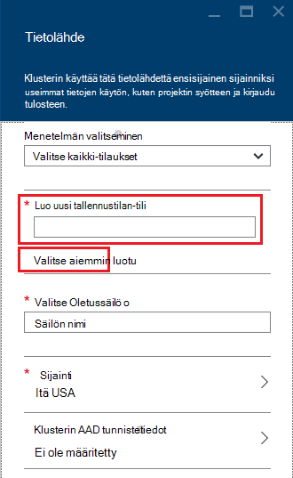

<properties
    pageTitle="Kyselyn HDFS-yhteensopiva Blob-objektien tallennustilaan | Microsoft Azure"
    description="HDInsight käyttää Azure Blob-objektien tallennustilaan kuin HDFS big datasta-kaupasta. Lisätietoja kyselyn Blob-säiliö ja tallentaa analyysin tulokset."
    keywords="BLOB storage, hdfs, jäsenneltyjen tietojen erimuotoisia tietoja"
    services="hdinsight,storage"
    documentationCenter=""
    tags="azure-portal"
    authors="mumian"
    manager="jhubbard"
    editor="cgronlun"/>

<tags
    ms.service="hdinsight"
    ms.workload="big-data"
    ms.tgt_pltfrm="na"
    ms.devlang="na"
    ms.topic="get-started-article"
    ms.date="09/06/2016"
    ms.author="jgao"/>

# HDFS-yhteensopiva Azure-Blob-säiliö käyttäminen HDInsight Hadoop

Opettele edullinen Azure-Blob-säiliö käyttäminen HDInsight ja luoda Azure-tallennustilan tilin ja Blob-objektien tallennustilan säilö osoite sisältämät tiedot.

Azure-Blob-säiliö on tehokkaat, yleinen tallennustilan ratkaisun, joka integroituu saumattomasti Hdinsightista. Hadoop distributed tiedoston järjestelmän (HDFS)-liittymän avulla käyttää kaikkia käytettävissä olevia HDInsight osia voi toimia suoraan-Blob-objektien tallennustilaan rakenteellisia tai rakenteeton tiedot.

Tietojen tallentaminen Blob-objektien tallennustilaan avulla voit poistaa turvallisesti HDInsight-klustereiden, joita käytetään laskenta käyttäjätietoja menettämättä.

> [AZURE.IMPORTANT] HDInsight tukee vain estä BLOB-objektit. Se ei tue sivun tai liittäminen BLOB-objektit.

Lisätietoja HDInsight-klusterin luomisesta on artikkelissa [Aloittaminen HDInsight] [ hdinsight-get-started] tai [Luo HDInsight klustereiden][hdinsight-creation].

## Tallennustilan HDInsight-arkkitehtuuri
Seuraavassa kaaviossa on abstraktit näkymän HDInsight tallennustilan arkkitehtuurista:

![Hadoop klustereiden käyttää HDFS Ohjelmointirajapinnan ja tallentaa erimuotoisia tietoja Blob-objektien tallennustilaan.] (./media/hdinsight-hadoop-use-blob-storage/HDI.WASB.Arch.png "Tallennustilan HDInsight-arkkitehtuuri")

Hajautettu tiedostojärjestelmän, joka on liitetty paikallisesti Laske solmut HDInsight pääsee. Tämän tiedostojärjestelmän niitä voi käyttää käyttämällä täydellistä URI, esimerkiksi:

    hdfs://<namenodehost>/<path>

Lisäksi HDInsight mahdollistaa access Azure-Blob-objektien tallennustilaan tallennettuja tietoja. Syntaksi on:

    wasb[s]://<containername>@<accountname>.blob.core.windows.net/<path>

> [AZURE.NOTE] Vanhemmat versiot 3.0, HDInsight-versioissa `asv://` käytettiin sijaan `wasb://`. `asv://`olisi ei voi käyttää HDInsight klustereiden 3.0 tai uudempi versio, kun se aiheuttaa virheen.

Hadoop tukee käsite käyttöjärjestelmän. Käyttöjärjestelmän merkitsee oletusarvon värimallin ja myöntäjä. Se voidaan myös ratkaisemiseksi suhteellisia polkuja. Aikana HDInsight-luontiprosessi ja Azure-tallennustilan tilin tietyn Azure-Blob-säiliö säilö kyseiseltä tililtä on määritetty oletusarvoinen tiedostojärjestelmässä.

Tallennustilan tilin lisäksi voit lisätä tallennustilaa tilit saman Azure tilaus tai eri Azure-tilauksissa luomisen aikana tai klusterin luomisen jälkeen. Ohjeita lisätään lisätallennustilaa tilit-kohdassa [Luo HDInsight klustereiden][hdinsight-creation].

- **Tallennustilan tilit, jotka ovat yhteydessä klusterin säilöjä:** Koska tilin nimi ja avain liittyvät klusterin luonnin aikana, sinulla on täydet oikeudet näiden säilöt-BLOB-objektit.

- **Julkisen säilöjen tai julkinen BLOB storage-tilin, joka ei ole yhteyttä klusterin:** Sinulla on vain luku-oikeudet säilöt-BLOB-objektit.

    > [AZURE.NOTE]
        > Julkinen säilöjen mahdollistavat kaikki BLOB-objektit, jotka ovat käytettävissä kyseisen säilön ja hanki säilö metatietojen luettelo. Julkinen BLOB avulla voit käyttää BLOB-objektit, vain, jos tiedät, että tarkka URL-osoite. Lisätietoja on artikkelissa <a href="http://msdn.microsoft.com/library/windowsazure/dd179354.aspx">Rajoita käyttöoikeuksien säilöjen ja BLOB-objektit</a>.

- **Tallennustilan tilit, jotka eivät ole yhteydessä klusterin yksityinen säilöjä:** Et voi käyttää säilöt-BLOB-objektit, ellet määrität tallennustilan tilin lähettäessäsi WebHCat työt. Tämä on kuvattu tämän artikkelin.

Tallennustilan tilit, jotka on määritelty luontia ja niiden näppäimet on tallennettu %HADOOP_HOME%/conf/core-site.xml klusterin solmuissa. HDInsight oletusasetuksista on määritetty core site.xml tiedostossa tallennustilan tilejä. Ei suositella core site.xml-tiedoston muokkaaminen, koska klusterin pään node(master) voidaan reimaged tai siirtää milloin tahansa ja tiedostoihin tehdyt muutokset menetetään.

Useita WebHCat töitä, kuten rakenne, MapReduce, Hadoop-tietovirta ja Possu, voit suorittaa tallennustilan asiakkaat ja heidän kanssaan metatietojen kuvaus. (Tämä tällä hetkellä toimii Possu tallennustilan tilien kanssa, mutta ei metatietojen.) Tässä artikkelissa [Azure PowerShellin avulla Access-BLOB](#powershell) -osassa on otoksen tätä ominaisuutta. Lisätietoja on artikkelissa [HDInsight-klusterin vaihtoehtoinen tallennustilan tilejä ja Metastores](http://social.technet.microsoft.com/wiki/contents/articles/23256.using-an-hdinsight-cluster-with-alternate-storage-accounts-and-metastores.aspx).

Erimuotoisia tietoja voi käyttää Blob-objektien tallennustilaan. Blob-objektien tallennustilan säiliöiden tallentaa tiedot avain ja arvon tietoparin ja ei ole hakemisto-hierarkia. Kuitenkin merkin vinoviiva (/) voidaan sisällä avaimen nimi aluetta, että tiedosto on tallennettuna kansiorakenne. Blob-objektien avain voi olla esimerkiksi *input/log1.txt*. Todellinen *syötteen* kansio ei ole olemassa, mutta vuoksi avaimen nimi vinoviiva merkin tavoitettavuustietojen, se on tiedostopolusta ulkoasua.

###Blob-objektien tallennustilaan edut
Epäsuora suorituskyvyn kustannuksiksi ei ole yhtä etsiminen laskea klustereiden ja tallennustilaa resursseja, joiden on lievity sen mukaan, miten Laske klustereiden luodaan lähellä tallennustilan tilin resurssit Azure sisäpuolta, jossa nopea verkko on erittäin tehokkaasti Laske solmujen tietojen Azure-Blob-säiliö sisällä.

On useita hyötyjä liittyvät tiedot tallennetaan Azure-Blob-säiliö HDFS sijaan:

* **Tiedot uudelleen ja jakaminen:** HDFS tiedot on kotelon sisäpuolella laskentaklusteriin. Vain sovellukset, jotka on pääsy laskentaklusteriin käyttää tiedot käyttämällä HDFS API. Azure-Blob-säiliö tietoja voidaan käyttää joko HDFS-ohjelmointirajapinnan tai kautta [Blob Storage REST API][blob-storage-restAPI]. Näin ollen suurempaa joukkoa (mukaan lukien HDInsight toisten klustereiden) sovellusten ja työkalujen avulla voidaan tuottaa ja käyttää tietoja.
* **Tietojen arkistointi:** Tiedot tallennetaan Azure-Blob-säiliö mahdollistaa käytettäviä laskenta poistetaan turvallisesti menettämättä käyttäjätiedot HDInsight klustereiden.
* **Tietojen tallennustilan kustannukset:** Tiedot tallennetaan DFS pitkällä aikavälillä on enemmän kuin tietojen tallentamista Azure-Blob-säiliö, koska laskentaklusteriin kustannus on suurempi kuin Azure-Blob-tallennustilan säiliön kustannukset kallista. Lisäksi sillä tietoja ei ole ladataan jokaisen Laske klusterin luontia varten, myös tallennat tietojen lataaminen kustannukset.
* **Joustavasti mittakaava-kohtaa:** Vaikka HDFS voi skaalata ulos tiedostojärjestelmässä, asteikon määritetään, jonka luot yhteyttä klusterin solmujen määrän mukaan. Asteikon muuttaminen voi olla monimutkaisempia prosessin kuin käyttäisit skaalaus ominaisuuksista, joita voit hakea automaattisesti Azure-Blob-säiliö Lisää-joustavasti.
* **Geo replikoinnin:** Azure-Blob tallennustilan säiliöiden voi olla geo replikoida. Vaikka Näin voit maantieteelliset palauttaminen ja tietojen kopion automaattisesti geo replikoida haluamaasi kohtaan vaikuttaa vakavasti suorituskyvyn ja se voi syntyä lisäkustannuksia. Jotta Microsoftin suositus on valita geo-replikoinnin viisaasti ja vain, jos tiedot on nykyarvo lisäkustannuksia.

Tiettyjen MapReduce työt ja pakettien voi luoda keskitason tulokset, joita et halua todella Azure-Blob-objektien tallennustilaan tallentamiseen. Siinä tapauksessa voit lopettaa paikallisen HDFS tietojen tallennusta varten. Itse asiassa HDInsight käyttää DFS useiden rakenteen projektien ja muiden prosessien keskitason tulokset.

> [AZURE.NOTE] Useimmat HDFS komennot (esimerkiksi <b>ls</b>, <b>copyFromLocal</b> ja <b>mkdir</b>) toimivat odotetusti. Vain komennot, jotka ovat alkuperäisen HDFS käyttöönoton (joka kutsutaan DFS), kuten <b>fschk</b> ja <b>dfsadmin</b>näkyy Azure-Blob-säiliö eri tavalla.

## Luo Blob säilöt

Jos haluat käyttää BLOB-objektit, ensin luoda [Azure-tallennustilan tilin][azure-storage-create]. Osana Määritä Azure alue, joka tallentaa luomasi tällä tilillä objektit. Klusterin ja tallennustilaa tili on isännöitävä samassa alueella. Rakenteen metastore SQL Server-tietokantaan ja Oozie metastore SQL Server-tietokannan myös sijaittava samalla alueella.

Kaikkialla, missä se sijaitsee kunkin blob luot kuuluu tilisi Azure-tallennustilan säilö. Tämä säilö saattaa olla aiemmin blob, joka on luotu HDInsight ulkopuolella tai se saattaa olla säilö, joka on luotu HDInsight-klusterin.

Oletusarvon Blob-säilö tallentaa klusterin tarkat tiedot, kuten Työhistoria ja lokit. Oletusarvo-Blob-säilö ei jakaminen useiden HDInsight klustereiden. Tämä saattaa vioittunut Työhistoria ja klusterin misbehave. On suositeltavaa käyttää eri säilöön kunkin klusterin ja Aseta jaettujen tietojen määritettyä käyttöönoton kaikki asianmukaiset klustereiden tallennustilan oletustilin sijaan linkitetyn tallennustilan-tiliä. Katso lisätietoja linkitetyn tallennustilan tilien määrittämisestä [luominen HDInsight klustereiden][hdinsight-creation]. Voit kuitenkin käyttää oletusarvon tallennustilan säilö alkuperäisen HDInsight-klusterin poistamisen jälkeen. Klustereiden HBase todellisuudessa voit säilyttää HBase Taulukkorakenteen ja tietojen Luo uuden HBase-klusterin käyttämällä oletusarvoista blob säilytykseen, jota käytetään HBase-klusterin, joka on poistettu.

### Azure-portaalissa

Luotaessa HDInsight-klusterin-portaalista sinulla on käytössä olevan tallennustilan-tilin tai luoda uuden tallennustilan tilin asetukset:

###Azure CLI käyttäminen

[AZURE.INCLUDE [use-latest-version](../../includes/hdinsight-use-latest-cli.md)]

Jos sinulla on [asennettu ja määritetty Azure-CLI](../xplat-cli-install.md), seuraava komento voidaan tallennustilan tilin ja säilö.

    azure storage account create <storageaccountname> --type LRS

> [AZURE.NOTE] `--type` Parametri ilmaisee, miten tallennustilan tilin replikoida. Lisätietoja on artikkelissa [Azure-tallennustilan replikoinnin](../storage/storage-redundancy.md). Älä käytä ZRS, kuten ZRS ei tue sivun blob, tiedoston, taulukko tai jonossa.

Voit pyydetään määrittämään maantieteellisen alueen, tallennustilan tilin sijaitsee. Sinun on luotava tallennustilan tilin saman alueen, jonka aiot HDInsight-klusterin luominen.

Kun tallennustilan-tili on luotu, käytä seuraavaa komentoa hakemiseen tallennustilan tilin näppäimet:

    azure storage account keys list <storageaccountname>

Jos haluat luoda säilön, käytä seuraavaa komentoa:

    azure storage container create <containername> --account-name <storageaccountname> --account-key <storageaccountkey>

### Azure PowerShellin avulla

Jos olet [asentanut ja määrittänyt PowerShellin Azure][powershell-install], Azure PowerShell-kehotteessa seuraava avulla voit luoda tallennustilan tilin ja säilö:

[AZURE.INCLUDE [upgrade-powershell](../../includes/hdinsight-use-latest-powershell.md)]

    $SubscriptionID = "<Your Azure Subscription ID>"
    $ResourceGroupName = "<New Azure Resource Group Name>"
    $Location = "EAST US 2"
    
    $StorageAccountName = "<New Azure Storage Account Name>"
    $containerName = "<New Azure Blob Container Name>"
    
    Add-AzureRmAccount
    Select-AzureRmSubscription -SubscriptionId $SubscriptionID
    
    # Create resource group
    New-AzureRmResourceGroup -name $ResourceGroupName -Location $Location
    
    # Create default storage account
    New-AzureRmStorageAccount -ResourceGroupName $ResourceGroupName -Name $StorageAccountName -Location $Location -Type Standard_LRS 
    
    # Create default blob containers
    $storageAccountKey = (Get-AzureRmStorageAccountKey -ResourceGroupName $resourceGroupName -StorageAccountName $StorageAccountName)[0].Value
    $destContext = New-AzureStorageContext -StorageAccountName $storageAccountName -StorageAccountKey $storageAccountKey  
    New-AzureStorageContainer -Name $containerName -Context $destContext

## Tiedostot Blob-objektien tallennustilaan

Blob-objektien tallennustilaan tiedostojen avaaminen HDInsight-URI-malli on:

    wasb[s]://<BlobStorageContainerName>@<StorageAccountName>.blob.core.windows.net/<path>

Salaamaton pääsee URI-malli (kanssa *wasb:* etuliite) ja SSL salattu käytön ( *wasbs*). On suositeltavaa käyttää *wasbs* mahdollisuuksien mukaan myös silloin, kun tietojen, joka sijaitsee Azure saman sisäpuolta käyttäminen.

&lt;BlobStorageContainerName&gt; Azure-Blob-objektien tallennustilaan säilön nimi.
&lt;StorageAccountName&gt; Azure-tallennustilan tilin nimi. Täydellinen toimialuenimi (FQDN) vaaditaan.

Jos kumpaakaan &lt;BlobStorageContainerName&gt; eikä &lt;StorageAccountName&gt; on määritetty, käytetään oletusarvon tiedostojärjestelmässä. Käyttöjärjestelmän tiedostoja voit käyttää suhteellinen polku tai absoluuttinen polku. Esimerkiksi *hadoop-mapreduce-examples.jar* tiedosto, joka sisältää HDInsight klustereiden voit käsiteltäväksi käyttämällä jotakin seuraavista toimista:

    wasbs://mycontainer@myaccount.blob.core.windows.net/example/jars/hadoop-mapreduce-examples.jar
    wasbs:///example/jars/hadoop-mapreduce-examples.jar
    /example/jars/hadoop-mapreduce-examples.jar

> [AZURE.NOTE] Tiedostonimi on <i>hadoop examples.jar</i> HDInsight-versio 2.1 ja 1.6 klustereissa.

&lt;Polku&gt; on tiedoston tai kansion HDFS polku. Koska Azure-Blob-säiliö säilöt ovat ainoastaan avain-arvo stores, TOSI hierarkkisia tiedostojärjestelmän on luotu. Hakemiston erottimen tulkitaan vinoviiva-merkki (/) sisällä blob-näppäintä. *Hadoop-mapreduce-examples.jar* blob nimi on esimerkiksi:

    example/jars/hadoop-mapreduce-examples.jar

> [AZURE.NOTE] Kun käsittelet BLOB HDInsight ulkopuolella, useimmat apuohjelmat ei tunnista WASB muotoa ja odottaa sen sijaan basic polku-muodossa, kuten `example/jars/hadoop-mapreduce-examples.jar`.

## Access-BLOB Azure CLI käyttäminen

Käytä seuraavaa komentoa luettelon blob-ryhmän komentoja:

    azure storage blob

**Esimerkki tiedoston lataaminen Azure CLI avulla**

    azure storage blob upload <sourcefilename> <containername> <blobname> --account-name <storageaccountname> --account-key <storageaccountkey>

**Esimerkki käyttämällä Azure CLI tiedoston lataaminen**

    azure storage blob download <containername> <blobname> <destinationfilename> --account-name <storageaccountname> --account-key <storageaccountkey>

**Esimerkki Azure CLI avulla voit poistaa tiedoston**

    azure storage blob delete <containername> <blobname> --account-name <storageaccountname> --account-key <storageaccountkey>

**Esimerkki Azure CLI tiedostojen**

    azure storage blob list <containername> <blobname|prefix> --account-name <storageaccountname> --account-key <storageaccountkey>

## Access-BLOB Azure PowerShellin avulla

> [AZURE.NOTE] Tässä osassa komentoja on basic Esimerkki PowerShellin avulla Accessin BLOB tallennettuja tietoja. Katso Lisää tietoliikenneohjelmistossa esimerkki, joka on mukautettu käsittelyyn HDInsight- [HDInsight-Työkalut](https://github.com/Blackmist/hdinsight-tools).

Käytä seuraavaa komentoa luettelon blob-ryhmän cmdlet-komennot:

    Get-Command *blob*

![Blob-objektien liittyvät PowerShell cmdlet-komentojen luettelo.][img-hdi-powershell-blobcommands]

###Tiedostojen lataaminen

Katso [Lataa tiedot HDInsight][hdinsight-upload-data].

###Tiedostojen lataaminen

Seuraavat etäasennuksen Lataa estä Blob-objektien nykyiseen kansioon. Ennen kuin suoritat komentosarjan, Vaihda kansio kansioon, johon sinulla on kirjoitusoikeus.

    $resourceGroupName = "<AzureResourceGroupName>"
    $storageAccountName = "<AzureStorageAccountName>"   # The storage account used for the default file system specified at creation.
    $containerName = "<BlobStorageContainerName>"  # The default file system container has the same name as the cluster.
    $blob = "example/data/sample.log" # The name of the blob to be downloaded.
    
    # Use Add-AzureAccount if you haven't connected to your Azure subscription
    Login-AzureRmAccount 
    Select-AzureRmSubscription -SubscriptionID "<Your Azure Subscription ID>"
    
    Write-Host "Create a context object ... " -ForegroundColor Green
    $storageAccountKey = (Get-AzureRmStorageAccountKey -ResourceGroupName $resourceGroupName -Name $storageAccountName)[0].Value
    $storageContext = New-AzureStorageContext -StorageAccountName $storageAccountName -StorageAccountKey $storageAccountKey  
    
    Write-Host "Download the blob ..." -ForegroundColor Green
    Get-AzureStorageBlobContent -Container $ContainerName -Blob $blob -Context $storageContext -Force
    
    Write-Host "List the downloaded file ..." -ForegroundColor Green
    cat "./$blob"

Tarjoamalla Resurssin ryhmänimi ja klusterinimeä, voit käyttää seuraava koodi:

    $resourceGroupName = "<AzureResourceGroupName>"
    $clusterName = "<HDInsightClusterName>"
    $blob = "example/data/sample.log" # The name of the blob to be downloaded.
    
    $cluster = Get-AzureRmHDInsightCluster -ResourceGroupName $resourceGroupName -ClusterName $clusterName
    $defaultStorageAccount = $cluster.DefaultStorageAccount -replace '.blob.core.windows.net'
    $defaultStorageAccountKey = (Get-AzureRmStorageAccountKey -ResourceGroupName $resourceGroupName -Name $defaultStorageAccount)[0].Value
    $defaultStorageContainer = $cluster.DefaultStorageContainer
    $storageContext = New-AzureStorageContext -StorageAccountName $defaultStorageAccount -StorageAccountKey $defaultStorageAccountKey 
    
    Write-Host "Download the blob ..." -ForegroundColor Green
    Get-AzureStorageBlobContent -Container $defaultStorageContainer -Blob $blob -Context $storageContext -Force

###Tiedostojen poistaminen

    Remove-AzureStorageBlob -Container $containerName -Context $storageContext -blob $blob

###Luettelo tiedostoista

    Get-AzureStorageBlob -Container $containerName -Context $storageContext -prefix "example/data/"

###Suorita määrittämätön tallennustilan tilin kyselyjen rakenne

Tässä esimerkissä näytetään, miten luettelon tallennustilan-tili, jota ei ole määritetty aikana luontiprosessi kansion.
$clusterName = "<HDInsightClusterName>"

    $undefinedStorageAccount = "<UnboundedStorageAccountUnderTheSameSubscription>"
    $undefinedContainer = "<UnboundedBlobContainerAssociatedWithTheStorageAccount>"

    $undefinedStorageKey = Get-AzureStorageKey $undefinedStorageAccount | %{ $_.Primary }

    Use-AzureRmHDInsightCluster $clusterName

    $defines = @{}
    $defines.Add("fs.azure.account.key.$undefinedStorageAccount.blob.core.windows.net", $undefinedStorageKey)

    Invoke-AzureRmHDInsightHiveJob -Defines $defines -Query "dfs -ls wasbs://$undefinedContainer@$undefinedStorageAccount.blob.core.windows.net/;"

## Seuraavat vaiheet

Tässä artikkelissa oppimiasi HDFS-yhteensopiva Azure-Blob-säiliö käyttäminen HDInsight ja oppimiasi Azure-Blob-säiliö on HDInsight ratkaisevan osa. Näin voit skaalattava, pitkään, arkistointia tietojen hankkiminen ratkaisujen Azure-Blob-säiliö luominen ja käyttäminen HDInsight lukituksen välimuistin erimuotoisia tietoja sisältämiä tietoja.

Lisätietoja on artikkelissa:

* [Azure Hdinsightiin käytön aloittaminen][hdinsight-get-started]
* [Tietojen lataaminen Hdinsightiin][hdinsight-upload-data]
* [Rakenteen käyttäminen Hdinsightiin][hdinsight-use-hive]
* [Possu käyttäminen Hdinsightiin][hdinsight-use-pig]
* [Käytön rajoittaminen HDInsight-tietojasi Azure tallennustilan jaettu Access allekirjoitusten käyttäminen][hdinsight-use-sas]

[hdinsight-use-sas]: hdinsight-storage-sharedaccesssignature-permissions.md
[powershell-install]: ../powershell-install-configure.md
[hdinsight-creation]: hdinsight-provision-clusters.md
[hdinsight-get-started]: hdinsight-hadoop-tutorial-get-started-windows.md
[hdinsight-upload-data]: hdinsight-upload-data.md
[hdinsight-use-hive]: hdinsight-use-hive.md
[hdinsight-use-pig]: hdinsight-use-pig.md

[blob-storage-restAPI]: http://msdn.microsoft.com/library/windowsazure/dd135733.aspx
[azure-storage-create]: ../storage/storage-create-storage-account.md

[img-hdi-powershell-blobcommands]: ./media/hdinsight-hadoop-use-blob-storage/HDI.PowerShell.BlobCommands.png
[img-hdi-quick-create]: ./media/hdinsight-hadoop-use-blob-storage/HDI.QuickCreateCluster.png
[img-hdi-custom-create-storage-account]: ./media/hdinsight-hadoop-use-blob-storage/HDI.CustomCreateStorageAccount.png  
