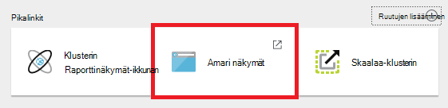
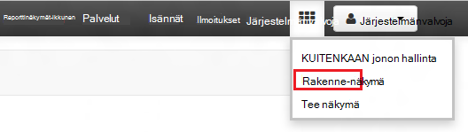
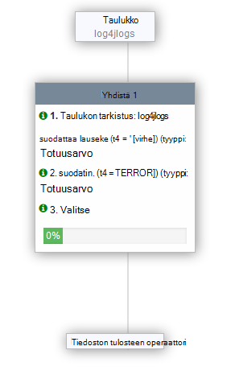

<properties
   pageTitle="Ambari näkymien avulla voit käsitellä rakenne-HDInsight (Hadoop) | Microsoft Azure"
   description="Opettele käyttämään selaimesta rakenne-näkymän Lähetä kyselyt rakenne. Rakenne-näkymä on mukana Linux-pohjaiset HDInsight-klusterin Ambari Web-Käyttöliittymän osa."
   services="hdinsight"
   documentationCenter=""
   authors="Blackmist"
   manager="jhubbard"
   editor="cgronlun"
    tags="azure-portal"/>

<tags
   ms.service="hdinsight"
   ms.devlang="na"
   ms.topic="article"
   ms.tgt_pltfrm="na"
   ms.workload="big-data"
   ms.date="10/28/2016"
   ms.author="larryfr"/>

#Hadoop HDInsight-rakenne-näkymän käyttäminen

[AZURE.INCLUDE [hive-selector](../../includes/hdinsight-selector-use-hive.md)]

Ambari on hallintaan ja seurantaa apuohjelma, mukana Linux-pohjaiset HDInsight klustereiden. Yksi kautta Ambari ominaisuuksista on Web-Käyttöliittymä, joka voidaan suorittaa kyselyjä rakenne. Tämä on __Rakenne näkymän__osa HDInsight-klusterin mukana Ambari näkymiä.

> [AZURE.NOTE] Ambari on paljon ominaisuuksista, joita ei käsitellään tässä asiakirjassa. Lisätietoja on artikkelissa [hallinta HDInsight klustereiden Ambari Web-Käyttöliittymän avulla](hdinsight-hadoop-manage-ambari.md).

##Edellytykset

- Linux-pohjaiset HDInsight-klusterin. Lisätietoja uuden klusterin luomisesta on artikkelissa [Linux-pohjaiset HDInsight käytön aloittaminen](hdinsight-hadoop-linux-tutorial-get-started.md).

##Avaa rakenne-näkymä

Voit tehdä Ambari näkymien Azure-portaalista; Valitse HDInsight-klusterin ja valitse sitten __Ambari näkymien__ __Pikalinkit__ -osiosta.

Voit myös siirtyä suoraan Ambari siirtymällä https://CLUSTERNAME.azurehdinsight.net selaimessa (jossa __CLUSTERNAME__ on HDInsight-klusterin nimen) ja valitse sitten olevat ruudut sivun vieressä olevasta valikosta ( __järjestelmänvalvojan__ linkki ja painike sivun vasemmalla puolella) käytettävissä olevat näkymät. Valitse __Näytä rakenne__.

.

> [AZURE.NOTE] Ambari käytettäessä voit pyydetään tarkistamiseen sivustoon. Kirjoita järjestelmänvalvoja (oletus `admin`,) tilin käyttäjänimi ja salasana, joita käytit luodessasi klusterin.

Näyttöön tulee sivu, joka on seuraavankaltaiselta:

##Taulukot

Valitse sivun __Tietokannan Explorer__ -osiossa __Oletusarvo- __tietokannat__ -välilehti__ . Tässä näkyvät taulukkoluettelon oletusarvo-tietokannassa. Uuden HDInsight-klusterin vain yhden taulukon pitäisi olla; __hivesampletable__.

Uusien taulukoiden on lisätty vaiheet tässä asiakirjassa, voit päivittää käytettävissä olevien taulukoiden luettelon tietokannan Explorer oikeassa yläkulmassa Päivitä-kuvake avulla.

##Kyselyeditori

Rakenne-näkymästä seuraavien vaiheiden avulla voit suorittamalla tietojen mukana klusterin kyselyn rakenne.

1. Liitä HiveQL seuraavista väittämistä laskentataulukkoon sivun __Kyselyeditori__ -osassa:

        DROP TABLE log4jLogs;
        CREATE EXTERNAL TABLE log4jLogs(t1 string, t2 string, t3 string, t4 string, t5 string, t6 string, t7 string)
        ROW FORMAT DELIMITED FIELDS TERMINATED BY ' '
        STORED AS TEXTFILE LOCATION 'wasbs:///example/data/';
        SELECT t4 AS sev, COUNT(*) AS cnt FROM log4jLogs WHERE t4 = '[ERROR]' GROUP BY t4;

    Alikyselyn tehdä seuraavat toimet:

    - **DROP TABLE** - poistaa taulukon ja datatiedostoa, siltä varalta, kun taulukko on jo olemassa.
    - **Luo ulkoinen taulukko** - Luo uusi "ulkoinen" taulukko rakenne. Ulkoiset taulukot tallentaa vain taulukkomäärityksen rakenne; tietoja jää alkuperäiseen sijaintiin.
    - **RIVIN muoto** - kertoo rakenne tietojen muotoilun. Tällöin kunkin lokin kentät on erotettu toisistaan välilyönnillä.
    - **TALLENNETTU AS TEXTFILE sijainti** - kertoo rakenne, jossa tiedot on tallennettu (esimerkkitietoja /-hakemistosta) ja että se on tallennettu tekstinä.
    - **Valitse** - valitsee kaikki rivit, joissa sarakkeen t4 sisältää arvon [virhe] määrä.

    >[AZURE.NOTE] Ulkoiset taulukot on käytettävä, kun odotat ulkoisesta tietolähteestä, kuten automaattinen tiedot-lataus tai toinen MapReduce toiminto päivittää pohjana olevat tiedot, mutta haluat aina uusimmat tiedot käyttämällä kyselyjä rakenne. Onko pudottaminen ulkoisen taulukon *ei* Poista tiedot vain taulukkomäärityksen.

2. Käynnistä kyselyn alareunassa Query-editorissa __Execute__ -painikkeen avulla. Se kannattaa ottaa oranssi ja muuttaa tekstin Pysäytä __suoritus__. __Prosessin kyselytulokset__ osan olisi tulevat näkyviin Kyselyeditorin alapuolella ja tuoda tietoja työstä.

    > [AZURE.IMPORTANT] Selaimet, eivät ehkä päivity lokin tai tulokset tiedot oikein. Jos suoritat työn, se näkyy suorittaa jatkuvasti päivittämättä lokiin tai tuota tuloksia, Mozilla FireFox tai Google Chrome asemesta.

3. Kun kysely on valmis, __Prosessi kyselytulokset__ -kohta näkyy toiminnon tulokset. __Pysäytä suorittamisen__ -painike myös muuttuu takaisin vihreää __Suorita__ -painiketta. __Tulokset__ -välilehden pitäisi olla seuraavat tiedot:

        sev       cnt
        [ERROR]   3

    __Lokit__ -välilehden avulla voidaan tarkastella työn luomia lokitiedot. Voit käyttää tätä tilanne kyselyn liittyvien ongelmien vianmääritystä varten.

    > [AZURE.TIP] Huomaa __tulosten tallentaminen__ avattavasta-valintaikkunan vasemmassa yläkulmassa __Prosessin kyselytulokset__ ; osan Tämän avulla voit ladata tulokset tai tallentaa ne HDInsight tallennustilan CSV-tiedostona.

3. Valitse tämä kysely neljä ensimmäistä riviä ja valitse sitten __Suorita__. Huomaa, että ei ole tuloksia, kun työ on valmis. Tämä johtuu siitä __Execute__ -painikkeen avulla, kun kysely osa on valittuna vain Suorita valitun lauseet. Tässä tapauksessa valinnan kaavioon lopullinen lause, joka hakee taulukon rivejä. Jos valitset kyseisen rivin ja käyttää __Execute__-pitäisi näkyä odotetut tulokset.

3. __Kyselyeditorin__ alareunassa __Uusi laskentataulukko__ -painike avulla voit luoda uuden laskentataulukon. Kirjoita uuteen laskentataulukkoon HiveQL seuraavista väittämistä:

        CREATE TABLE IF NOT EXISTS errorLogs (t1 string, t2 string, t3 string, t4 string, t5 string, t6 string, t7 string) STORED AS ORC;
        INSERT OVERWRITE TABLE errorLogs SELECT t1, t2, t3, t4, t5, t6, t7 FROM log4jLogs WHERE t4 = '[ERROR]';

    Alikyselyn tehdä seuraavat toimet:

    - **Luo taulukko IF NOT olemassa** - luo taulukon, jos se ei ole jo olemassa. **Ulkoiset** avainsana ei käytetä, koska tämä on sisäinen taulukosta, joka on tallennettu rakenteen tietovarasto ja rakenteen hallitsee kokonaan. Toisin kuin ulkoiset taulukot pudottaminen sisäinen taulukko poistetaan myös pohjana olevia tietoja.
    - **TALLENNETTU AS ORC** - tallentaa tiedot optimoitu rivin Sarakemuoto (ORC)-muodossa. Tämä on erittäin optimoitu ja tehokkaana muoto rakenteen tietojen tallentamista varten.
    - Lisää **Korvaa... Valitse** - valitsee rivit, jotka sisältävät [virhe] **log4jLogs** taulukosta ja lisää sitten **errorLogs** taulukkoon tiedot.

    __Execute__ -painikkeen avulla voit suorittaa tässä kyselyssä. __Tulokset__ -välilehti ei sisällä tietoja rivejä ei palauttamat tässä kyselyssä, mutta tilan pitäisi näyttää __onnistui__.

###Rakenne-asetukset

Valitse oikealla puolella editorin __asetukset__ -kuvaketta.

Asetuksia voi käyttää MapReduce haluat muuttaa eri rakenne-asetuksia, kuten suorittamisen ohjelma muuttaminen rakenne-Tez (oletus-).

###Visual kerrotaan

Valitse oikealla puolella editorin __Visual kerrotaan__ -kuvake.

Tämä on kysely, joka voi olla hyötyä ymmärtämään monimutkaisia kyselyjä kulun __Visual kerrotaan__ näkymän. Voit tarkastella tekstiä vastikkeen Tämä näkymä-painikkeella __Selitys__ Kyselyeditorissa.

###Tez

Valitse oikealla puolella editorin __Tez__ -kuvake.

Tässä näkyvät ohjataan asykliset Graph (DAG) Tez tämän kyselyn käyttämä, jos sellainen on käytettävissä. Jos haluat tarkastella kyselyjen DAG olet suoritit aiemmin tai virheenkorjaus Tez prosessin käytössä [Tez näkymän](hdinsight-debug-ambari-tez-view.md) sijaan.

###Ilmoitukset

Valitse editorin oikeassa __ilmoitukset__ -kuvaketta.

Ilmoitusten viestejä, jotka on luotu suoritettaessa kyselyjä. Esimerkiksi saat ilmoituksen, kun kysely lähetetään tai kun näyttöön tulee virhesanoma.

##Tallennetut kyselyt

1. Valitse kyselyeditori Luo uusi laskentataulukko ja kirjoita seuraava kysely:

        SELECT * from errorLogs;

    Suorita kysely voit varmistaa, että se toimii. Tulokset ovat seuraavat:

        errorlogs.t1    errorlogs.t2    errorlogs.t3    errorlogs.t4    errorlogs.t5    errorlogs.t6    errorlogs.t7
        2012-02-03  18:35:34    SampleClass0    [ERROR]     incorrect   id  
        2012-02-03  18:55:54    SampleClass1    [ERROR]     incorrect   id  
        2012-02-03  19:25:27    SampleClass4    [ERROR]     incorrect   id

2. __Tallenna nimellä__ -painikkeella editorin alareunassa. Nimeä tämä kysely __Errorlogs__ ja valitse sitten __OK__. Huomaa, että laskentataulukon nimeksi tulee __Errorlogs__.

3. Valitse rakenne-näkymän sivun yläreunassa __Tallennettu kyselyt__ -välilehti. Huomaa, että __Errorlogs__ näkyy nyt tallennettu kyselynä. Se pysyy tässä luettelossa, kunnes se poistetaan. Valitsemalla nimen avautuu kyselyä Kyselyeditorissa.

##Kyselyn historia

Rakenne-näkymän yläreunassa __historia__ -painikkeen avulla voit näyttää kyselyt on suorittanut aiemmin. Sitä käytetään nyt ja valitse jotkin kyselyt, sinulla on suorittanut aiemmin. Kun valitset kyselyn, se avautuu sen Kyselyeditorissa.

##Käyttäjän määrittämät funktiot (UDF)

Rakenteen voi myös laajentaa **käyttäjän määrittämiä funktioita (UDF)**kautta. UDF voit toteuttaa toimintoja tai logiikka, joka ei ole helposti mallintaa HiveQL.

Voit lisätä UDF osana HiveQL lauseet kyselyssä, rakenne-näkymän yläreunassa UDF-välilehden avulla voit määritellä ja tallentamalla UDF, joka voidaan käyttää __Kyselyeditori__.

Kun olet lisännyt UDF rakenne-näkymään, __Lisää UDF__ -painike tulee näkyviin __Kyselyeditorin__alareunassa. Valitsemalla tämän näkyy määritetty rakenne-näkymässä UDF avattavan luettelon. UDF valitsemalla Lisää HiveQL lauseet käyttöön UDF kyselyyn.

Esimerkki: Jos olet määrittänyt UDF, joilla on seuraavat ominaisuudet:

* Resurssinimi: myudfs
* Resurssipolku: wasbs:///myudfs.jar
* UDF nimi: myawesomeudf
* UDF luokkanimi: com.myudfs.Awesome

__Lisää UDF__ -painike näkyy nimi __myudfs__, jokainen määritetty kyseiselle resurssille UDF toiseen avattavasta kanssa. Tässä tapauksessa __myawesomeudf__. Valitsemalla tämän vaihtoehdon Lisää seuraava kysely alkuun:

    add jar wasbs:///myudfs.jar;

    create temporary function myawesomeudf as 'com.myudfs.Awesome';

Voit käyttää UDF kyselyssä. Esimerkiksi `SELECT myawesomeudf(name) FROM people;`.

Lisätietoja UDF käyttäminen HDInsight-rakenne on seuraavissa artikkeleissa:

* [Rakenne ja HDInsight Possu Python käyttäminen](hdinsight-python.md)

* [Mukautettu rakenne UDF lisääminen Hdinsightiin](http://blogs.msdn.com/b/bigdatasupport/archive/2014/01/14/how-to-add-custom-hive-udfs-to-hdinsight.aspx)

##Seuraavat vaiheet

Lisätietoa HDInsight-rakenne:

* [Hadoop HDInsight-rakenteen käyttäminen](hdinsight-use-hive.md)

Lisätietoja muista tavoista voit käsitellä Hadoop-HDInsight:

* [Possu käyttäminen Hadoop-Hdinsightiin](hdinsight-use-pig.md)

* [Hadoop-HDInsight MapReduce käyttäminen](hdinsight-use-mapreduce.md)
