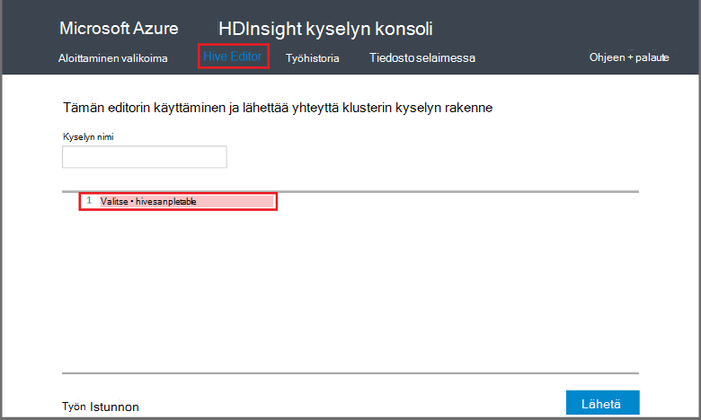

<properties
   pageTitle="Hadoop rakenteen käyttäminen kyselyn konsolin HDInsight | Microsoft Azure"
   description="Opettele käyttämään verkkopohjaisia kyselyn konsolin toimimaan rakenteen kyselyjen HDInsight Hadoop-klusterin selaimessa."
   services="hdinsight"
   documentationCenter=""
   authors="Blackmist"
   manager="jhubbard"
   editor="cgronlun"
    tags="azure-portal"/>

<tags
   ms.service="hdinsight"
   ms.devlang="na"
   ms.topic="article"
   ms.tgt_pltfrm="na"
   ms.workload="big-data"
   ms.date="09/20/2016"
   ms.author="larryfr"/>

# Suorita kysely-konsolin kyselyjen rakenne

[AZURE.INCLUDE [hive-selector](../../includes/hdinsight-selector-use-hive.md)]

Tässä artikkelissa kerrotaan käyttämisestä HDInsight kyselyn konsolin toimimaan rakenteen kyselyjen HDInsight Hadoop-klusterin selaimessa.

> [AZURE.IMPORTANT] Kyselyn HDInsight-konsolin on käytettävissä vain Windows-pohjaisesta HDInsight klustereiden. Jos käytössäsi on Linux-pohjaiset HDInsight-klusterin-kohdassa [Suorita rakenne-kyselyjen rakenne-näkymässä](hdinsight-hadoop-use-hive-ambari-view.md).

##Edellytykset

Tämän artikkelin seuraavien vaiheiden suorittamiseen tarvitset seuraavasti.

* Windows-pohjaisesta HDInsight Hadoop-klusterin

* Uusi web-selaimessa

##Suorita kysely-konsolin kyselyjen rakenne

1. Avaa selain ja siirry __https://CLUSTERNAME.azurehdinsight.net__, missä __CLUSTERNAME__ HDInsight-klusterin nimen. Jos sinulta kysytään, kirjoita käyttäjänimi ja salasana, joita käytit, kun olet luonut klusterin.

2. Linkkien sivun yläreunassa Valitse **Rakenne-editori**. Lomake, joka voidaan kirjoittaa HiveQL lausekkeita, jotka haluat suorittaa HDInsight-klusterin näkyviin.

    

    Korvaa teksti `Select * from hivesampletable` HiveQL seuraavista väittämistä kanssa:

        set hive.execution.engine=tez;
        DROP TABLE log4jLogs;
        CREATE EXTERNAL TABLE log4jLogs (t1 string, t2 string, t3 string, t4 string, t5 string, t6 string, t7 string)
        ROW FORMAT DELIMITED FIELDS TERMINATED BY ' '
        STORED AS TEXTFILE LOCATION 'wasbs:///example/data/';
        SELECT t4 AS sev, COUNT(*) AS count FROM log4jLogs WHERE t4 = '[ERROR]' AND INPUT__FILE__NAME LIKE '%.log' GROUP BY t4;

    Alikyselyn tehdä seuraavat toimet:

    * **Taulukon**: poistaa taulukon ja datatiedosto, jos taulukko on jo olemassa.
    * **Luo ulkoinen taulukko**: Luo uusi "ulkoinen" taulukko rakenne. Ulkoiset taulukot tallentaa vain taulukkomäärityksen rakenne; tietoja jää alkuperäiseen sijaintiin.

    > [AZURE.NOTE] Ulkoiset taulukot on käytettävä, kun odotat pohjana olevia tietoja voi päivittää ulkoisesta tietolähteestä (esimerkiksi automaattinen tiedot-lataus) tai toinen MapReduce-toiminto, mutta haluat aina uusimmat tiedot käyttämällä kyselyjä rakenne.
    >
    > Onko pudottaminen ulkoisen taulukon **ei** Poista tiedot vain taulukkomäärityksen.

    * **RIVIN muoto**: kertoo rakenne tietojen muotoilun. Tällöin kunkin lokin kentät on erotettu toisistaan välilyönnillä.
    * **TALLENNETTU AS TEXTFILE sijainti**: kertoo rakenne, jossa tiedot on tallennettu (esimerkkitietoja /-hakemistosta) ja että se on tallennettu tekstinä
    * **Valitse**: Valitse kaikki rivit, joissa sarakkeen **t4** sisältävät arvon **[virhe]**määrä. Tämä olisi palauttaa arvon **3** , koska tilikaudessa on kolme rivit, jotka sisältävät arvon.
    * **INPUT__FILE__NAME LIKE "%.log"** - kertoo rakenne, joka on palauttaa tietoja ainoastaan loppuosaksi tiedostoista. loki. Tämä rajoittaa haun sample.log tiedostoon, joka sisältää haluamasi tiedot ja säilyttää-palauttaminen tietoja muiden Esimerkki datatiedostot, jotka eivät vastaa määritimme rakenne.

2. Valitse **Lähetä**. **Työn istunnon** sivun alareunassa pitäisi näyttää projektin tiedot.

3. Kun **tila** -kentän arvoksi **Valmis**, valitse **Näytä tiedot** projektille. Valitse tiedot-sivulla **Työn tulos** sisältää `[ERROR]   3`. Kentän **Lataa** -painike avulla voit ladata tiedoston, joka sisältää työn tulos.

##Yhteenveto

Voit tarkastella, kysely-konsolin antaa rakenteen kyselyjen suorittaminen HDInsight-klusterin, työ-tilaa ja Nouda tulosteen helposti.

Lisätietoja rakenteen töiden rakenne kyselyn konsolin avulla kyselyn konsolin yläreunassa **Aloittaminen** ja sitten malleja, jotka ovat. Otosten käydään läpi rakenteen käyttäminen analysointiin tiedot, myös käyttää otoksessa HiveQL lauseiden selitykset.

##Seuraavat vaiheet

Yleisiä tietoja HDInsight-rakenne:

* [Hadoop HDInsight-rakenteen käyttäminen](hdinsight-use-hive.md)

Lisätietoja muista tavoista voit käsitellä Hadoop-HDInsight:

* [Possu käyttäminen Hadoop-Hdinsightiin](hdinsight-use-pig.md)

* [Hadoop-HDInsight MapReduce käyttäminen](hdinsight-use-mapreduce.md)

Jos käytät Tez rakenteen kanssa, lue seuraavat tiedostot virheiden tiedot:

* [Käytä Windows-pohjaisesta HDInsight Tez-Käyttöliittymä](hdinsight-debug-tez-ui.md)

* [Linux-pohjaiset HDInsight Ambari Tez-näkymän käyttäminen](hdinsight-debug-ambari-tez-view.md)

[1]: ../HDInsight/hdinsight-hadoop-visual-studio-tools-get-started.md

[hdinsight-sdk-documentation]: http://msdnstage.redmond.corp.microsoft.com/library/dn479185.aspx

[azure-purchase-options]: http://azure.microsoft.com/pricing/purchase-options/
[azure-member-offers]: http://azure.microsoft.com/pricing/member-offers/
[azure-free-trial]: http://azure.microsoft.com/pricing/free-trial/

[apache-tez]: http://tez.apache.org
[apache-hive]: http://hive.apache.org/
[apache-log4j]: http://en.wikipedia.org/wiki/Log4j
[hive-on-tez-wiki]: https://cwiki.apache.org/confluence/display/Hive/Hive+on+Tez
[import-to-excel]: http://azure.microsoft.com/documentation/articles/hdinsight-connect-excel-power-query/

[hdinsight-use-oozie]: hdinsight-use-oozie.md
[hdinsight-analyze-flight-data]: hdinsight-analyze-flight-delay-data.md

[hdinsight-storage]: hdinsight-hadoop-use-blob-storage.md

[hdinsight-provision]: hdinsight-provision-clusters.md
[hdinsight-submit-jobs]: hdinsight-submit-hadoop-jobs-programmatically.md
[hdinsight-upload-data]: hdinsight-upload-data.md
[hdinsight-get-started]: hdinsight-hadoop-linux-tutorial-get-started.md

[Powershell-install-configure]: powershell-install-configure.md
[powershell-here-strings]: http://technet.microsoft.com/library/ee692792.aspx

[img-hdi-hive-powershell-output]: ./media/hdinsight-use-hive/HDI.Hive.PowerShell.Output.png
