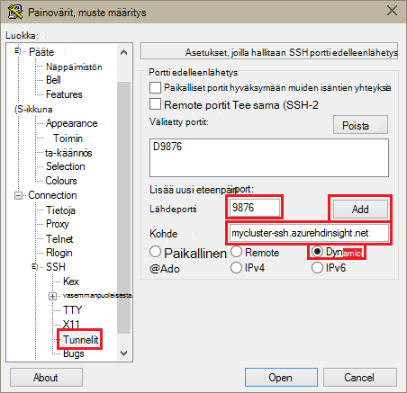
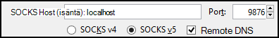
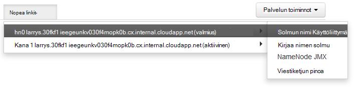

<properties
pageTitle="SSH-tunnelointi avulla voit käyttää Ambari web-Käyttöliittymä, Resurssienhallinta, JobHistory, NameNode, Oozie ja muut sivuston Käyttöliittymä"
description="Opettele käyttämään SSH tunnelin selaamalla web resursseja Linux-pohjaiset HDInsight-solmut suojatusti."
services="hdinsight"
documentationCenter=""
authors="Blackmist"
manager="jhubbard"
editor="cgronlun"/>

<tags
ms.service="hdinsight"
ms.devlang="na"
ms.topic="article"
ms.tgt_pltfrm="na"
ms.workload="big-data"
ms.date="10/17/2016"
ms.author="larryfr"/>

# SSH-tunnelointi avulla voit käyttää Ambari web-Käyttöliittymä, JobHistory, NameNode, Oozie ja muut sivuston Käyttöliittymä

Linux-pohjaiset HDInsight klustereiden tarjoavat Ambari web-Käyttöliittymä pääsyn Internetin kautta, mutta jotkin käyttöliittymän ominaisuudet eivät ole. Esimerkiksi web-Käyttöliittymä muista palveluista, jotka ovat esiin Ambari kautta. Täydellisesti Ambari web-Käyttöliittymä sinun on käytettävä SSH-tunnelin klusterin otsikkoon.

## Mikä vaatii SSH tunnelin?

Useita Ambari valikot ei täysin täyttää ilman SSH-tunnelin, kuten verkkosivustojen ja muut Hadoop palveluita klusterin näyttämiä palvelujen pääsemästä. Usein näitä sivustoja ovat ole suojattu, joten niitä ei ole Turvalliset ja näyttää suoraan Internetissä. Joskus palvelun suoritetaan toisen klusterin solmun Zookeeper solmu esimerkiksi sivuston.

Palvelut, jotka Ambari web-Käyttöliittymä käyttää, ei voi käyttää ilman SSH tunnelin ovat seuraavat:

* JobHistory,
* NameNode,
* Viestiketjun pinoa
* Oozie web-Käyttöliittymä
* HBase pää- ja lokit-Käyttöliittymä

Jos komentosarjan toimintojen avulla voit mukauttaa yhteyttä klusterin, kaikki palvelujen tai apuohjelmia, jotka olet asentanut, joka näyttää web-Käyttöliittymä edellyttää SSH tunnelin. Jos asennat sävyä komentosarja-toiminnon avulla, sinun on käytettävä SSH tunnelin käyttämään värisävy-web-Käyttöliittymää.

## Mikä on SSH tunnelin?

[Suojattu runko (SSH) tunneling](https://en.wikipedia.org/wiki/Tunneling_protocol#Secure_Shell_tunneling) reitittää liikenteen porttiin paikallisen työasemalle, SSH-yhteydellä oman HDInsight klusterin pään solmun, jossa pyynnön ratkaistaan sitten kuin, jos se on peräisin pään solmun lähetetyt. Vastauksen reititetään sitten takaisin työasemaan tunnelissa.

## Edellytykset

Kun käytät SSH tunnelin web tietoliikenteen, sinulla on oltava seuraavasti:

* SSH-asiakas. Linux ja Unix jaot tai Macintosh OS X `ssh` komento on annettu käyttöjärjestelmän kanssa. (Windows) on suositeltavaa [painovärit, muste](http://www.chiark.greenend.org.uk/~sgtatham/putty/download.html)

    > [AZURE.NOTE] Jos haluat käyttää SSH asiakkaan muu kuin `ssh` tai painovärit, muste, siitä, miten voit luoda SSH tunnelin asiakkaan käyttöohjeisiin.

* Web-selaimessa, joka on määritetty käyttämään välityspalvelinta SOCKS

## Luoda tunnelin SSH-komento

Käytä seuraava komento luominen SSH tunnelin avulla `ssh` komento. Korvaa __käyttäjänimi__ HDInsight-klusterin SSH käyttäjän kanssa ja __CLUSTERNAME__ HDInsight-klusterin nimi

    ssh -C2qTnNf -D 9876 USERNAME@CLUSTERNAME-ssh.azurehdinsight.net

Tämä luo yhteys, joka reitittää liikenteen paikallisen portin 9876 klusteriin SSH päälle. Vaihtoehdot ovat:

* **D 9876** - paikallisen portin, joka reitittää liikenteen tunnelissa.

* **C** - pakata kaikki tiedot, koska web-liikenne on enimmäkseen tekstiä.

* **2** - voimassa SSH yrittää protokolla vain versio 2.

* **q** - Hiljainen tila.

* **T** - käytöstä pseudo tty kohdistus, koska on vain välitettävän portin.

* **n** - estää STDIN, lukeminen, koska on vain välitettävän portin.

* **N** - suorittaa remote-komento, koska on vain välitettävän portin.

* **f** - käynnissä taustalla.

Jos olet määrittänyt klusterin SSH avaimella, joudut ehkä käytä `-i` parametri ja määritä polku SSH yksityinen avain.

Kun komento on päättynyt, liikenne paikalliseen tietokoneeseen 9876 porttiin lähetetyt reititetään päälle Secure Sockets Layer (SSL) klusteriin head solmu ja peräisin näy.

## Luoda tunnelin painovärit, muste

Seuraavien vaiheiden avulla voit luoda SSH-tunnelin painovärit, muste.

1. Avaa painovärit, muste ja kirjoita yhteyden tietoja. Jos et ole aiemmin käyttänyt painovärit, muste, lisätietoja [Käyttää SSH Linux-pohjaiset Hadoop HDInsight Windows-ja](hdinsight-hadoop-linux-use-ssh-windows.md) siitä, miten voit käyttää sitä Hdinsightista.

2. Vasemmalla puolella valintaikkunan **luokka** -osasta Laajenna **yhteyden**, laajenna **SSH**ja valitse sitten **tunneleita**.

3. Anna **asetukset, joilla hallitaan SSH portin edelleenlähetys** -lomakkeen seuraavat tiedot:

    * **Lähdeportti** - asiakas, johon haluat lähettää porttiin. Esimerkiksi **9876**.

    * **Kohde** - SSH osoite Linux-pohjaiset HDInsight-klusterin. Esimerkiksi **mycluster ssh.azurehdinsight.net**.

    * **Dynaaminen** – ottaa dynaaminen SOCKS välityspalvelimen reititys.

    

4. Lisää valitsemalla **Lisää** asetuksia ja valitse sitten **Avaa** SSH-yhteyden.

5. Kun sinulta kysytään, kirjaudu sisään palvelimeen. Tämä muodostaa SSH-istunnon ja ota käyttöön tunnelin.

## Käytä tunnelia selaimessa

> [AZURE.NOTE] Tämän osan vaiheet käyttää on vapaasti ladattavissa Linux, Unix, Macintosh OS X- ja Windows-järjestelmiä FireFox-selaimessa. Nykyaikainen muissa selaimissa, jotka tukevat SOCKS-välityspalvelimen toimii myös.

1. Määritä selaimen käyttämään **localhost:9876** **SOCKS v5** -välityspalvelin. Seuraavassa on Firefox-asetuksia millaiseksi. Jos olet käyttänyt eri portin kuin 9876, muuta portin esitys:

    

    > [AZURE.NOTE] Valitsemalla **Remote DNS** ratkaisee (DNS, Domain Name System)-pyynnöt HDInsight-klusterin avulla. Jos kyseessä on valitsematon, DNS, ratkaistaan paikallisesti.

2. Varmista, että liikenne reitittyvät tunnelissa mukaan vising sivustossa, esimerkiksi [http://www.whatismyip.com/](http://www.whatismyip.com/) käytössä ja poissa käytöstä Firefoxissa välityspalvelimen asetusten kanssa. Kun asetukset ovat käytössä, tietokoneeseen, joten Microsoft Azure on IP-osoite.

##Tarkista Ambari Web-Käyttöliittymä

Kun klusterin on muodostettu, varmista, että voit käyttää palvelun web käyttöliittymät Ambari verkosta seuraavien vaiheiden avulla:

1. Siirry selaimella osoitteeseen http://headnodehost:8080. `headnodehost` Lähetetään klusterin tunnelin päälle ja osoittamaan Ambari käynnissä olevaan headnode. Kun sinulta kysytään, kirjoita yhteyttä klusterin järjestelmänvalvojan käyttäjänimeä (järjestelmänvalvojat) ja salasana. Sinua voidaan pyytää toisen kerran mukaan Ambari web-Käyttöliittymä. Jos näin on, voit kirjoittaa tietoja uudelleen.
    
    > [AZURE.NOTE] Kun http://headnodehost:8080-osoitteen avulla voit muodostaa yhteyttä klusterin, olet muodostamassa suoraan pään solmun, joka Ambari suoritetaan http:n ja viestintä on suojattu SSH tunnelin tunnelin kautta. Internetin välityksellä tunnelin käyttämättä muodostettaessa viestintä on suojattu HTTPS-yhteyden avulla. Muodostaa Internetin kautta käyttämällä HTTPS käyttää https://CLUSTERNAME.azurehdinsight.net, jossa __CLUSTERNAME__ on klusterin.

2. Valitse sivun vasemmalla olevasta luettelosta HDFS Ambari Web-Käyttöliittymä.

    

3. Kun HDFS palvelutiedot on näkyvissä, valitse __Pikalinkit__. Klusterin pään solmujen luettelo tulee näkyviin. Valitse jokin pään solmut ja valitse sitten __NameNode Käyttöliittymän__.

    

    > [AZURE.NOTE] Jos sinulla on internet-yhteys on hidas tai pään solmu on varattu, näkyviin voi tulla odottaa-ilmaisin valikon sijaan, kun valitset __Pikalinkit__. Jos näin on, odota hetki kaksi tietojen vastaanotti palvelimesta ja valitse luettelosta uudelleen.
    >
    > Jos käytät näytön tarkkuus-näyttöä tai selainikkunassa ei ole suurennettu, näytön oikealla puolella poistettu merkintöjä __Pikalinkit__ -valikossa saattaa. Jos näin on, laajenna hiirellä-valikko ja valitse Vieritä oikealle saadaksesi näkyviin valikon loput näytön oikeaa nuolinäppäintä avulla.

4. Näkyy sivun seuraavankaltaiselta:

    

    > [AZURE.NOTE] Huomaa, että tämän sivun; URL-osoite luultavasti muistuttaa ____http://hn1-CLUSTERNAME.randomcharacters.cx.internal.cloudapp.net:8088/klusteriin. Tämä on käytössä sisäinen täydellinen toimialuenimi (FQDN) solmun ja ei ole käytettävissä käyttämättä SSH tunnelin.

## Seuraavat vaiheet

Nyt, miten voit luoda ja käyttää SSH tunnelin oppimiasi näy seuranta ja hallinta yhteyttä klusterin käyttämällä Ambari seuraavat tiedot:

* [Voit hallita HDInsight klustereiden Ambari](hdinsight-hadoop-manage-ambari.md)

Lisätietoja HDInsight SSH käyttämisestä on seuraavissa artikkeleissa:

* [Linux-pohjaiset Hadoop HDInsight Linux, Unix tai OS X-SSH käyttäminen](hdinsight-hadoop-linux-use-ssh-unix.md)

* [SSH käyttäminen Linux-pohjaiset Hadoop-HDInsight Windows](hdinsight-hadoop-linux-use-ssh-windows.md)
