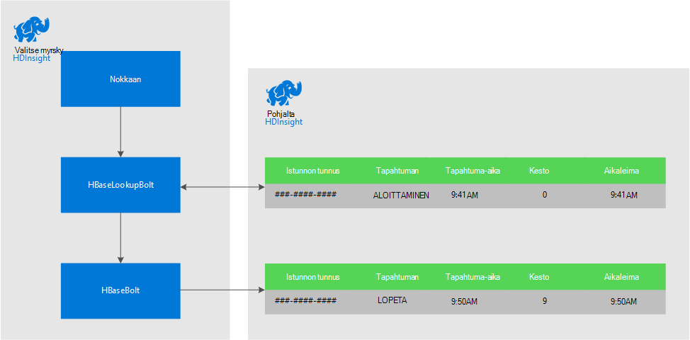
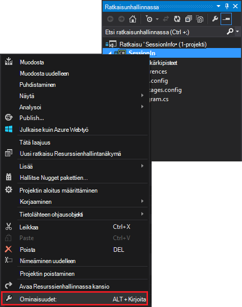
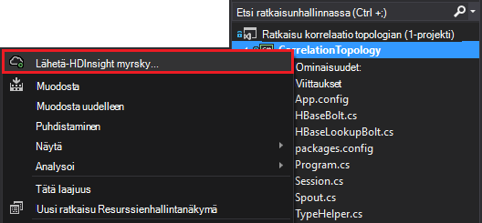

<properties
 pageTitle="Tapahtumien yhdistäminen myrsky ja HBase HDInsight-ajan mittaan"
 description="Lue, miten voit yhdistää tapahtumat, jotka saapuvat eri aikoina käyttämällä myrsky ja HBase Hdinsightista."
 services="hdinsight"
 documentationCenter=""
 authors="Blackmist"
 manager="jhubbard"
 editor="cgronlun"
 tags="azure-portal"/>

<tags
 ms.service="hdinsight"
 ms.devlang="dotnet"
 ms.topic="article"
 ms.tgt_pltfrm="na"
 ms.workload="big-data"
 ms.date="10/27/2016"
 ms.author="larryfr"/>

# Tapahtumien yhdistäminen myrsky ja HBase HDInsight-ajan mittaan

Käyttämällä pysyvä tietosäilö Apache myrsky, voit yhdistää tietoja tapahtumat, jotka saapuvat eri aikoina. Linkittäminen esimerkiksi käyttäjän istuntoon lasketaan, kuinka kauan istunto viimeksi sisään- ja uloskirjautuminen tapahtumat.

Tässä asiakirjassa kerrotaan luomisesta basic myrsky C#-topologian seurataan käyttäjien istuntojen sisään- ja uloskirjautuminen tapahtumia ja laskee istunnon kestoa. Topologian käyttää HBase pysyvän tietosäilö. HBase avulla voit suorittaa Siirtoerän kyselyjen historiatiedoissa, jotta tuottaa muita tietoja, kuten kuinka monta käyttäjää istuntoa on aloitettu tai tietyn ajanjakson aikana päättyi.

## Edellytykset

- Visual Studio ja Visual Studio HDInsight-työkalut: katso asennusohjeet [käyttäminen Visual Studio HDInsight-Työkalut](../HDInsight/hdinsight-hadoop-visual-studio-tools-get-started.md) .

- Apache myrsky HDInsight-klusterin (Windows-pohjainen). Tämä suorittaa myrsky topologian, joka käsittelee saapuvia tietoja ja tallentaa sen HBase.

    > [AZURE.IMPORTANT] Kun SCP.NET topologioissa tuetaan Linux-pohjaiset myrsky klustereiden luotu jälkeen 10/28/2016, HBase SDK .NET paketti käytettävissä saavuttaman 10/28/2016 ei toimi oikein Linux.

- Apache HBase HDInsight-klusterissa (Linux tai Windows-pohjainen). Tämä on tässä esimerkissä tietovaraston.

## Arkkitehtuuri

Yleisiä tunnus hajautettuna tapahtumien vaatii lähteen. Http://servername Käyttäjätunnus, istunnon tunnus tai muut tiedot, jotka ovat a) yksilöllinen ja b) sisällytetään kaikki tiedot lähetetään myrsky-osan. Tässä esimerkissä käytetään GUID-arvon edustavan on istunto.

Tässä esimerkissä kuuluu kaksi HDInsight klustereiden:

-   HBase: historiatietoja pysyvä tietosäilö

-   Myrsky: käytettävä ingest saapuvat tiedot

Tiedot on luotu satunnaisesti myrsky topologiasta ja kuuluu seuraavat kohteet:

-   Istunnon tunnus: GUID-tunnus, joka yksilöi istunnossa

-   Tapahtuman: ALKAMIS- tai tapahtumasta. Tässä esimerkissä alku aina toteutuu ennen loppu

-   Aika: tapahtuman aika.

Tietojen käsitteleminen ja HBase tallennetaan.

### Myrsky topologian

Istunnon käynnistyessä **Aloitus** on vastaanottanut topologiasta ja kirjautunut HBase. **Tapahtuman** saapuessa topologian hakee **Käynnistä** tapahtuman ja laskee kaksi tapahtumaa välisen ajan. **Kesto** -arvoksi tallennetaan sitten HBase sekä **pää** tapahtumatiedot.

> [AZURE.IMPORTANT] Samalla, kun tämän topologian esitellään basic kuviota, tuotannon ratkaisu on otettava rakenne seuraavissa tilanteissa:
>
> - Tilauksen ulos saapuvat tapahtumat
> - Kaksoiskappaleiden tapahtumat
> - Hylätyt tapahtumat

Esimerkki topologian koostuu seuraavat osat:

-   Session.CS: varmistaminen käyttäjän istuntoon luomalla satunnaisia istunnon tunnus, Käynnistä aika ja kuinka kauan istunto kestää

-   Spout.CS: Luo istunnot 100, tietokoneesta kuuluu äänimerkki Käynnistä tapahtuman, satunnainen aikakatkaisu odottaa istunnossa ja valitse tietokoneesta kuuluu äänimerkki tapahtuman. Valitse kierrättää päättyi istuntoon ja luoda uusia.

-   HBaseLookupBolt.cs: käyttää istunnon tunnus hakeminen HBase istunnon tietoja. Kun tapahtuman käsitellään, se havaitsee vastaavan Käynnistä tapahtuman ja laskee istunnon kestoa.

-   HBaseBolt.cs: Tallentaa HBase tiedot.

-   TypeHelper.cs: Helpottaa muuntamisen kun luettaessa / HBase kirjoitettaessa.

### HBase rakenne

HBase tiedot tallennetaan taulukon, jossa on seuraava rakenteen/asetukset:

-   Rivi-näppäintä: tunnus käytetään taulukon rivien ‑avain istuntoon

-   Sarakkeen perheen: nimi on "KV". Tämä perheen tallennetaan sarakkeet ovat:

    -   tapahtuman: ALKUUN tai loppuun

    -   aika: tapahtuma on tapahtunut millisekunteina

    -   kesto: pituus ALKAMIS- ja tapahtuman välillä

-   VERSIOT: "KV" perhe on määritetty säilyttämään kullakin rivillä 5 versiot

    > [AZURE.NOTE] Ovat edellisen tietyn rivin avaimen arvoja loki. Oletusarvon mukaan HBase palauttaa vain rivin uusimman version-arvon. Tässä tapauksessa samalla rivillä käytetään kaikki tapahtumat (alku, loppu.) kunkin rivin version tunnistetaan aikaleima-arvon. Tämä sisältää tietyn tunnuksen tapahtumien historiallisten näkymän.

## Lataa projekti

Esimerkki projektin voi ladata [https://github.com/Azure-Samples/hdinsight-storm-dotnet-event-correlation](https://github.com/Azure-Samples/hdinsight-storm-dotnet-event-correlation).

Tämän ladattavan sisältää seuraavat C#-projekteja:

-   CorrelationTopology: C# myrsky topologian, satunnaisesti tietokoneesta kuuluu äänimerkki alkamis- ja tapahtumien käyttäjien istuntojen. Istunnossa kestää väliltä 1 – 5 minuuttia.

-   SessionInfo: C# konsolisovellus, joka luo HBase taulukon ja antaa Esimerkki kyselyn palauttavan tallennetun istunnon tietoja.

## Taulukon luominen

1. Avaa projekti, **SessionInfo** Visual Studiossa.

2. **Ratkaisunhallinnassa** **SessionInfo** projektin hiiren kakkospainikkeella ja valitse **Ominaisuudet**.

    

3. Valitse **asetukset**ja määritä seuraavat arvot:

    -   HBaseClusterURL: HBase-klusterin URL. Esimerkiksi https://myhbasecluster.azurehdinsight.net

    -   HBaseClusterUserName: järjestelmänvalvoja/HTTP-yhteyden käyttäjätilin yhteyttä klusterin

    -   HBaseClusterPassword: järjestelmänvalvoja/HTTP-käyttäjätilin salasanan

    -   HBaseTableName: Tässä esimerkissä käyttäminen taulukon nimi

    -   HBaseTableColumnFamily: Sarakkeen perheen nimi

    

5. Suorita ratkaisu. Kun sinulta kysytään, valitse taulukon luomisesta HBase-klusterin "c"-avain.

## Muodosta ja ota käyttöön myrsky topologian

1.  Avaa **CorrelationTopology** -ratkaisun Visual Studiossa.

2.  **Ratkaisunhallinnassa** **CorrelationTopology** projektin napsauttamalla hiiren kakkospainikkeella ja valitse Ominaisuudet.

3.  Valitse ominaisuudet-ikkunassa **asetukset** ja anna seuraavat tiedot. Ensimmäinen 5 on oltava samat arvot **SessionInfo** project käyttää:

    -   HBaseClusterURL: HBase-klusterin URL. Esimerkiksi https://myhbasecluster.azurehdinsight.net

    -   HBaseClusterUserName: järjestelmänvalvoja/HTTP-yhteyden käyttäjätilin yhteyttä klusterin

    -   HBaseClusterPassword: järjestelmänvalvoja/HTTP-käyttäjätilin salasanan

    -   HBaseTableName: Tässä esimerkissä käyttäminen taulukon nimi. Samaa taulukon nimeä, jota SessionInfo Projectissa on sisällettävä

    -   HBaseTableColumnFamily: Sarakkeen perheen nimi. On sisällettävä sama kuin SessionInfo projektiin käytetyn sarakkeen perheen nimi

    > [AZURE.IMPORTANT] Älä muuta HBaseTableColumnNames, kuin oletusarvoiset nimet käyttämä **SessionInfo** tietojen hakemiseen.

4.  Tallenna ominaisuudet ja sitten Luo projekti.

5.  **Ratkaisunhallinnassa**projektin napsauttamalla hiiren kakkospainikkeella ja valitse **Lähetä myrsky-Hdinsightista**. Anna tunnistetiedot pyydettäessä Azure tilauksen.

    

6.  Valitse **Lähetä topologian** -valintaikkuna, joka suorittaa tämän topologian myrsky klusterin.

    > [AZURE.NOTE] Ensimmäisen kerran, voit lähettää verkkotopologia, voi kestää joitakin sekunteja, ennen kuin hakea HDInsight-klustereiden.

7.  Kun topologian on ladattu ja lähettää klusterin, **Myrsky topologian näkymän** Avaa ja näyttää käynnissä topologian. Valitse **CorrelationTopology** ja Päivitä-painike yläosassa avulla voit päivittää tiedot topologian sivun.

    

    Kun topologian alkaa luodaan tietoja, kasvattaa **Emitted** -sarakkeen arvo.

    > [AZURE.NOTE] Jos **Myrsky topologian näkymä** ei avaudu automaattisesti, avaa se seuraavien vaiheiden avulla:
    >
    > 1. **Ratkaisunhallinnassa**Laajenna **Azure**ja laajenna sitten **Hdinsightista**.
    >
    > 2. Napsauta hiiren kakkospainikkeella myrsky klusterin topologian käynnissä olevaan ja valitse sitten **Näytä myrsky topologioissa**

## Kyselyn tiedot

Kun tiedot on lähetetty, kyselyn tiedot seuraavien vaiheiden avulla.

1. Palaa **SessionInfo** projektiin. Jos ei ole käynnissä, Käynnistä uuden esiintymän.

2. Pyydettäessä, valitse Etsi Käynnistä tapahtuman **s** . Pyydetään antamaan alkamis- ja aika, voit määrittää aikavälin - välillä nämä kaksi kertaa vain tapahtumat palautetaan.

    Käytä seuraavaa muotoa, kun kirjoitat alkamis- ja päättymisajat: hh: mm ja "am" tai "pm". Esimerkki 11:20 pm.

    Koska topologian on juuri aloittanut, käytä alkamis aika-, ennen kuin se on otettu käyttöön ja päättymisaikaa nyt. Tämä on siepata useimmat Käynnistä tapahtumat, jotka on luotu, se käynnistyessään. Kun kysely suoritetaan, pitäisi näkyä tapahtumat seuraavankaltaiselta:

        Session e6992b3e-79be-4991-afcf-5cb47dd1c81c started at 6/5/2015 6:10:15 PM. Timestamp = 1433527820737

Lopeta tapahtumien etsiminen toimii sama kuin Aloita tapahtumat. Kuitenkin tapahtumia luodaan satunnaisesti väliltä 1 – 5 minuuttia Käynnistä tapahtuman jälkeen. Niin sinulla Kokeile joitakin aikavälin löytämiseksi END-tapahtumat. Lopeta tapahtumien sisältää myös istunnon - tapahtuman alkamisaika ja päättymisaika tapahtuman välisen eron kestoa. Tässä on esimerkki tapahtumia tiedoista:

    Session fc9fa8e6-6892-4073-93b3-a587040d892e lasted 2 minutes, and ended at 6/5/2015 6:12:15 PM

> [AZURE.NOTE] Kun kirjoitat aika-arvot ovat ajaksi, kyselyn palauttamien kerran on UTC-aika.

##Lopeta topologian

Kun olet valmis, Lopeta topologian, palaa **CorrelationTopology** projektia Visual Studiossa. **Myrsky topologian näkymän**Valitse topologian ja käytä sitten topologian näkymän yläreunassa **Poista** -painiketta.

##Poista yhteyttä klusterin

[AZURE.INCLUDE [delete-cluster-warning](../../includes/hdinsight-delete-cluster-warning.md)]

##Seuraavat vaiheet

Katso Lisää myrsky esimerkkejä [Esimerkki topologioissa myrsky HDInsight-varten](hdinsight-storm-example-topology.md).
 
