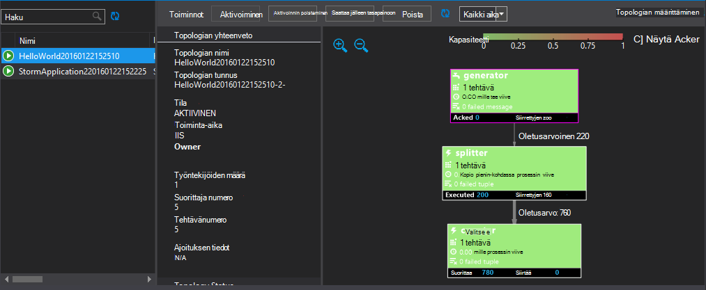

<properties
   pageTitle="Ottaa käyttöön ja hallita Apache myrsky topologioissa HDInsight | Microsoft Azure"
   description="Opettele käyttöön, seurata ja hallita Apache myrsky topologioissa myrsky Raporttinäkymät-ikkunan käyttäminen Hdinsightista. Visual Studio Hadoop työkaluilla."
   services="hdinsight"
   documentationCenter=""
   authors="Blackmist"
   manager="jhubbard"
   editor="cgronlun"
    tags="azure-portal"/>

<tags
   ms.service="hdinsight"
   ms.devlang="java"
   ms.topic="article"
   ms.tgt_pltfrm="na"
   ms.workload="big-data"
   ms.date="10/11/2016"
   ms.author="larryfr"/>

#Käyttöönotto ja Apache myrsky topologioissa Windows-pohjaisesta HDInsight-hallinta

Myrsky Raporttinäkymät-ikkunan avulla voit helposti käyttöön ja suorita HDInsight-klusterin Apache myrsky topologioissa käyttämällä selainta. Koontinäytön avulla voit seurata ja hallita käynnissä topologioissa. Jos käytät Visual Studio, Visual Studio HDInsight-työkalut tarjoavat Visual Studiossa vastaavia toimintoja.

Myrsky Raporttinäkymät-ikkunan ja HDInsight-Työkalut myrsky toimintoja luottavat myrsky REST API, jonka avulla voidaan luoda omia seuranta ja ratkaisujen.

> [AZURE.IMPORTANT] Tässä asiakirjassa vaiheet pätevät Windows-pohjaisesta myrsky, HDInsight-klusterissa. Lisätietoja Linux-pohjaiset klusterin käyttämisestä on artikkelissa [käyttöönotto ja hallita Apache myrsky topologioissa Linux-pohjaiset HDInsight-](hdinsight-storm-deploy-monitor-topology-linux.md)

##Edellytykset

* **Apache myrsky HDInsight-** – katso ohjeet klusterin luominen <a href="../hdinsight-storm-getting-started/" target="_blank">Apache myrsky HDInsight-käytön aloittaminen</a>

* **Myrsky Raporttinäkymät-ikkunan**: Moderni selaimessa, joka tukee HTML5: ssä

* **Visual Studio** - Azure SDK 2.5.1 tai uudempaa versiota ja Visual Studio HDInsight-työkalut. Katso asennetaan ja määritetään HDInsight-Työkalut Visual Studio <a href="../hdinsight-hadoop-visual-studio-tools-get-started/" target="_blank">HDInsight Tools for Visual Studio käytön aloittamisessa</a> .

    Yksi Visual Studio seuraavia versioita:

    * Visual Studio 2012 kanssa <a href="http://www.microsoft.com/download/details.aspx?id=39305" target="_blank">Päivitä 4</a>

    * Visual Studio 2013 <a href="http://www.microsoft.com/download/details.aspx?id=44921" target="_blank">Päivitä 4</a> tai <a href="http://go.microsoft.com/fwlink/?LinkId=517284" target="_blank">Visual Studio 2013 yhteisön</a>

    * <a href="http://visualstudio.com/downloads/visual-studio-2015-ctp-vs" target="_blank">Visual Studio 2015 CTP6</a>

    > [AZURE.NOTE] Tällä hetkellä Visual Studio HDInsight-Työkalut tukevat vain myrsky HDInsight klusterin versio 3,2.

##Myrsky Raporttinäkymät-ikkunan

Myrsky Raporttinäkymät-ikkunan on käytettävissä myrsky-klusterin web-sivu. URL-osoite on **https://&lt;clustername >.azurehdinsight.net/**, jossa **clustername** on oman myrsky HDInsight-klusterissa nimi.

Valitse **Lähetä topologian**myrsky Raporttinäkymät-ikkunan alkuun. Suorita otoksen topologian, lataa ja suorita topologian, jonka loit sivun ohjeiden mukaisesti.

![Lähetä topologian sivulle][storm-dashboard-submit]

###Myrsky Käyttöliittymä

Valitse myrsky Raporttinäkymät-ikkunan **Myrsky Käyttöliittymä** -linkkiä. Tässä näkyvät klusterin lisäksi kaikki käynnissä olevat topologioissa tietoja.

![myrsky-käyttöliittymä][storm-dashboard-ui]

> [AZURE.NOTE] Internet Explorerin versioilla saatat huomata, että myrsky-Käyttöliittymän eivät päivity, käyttämiäsi se ensin. Esimerkiksi se ei ehkä Näytä uusi topologioissa lähettämäsi, tai se voi esittää topologian aktiiviseksi, kun aiemmin käytöstä. Microsoft on tietoinen tästä ongelmasta ja ratkaista parissa.

####Pääsivun

Pääsivulta myrsky käyttöliittymän sisältää seuraavat tiedot:

* **Klusterin yhteenveto**: perustietoja myrsky-klusterin.

* **Topologian yhteenveto**: käynnissä topologioissa luettelo. Tässä osassa linkkien avulla voit tarkastella lisätietoja tietyn topologioissa.

* **Valvojan yhteenveto**: myrsky valvojan tietoja.

* **Nimbus määritys**: klusterin Nimbus määritykset.

####Topologian yhteenveto

Linkin valitseminen **topologian yhteenveto** -osassa näkyvät topologian seuraavat tiedot:

* **Topologian yhteenveto**: perustietoja topologian.

* **Topologian toiminnot**: hallinnan toiminnot, jotka voit tehdä topologian.

    * **Aktivoi**: ansioluettelot käsittely käytöstä topologian.

    * **Poista aktivointi**: pysäyttää käynnissä topologian.

    * **Saattaa jälleen tasapainoon**: säätää topologian rinnakkaisuus. Sinun pitäisi saattaa jälleen tasapainoon käynnissä topologioissa sen jälkeen, kun olet muuttanut klusterin solmujen määrän. Näin topologian Säädä rinnakkaisuus korvaamaan klusterin solmut kasvaa tai pienentyä määrän.

        Lisätietoja on kohdassa <a href="http://storm.apache.org/documentation/Understanding-the-parallelism-of-a-Storm-topology.html" target="_blank">tietoa myrsky topologian rinnakkaisuus</a>.

    * **Lopettaa**: myrsky topologian päättyy määritetyn aikakatkaisun jälkeen.

* **Topologian tilasto**: topologian tilastoja. **Ikkuna** -sarakkeen linkkien avulla voit määrittää jäljellä olevat tapahtumat ajankohta sivulla.

* **Spouts**: topologian käyttämä spouts. Tässä osassa linkkien avulla voit tarkastella tietyn spouts lisätietoja.

* **Bolts**: topologian käyttämä Pultit. Tässä osassa linkkien avulla voit tarkastella tietyn Pultit lisätietoja.

* **Topologian määrittäminen**: valitun topologian määrittäminen.

####Nokkaan ja lukko yhteenveto

Valitsemalla nokkaan **Spouts** tai **Bolts** osat näyttää valitun kohteen seuraavat tiedot:

* **Osan yhteenveto**: perustietoja nokkaan tai lukko.

* **Nokkaan/lukko tilasto**: nokkaan tai lukko tilastoja. **Ikkuna** -sarakkeen linkkien avulla voit määrittää jäljellä olevat tapahtumat ajankohta sivulla.

* **Syötteen tilasto** (vain lukita): laitteen käyttämä syötteen virtaa tietoja.

* **Tulosteen tilasto**: Tämä lähettämän virtaa tietoja spout tai lukita.

* **Pesänselvittäjät**: tietoja nokkaan tai lukko esiintymät. Valitse tietyn suorittaja, voit tarkastella valmistettu tässä esiintymässä vianmääritystiedot loki **portin** .

* **Virheet**: Tämä virhe mitään tietoja spout tai lukita.

##HDInsight Tools for Visual Studio

HDInsight-työkalujen avulla voidaan lähettää C#- tai hybrid topologioissa myrsky-klusterin. Esimerkkisovelluksen avulla seuraavasti. Katso tietoja luomisesta oman topologioissa HDInsight-painikkeilla [C kehittää # topologioissa Visual Studio HDInsight-työkalujen avulla](hdinsight-storm-develop-csharp-visual-studio-topology.md).

Seuraavien vaiheiden avulla voit otoksen käyttöön oman myrsky HDInsight-klusterissa sitten tarkastella ja hallita topologian.

1. Jos et ole asentanut uusimman version HDInsight-Työkalut Visual Studio, katso <a href="../hdinsight-hadoop-visual-studio-tools-get-started/" target="_blank">käyttäminen HDInsight Tools for Visual Studio</a>.

2. Avaa Visual Studiossa, valitse **Tiedosto** > **Uusi** > **projektin**.

3. Laajenna **Uusi projekti** -valintaikkunassa **asennetut** > **Mallit**ja valitse sitten **Hdinsightista**. Valitse Mallit-luettelosta **Myrsky malli**. Kirjoita sovelluksen nimi-valintaikkunan alareunassa.

    

1. **Ratkaisunhallinnassa**projektin hiiren kakkospainikkeella ja valitse **Lähetä myrsky HDInsight**.

    > [AZURE.NOTE] Kirjoita pyydettäessä Azure tilauksen kirjautumisen tunnistetiedot. Jos sinulla on useita tilauksia, kirjaudu haluamasi vaihtoehto, joka sisältää oman myrsky HDInsight-klusterissa.

2. Valitse oman myrsky HDInsight-klusterissa **Myrsky klusterin** avattavasta luettelosta ja valitse sitten **Lähetä**. Voit valvoa onko lähetys onnistuu käyttämällä **kohde** -ikkunassa.

3. Kun topologian on lähetetty, **Myrsky topologioissa** klusterin pitäisi näkyä. Valitse topologian liittyviä tietoja käynnissä topologian luettelosta.

    

    > [AZURE.NOTE] Voit myös tarkastella **Myrsky topologioissa** **Server** Explorerista laajentamalla **Azure** > **HDInsight**- ja sitten myrsky HDInsight-klusterissa hiiren kakkospainikkeella ja valitsemalla **Näytä myrsky topologioissa**.

    Valitse muoto, spouts tai Pultit liittyviä tietoja komponentit. Uusi ikkuna avautuu jokaisen osa on valittuna.
    
    > [AZURE.NOTE] Topologian on topologian luokkanimi (Tässä tapauksessa `HelloWord`,) ja aikaleiman, joka on lisätty.

4. Valitse **Topologian yhteenveto** -näkymässä voit lopettaa topologian **lopettaa** .

    > [AZURE.NOTE] Myrsky topologioissa edelleen käytössä, kunnes ne on lopetettu tai klusterin poistetaan.

##REST-OHJELMOINTIRAJAPINNALLA

Myrsky-Käyttöliittymän rakentuu REST-Ohjelmointirajapinnalla, jotta voit suorittaa vastaavat hallintaan ja valvontaan toimintoja käyttämällä REST-Ohjelmointirajapinnalla. REST-Ohjelmointirajapinnalla avulla voit luoda mukautettuja työkaluja myrsky topologioissa seuranta ja hallinta.

Lisätietoja on artikkelissa [Myrsky Käyttöliittymän REST API](https://github.com/apache/storm/blob/0.9.3-branch/STORM-UI-REST-API.md). Seuraavassa on REST-Ohjelmointirajapinnalla käyttäminen Apache myrsky-Hdinsightista.

###Base URI

Perus HDInsight klustereiden REST-Ohjelmointirajapinta-URI on **https://&lt;clustername >.azurehdinsight.net/stormui/api/v1/**, jossa **clustername** on oman myrsky HDInsight-klusterissa nimi.

###Todennus

REST API-pyynnöt käytettävä **perustodentamista**, niin voit käyttää HDInsight klusterin järjestelmänvalvojan käyttäjänimeä ja salasanaa.

> [AZURE.NOTE] Koska perustodentamista on lähetetty käyttämällä pelkkänä tekstinä, sinun tulee **aina** käyttöön HTTPS suojaamiseen klusterin tietoliikennetapahtumat.

###Palautettavat arvot

Tietoja, joka palautetaan REST-Ohjelmointirajapinnan on ehkä vain käytettävä klusteriin tai samaan Azure Virtual verkossa kuin klusterin näennäiskoneiden. Esimerkiksi täydellinen toimialuenimi (FQDN) palautti Zookeeper palvelimia ei voi käyttää Internetissä.

##Seuraavat vaiheet

Nyt kun olet tutustunut käyttöönotto ja seurata topologioissa myrsky hallintanäkymässä, katso, miten voit:

* [C# topologioissa Visual Studio HDInsight-työkaluilla kehittäminen](hdinsight-storm-develop-csharp-visual-studio-topology.md)

* [Kehitä Java-pohjainen topologioissa käyttämällä maven-testi](hdinsight-storm-develop-java-topology.md)

Katso Lisää Esimerkki topologioissa luettelo on [Esimerkki topologioissa myrsky HDInsight-varten](hdinsight-storm-example-topology.md).

[hdinsight-dashboard]: ./media/hdinsight-storm-deploy-monitor-topology/dashboard-link.png
[storm-dashboard-submit]: ./media/hdinsight-storm-deploy-monitor-topology/submit.png
[storm-dashboard-ui]: ./media/hdinsight-storm-deploy-monitor-topology/storm-ui-summary.png
