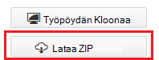
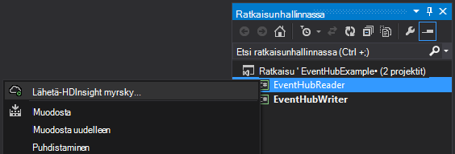
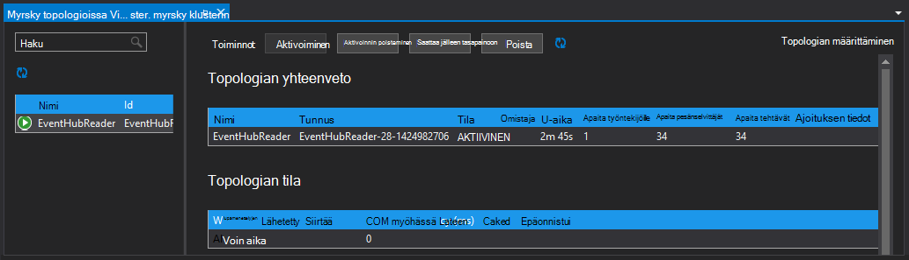

<properties
   pageTitle="Käsittele tapahtuman lihavoituna myrsky HDInsight-tapahtumia | Microsoft Azure"
   description="Opettele käsittelemään keskittimet tapahtuman tiedot ja Visual Studio HDInsight-työkaluilla Visual Studiossa luodut myrsky C#-topologian."
   services="hdinsight,notification hubs"
   documentationCenter=""
   authors="Blackmist"
   manager="jhubbard"
   editor="cgronlun"/>

<tags
   ms.service="hdinsight"
   ms.devlang="dotnet"
   ms.topic="article"
   ms.tgt_pltfrm="na"
   ms.workload="big-data"
   ms.date="10/27/2016"
   ms.author="larryfr"/>

# Tapahtuman Azure HDInsight (C#)-myrsky lihavoituna tapahtumia prosessi

Azure tapahtuman keskittimet voit käsitellä mahdutettavia sivustot, sovellusten ja laitteiden tietoja. Tapahtuman keskittimet nokkaan on helppo käyttää Apache myrsky ja analysoida reaaliaikaisesti HDInsight. Voit myös kirjoittaa tietoja tapahtuman porttiin myrsky-tapahtuman keskittimet lukko avulla.

Tässä opetusohjelmassa opit käyttämään HDInsight Tools for Visual Studio ja Visual Studio valmista Luo kaksi topologioissa Azure tapahtuman keskittimet kanssa toimivat.

* **EventHubWriter**: Luo tiedot ja kirjoittaa tapahtuman porttiin satunnaisesti

* **EventHubReader**: lukee tiedot tapahtuman keskittimet ja kirjaa tietoja myrsky-lokit

> [AZURE.NOTE] Kun tämän asiakirjan vaiheet ovat riippuvaisia Windows kehitysympäristö Visual Studiossa, käännetty projektin voidaan lähettää Linux- tai Windows-pohjaisesta HDInsight-klusterin. Linux-pohjaiset klustereiden luoda vain 10/28/2016 tuki jälkeen SCP.NET topologioissa.
>
> Jos haluat käyttää C#-topologian Linux-pohjaiset klusterin, sinun on päivitettävä Microsoft.SCP.Net.SDK NuGet paketin käyttämä projektin 0.10.0.6 versioon tai sitä uudemmassa versiossa. Paketin versio on myös vastattava myrsky HDInsight asennettuihin pääversion. Esimerkiksi myrsky HDInsight-versioiden 3.3 ja 3.4 käyttämällä myrsky versio 0.10.x HDInsight 3.5 käyttää myrsky 1.0.x.
> 
> Topologioissa C#-Linux-pohjaiset klustereiden Käytä .NET 4.5, ja käyttää Mono HDInsight-klusterin. Useimmat toimivat, mutta kannattaa tarkistaa mahdolliset yhteensopivuusongelmia [Mono yhteensopivuuden](http://www.mono-project.com/docs/about-mono/compatibility/) asiakirjan.
>
> Tämä projekti, joka toimii myös Linux- tai Windows-pohjaisia klusterissa, Java-versio on [prosessin tapahtumia Azure tapahtuman lihavoituna myrsky-HDInsight (Java)](hdinsight-storm-develop-java-event-hub-topology.md).

## Edellytykset

* [Apache myrsky HDInsight-klusterissa](hdinsight-apache-storm-tutorial-get-started.md)

* [Azure tapahtumaa-toiminnossa](../event-hubs/event-hubs-csharp-ephcs-getstarted.md)

* [Azure .NET SDK-paketissa](http://azure.microsoft.com/downloads/)

* [HDInsight Tools for Visual Studio](hdinsight-hadoop-visual-studio-tools-get-started.md)

## Valmiin projektin

Voit ladata tämän opetusohjelman GitHub luotu projektin täyden version: [eventhub-myrsky-yhdistelmä](https://github.com/Azure-Samples/hdinsight-dotnet-java-storm-eventhub). Kuitenkin yhä haluat säätää asetuksia noudattamalla tässä opetusohjelmassa.

## Tapahtuman keskittimet nokkaan ja lukko

Tapahtuman keskittimet spout ja ovat bolt Java-komponentteja, jotta voit käsitellä helposti tapahtuman keskittimet Apache myrsky. Vaikka komponentit on kirjoitettu Java-Visual Studio HDInsight-työkalujen avulla voit luoda hybrid topologioissa, sekoitetaan C#- ja Java-osia.

Nokkaan ja lukko jaetaan yksittäisen Java arkisto (.jar)-tiedostona nimeltä **eventhubs-storm-spout-#.#-jar-with-dependencies.jar**, jossa #. # on tiedoston version.

### Lataa .jar-tiedosto

Purkki tiedoston uusimman version sisältyy [HDInsight myrsky esimerkkejä](https://github.com/hdinsight/hdinsight-storm-examples) projektin **lib/eventhubs** -kansiossa. Lataa tiedosto jollakin seuraavista tavoista.

> [AZURE.NOTE] Nokkaan ja lukko lähetettyjen merkitsemiseen Apache myrsky Projectissa. Lisätietoja on artikkelissa [MYRSKY 583: alkuperäinen sisäänkuittauksen myrsky tapahtuman keskittimet](https://github.com/apache/storm/pull/336/files) -GitHub.

* **Lataa ZIP-tiedosto**: [HDInsight myrsky esimerkkejä](https://github.com/hdinsight/hdinsight-storm-examples) -sivustosta, valitse oikeanpuoleisessa ruudussa Lataa .zip-tiedosto, joka sisältää projektin **Lataa ZIP** .

    

    Kun tiedosto on ladattu, voit purkaa arkisto ja tiedosto päivitetään **lib** hakemistossa.

* **Kloonaa projektin**: Jos sinulla on asennettu [Git](http://git-scm.com/) , käytä seuraavaa komentoa Kloonaa säilö paikallisesti ja valitse Etsi jaettava tiedosto **lib** hakemistossa.

        git clone https://github.com/hdinsight/hdinsight-storm-examples

## Tapahtuman keskittimet määrittäminen

Tapahtuman keskittimet on tässä esimerkissä tietolähde. Käytä tietoja [tapahtuman keskittimet käytön aloittaminen](../event-hubs/event-hubs-csharp-ephcs-getstarted.md) -asiakirjan __luominen tapahtumaa-toiminnossa__ -osassa.

3. Kun tapahtumaa-toiminnossa on luotu, Näytä EventHub sivu Azure-portaalissa ja valitse __jaettu access käytännöt__. __+ Lisää__ tapahtuma avulla voit lisätä käytettävissään seuraavat käytännöt:

  	| Nimi | Käyttöoikeudet |
  	| ----- | ----- |
  	| Writer | Lähetä |
  	| Lukija | Kuuntele |

    

5. Valitse __reader__ ja __kirjoittajan__ käytännöt. Kopioida ja tallentaa sekä käytännöt __PERUSAVAIMEN__ arvoa nämä käytetään myöhemmin.

## Määritä EventHubWriter

1. Jos et ole asentanut uusimman version HDInsight-Työkalut Visual Studio, katso [käyttäminen HDInsight Tools for Visual Studio](hdinsight-hadoop-visual-studio-tools-get-started.md).

2. Lataa ratkaisu [eventhub-myrsky-yhdistelmä](https://github.com/Azure-Samples/hdinsight-dotnet-java-storm-eventhub). Avaa ratkaisu ja kestää jonkin aikaa, voit selata __EventHubWriter__ projektin koodi.

4. __EventHubWriter__ Projectissa Avaa __App.config__ -tiedostoa. Tapahtuma-toiminnosta aiemmin määritetty tietojen avulla voit täyttää seuraavat Avaintyypit arvo:

  	| Avain | Arvo |
  	| ----- | ----- |
  	| EventHubPolicyName | Writer (Jos olet käyttänyt eri nimellä käytännön _Lähetä_ käyttöoikeudet, käytä sen sijaan.) |
  	| EventHubPolicyKey | Kirjoittaja-käytäntö näppäintä |
  	| EventHubNamespace | Nimitilan, joka sisältää tapahtumaa-toiminnossa |
  	| EventHubName | Nimesi tapahtumaa-toiminnossa |
  	| EventHubPartitionCount | Tapahtuma-toiminnossa osioiden määrää |

4. Tallenna ja sulje **App.config** -tiedostoa.

## Määritä EventHubReader

1. Avaa __EventHubReader__ -projekti ja kestää muutaman momoents, voit selata koodi.

2. Avaa __App.config__ __EventHubWriter__. Tapahtuma-toiminnosta aiemmin määritetty tietojen avulla voit täyttää seuraavat Avaintyypit arvo:

  	| Avain | Arvo |
  	| ----- | ----- |
  	| EventHubPolicyName | Lukija (Jos olet käyttänyt eri nimellä käytännön _kuunnella_ käyttöoikeudet, käytä sen sijaan.) |
  	| EventHubPolicyKey | Lukija-käytäntö näppäintä |
  	| EventHubNamespace | Nimitilan, joka sisältää tapahtumaa-toiminnossa |
  	| EventHubName | Nimesi tapahtumaa-toiminnossa |
  	| EventHubPartitionCount | Tapahtuma-toiminnossa osioiden määrää |

3. Tallenna ja sulje **App.config** -tiedostoa.

## Käyttöönotto topologioissa

1. **Ratkaisunhallinnassa** **EventHubReader** projektin hiiren kakkospainikkeella ja valitse **Lähetä myrsky-Hdinsightista**.

    

2. Valitse **Lähetä topologian** -ruudun kohdassa **Myrsky klusterin**. Laajenna **Lisäasetuksia**, valitse **Java tiedostopolkujen**, valitse **...** ja valitse kansio, joka sisältää aiemmin lataamaasi **eventhubs-storm-spout-0.9-jar-with-dependencies.jar** tiedostoa. Valitse lopuksi **Lähetä**.

    

3. Kun topologian raportoidut **Myrsky topologioissa Viewer** tulee näkyviin. Valitse vasemmanpuoleisessa ruudussa topologian tilastojen **EventHubReader** topologian. Mitään pitäisi olla näistä tällä hetkellä, koska tapahtumia ei ole kirjoitettu tapahtuman porttiin vielä.

    

4. **Ratkaisunhallinnassa** **EventHubWriter** projektin hiiren kakkospainikkeella ja valitse **Lähetä myrsky-Hdinsightista**.

2. Valitse **Lähetä topologian** -ruudun kohdassa **Myrsky klusterin**. Laajenna **Lisäasetuksia**, valitse **Java tiedostopolkujen**, valitse **...** ja valitse aiemmin lataamaasi **eventhubs-storm-spout-0.9-jar-with-dependencies.jar** tiedoston sisältävä kansio. Valitse lopuksi **Lähetä**.

5. Kun topologian on lähetetty, Päivitä topologian **Myrsky topologioissa Viewer** , varmista, että molemmat topologioissa suoritetaan klusterin.

6. Valitse **Myrsky topologioissa Viewerin** **EventHubReader** topologian.

4. Kaavionäkymä Kaksoisnapsauta __LogBolt__ -osa. Laitteen __Osan yhteenveto__ -sivu avautuu.

3. Valitse __pesänselvittäjät__ -osassa jokin __Port (portti)__ -sarakkeen linkkiä. Osan tallentamat tiedot tulevat näkyviin. Kirjautuneena tiedot seuraavankaltaiselta:

        2016-10-20 13:26:44.186 m.s.s.b.ScpNetBolt [INFO] Processing tuple: source: com.microsoft.eventhubs.spout.EventHubSpout:7, stream: default, id: {5769732396213255808=520853934697489134}, [{"deviceId":3,"deviceValue":1379915540}]
        2016-10-20 13:26:44.234 m.s.s.b.ScpNetBolt [INFO] Processing tuple: source: com.microsoft.eventhubs.spout.EventHubSpout:7, stream: default, id: {7154038361491319965=4543766486572976404}, [{"deviceId":3,"deviceValue":459399321}]
        2016-10-20 13:26:44.335 m.s.s.b.ScpNetBolt [INFO] Processing tuple: source: com.microsoft.eventhubs.spout.EventHubSpout:6, stream: default, id: {513308780877039680=-7571211415704099042}, [{"deviceId":5,"deviceValue":845561159}]
        2016-10-20 13:26:44.445 m.s.s.b.ScpNetBolt [INFO] Processing tuple: source: com.microsoft.eventhubs.spout.EventHubSpout:7, stream: default, id: {-2409895457033895206=5479027861202203517}, [{"deviceId":8,"deviceValue":2105860655}]

## Lopeta topologioissa

Lopeta topologioissa, valitse kunkin topologian **Myrsky topologian Viewer**-ja valitse sitten **lopettaa**.

## Poista yhteyttä klusterin

[AZURE.INCLUDE [delete-cluster-warning](../../includes/hdinsight-delete-cluster-warning.md)]

## Huomautuksia

### Checkpointing

EventHubSpout säännöllisesti tarkistuspisteet tilaan Zookeeper-solmu, joka tallentaa nykyisen siirtymä viestien lukeminen jonossa. Näin osan toimittamista viestien tallennetun osoitteesta seuraavissa tilanteissa:

* Komponentin esiintymä epäonnistuu, ja se on käynnistettävä uudelleen.

* Suurenna tai Pienennä klusterin lisäämällä tai poistamalla solmujen.

* Topologian on lopetettu ja käynnistetään uudelleen **saman niminen**.

Voit myös viedä ja tuoda pysyviä tarkistuspisteet WASB (Azure tallennustilaan käyttämä HDInsight-klusterin.) Voit tehdä tämän komentosarjat sijaitsevat HDInsight-klusterissa on **c:\apps\dist\storm-0.9.3.2.2.1.0-2340\zkdatatool-1.0\bin**myrsky.

>[AZURE.NOTE] Versionumero polun voi vaihdella, kuten myrsky klusterin asennettu versio voi muuttua myöhemmin.

Tässä kansiossa komentosarjat ovat:

* **stormmeta_import.cmd**: kaikki myrsky metatiedot tuominen Zookeeper klusterin oletusarvon tallennustilan säilö.

* **stormmeta_export.cmd**: kaikki myrsky metatiedot vieminen klusterin oletusarvon tallennustilan säiliön Zookeeper.

* **stormmeta_delete.cmd**: kaikki myrsky metatietojen poistaminen Zookeeper.

Vie tuonti sallii jatkuvat tarkistuspiste tiedot, kun haluat poistaa klusterin, mutta haluat jatkaa käsittely-toiminnossa kuluvan siirtymä, kun yhdistät uuden klusterin online-tilaan.

> [AZURE.NOTE] Koska tiedot on samanlainen oletusarvon tallennustilan säilö, uusi klusterin **on** käytettävä saman tallennustilan tilin ja säilö kuin edellinen klusterin.

## Seuraavat vaiheet

Tässä asiakirjassa on asiat Java tapahtuman keskittimet Spout ja lukko-C#-topologian käyttäminen Azure tapahtumaa-toiminnossa. Lisätietoja C# topologioissa luomisesta on seuraavissa artikkeleissa.

* [Kehitä C# topologioissa Apache myrsky käyttöön Visual Studiossa Hdinsightiin](hdinsight-storm-develop-csharp-visual-studio-topology.md)

* [SCP ohjelmoinnin opas](hdinsight-storm-scp-programming-guide.md)

* [Esimerkki topologioissa myrsky HDInsight-varten](hdinsight-storm-example-topology.md)
 
