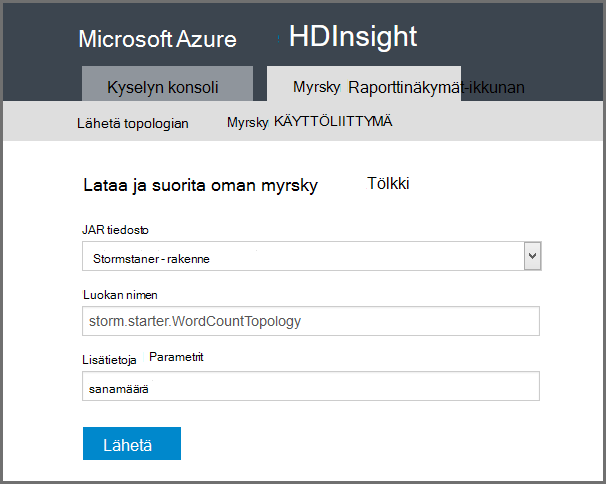

<properties
    pageTitle="Johdanto Apache myrsky HDInsight | Microsoft Azure"
    description="Tutustu sovelluksen Apache myrsky ja tietoja siitä, miten voit käyttää myrsky HDInsight reaaliaikaisia tietoja analytics-ratkaisuja pilveen."
    services="hdinsight"
    documentationCenter=""
    authors="Blackmist"
    manager="jhubbard"
    editor="cgronlun"
    tags="azure-portal"/>

<tags
   ms.service="hdinsight"
   ms.devlang="na"
   ms.topic="get-started-article"
   ms.tgt_pltfrm="na"
   ms.workload="big-data"
   ms.date="10/11/2016"
   ms.author="larryfr"/>

#Johdanto Apache myrsky HDInsight-: Hadoop reaaliaikainen analysointitietoja

Apache myrsky HDInsight-avulla voit luoda eri aikajaksoille, reaaliaikainen analytics-ratkaisujen Azure-ympäristössä [Apache Hadoop](http://hadoop.apache.org)avulla.

##Mikä on Apache myrsky?

Apache myrsky on jaettu, vikasietoinen, Avaa lähde laskenta-järjestelmä, jonka avulla voit käsitellä tietoja Hadoop reaaliaikaisesti. Myrsky ratkaisuja voit myös lisätä tietojen, taattua käsittely mahdollisuuden toista tiedot, joita ei voitu käsitellä ensimmäisen kerran.

##Mitä hyötyä myrsky HDInsight?

Apache myrsky HDInsight-on integroitu Azure-ympäristöön hallitun klusterin. Se sisältää seuraavat tärkeät edut:

* Suorittaa hallitun palveluna kerta 99,9 % SLA

* Käytä valittua kieltä: myrsky osien kirjoitettu **Java**, **C#**ja **Python** tuki

    * Tukee useita kieliä ohjelmointi: Lue tietoja käyttämällä Java ja käsitellä sen C#
    
        > [AZURE.NOTE] C# topologioissa tuetaan vain Windows-pohjaisesta HDInsight klustereiden.

    * Käytä **Trident** Java-liittymän luomiseen myrsky topologioissa, jotka tukevat "täsmälleen kun" viestejä, "tapahtumien" datastore pysyvyys ja yleisiä stream analytics toimintojen joukko käsittely

* Skaalaa ylöspäin ja skaalaus-luettelosta ominaisuuksia: Skaalaa HDInsight klusteri ja vaikutusta myrsky topologioissa käynnissä

* Integroi Azure muiden palvelujen, kuten tapahtumaa-toiminnossa, Azure Virtual Network, SQL-tietokantaan, Blob-säiliö ja DocumentDB

    * Yhdistää useita HDInsight klustereiden ominaisuuksia käyttämällä Azure Virtual Network: analyyttisten putkistot, jotka käyttävät HDInsight HBase ja Hadoop klustereiden luominen

Yrityksille, jotka käyttävät Apache myrsky niiden reaaliaikainen analytics-ratkaisuja luettelo on artikkelissa [Yritysten käyttämällä Apache myrsky](https://storm.apache.org/documentation/Powered-By.html).

Aloita käyttäminen myrsky-kohdasta [aloittaminen myrsky HDInsight-][gettingstarted].

###Helppokäyttötoiminnot valmistelu

Voit valmistella uuden myrsky HDInsight-klusterissa minuutteina. Määritä klusterinimeä, kokoa, järjestelmänvalvojatilin ja tallennustilaa-tili. Azure Luo klusterin, mukaan lukien otoksen topologioissa ja web hallinta Raporttinäkymät-ikkunan.

> [AZURE.NOTE] Voit myös valmistella klustereiden myrsky [Azure CLI](../xplat-cli-install.md) tai [PowerShellin Azure](../powershell-install-configure.md).

15 minuutin lähetetään pyyntö sinulla on uuden myrsky-klusterin käynnissä ja valmis etu reaaliaikainen analytics putkijohto.

###Käytön helppous

__Varten Linux-pohjaiset myrsky HDInsight klustereiden käyttöön__, voit muodostaa yhteyden klusterin SSH ja käytä `storm` komento ja hallita topologioissa. Lisäksi voit valvoa myrsky-palveluun ja seurata ja hallita käynnissä topologioissa myrsky Käyttöliittymän Ambari.

Lisätietoja Linux-pohjaiset myrsky klustereiden käsittelemisestä on artikkelissa [Apache myrsky Linux-pohjaiset HDInsight-käytön aloittaminen](hdinsight-apache-storm-tutorial-get-started-linux.md).

__Windows-pohjainen myrsky-HDInsight klustereiden__Visual Studio HDInsight-työkalujen avulla voit luoda C# ja hybrid C# / Java topologioissa ja lähettää ne sitten oman myrsky HDInsight-klusterissa.  

HDInsight Tools for Visual Studio sisältää myös käyttöliittymän, jonka avulla voit seurata ja hallita myrsky topologioissa klusterissa.

Esimerkki HDInsight työkaluilla voit luoda myrsky-sovelluksen Katso [kehittää C# myrsky topologioissa Visual Studio HDInsight-työkaluja](hdinsight-storm-develop-csharp-visual-studio-topology.md).

Saat lisätietoja Visual Studio HDInsight-työkalujen [käyttäminen Visual Studio HDInsight-Työkalut](../HDInsight/hdinsight-hadoop-visual-studio-tools-get-started.md).

Kunkin myrsky HDInsight-klusterissa on myös verkkopohjaisia myrsky Raporttinäkymät-ikkunan, jonka avulla voit lähettää, seurata ja hallita myrsky topologioissa klusterin käytössä.

Saat lisätietoja myrsky hallintanäkymässä [käyttöönotto ja hallita Apache myrsky topologioissa HDInsight-](hdinsight-storm-deploy-monitor-topology.md).

Myrsky HDInsight-sisältää myös helposti integrointi Azure tapahtuman keskittimet **Tapahtumaa-toiminnossa Spout**kautta. Tämän osan uusin versio on saatavilla kohdassa [https://github.com/hdinsight/hdinsight-storm-examples/tree/master/lib/eventhubs](https://github.com/hdinsight/hdinsight-storm-examples/tree/master/lib/eventhubs). Saat lisätietoja tämän osan seuraavat asiakirjat.

* [C#-topologian, joka käyttää Azure tapahtuman keskittimet kehittäminen](hdinsight-storm-develop-csharp-event-hub-topology.md)

* [Java-topologian, joka käyttää Azure tapahtuman keskittimet kehittäminen](hdinsight-storm-develop-java-event-hub-topology.md)

###Luotettavuuden

Aina Apache myrsky takaa, että jokaisen saapuneen viestin täysin käsitellään, vaikka tietojen analysointi on levitä solmujen satoja.

**Nimbus solmu** tarjoaa samankaltaisia toimintoja Hadoop-JobTracker ja määrittää tehtäviä solmujen **Zookeeper**klusterissa. Zookeeper solmujen tarjoavat klusterin yhteensovittamisesta ja Nimbus ja **valvojan** prosessin työntekijä solmuissa välisen helpottamiseksi. Jos yksi käsittely-solmu menee Nimbus-solmu saa ilmoituksen ja toisen solmun määrittää tehtävän ja siihen liittyvät tiedot.

Apache myrsky oletusarvon mukainen määritys on vain yksi Nimbus solmu. Myrsky HDInsight-suorittaa kaksi Nimbus solmujen. Jos ensisijainen solmu epäonnistuu, HDInsight-klusterin siirtyy toissijaisen solmun samalla, kun ensisijainen solmu on palautettu.

###Asteikko

Vaikka voit määrittää näkyvien solmujen määrän yhteyttä klusterin luonnin aikana, haluat ehkä Suurenna tai Pienennä klusterin vastaamaan työmäärää. Kaikki HDInsight klustereiden Salli-klusterin solmujen määrän vaikka tietojen käsittelemistä.

> [AZURE.NOTE] Uusien solmujen lisätä skaalaus hyödyntää, tarvitset saattaa jälleen tasapainoon topologioissa aloittanut klusteri on entistä parempi.

###Tuki

Myrsky HDInsight-sisältyy koko yritystason 24/7 tuki. Myrsky-Hdinsightista on myös 99,9 % SLA. Tämä tarkoittaa on varmistaa, että klusterin on ulkoinen yhteys vähintään 99,9 % aika.

##Yleisiä Käytä tapauksissa reaaliaikainen analysoinnissa

Seuraavassa on muutamia yleisiä tilanteita, joissa, jonka voit käyttää Apache myrsky HDInsight. Lisätietoja tosielämän skenaariot lukea [miten myrsky käyttävät yritykset](https://storm.apache.org/documentation/Powered-By.html).

* Internet-kohteita (IoT)
* Ilmoituksen tunnistus
* Sosiaaliset analytics
* Pura, muunna lataaminen (ETL)
* Verkon seuranta
* Haku
* Mobiili välitys

##Miten tietojen HDInsight myrsky käsitellään?

Apache myrsky suorittaa **topologioissa** MapReduce työt, jotka sinulla on oltava kokemusta HDInsight tai Hadoop sijaan. Myrsky HDInsight-klusterissa on kahdentyyppisiä solmujen: head solmut, jotka suoritetaan **Nimbus** ja työntekijä solmut, jotka suoritetaan **esimies**.

* **Nimbus**: samoin kuin JobTracker Hadoop-, se on vastuussa jakaminen klusterin koko koodi ja tehtävien määrittäminen näennäiskoneiden epäonnistumiseen seuranta. Hdinsightiin sisältää kahden Nimbus solmujen niin ei ole yksittäisen kohdan myrsky HDInsight-virhe

* **Valvojan**: kunkin työntekijän solmun valvojan on vastuussa käynnistäminen ja lopettaminen **Työntekijä prosessit** solmun.

* **Työntekijän prosessi**: suoritetaan **topologian**alijoukkoa. Käynnissä olevat topologian jaetaan useiden työntekijöiden prosessien klusterin koko.

* **Topologian**: määrittää, joka käsittelee **virtaa** tietojen laskenta-kaaviota. Toisin kuin MapReduce työt topologioissa käytössä, kunnes ne lopetetaan.

* **Virta**: **monikot**sitomattoman kokoelma. Virtaa on valmistettu **spouts** ja **bolts**ja ne ovat kulutettu **bolts**mukaan.

* **Monikon**: nimetyt dynaamisesti kirjoitetun arvoluettelon.

* **Spout**: siinä käytetään tiedot tietolähteestä ja vähintään yhden **virtaa**tietokoneesta kuuluu äänimerkki.

    > [AZURE.NOTE] Monissa tapauksissa tietoja luetaan jono, kuten Kafka, Azure palvelun Bus olevien tai tapahtuman keskittimet. Jonossa varmistaa tietoja säilytetään, jos on käyttökatkosta.

* **Lukko**: siinä käytetään **virtaa**ja suorittaa käsittely **monikot** **virtaa**voivat lähettää. Pultit on myös vastuussa ulkoisen tallennuspaikkaa, kuten jonossa, HDInsight, HBase, blob tai muita tietovaraston kirjoittaminen.

* **Apache Thrift**: ohjelmiston kehys skaalattava usean kielen palvelun kehittämiseen. Sen avulla voit luoda palvelut, jotka toimivat C++, Java, Python, PHP, Ruby, Erlang, Perl, Haskell, C#, kaakaota, JavaScript, Node.js, Smalltalk ja muilla kielillä.

    * **Nimbus** on Thrift palvelu ja **topologian** on Thrift-määritys, joten on mahdollista kehittää topologioissa erilaisilla ohjelmoinnin kieliä.

Saat lisätietoja myrsky osien [myrsky opetusohjelma] [ apachetutorial] apache.org-palvelussa.

##Ohjelmoinnin kielipakettien voi käyttää?

HDInsight-klusterissa myrsky tukee C#, Java ja Python.

### K & #35;

Visual Studio HDInsight-työkalujen avulla voit suunnitella ja toteuttaa on verkkotopologia C# .NET-kehittäjille. Voit myös luoda hybrid topologioissa, jotka käyttävät Java- ja C#-komponentteja.

Lisätietoja on artikkelissa [topologioissa C kehittää # Apache myrsky Visual Studiossa HDInsight-varten](hdinsight-storm-develop-csharp-visual-studio-topology.md).

###Java

Useimmat Java esimerkeissä käytössä ilmenee on tavallista Javan tai Trident. Trident on korkean tason otetaan, joka on helppo tehdä seuraavia toimintoja, kuten liitosten koosteet ryhmittely ja suodatus. Kuitenkin Trident toimii monikot, erissä olisi raaka Java-ratkaisun käsittelee stream yhden monikon kerrallaan.

Saat lisätietoja Trident [Trident opetusohjelma](https://storm.apache.org/documentation/Trident-tutorial.html) osoitteessa apache.org.

Java- ja Trident topologioissa esimerkkejä on artikkelissa HDInsight-klusterin [Esimerkki myrsky topologioissa luettelo](hdinsight-storm-example-topology.md) tai myrsky starter-esimerkkejä.

Esimerkkejä myrsky starter sijaitsevat Linux-pohjaiset klustereiden __/usr/hdp/current/storm-client/contrib/storm-starter__ -kansio ja Windows-pohjaisesta klustereiden **%storm_home%\contrib\storm-starter** -kansio.

##Mitkä ovat joitakin yleisiä kehittäminen kuviot?

###Taattua viestin käsittely

Myrsky tarjota taattua käsittely eri tasoja. Esimerkiksi basic myrsky-sovellus voi taata osoitteessa ainakin kerran-käsittely ja Trident voi taata täsmälleen-käsittelyn kerran.

Lisätietoja [tietojen käsittely-oikeudet](https://storm.apache.org/about/guarantees-data-processing.html) osoitteessa apache.org.

###IBasicBolt

Kuvion lukemisen syötteen monikon, jossa nolla tai Lisää monikot ja sitten acking syötteen monikon heti execute-menetelmä lopussa on hyvin yleisiä ja myrsky tarjoaa [IBasicBolt](https://storm.apache.org/apidocs/backtype/storm/topology/IBasicBolt.html) -käyttöliittymän, voit automatisoida tätä mallia.

###Yhdistää

Liittyminen kaksi virtaa tiedot vaihtelevat sovelluksesta toiseen. Esimerkiksi voi yhdistää useita virtaa-kunkin monikon yhdeksi yhden uuden stream tai voit yhdistää vain tietyt ikkunan monikot erissä. Kummassakin tapauksessa liittyminen onnistuu käyttämällä [fieldsGrouping](http://javadox.com/org.apache.storm/storm-core/0.9.1-incubating/backtype/storm/topology/InputDeclarer.html#fieldsGrouping%28java.lang.String,%20backtype.storm.tuple.Fields%29), joka on keino määrittäminen, miten monikot reititetään Pultit.

Java seuraavassa esimerkissä fieldsGrouping käytetään monikot, jotka ovat peräisin osat "1", "2" ja "3" **MyJoiner** kaikissa reitittänyt.

    builder.setBolt("join", new MyJoiner(), parallelism) .fieldsGrouping("1", new Fields("joinfield1", "joinfield2")) .fieldsGrouping("2", new Fields("joinfield1", "joinfield2")) .fieldsGrouping("3", new Fields("joinfield1", "joinfield2"));

###Jonottaminen

Jonottaminen onnistuu monella tavalla. Basic myrsky Java-topologian voi käyttää yksinkertainen Laskin monikot numeroksi erä X, ennen kuin lähettää ne tai käyttää nimeltään "tick monikon" tulostaminen erän X sekunnin välein sisäinen ajoitus-järjestelmä.

Esimerkki jakoviivojen monikot käyttämisestä on artikkelissa [analysoiminen tunnistimen tietojen myrsky ja HBase HDInsight](hdinsight-storm-sensor-data-analysis.md).

Jos käytössäsi on Trident, se perustuu käsittelyn monikot erissä.

###Välimuistiin tallentaminen

Ladatun välimuistiin usein käyttää, kuten tarkoitetut nopeuttaminen käsittelyn, koska se säilyttää usein käytetyt varat muistiin. Koska on verkkotopologia jaetaan useiden solmujen ja kunkin solmun useita prosesseja, ota huomioon [fieldsGrouping](http://javadox.com/org.apache.storm/storm-core/0.9.1-incubating/backtype/storm/topology/InputDeclarer.html#fieldsGrouping%28java.lang.String,%20backtype.storm.tuple.Fields%29) avulla voit varmistaa, että monikot, joka sisältää kentät, joita käytetään välimuistin hakua reititetään aina samoja ohjeita. Tämä ei merkinnät päällekkäisten prosessien välillä.

###Ylimmät N Streaming

Kun oman topologian määräytyy "ylimmät N" arvoa, kuten Twitteriin, valitse Ylin 5 trendien laskeminen olisi rinnakkain ylimmät N-arvon ja yhdistää sitten laskutoimitusten tulosteen yleisen arvon. Tämä on mahdollista käyttämällä [fieldsGrouping](http://javadox.com/org.apache.storm/storm-core/0.9.1-incubating/backtype/storm/topology/InputDeclarer.html#fieldsGrouping%28java.lang.String,%20backtype.storm.tuple.Fields%29) reitin rinnakkain Pultit (joka osioiden tiedot kentän arvon mukaan)-kenttä ja sitten reitin lukko, joka määrittää yleisesti ylimmät N.

Katso tämän esimerkin [RollingTopWords](https://github.com/nathanmarz/storm-starter/blob/master/src/jvm/storm/starter/RollingTopWords.java) esimerkki.

##Minkä tyyppisiä kirjaaminen myrsky käytön?

Myrsky käyttää Apache Log4j lokitiedot. Oletusarvon mukaan suuria määriä tietoa on kirjautunut ja se voi olla vaikea selattavana tiedot. Voit lisätä kirjaaminen kokoonpanotiedosto osana myrsky-topologian kirjaaminen toiminta ohjausobjektiin.

Esimerkki topologian, joka näytetään, miten voit määrittää kirjaaminen artikkelissa [Java-pohjainen WordCount](hdinsight-storm-develop-java-topology.md) Esimerkki myrsky HDInsight.

##Seuraavat vaiheet

Lisätietoja Apache myrsky HDInsight-ratkaisujen reaaliaikainen analytics:

* [HDInsight-myrsky käytön aloittaminen][gettingstarted]

* [Esimerkki topologioissa myrsky HDInsight-varten](hdinsight-storm-example-topology.md)

[stormtrident]: https://storm.apache.org/documentation/Trident-API-Overview.html
[samoa]: http://yahooeng.tumblr.com/post/65453012905/introducing-samoa-an-open-source-platform-for-mining
[apachetutorial]: https://storm.apache.org/documentation/Tutorial.html
[gettingstarted]: hdinsight-apache-storm-tutorial-get-started-linux.md
