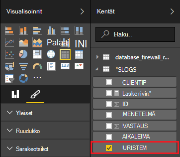

<properties
 pageTitle="Apache myrsky käyttäminen Power BI | Microsoft Azure"
 description="Luo Power BI-raportti käyttää tietoja on C# verkkotopologia Apache myrsky-klusterin HDInsight-käyttöjärjestelmässä."
 services="hdinsight"
 documentationCenter=""
 authors="Blackmist"
 manager="jhubbard"
 editor="cgronlun"
    tags="azure-portal"/>

<tags
 ms.service="hdinsight"
 ms.devlang="dotnet"
 ms.topic="article"
 ms.tgt_pltfrm="na"
 ms.workload="big-data"
 ms.date="10/27/2016"
 ms.author="larryfr"/>

# Apache myrsky topologian tietojen visualisointi Power BI avulla

Voit näyttää tietoja visuaalisesti raportteja Power BI. Käyttämällä HDInsight-myrsky Visual Studio malleja, voit helposti käyttää myymälätietojen topologian, Apache-myrsky HDInsight-klusterissa tuominen SQL Azure-käyttöjärjestelmässä ja visualisointi tiedot käyttämällä Power BI.

Tämän asiakirjan opit käyttämään Power BI-raportin luominen tietojen Apache myrsky topologian luoma ja tallennettu Azure SQL-tietokantaan.

> [AZURE.NOTE] Kun tämän asiakirjan vaiheet ovat riippuvaisia Windows kehitysympäristö Visual Studiossa, käännetty projektin voidaan lähettää Linux- tai Windows-pohjaisesta HDInsight-klusterin. Linux-pohjaiset klustereiden luoda vain 10/28/2016 tuki jälkeen SCP.NET topologioissa.
>
> Jos haluat käyttää C#-topologian Linux-pohjaiset klusterin, sinun on päivitettävä Microsoft.SCP.Net.SDK NuGet paketin käyttämä projektin 0.10.0.6 versioon tai sitä uudemmassa versiossa. Paketin versio on myös vastattava myrsky HDInsight asennettuihin pääversion. Esimerkiksi myrsky HDInsight-versioiden 3.3 ja 3.4 käyttämällä myrsky versio 0.10.x HDInsight 3.5 käyttää myrsky 1.0.x.
> 
> Topologioissa C#-Linux-pohjaiset klustereiden Käytä .NET 4.5, ja käyttää Mono HDInsight-klusterin. Useimmat toimivat, mutta kannattaa tarkistaa mahdolliset yhteensopivuusongelmia [Mono yhteensopivuuden](http://www.mono-project.com/docs/about-mono/compatibility/) asiakirjan.
>
> Tämä projekti, joka toimii myös Linux- tai Windows-pohjaisia klusterissa, Java-versio on [prosessin tapahtumia Azure tapahtuman lihavoituna myrsky-HDInsight (Java)](hdinsight-storm-develop-java-event-hub-topology.md).

## Edellytykset

- Azure tilaus. Katso [Hae Azure maksuttoman kokeiluversion](https://azure.microsoft.com/documentation/videos/get-azure-free-trial-for-testing-hadoop-in-hdinsight/).

* Azure Active Directory-käyttäjän [Power BI](https://powerbi.com) -Accessissa

* Visual Studio (yksi seuraavista versioista)

    * Visual Studio 2012 kanssa [Päivitä 4](http://www.microsoft.com/download/details.aspx?id=39305)

    * Visual Studio 2013 [Päivitä 4](http://www.microsoft.com/download/details.aspx?id=44921) tai [Visual Studio 2013 yhteisön](http://go.microsoft.com/fwlink/?linkid=517284&clcid=0x409)

    * [Visual Studio 2015](https://www.visualstudio.com/downloads/download-visual-studio-vs.aspx)

* Visual Studio HDInsight-työkalut: Katso lisätietoja asennustiedot [käyttäminen Visual Studio HDInsight-Työkalut](../HDInsight/hdinsight-hadoop-visual-studio-tools-get-started.md) .

## Toiminta

Tässä esimerkissä on C# myrsky topologian, joka luo satunnaisesti Internet Information Services (IIS) lokitiedot. Tämä tieto on kirjoitettu SQL-tietokantaan ja sieltä on käytettävä raportteja Power BI.

Seuraavassa on luettelo tiedostoista, jotka toteuttavat tässä esimerkissä tärkeimmät toiminnot.

* **SqlAzureBolt.cs**: kirjoittaa tiedot tuottaa myrsky topologian SQL-tietokantaan.

* **IISLogsTable.sql**: käytettävä tietokanta, tiedot tallennetaan Transact-SQL-lauseita.

> [AZURE.WARNING] Sinun on luotava taulukon SQL-tietokantaan, ennen kuin aloitat topologian HDInsight-klusterissa.

## Lataa Esimerkki

Lataa [HDInsight C# myrsky Power BI-Esimerkki](https://github.com/Azure-Samples/hdinsight-dotnet-storm-powerbi). Voit ladata sen rinnakkainen/Kloonaa käyttämällä [git](http://git-scm.com/)tai Lataa .zip-arkiston **Lataa** -linkin avulla.

## Tietokannan luominen

1. Luo uusi SQL-tietokanta [SQL-tietokanta-opetusohjelma](../sql-database/sql-database-get-started.md) asiakirjan ohjeiden.

2. Muodosta yhteys tietokantaan noudattamalla [Visual Studiossa SQL-tietokannan muodostaminen](../sql-database/sql-database-connect-query.md) asiakirjan tietokantayhteyden muodostamisessa.

4. Napsauta tietokannan objektin Explorerissa hiiren kakkospainikkeella ja luo __Uusi kysely__. Liitä ladatut projektin sisältämän kysely-ikkunaan __IISLogsTable.sql__ -tiedoston sisällön ja käyttää Ctrl + VAIHTO + E kyselyn suorittaminen. Näyttöön tulee sanoma command(s) onnistui.

    Kun toiminto on suoritettu, ole nimeltä __IISLOGS__ tietokannan uuteen taulukkoon.

## Määritä malli

1. [Azure-portaaliin](https://portal.azure.com)ja valitse SQL-tietokantaan. SQL-tietokannan sivu __Essentials__ -osiosta Valitse __Näytä tietokannan yhteysmerkkijonoja__. Kopioi tulevasta luettelosta __ADO.NET (SQL-todennus)__ tiedot.

1. Avaa Visual Studiossa otosten. **Ratkaisunhallinnassa** **App.config** -tiedoston avaaminen ja etsi sitten seuraavat tiedot:

        <add key="SqlAzureConnectionString" value="##TOBEFILLED##" />
    
    Korvaa arvon __## TOBEFILLED ##__ edellisessä vaiheessa kopioimasi tietokantayhteyden merkkijono. Korvaa __{oman\_käyttäjänimi}__ ja __{oman\_salasana}__ käyttäjänimellä ja salasanalla tietokannan.

2. Tallenna ja sulje tiedostot.

## Ota malli käyttöön

1. **Ratkaisunhallinnassa** **StormToSQL** projektin hiiren kakkospainikkeella ja valitse **Lähetä myrsky-Hdinsightista**. Valitse HDInsight-klusterin **Myrsky klusterin** avattava luettelo-valintaikkuna.

    > [AZURE.NOTE] Voi kestää joitakin sekunteja **Myrsky klusterin** avattavasta valikosta voit lisätä palvelinten nimet.
    >
    > Kirjoita pyydettäessä Azure tilauksen kirjautumisen tunnistetiedot. Jos sinulla on useita tilauksia, kirjaudu haluamasi vaihtoehto, joka sisältää oman myrsky HDInsight-klusterissa.

2. Kun topologian on lähetetty, myrsky topologioissa klusterin pitäisi näkyä. Valitsemalla SqlAzureWriterTopology voit tarkastella tietoja käynnissä topologian.

    

    Tässä näkymässä voit tiedot näy topologian tai kaksoisnapsauta tapahtumiin (esimerkiksi SqlAzureBolt) lisätietoja tietyn osan, topologian.

3. Kun topologian on suorittanut muutama minuutti, palaa tietokannan luomiseen käytetty SQL-kyselyikkunan varten. Korvaa aiemmin luotu lauseet seuraavasti.

        select * from iislogs;
    
    Käytä Ctrl + VAIHTO + E Suorita kysely ja vastaanottavien seuraavankaltaiselta tulokset.
    
        1   2016-05-27 17:57:14.797 255.255.255.255 /bar    GET 200
        2   2016-05-27 17:57:14.843 127.0.0.1   /spam/eggs  POST    500
        3   2016-05-27 17:57:14.850 123.123.123.123 /eggs   DELETE  200
        4   2016-05-27 17:57:14.853 127.0.0.1   /foo    POST    404
        5   2016-05-27 17:57:14.853 10.9.8.7    /bar    GET 200
        6   2016-05-27 17:57:14.857 192.168.1.1 /spam   DELETE  200

    Tämä on tietoja, jotka on kirjoitettu myrsky topologian.

## Raportin luominen

1. Yhteyden muodostaminen [SQL Azure-tietokantayhteyden](https://app.powerbi.com/getdata/bigdata/azure-sql-database-with-live-connect) Power BI.

2. Sisällä __tietokantoja__Valitse __Hae__.

3. Valitse __Azure SQL-tietokanta__ja valitse sitten __Yhdistä__.

4. Kirjoita tiedot Azure SQL-tietokantayhteyden muodostamisessa. Voit etsiä ohjesisältöä [Azure portal](https://portal.azure.com) ja valitsemalla SQL-tietokantaan.

    > [AZURE.NOTE] Voit määrittää päivitysväli- ja erikoissuodattimien käyttämällä __Käyttöön Lisäasetukset-välilehden__ Yhdistä-valintaikkunassa.

5. Kun olet yhdistänyt, näet uusi tietojoukko saman niminen muodostettu tietokantana. Valitse Aloita raportin tietojoukko.

3. __Kentät__Laajenna __IISLOGS__ tapahtuma. Kohdassa __URISTEM__valintaruutu. Tämä vaihtoehto Luo uusi raportti, jossa on luettelo URI-varret (tai tapahtuman, nimenä/palkki-, jne.) kirjautunut tietokantaan.

    

5. Vedä seuraavaksi __menetelmä__ raporttiin. Raportin päivittää luettelon varret ja vastaavan HTTP-menetelmä, jolla HTTP-pyynnön.

    

4. __Visualisoinnit__ -sarakkeesta Valitse __kentät__ -kuvake ja valitse sitten __arvot__ -kohdassa __menetelmä__ -kohdan vieressä olevaa alanuolta. Valitse avautuvasta luettelosta __määrä__. Tämä muuttaa näkyvät raportissa määrä, kuinka monta kertaa tietyn URI on käytetty.

    

6. Valitse seuraavaksi tietojen näyttötavan muuttaminen __Pinottu pylväskaavio__ .

    

7. Kun olet raportin haluat sen, miten avulla voit __tallentaa__ tapahtuma-valikon nimi ja tallennat sitten raportin.

## Lopeta topologian

Topologian edelleen käytössä, kunnes lopetetaan tai poistaa HDInsight-klusterissa myrsky. Seuraavien toimien lopettavat topologian.

1. Visual Studiossa palaa topologian Viewer-ohjelman ja valitse topologian.

2. Valitse Pysäytä topologian **Poista** -painiketta.

    

## Poista yhteyttä klusterin

[AZURE.INCLUDE [delete-cluster-warning](../../includes/hdinsight-delete-cluster-warning.md)]

## Seuraavat vaiheet

Tässä asiakirjassa opit, miten voit lähettää tietoja myrsky topologian SQL-tietokantaan ja Visualisoi tietoja käyttämällä Power BI. Lisätietoja muiden Azure tekniikoiden myrsky käyttäminen HDInsight käsittelemisestä on seuraavissa artikkeleissa:

* [Esimerkki topologioissa myrsky HDInsight-varten](hdinsight-storm-example-topology.md)
