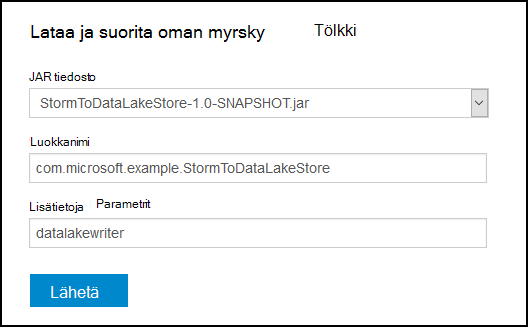

<properties
pageTitle="Käytä Azure tietojen järvi kaupan Apache myrsky-Azure Hdinsightiin"
description="Lue, miten kirjoittaa tietoja Azure järvi tietovaraston Apache myrsky topologian HDInsight. Tämä asiakirja ja liittyvän esimerkin näytetään, miten HdfsBolt-osan avulla voidaan kirjoittaa järvi tietosäilö."
services="hdinsight"
documentationCenter="na"
authors="Blackmist"
manager="jhubbard"
editor="cgronlun"/>

<tags
ms.service="hdinsight"
ms.devlang="na"
ms.topic="article"
ms.tgt_pltfrm="na"
ms.workload="big-data"
ms.date="09/06/2016"
ms.author="larryfr"/>

#Käytä Azure tietojen järvi kaupan Apache myrsky HDInsight kanssa

Azure järvi tietosäilö on HDFS yhteensopiva pilvitallennuspalveluun, joka sisältää suuren siirtonopeuden, käytettävyyttä, kestävyyttä ja luotettavuutta tiedoillesi. Tässä asiakirjassa opit käyttämään Java-pohjainen myrsky topologian tietojen kirjoittaminen Azure järvi tietovaraston käyttämällä [HdfsBolt](http://storm.apache.org/javadoc/apidocs/org/apache/storm/hdfs/bolt/HdfsBolt.html) -osa, joka on annettu Apache myrsky osana.

> [AZURE.IMPORTANT] Esimerkki topologian tässä asiakirjassa on riippuvainen osat, jotka ovat mukana myrsky-HDInsight klustereiden ja voi pyytää muutosta Azure Lake Tietosäilölle Apache myrsky toisten klustereiden käytettäessä käyttöä varten.

##Edellytykset

* [Java JDK 1.7](https://www.oracle.com/technetwork/java/javase/downloads/jdk7-downloads-1880260.html) tai uudempi versio
* [Maven-testi 3.x](https://maven.apache.org/download.cgi)
* Azure tilauksen
* Myrsky HDInsight klusterin versio 3,2. Voit luoda uuden myrsky HDInsight-klusterin-ohjeiden [käyttää HDInsight tietojen järvi kaupan käyttämällä Azure](../data-lake-store/data-lake-store-hdinsight-hadoop-use-portal.md) -asiakirjassa. Ohjeita tämän asiakirjan edetään ohjatusti luoda uuden HDInsight-klusterin ja Azure Lake Tietosäilölle.  

    > [AZURE.IMPORTANT] Kun luot HDInsight-klusterin, valittava __myrsky__ klusterin tyyppi ja __3,2__ versiona. Käyttöjärjestelmän voi olla Windows- tai Linux.  

###Määritä ympäristömuuttujat

Seuraavat ympäristömuuttujat voi määrittää, kun asennat Java- ja JDK kehittäminen työaseman. Kuitenkin kannattaa tarkistaa, että ne ovat olemassa ja että ne sisältävät järjestelmän oikeat arvot.

* __JAVA_HOME__ - osoitettava kansion, johon on asennettu suorituksenaikainen Java-ympäristö (JRE). Esimerkiksi Unix- tai Linux hajautuksessa-tunnisteen pitäisi olla samankaltainen kuin arvo `/usr/lib/jvm/java-7-oracle`. Windowsin, se on arvo, joka on samanlainen `c:\Program Files (x86)\Java\jre1.7`.

* __PATH__ - pitäisi olla seuraavat polut:

    * __JAVA\_HOME__ (tai vastaava polku)
    
    * __JAVA\_HOME\bin__ (tai vastaava polku)
    
    * Kansion, johon on asennettu maven-testi

##Topologian käyttöönotto

Esimerkki tässä asiakirjassa on kirjoitettu Java ja käyttää seuraavat osat:

* __TickSpout__: Luo topologian muiden osien käyttämät tiedot.

* __PartialCount__: laskee TickSpout luomat tapahtumat.

* __FinalCount__: laskeminen kokoavat PartialCount tietoja.

* __ADLStoreBolt__: kirjoittaa tietoja Azure Lake Tietosäilölle [HdfsBolt](http://storm.apache.org/javadoc/apidocs/org/apache/storm/hdfs/bolt/HdfsBolt.html) -osan avulla.

Projekti, joka sisältää tässä topologian on ladattavissa- [https://github.com/Azure-Samples/hdinsight-storm-azure-data-lake-store](https://github.com/Azure-Samples/hdinsight-storm-azure-data-lake-store).

###Tietoja ADLStoreBolt

ADLStoreBolt on käytettävä joka kirjoittaa Azure tietojen järvi topologian HdfsBolt-esiintymän nimi. Tämä ei ole luotu Microsoft; HdfsBolt erityinen versio sen sijaan luottavat core sivuston määritysten arvot sekä Hadoop-osat, jotka sisältyvät Azure Hdinsightiin tietojen järvi tietoliikenteen.

Tarkemmin sanottuna luodessasi HDInsight-klusterin liittämällä sen Azure tietojen järvi-kaupasta. Tämä kirjoittaa core-sivustoon tietojen järvi kaupan valitsit, tapahtumia, jotka käyttävät osia, kuten hadoop-asiakasohjelman ja hadoop hdfs tietojen järvi kaupan tietoliikenne.

> [AZURE.NOTE] Microsoft on lähettänyt Apache Hadoop ja myrsky projekteja koodi, joka mahdollistaa Azure järvi tietovaraston ja Azure Blob storage tietoliikenteen, mutta tämä toiminto ei voi sisällyttää muita Hadoop ja myrsky jaot oletusarvoisesti.

Topologian HdfsBolt kokoonpano on seuraavanlainen:

    // 1. Create sync and rotation policies to control when data is synched
    //    (written) to the file system and when to roll over into a new file.
    SyncPolicy syncPolicy = new CountSyncPolicy(1000);
    FileRotationPolicy rotationPolicy = new FileSizeRotationPolicy(0.5f, Units.KB);
    // 2. Set the format. In this case, comma delimited
    RecordFormat recordFormat = new DelimitedRecordFormat().withFieldDelimiter(",");
    // 3. Set the directory name. In this case, '/stormdata/'
    FileNameFormat fileNameFormat = new DefaultFileNameFormat().withPath("/stormdata/");
    // 4. Create the bolt using the previously created settings,
    //    and also tell it the base URL to your Data Lake Store.
    // NOTE! Replace 'MYDATALAKE' below with the name of your data lake store.
    HdfsBolt adlsBolt = new HdfsBolt()
        .withFsUrl("adl://MYDATALAKE.azuredatalakestore.net/")
        .withRecordFormat(recordFormat)
        .withFileNameFormat(fileNameFormat)
        .withRotationPolicy(rotationPolicy)
        .withSyncPolicy(syncPolicy);
    // 4. Give it a name and wire it up to the bolt it accepts data
    //    from. NOTE: The name used here is also used as part of the
    //    file name for the files written to Data Lake Store.
    builder.setBolt("ADLStoreBolt", adlsBolt, 1)
      .globalGrouping("finalcount");
      
Jos olet käyttänyt HdfsBolt, huomaat, että tämä on kaikki melko vakio määritys lukuun ottamatta URL-osoite. URL-osoite sisältää tallennuspaikan Azure järvi pääkansion polku.

Koska kirjoittaminen järvi tietovaraston käyttää HdfsBolt eikä vain URL-osoite muuttuu, sinun pitäisi aiemmin topologian, joka kirjoittaa HDFS tai käyttämällä HdfsBolt WASB ja muuta sen asetukseksi Määritä Azure järvi tietovaraston helposti.

##Muodosta ja topologian pakkaaminen

1. Lataa Esimerkki projektin: [https://github.com/Azure-Samples/hdinsight-storm-azure-data-lake-store](https://github.com/Azure-Samples/hdinsight-storm-azure-data-lake-store
) kehittäminen-ympäristöön.

2. Avaa `StormToDataLake\src\main\java\com\microsoft\example\StormToDataLakeStore.java` -editorissa tiedosto ja Etsi rivi, joka sisältää `.withFsUrl("adl://MYDATALAKE.azuredatalakestore.net/")`. Muuta __MYDATALAKE__ Azure järvi tietovaraston käytit luodessasi HDInsight-palvelimen nimeä.

3. Komennon kehote, pääte tai shell-istunnon muuttaa kansioiden ladatut projektin ylimmällä ja suorittamalla seuraavat komennot voivat laatia ja pakata topologian.

        mvn compile
        mvn package
    
    Kun muodosta ja pakkaaminen on valmis, uusi kansio nimeltä ole `target`, joka sisältää tiedoston `StormToDataLakeStore-1.0-SNAPSHOT.jar`. Tämä on käännetty topologian.

##Ottaa käyttöön ja suorittamisesta Linux-pohjaiset Hdinsightiin

Jos olet luonut Linux-pohjaiset myrsky HDInsight-klusterissa, avulla käyttöön ja suorita topologian seuraavia ohjeita.

1. Seuraavalla komennolla kopioi topologian HDInsight-klusterin. Korvaa __käyttäjän__ käytit luodessasi klusterin SSH käyttäjänimi. Korvaa __CLUSTERNAME__ klusterin nimi.

        scp target\StormToDataLakeStore-1.0-SNAPSHOT.jar USER@CLUSTERNAME-ssh.azurehdinsight.net:StormToDataLakeStore-1.0-SNAPSHOT.jar
    
    Kirjoita pyydettäessä luotaessa klusterin SSH käyttäjän salasana. Jos olet käyttänyt julkisella avaimella salasanan sijaan, voit joutua käyttämään `-i` parametri polku vastaava yksityinen avain.
    
    > [AZURE.NOTE] Jos käytössäsi on Windows-asiakas, kehitystä, sinulla ei ole `scp` komento. Jos näin on, voit käyttää `pscp`, joka on käytettävissä [http://www.chiark.greenend.org.uk/~sgtatham/putty/download.html](http://www.chiark.greenend.org.uk/~sgtatham/putty/download.html).

2. Kun lataus on valmis, voit muodostaa käyttämällä SSH HDInsight-klusterin seuraavat avulla. Korvaa __käyttäjän__ käytit luodessasi klusterin SSH käyttäjänimi. Korvaa __CLUSTERNAME__ klusterin nimi.

        ssh USER@CLUSTERNAME-ssh.azurehdinsight.net

    Kirjoita pyydettäessä luotaessa klusterin SSH käyttäjän salasana. Jos olet käyttänyt julkisella avaimella salasanan sijaan, voit joutua käyttämään `-i` parametri polku vastaava yksityinen avain.
    
    > [AZURE.NOTE] Jos käytössäsi on Windows-asiakas, kehitystä, noudata [Linux-pohjaiset HDInsight SSH Windows ja Yhdistä](hdinsight-hadoop-linux-use-ssh-windows.md) tietoja Lisätietoja painovärit, muste-asiakasohjelman avulla voit muodostaa yhteyttä klusterin.
    
3. Kun yhteys on muodostettu, voit käynnistää topologian käyttämällä seuraavaa:

        storm jar StormToDataLakeStore-1.0-SNAPSHOT.jar com.microsoft.example.StormToDataLakeStore datalakewriter
    
    Tämä käynnistää topologian kutsumanimi jossa `datalakewriter`.

##Ottaa käyttöön ja suorita Windows-pohjaisesta Hdinsightiin

1. Avaa selain ja siirry HTTPS://CLUSTERNAME.azurehdinsight.net, missä __CLUSTERNAME__ HDInsight-klusterin nimen. Anna kehotettaessa järjestelmänvalvojan käyttäjänimi (`admin`) ja salasana, joita voit käyttää klusterin luonnin yhteydessä.

2. Myrsky koontinäytöstä, valitse __Selaa__ __Jar tiedoston__ avattavasta luettelosta ja valitse sitten StormToDataLakeStore 1.0-SNAPSHOT.jar-tiedostosta `target` hakemisto. Käytä lomakkeen muita tietueita seuraavat arvot:

    * Luokan nimi: com.microsoft.example.StormToDataLakeStore
    * Lisää parametrit: datalakewriter
    
    

3. Valitse Lataa ja aloittaa topologian __Lähetä__ -painiketta. __Lähetä__ -painikkeen alla kenttä tulos pitäisi näyttää seuraavankaltaiselta tiedot, kun topologian on alkanut:

        Process exit code: 0
        Currently running topologies:
        Topology_name        Status     Num_tasks  Num_workers  Uptime_secs
        -------------------------------------------------------------------
        datalakewriter       ACTIVE     68         8            10        

##Tulosteen tietojen tarkasteleminen

Voit tarkastella tietoja useilla tavoilla. Tässä osassa Käytämme Azure-portaalin ja `hdfs` komennolla voit tarkastella tietoja.

> [AZURE.NOTE] Kannattaa antaa topologioissa toimimaan useamman minuutin ennen tarkistamista tiedot, niin, että tiedot on on synkronoitu Azure järvi tietovaraston useita tiedostoja.

* __ [Azure-portaalissa](https://portal.azure.com)__: Valitse portaalissa Azure järvi tietovarasto, jota olet käyttänyt Hdinsightista.

    > [AZURE.NOTE] Jos kiinnität ei järvi tietovaraston Azure portaalin koontinäyttö, löydät sen valitsemalla __Selaa__ vasemmassa reunassa sitten __Järvi tietovaraston__luettelon loppuun ja valitsemalla lopuksi kauppa.
    
    Valitse __Tietoresurssien__järvi tietovaraston yläreunassa kuvakkeet.
    
    
    
    Valitse seuraavaksi __stormdata__ -kansio. Luettelo tekstitiedostoista, näytetään.
    
    
    
    Valitse jokin tiedostot voit tarkastella sen sisältöä.

* __Klusterista__: Jos olet muodostanut yhteyden HDInsight-klusterin käyttämällä SSH (Linux-klusterin) tai etätyöpöydän kautta (Windows-klusterin), voit tehdä seuraavat tarkastella tietoja. Vaihda __DATALAKE__ Lake tietovaraston nimi

        hdfs dfs -cat adl://DATALAKE.azuredatalakestore.net/stormdata/*.txt

    Tämä KETJUTA directory ja Näytä tiedot seuraavankaltaiselta tallennetut tiedostot:
    
        406000000
        407000000
        408000000
        409000000
        410000000
        411000000
        412000000
        413000000
        414000000
        415000000
        
##Lopeta topologian

Myrsky topologioissa suoritetaan, kunnes pysäytetään- tai klusterin poistetaan. Voit lopettaa topologioissa, käytä seuraavia tietoja.

__Linux-pohjaiset HDInsight varten__:

SSH istunnosta klusteriin Kirjoita seuraava komento:

    storm kill datalakewriter

__Windows-pohjaisesta HDInsight varten__:

1. Myrsky koontinäytössä (https://CLUSTERNAME.azurehdinsight.net) Valitse sivun yläosassa __Myrsky Käyttöliittymä__ -linkki.

2. Kun myrsky Käyttöliittymä latautuu, valitse __datalakewriter__ -linkki.

    

3. __Topologian toiminnot__ -osassa Valitse __Poista__ ja valitse sitten tulevassa valintaikkunassa OK.

    

## Poista yhteyttä klusterin

[AZURE.INCLUDE [delete-cluster-warning](../../includes/hdinsight-delete-cluster-warning.md)]

##Seuraavat vaiheet

Nyt oppinut voit käyttämisestä myrsky Azure järvi tietovaraston kirjoittaminen, tutustu muita [myrsky esimerkkejä Hdinsightista](hdinsight-storm-example-topology.md).
