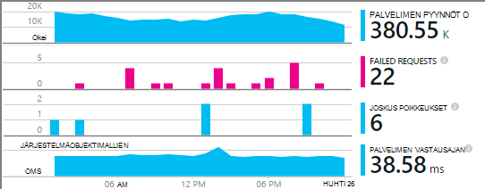

<properties
    pageTitle="Esimerkki MyDriving Azure IoT: Muodosta se | Microsoft Azure"
    description="Luo sovellus, joka on siitä, miten arkkitehti IoT järjestelmän käyttämällä Microsoft Azure, esimerkiksi Stream Analytics koneen oppiminen ja tapahtuman keskittimet täydellinen esittely."
    services=""
    documentationCenter=".net"
    suite=""
    authors="harikmenon"
    manager="douge"/>

<tags
    ms.service="multiple"
    ms.workload="tbd"
    ms.tgt_pltfrm="ibiza"
    ms.devlang="dotnet"
    ms.topic="article"
    ms.date="03/25/2016"
    ms.author="harikm"/>


# <a name="build-and-deploy-the-mydriving-solution-to-your-environment"></a>Muodosta ja ota käyttöön MyDriving ratkaisu-ympäristöön

MyDriving on asioita Internet (IoT)-ratkaisu, joka kokoaa tietoja auton, käsittelee käyttämällä tietokoneen learning ja esittää matkapuhelimeen. Microsoft Azure palveluja erilaisia muodostuu uudelleen. Asiakkaat voivat olla Android-, iOS- ja Windows 10-puhelimet.

MyDriving-ratkaisun avulla voit luoda IoT-järjestelmän jumpstart luomaasi. [MyDriving säilöön-GitHub](https://github.com/Azure-Samples/MyDriving)saat Azure Resurssienhallinta komentosarjojen ottamaan taustatietokantaan-arkkitehtuuri oman Azure huomioon. Lähtien uudelleen eri palveluissa, kyselyt, ja sopivat omilla tiedoillasi. Voit etsiä komentosarjat--ja mobile-sovellus, Azure App Service API-projekti ja muihin--MyDriving säilöön-koodin.

Jos eivät ole yrittänyt sovelluksen vielä tarkastella [Get aloittaminen opas](iot-solution-get-started.md).

Tällä [MyDriving opas](http://aka.ms/mydrivingdocs)arkkitehtuuri yksityiskohtaiset huomioon. On useita laitteita, jotka on määritetty ja että määrität enintään luo samalla projektin yhteenveto:

* **Asiakas-sovellus** toimii Android-, iOS- ja Windows 10-puhelimet. Käytämme Xamarin platform jakamaan paljon koodi, joka on tallennettu GitHub `src/MobileApp`. Sovellus on todella suorittaa kaksi eri toimintoja:
 * Se välittää telemetriatietojen junassa diagnostiikka (OBD) laitteesta ja järjestelmän cloud takaisin loppuun Oma sijainti-palvelusta.
 * On käyttöliittymä, jossa käyttäjät voivat tehdä niiden tallennettujen tien trips tietoja.
* **Pilvipalvelussa** ingests tien työmatkan tiedot reaaliajassa ja käsittelee sen. Tärkeimmät työmäärä luominen Tämä palvelu on valita, parameterize ja kulmien eri Azure palvelujen määrittäminen. Jotkin osat edellyttävät komentosarjojen suodatus- ja prosessissa saapuvia tiedot. Azure Resurssienhallinta-mallin avulla määrittää kaikki osat.
* **Mobiilipalvelu app** on takana laitteen sovelluksen käyttäjän LIP-osan WWW-palvelun. Sen tärkeimmät työ on tietokantakyselyn käsitellyt tallennetut tiedot. Sen koodin on GitHub `src/MobileAppService`.
* **Visual Studiossa Xamarin** on Microsoftin kehitysympäristö. Xamarin, jossa on sekä erillinen integroitu kehitysympäristö (IDE) osana Visual Studiossa, käytetään Office kaikissa ympäristöissä laite-koodin luominen. Muodostaa iOS-koodi on käynnissä OS X-laitteeseen Xamarin esiintymä. Jos määrittäminen pakolliseksi, se voidaan suorittaa edustajana, poistaa Visual Studio.
* Laitteen sovelluksia **yksikön testaus** suoritetaan Xamarin testi pilveen.
* **GitHub** on säilö, jossa koodi, komentosarjojen ja mallit tallennetaan.
* **Visual Studio Team Services** on pilvipalvelussa, jota käytetään jatkuva muodosta ja testaa web-palvelu ja laitteen sovelluksia.
* **HockeyApp** käytetään laitteen koodin versioiden jakamiseen. Se myös kerää kaatumisen ja käytön raportteihin ja Käyttäjäpalaute.
* **Visual Studio hakemuksen tiedot** valvoo mobile web-palveluun.

Nyt Katso, miten on määritetty, kaikki. Huomaa, että monia vaiheet ovat valinnaisia.

## <a name="sign-up-for-accounts"></a>Tilien rekisteröityminen

-   [Visual Studio keskihajonta Essentials](https://www.visualstudio.com/products/visual-studio-dev-essentials-vs.aspx). Ilmainen ohjelma tarjoaa useita Kehitystyökalut ja palveluja, kuten Visual Studiossa, Visual Studio Team Services ja Azure helpon pääsyn. Antaa 25-, kuukausi-luottotietojen Azure 12 kuukautta. Se on myös Pluralsight koulutukseen ja Xamarin University tilaukset. Voit myös rekisteröidä erikseen [Azure](https://azure.com) ja [Visual Studio ryhmän palvelujen](https://www.visualstudio.com/products/visual-studio-team-services-vs.aspx)vapaa tasoa, mutta ne eivät tarjoa Azure hyvitykset.

-   [HockeyApp](https://rink.hockeyapp.net/) (valinnainen)-testi jakautumisen mobiilisovellukset hallintaan ja kerääminen telemetriatietojen.

-   [Xamarin](https://xamarin.com/) (pakollinen), luomista mobile-sovellus ja virheenkorjaus suoritetaan ja tarkistaa käytössä [Xamarin testi Cloud](https://xamarin.com/test-cloud)varten.

-   [GitHub](https://github.com/Azure-Samples/MyDriving/) (valinnainen), voit luoda vapaa julkisen säilöjen tietoihin oman koodin (yksityinen säilöjen tietoihin maksetaan). Vaihtoehtoisesti voit yksityinen säilöjen tietoihin Visual Studio Team Servicesissä basic suunnitelma.

-   [Power BI](https://powerbi.microsoft.com/) (valinnainen), jos haluat luoda monipuolisia visualisointeja tietojen koko järjestelmästä kautta.

> [AZURE.NOTE] Sinun ei tarvitse GitHub-tili, voit käyttää [GitHub MyDriving](https://github.com/Azure-Samples/MyDriving)säilössä MyDriving-koodi.

## <a name="install-development-tools"></a>Asenna Kehitystyökalut

Kehittämiseen täydellinen ratkaisu on seuraavat asetukset: iOS-, Android- ja Windows 10 Mobile Office kaikissa ympäristöissä-sovelluksen kanssa Azure takaisin end-näppäinyhdistelmää.

Vaihtoehtoisesti voit käyttää Xamarin Studio Mac- tai Windows kehittää mobile-sovellukset, jos et käytä lukuruutua Azure-takaisin end-näppäinyhdistelmää.

On [pidempi kuvaus nämä asetukset](https://msdn.microsoft.com/library/mt613162.aspx).

### <a name="windows-development-machine"></a>Windowsin kehittäminen machine

Windowsin keskitetyn työkalu on Visual Studiossa, Android-ja Windows MyDriving-sovelluksen, sovelluksen Service API projektin ja microservice tunnisteet.

Xamarin, Git, emulaattorit ja muita hyödyllisiä osat ovat kaikki integroitu Visual Studio.

Asenna:

-   [Visual Studio 2015 Xamarin kanssa](https://www.visualstudio.com/products/visual-studio-community-vs) (mikä tahansa versio--yhteisön on ilmainen).

-   [Yleinen Windows-ympäristön SQLite](https://visualstudiogallery.msdn.microsoft.com/4913e7d5-96c9-4dde-a1a1-69820d615936). Windows 10 Mobile-koodin luominen edellyttää.

-   [Azure SDK for Visual Studio 2015](https://go.microsoft.com/fwlink/?linkid=518003&clcid=0x409). Käyttöösi SDK käynnissä Azure-sovellusten sekä komentorivin hallintatyökalut Azure.

-   [Azure palvelun kangasta SDK](http://www.microsoft.com/web/handlers/webpi.ashx?command=getinstallerredirect&appid=MicrosoftAzure-ServiceFabric). Pakollinen luonnissa [microservice](../service-fabric/service-fabric-get-started.md) -tunniste.

Varmista, että oikea Visual Studio tunnisteet. Tarkista, että **Työkalut**-kohdassa **Android-, iOS-Xamarin...**. Jos näin ei ole, Avaa Ohjauspaneeli ja valitse sitten **Ohjelmat ja toiminnot** > **Microsoft** > **Visual Studio 2015** > **Muokkaa**. Valitse **Office kaikissa ympäristöissä kehitystä**, **C\#/.Net (Xamarin)**. Samalla, kun olet näkymässä, tarkista, että **Git Windows** on asennettu.

### <a name="mac-development-machine"></a>Mac kehittäminen machine

Mac (Yosemiten tai uudempi) vaaditaan, jos haluat kehittää iOS. Vaikka emme käyttää Windows Xamarin Visual Studio kehittämään ja hallita kaikki koodi, Xamarin käyttää agentti luominen ja iOS-koodin allekirjoittamiseen asennettu.


(Vaihtoehtona, voit käyttää Xamarin Studio suoraan Macissa kehittää Office kaikissa ympäristöissä sovellusten.)

Sinun ei tarvitse Mac-tietokoneella, jos et halua sisällyttää iOS kohdeympäristö nimellä.

Asenna:

-   [Xamarin Studio iOS](https://developer.xamarin.com/guides/ios/getting_started/installation/mac/). Voit myös määrittää Visual Studio ja Mac-tietokoneessa, jossa on käytössä Windows-virtual machine Xamarin. MSDN-sivuston kohdassa [asetukset, asennus- ja tarkastukset Mac-käyttäjille](https://msdn.microsoft.com/library/mt488770.aspx) .

-   [Azure Kehitystyökalut](https://azure.microsoft.com/downloads/) (valinnainen).

Ota käyttöön remote kirjautuminen koneisiin. Avaa **Järjestelmäasetukset** > **jakaminen**ja valitse sitten **Remote kirjautuminen**.

Kun avaat iOS-projektin Visual Studiossa Windows-laajennuksen Xamarin pyytää tunnus Mac-tietokoneesta.

## <a name="fetch-the-github-repository"></a>Noutaa GitHub säilö

Hae [GitHub MyDriving säilö](https://github.com/Azure-Samples/MyDriving) paikallisen kopion GitHub, Visual Studio tai toinen Git asiakas **Lataa ZIP** -painikkeen avulla.

Pura lyhyttä polun, kuten C:-niminen kansio tiedoston\\koodi.

Voit myös halutessasi säilyttää ajan tasalla tai osallistua koodia Kloonaa säilö seuraavasti:

**git Kloonaa https://github.com/Azure-Samples/MyDriving.git**

## <a name="get-a-bing-maps-api-key"></a>Hae Bing maps-Ohjelmointirajapinnan avain

[Rekisteröidy Bing Maps-Ohjelmointirajapinnan avain](https://msdn.microsoft.com/library/ff428642.aspx).

Haluat korvata tämän rivin 22 `src/MobileApps/MyDriving/MyDriving.Utils/Logger.cs`.


## <a name="build-the-demo-app"></a>Esittely-sovelluksen luominen

Avaa Visual Studiossa seuraavia ratkaisuja:

-   src\MobileApps\MyDriving.SLN

-   src\MobileAppService\MyDrivingService.SLN

-   src\Extensions\ServiceFabric\VINLookUpApplication\VINLookUpApplication.SLN

Näyttöön tulee näyttöön:

-   Luota jotkin mahdollisesti epäluotettava projektit. Valitse Avaa niitä, jos haluat siirtyä eteenpäin.

-   Jos työskentelet ajan tasalla Windows 10-laitteeseen kehittäjätilan määrittämisestä.

-   Anna Xamarin tunnistetiedot.

-   Yhteyden muodostaminen Xamarin Mac-tietokoneeseen. Jos sinulla ei ole Mac-iOS projektia Visual Studiossa hiiren kakkospainikkeella ja valitse sitten **poistaminen projektin**.

Muodosta uudelleen ratkaisu.

Jos sinulla on ongelmia rakennuksen, yritä elementtimäärityksen, olemme ratkaisuja:

-   *VINLookupApplication projektin ei lataudu*: Varmista, että olet asentanut [Azure SDK for Visual Studio 2015](https://go.microsoft.com/fwlink/?linkid=518003&clcid=0x409).

-   *Palvelun kangasta projektin ei luoda*: muodostaa liittymän projektien ensin ja varmista, että olet asentanut palvelun kangasta SDK-paketissa.

-   *Android-sovelluksen ei luominen*:

    -   Avaa **Työkalut** > **Android** > **Android SDK hallinta**- ja varmista, että Android 6 (API 23) / SDK-ympäristö on asennettu.

    -   Poista tämä kansio ja sitten uudelleen:<br/>
        `%LocalAppData%\Xamarin\zips`

## <a name="get-to-know-the-code"></a>Yleisiä tietoja koodi

Ratkaisun löydät:

-   Azure tunnisteet: palvelun kangasta.

-   Azure Hdinsightiin: Komentosarjojen Azure työmatkan tietojen käsittelyä varten.

-   Mobiilisovellusten: Laitteen sovellukset.

-   MobileAppsService/MyDrivingService: Verkossa takaisin lopussa.

-   Power BI: Raporttimäärityksen.

-   Komentosarjat:

    -   Resurssienhallinta: mallien luominen Azure resurssit.

    -   PowerShellin: Komentosarjojen suorittamisen Resurssienhallinta-mallit.

    -   Azure SQL-tietokantaan: Virheenkorjaus tietokannat.

-   SQL-tietokantaan: CreateTables: rakenne-määrityksiä.

-   Azure Stream Analytics: Kyselyt, jotka muuntavat saapuvien tietovirta.

## <a name="run-the-apps-in-development-mode"></a>Suorita sovellusten kehittämisen tilassa

Suorita Officen-laite, jota käytät perusteella toimia:

-  Uudelleen: Määritä MyDrivingService projektin aloitus ja paina F5-näppäintä taustatietokantaan WWW-palvelun. Se avautuu selainnäkymässä API-luettelon.

-  Mobiilisovellusten: [mobiilisovelluksia on kehitetty Xamarin](https://developer.xamarin.com/guides/cross-platform/deployment,_testing,_and_metrics/debugging_with_xamarin/).
 -  Android: Lisätietoja on artikkelissa [Xamarin virheenkorjaus Android](http://developer.xamarin.com/guides/android/deployment,_testing,_and_metrics/debugging_with_xamarin_android/).

 -  iOS: Lisätietoja on artikkelissa [iOS virheenkorjaus](http://developer.xamarin.com/guides/ios/deployment,_testing,_and_metrics/debugging_in_xamarin_ios/).

 -  Windows Phone: Lisätietoja on artikkelissa [Xamarin + Windows Phone](https://developer.xamarin.com/guides/cross-platform/windows/phone/).

## <a name="upload-the-mobile-app-to-hockeyapp"></a>Mobile-sovelluksen lataaminen HockeyApp

HockeyApp hallitsee Android-, iOS- ja Windows-sovelluksen käyttäjille, Testaa jakautumisen ilmoittaa käyttäjille uusimmat. Se myös kerää hyödyllisiä kaatumisraportit, käyttäjän palautteen näyttökuvat sekä käyttö arvot.

[Aloita lataamalla](http://support.hockeyapp.net/kb/app-management-2/how-to-create-a-new-app) muodosta sovelluksen. Valitse Kirjaudu [HockeyApp](https://rink.hockeyapp.net) kehittäminen tietokoneesta. Kehittäjän raporttinäkymät-ikkuna, valitse **Uusi sovellus**ja vetämällä ikkunan valmiita tiedostot. (Myöhemmin, voit automatisoida muodosta-palvelussa, voit tehdä tämän.)

Kun olet app raporttinäkymät-ikkunassa.


Toista, sovellus toimii eri ympäristöissä. Valitse Tee näin:

-  [Sovellustunnus](http://support.hockeyapp.net/kb/app-management-2/how-to-find-the-app-id) koontinäytöstä avulla voit lähettää kaatumisen tiedot ja palaute-sovellukset. Päivitä MyDriving, src/MobileApps/MyDriving/MyDriving.Utils/Logger.cs tunnukset.

-  [Kutsu testikäyttäjän](http://support.hockeyapp.net/kb/app-management-2/how-to-invite-beta-testers). Saat tarkoituksena on palkata testaajia käyttäjät URL-Osoitetta. Hän voi työryhmän rekisteröityminen ja lataa sovellus Lähetä palautetta.

-  Jos haluat mieluummin paremmin beetaversio, arvoksi julkisen jakauman. Valitse **Hallitse sovelluksen** > **jakauman** > **Lataa = julkisen**. Kuka tahansa nyt ladata sovelluksen ja Lähetä palautetta, ja ne näkyy ilmoituksen, kun uusi versio. Saatat saada kaatumisen joissakin raporteissa niiltä.

    

-  [Visual Studio Team Services linkki kaatumisen raportteja](http://support.hockeyapp.net/kb/third-party-bug-trackers-services-and-webhooks/how-to-use-hockeyapp-with-visual-studio-team-services-vsts-or-team-foundation-server-tfs). Valitse **Hallitse sovelluksen** > **Visual Studio Team Services**. HockeyApp voidaan luoda automaattisesti töitä Team Services kun liittyy kaatumisen raportteja tai kun palautetta vastaanotetaan.

Lue lisää [HockeyApp sivuston](https://hockeyapp.net).

## <a name="test-the-mobile-app-on-xamarin-test-cloud"></a>Testaa Xamarin testi Cloud mobile-sovellus

[Xamarin testi Cloud](https://developer.xamarin.com/guides/testcloud/introduction-to-test-cloud/) automatisoi Käyttöliittymän testaaminen pilveen reaali laitteilla. Käyttämällä NUnit framework kirjoittaa kokeet, jotka suoritetaan sovelluksen käyttöliittymässä.

Jos haluat käyttää Xamarin, [Xamarin.UITests](https://developer.xamarin.com/guides/testcloud/uitest/intro-to-uitest/) SDK liittää sovelluksen, joka sisältää NuGet-pakettina. Löydät sen esittely-sovelluksessa, ja se sisällytetään, kun luot uuden testiprojektien Xamarin malleja.


Esimerkki-testiprojektin sisältyy säilössä sovellus. Etsi [MyDriving](https://github.com/Azure-Samples/MyDriving/tree/master/src/MobileAppService), valitse [src](https://github.com/Azure-Samples/MyDriving/tree/master/src)/MobileApps/[MyDriving](https://github.com/Azure-Samples/MyDriving/tree/master/src/MobileApps/MyDriving)/MyDriving.UITests/.

Jos käytät Visual Studio Team Services muodosta, on helppo kirjoittaa Xamarin Käyttöliittymän yksikön tarkistaa ja näyttää niitä oman muodosta osana.

## <a name="deploy-azure-services"></a>Azure Services ‑palveluiden käyttöönottaminen

Automaattisen käyttöönoton Azure ja muodosta Team Services-palvelut on suoritettava viitata **scripts/README.md**yksityiskohtaisia ohjeita.

Microsoft Azure on runsaasti eri palvelua, joiden avulla voit luoda cloud sovelluksia. Monet avulla voidaan erikseen (kuten Service-Web sovellukset), ne ovat osoitteessa niiden parhaiten, kun ne on yhdistetty toisiinsa integroitu järjestelmä, kuten Microsoft käyttää MyDriving-lomakkeeseen.

Voi luoda ja interconnect Azure palvelut manuaalisesti, mutta se on paljon nopeammin ja käyttämään Azure Resurssienhallinta luotettava mallit. [Resurssienhallinta](../azure-resource-manager/resource-group-overview.md) automatisoi ratkaisussa resursseja ja tehdä niiden välillä sisäiset käyttöönottoa.

Löydät mallin MyDriving järjestelmän GitHub säilöön, [Komentosarjojen ja ARM](https://github.com/Azure-Samples/MyDriving/tree/master/scripts/ARM)-kohdassa. Se on ja miten eri-palveluissa sekä arkkitehtuuri on yhdistetty toisiinsa täydellinen ja Yksinkertainen näkymän. Kaikki nämä tiedot [MyDriving opas](http://aka.ms/mydrivingdocs)kerromme, mutta voit lukea useita vain lukemalla mallin avulla.

> [AZURE.NOTE] Useimmat Azure services on liittyviä kustannuksia hinnoittelu tason mukaan. Jos ole ennen käyttänyt Azure, voit [kokeilla sen maksutta](https://azure.microsoft.com/free/). Jos et aio käyttää tiettyjä osia MyDriving järjestelmässä, muista poistaa he voivat välttää sille kustannukset. Tämän artikkelin "Kustannusarvioita toiminnallisia"-osassa on yhteenveto tavallisia kulut.

### <a name="edit-the-template"></a>Mallin muokkaaminen

Voit mukauttaa käyttöönoton, esimerkiksi, jos haluat poistaa tarpeettomat osat tai lisätä muiden ensin skenaarion kopioita\_complete.params.json ja skenaario\_complete.json, johon haluat tehdä muutoksia.

Voit käyttää skenaarion\_complete.params.json tiedoston korvaavat eri oletusarvoja, kuten palvelun tuote tai replikoinnin tallennustyyppi seuraavassa taulukossa kuvatulla tavalla. Oletusarvot Valitse pienin kustannus-asetukset.

| **Parametri**         | **Kuvaus**                | **Oletusarvo** |
|--------|---------|-------|
| IoT keskittimeen SKU           | Azure IoT keskittimeen palvelun taso | F1                |
| Tallennustilan tilin tyyppi  | Replikoinnin tallennustyyppi       | Vakio LRS      |
| SQL-palvelun tavoite | Samanaikainen paikka kulutus   | DW100             |
| Isännöintipalvelu suunnitelman SKU      | Sovelluksen palvelun palvelusopimus   | F1                |

Tilanne\_complete.json:

-   Etsi "baseName" ja muuta se nimi, jonka haluat.

-   Etsi "Luo". Seuraavissa osissa Luo resurssin.

-   Määritä sqlServerAdminLogin ja sqlServerAdminPassword sopivan arvoihin.

-   Ennen kuin poistat osan, joka luo resurssin, tarkista onko se on seuraajat hakemalla nimen muualla tiedosto. Huomaa, että kullekin osalle, Luo palvelu sisältää *dependsOn* -osa, jossa on luettelo riippuvaa.

Seuraavassa on mallin määrittää. Tiedot ovat [Opas](http://aka.ms/mydrivingdocs).

| **Palvelun**                 | **Kuvauksesta ja tiedoista**  
|---|----
| Tallennustilan tilit            | Mallin luo kolme tiliä:                                                                                                                                                                       
|| SQL-tietokanta, joka vastaanottaa koostetun telemetriatietojen Stream Analytics ja Azure App palvelun taulukot, joka näyttää nämä tiedot – API päätepisteet varmuuskopioiminen kaupasta on.                      
|| -Blob-objektien tallennustilaan, kasvaa historiatietoja toiseen Stream Analytics-työstä käsittelemien Hdinsightista.                                                                                         
|| SQL-tietokanta, joka vastaanottaa tulokset käsittelemien Hdinsightiin Power BI käytettäväksi.                                                                                                                 
| Azure IoT-toiminnossa                     | Muodostaa kunkin yhdistetyn laitteen kaksisuuntaisen yhteyden. MyDriving-ratkaisun mobile-sovellus toimii kentän yhdyskäytävän tietojen lähettäminen Azure IoT toiminnossa. Azure IoT-toiminnossa on sitten syötteeksi-tietovirta Analytics. |
| Azure tapahtuman keskittimet                   | Virta Analytics työn, jonot laajennukset, jotka on luotu Azure palvelun kangasta tulosteet tulos.                                                                                               
| Azure SQL-tietovarasto          |                                                                                                                                                                                                            
| Virta Analytics töitä | Yhdistä syötteiden ja tulostaa kyselyn, jolla voidaan koota sekä reaaliaikainen ja historiallisten tietojen valitseminen Service API, Azure koneen Learning, tunnisteet ja Power BI.                               
| Koneen Learning työtila  | Sisältää kokeet, R-koodin ja API-palvelun.                                                                                                                                                              
| Azure Data Factory                | Varattu koneen Learning uudelleenkoulutusta.                                                                                                                                                                     
| Palvelun kangasta isännöintipalvelu suunnitelma | Saat tunnisteet.                                                                                                                                                                                            
| Sovelluksen Service ("mobiilisovelluksen")  | Isännöi Mobile-sovellusten API projekti, joka tarjoaa päätepisteet mobile-sovellus. API-koodi on otettava käyttöön App palveluun Visual Studio.                                                         
| Ilmoitusten säännöt                 | Lähettää sähköpostia Jos app vastaukset virheet.                                                                                                                                            
| Hakemuksen tiedot        | Seuranta-sovelluksen Service API suorituskykyä. Olet määrittänyt yhteyden Visual Studiossa.                                                                                          
| Azure avaimen säilö                   | Tallennuksen web palvelun klusterin varmenne.                                                                                                                                                                

### <a name="run-the-template"></a>Suorita malli

**Scripts/README.md**ovat tarkat ohjeet käynnissä malli.

Valmistelu nämä Azure tilisi palvelut komentosarjan avulla, toimi seuraavasti:

-   PowerShellin käyttäminen:

    ```

    cd scripts/PowerShell;
    deploy.ps1 *location* *resourceGroupName*
    ```

 -   *Tämä on [Azure sijainti](https://azure.microsoft.com/regions/), kuten* `North Europe` tai `West US`. Käytä `Get-AzureLocation` Etsi käytettävissä olevat sijainnit luettelo.

 -   *resourceGroupName* on nimi, jolle haluat antaa ryhmä, jossa kaikki resurssit kuuluvat. Kun olet valmis ja resurssit, voit poistaa ne ollenkaan poistamalla ryhmän.

-   Suorita DeploymentScripts/Bash/deploy.sh Bash.

-   Avaa ja Visual Studio-ratkaisun DeploymentScripts/VS/DeployARM.sln luominen.

Huomaa, että aina, kun mallin suoritetaan, se luo uusi joukko resurssien uusia nimiä. Jos haluat poistaa resursseja, portaalista ja poista resurssiryhmän.

Jos komentosarja epäonnistuu jostakin syystä, voit suorittaa sen uudelleen.

Komentosarjan tutustutaan voivat määrittää jatkuva integrointi Visual Studio Team Services-palveluissa. Jos olet määrittänyt ryhmän Services-projekti on URL-osoite: https://yourAccountName.visualstudio.com. Kirjoita täydellinen URL-osoite, kun ohjelma kysyy. Voit tarkastella sen ryhmän Services-projektin uuteen tai aiemmin luotuun nimi.

## <a name="set-up-build-and-test-definitions-in-visual-studio-team-services"></a>Muodosta määrittäminen ja testaus määritelmät Visual Studio Team Services-palveluissa

Emme Käytä Team Services projektin etupäässä sen muodosta ja testaa ominaisuudet. Mutta se tukee myös erinomainen yhteistyö, kuten Kanban taulut ja tehtävien hallinta-koodin Tarkista integroitu tehtäviin ja tietolähteen ohjausobjektin ja gated muodostaa. Se integroituu hyvin muita työkaluja, kuten GitHub, Xamarin, HockeyApp ja, Visual Studio. Voit avata sen web-liittymän tai Visual Studio kautta, kumpi tarkoituksenmukaista milloin tahansa.

Muodosta ja vapauta määritysten ohjeita erilaisten laajennuksen palvelut, jotka ovat käytettävissä Team Services [Marketplacesta](https://marketplace.visualstudio.com/VSTS). Lisäksi voit suorittaa komennon rivit tai kopioida tiedostoja basic apuohjelmia ovat services, joka käynnistää Xamarin-, Android-ja muiden valmistajien versiot ja, joka muodostaa HockeyApp.


### <a name="build-definitions"></a>Määritelmien luominen

Muodosta määritelmät kunkin tärkeimmät kohteet on. On myös variaatiot ominaisuus ja regression testaamiseen. Joka antaa us:

-   MyDriving.Services (taustatietokantaan web app for mobile-sovellus).

-   MyDriving.Xamarin.Android

    -   MyDriving.Xamarin.Android-ominaisuus

    -   MyDriving.Xamarin.Android regressio

-   MyDriving.Xamarin.iOS

    -   MyDriving.Xamarin.iOS-ominaisuus

    -   MyDriving.Xamarin.iOS regressio

-   MyDriving.Xamarin.UWP

    -   MyDriving.Xamarin.UWP-ominaisuus

    -   MyDriving.Xamarin.UWP regressio

Jos haluat tarkastella kaikkia tietoja Microsoftin määritys, katso osio 4.7 [MyDriving opas](http://aka.ms/mydrivingdocs)"Muodosta ja vapauta määritysten." Ne noudattavat Yleiset samoissa. Komentosarja:

1.  Palauttaa NuGet-paketti. Olemme Älä pidä käännetty koodi säilöstä jokaisen muodosta ensimmäiset vaiheet, joiden palauttaa tarvittavat NuGet-paketit.

2.  Aktivoi käyttöoikeus. Luo suoritetaan pilvipalvelussa, niin kun käyttöoikeuden--annettava erityisesti Xamarin muodosta--palvelun on Microsoftin käyttöoikeuden nykyiseen muodosta tietokoneeseen aktivoiminen. Olemme Poista aktivointi sen heti sen jälkeen, jotta se voidaan käyttää toisessa tietokoneessa.

3.  Muodostaa käyttämällä haluamasi palvelu. Käytämme Xamarin versiot mobile-sovellusten ja Visual Studio muodostaa taustatietokantaan WWW-palvelun.

4.  Muodostaa testit.

5.  Suorittaa testejä. Olemme suorittaa mobiilisovelluksen testejä Xamarin testi pilveen.

6.  Julkaisee muodosta tulos avattavan haluamaasi kohtaan.

Jatkuva integrointi on määritetty tärkeimmät versiot käynnistintä. Luo eli suoritetaan aina, kun koodi on kuitattu sisään perusmuodon haaraa.


### <a name="release-definitions"></a>Vapauta määritelmät

Vapauta määritykset on määritetty lähes samalla tavalla.

WWW-palvelun olemme määrittäminen käyttöönoton kuin Azure web app-sovelluksessa:


Ja release käynnistin asetuksena on jatkuva käyttöönotto. Toisin sanoen jokaisen sisäänkuittauksen ja sen jälkeen päivitys onnistui muodosta johtaa web App-sovellukseen.


For mobile-sovellukset on otettava käyttöön HockeyApp:


## <a name="explore-telemetry-by-using-application-insights"></a>Telemetriatietojen tutkiminen avulla hakemuksen tiedot

[Hakemuksen tiedot](../application-insights/app-insights-overview.md) kerää telemetriatietojen suorituskykyä ja WWW-palveluihin. Hakemuksen tiedot SDK lähettää telemetriatietojen Azure hakemuksen tiedot resurssin-palvelusta.

Siirry mallin määrittäminen sovelluksen havainnollistamisen käyttämäsi resurssi. Siellä voit tutkia [sovelluksen mobiilipalvelun projektin](https://github.com/Azure-Samples/MyDriving/tree/master/src/MobileAppService)suorituskyvyn kaavioita. Ne näyttävät palvelimen pyyntöjä ja vastaus kertaa epäonnistuu, ja poikkeuksen laskee. Saatavilla on myös riippuvuuden vastauksen kertaa--eli kutsut tietokantaan ja REST API esimerkiksi tietokoneen Learning kaavioita. Jos määritettynä on suorituskyvyn ongelmia, sinun on näe, mitä järjestelmä-osan aiheuttaa ne.



Jos sinulla on web-palvelu, voit määrittää manuaalisesti, on helppo käyttää samaa kaavioita. Napsauta WWW-palvelun sivu- **Työkalut** > **tunnisteet** > **Lisää**. Valitse **sovelluksen tiedot**.


Ominaisuus toimii instrumenting sovelluksen mukana sovelluksen havainnollistamisen SDK-paketissa.

Voit lisätä mukautetun telemetriatietojen (tai välineen sovellus, joka on käytössä ulkopuolella Azure) lisäämällä [Sovelluksen havainnollistamisen SDK](../application-insights/app-insights-asp-net.md) kehittäminen milloin. Tästä on hyötyä log arvot, jotka riippuvat sovellus, kuten käyttäjien keskiarvo työmatkan pituuden tai yhteensä matka. Visual Studion projektin hiiren kakkospainikkeella ja valitse sitten **Lisää sovellus-tiedot**.


Hakemuksen tiedot lähettää ilmoituksen sähköpostitse, jos se havaitsee virheen vastaukset epätavallisia määrän. Voit myös määrittää eri arvot, kuten vastauksen kertaa omia ilmoituksia.

Varmista, että web-palvelu on aina ajan ja käynnissä, voit määrittää [käytettävyys testien](../application-insights/app-insights-monitor-web-app-availability.md)ainoastaan. Näiden testien ping sivustosi eri puolilla maailmaa sijainneista 15 minuutin välein. Uudelleen saat sähköpostiviestin Jos on ongelma.

## <a name="estimate-operational-costs"></a>Toiminnallisia kustannusten arviointi

On hämmästyttävän edullinen Suorita sovellus, kuten näytettyjä pieni tasolla. Monissa palveluja on ilmainen ensimmäinen tasoa, niin, että kehitystä ja pieniä kustannusten hyvin vähän. Ja, Omat sovellukset ei ole käyttää kaikkia MyDriving esitellään toimintoja.

Seuraavassa on arvio siitä, tutustu kustannuksia MyDriving kehittäminen kokoonpanon määrittäminen. Olemme Huomaa myös muita vaihtoehtoja on tehneen *ei* käytössä. Näitä tietoja voi olla hyötyä, kun oman kustannusarvioita.

Olemme oletetaan, että:

-   Työryhmän enintään viisi (plus noudattaen sidosryhmien).

-   Käynnissä tietoja kuukausiksi.

-   100 käyttäjät, joilla on neljä trips päivässä.

>[AZURE.NOTE] Jos ole ennen käyttänyt Azure-on [ilmainen tili](https://azure.microsoft.com/free/).

| **Service-osa**  | **Huomautuksia** | **Kustannus-, kuukausi** |
|--------|--------|----------------|
| [Visual Studio 2015 yhteisön](https://www.visualstudio.com/products/visual-studio-community-vs) [Xamarin](https://visualstudiogallery.msdn.microsoft.com/dcd5b7bd-48f0-4245-80b6-002d22ea6eee) kanssa <br/>Office kaikissa ympäristöissä keskihajonta-ympäristössä| Visual Studio yhteisö. (Edellyttää [Xamarin.Forms](https://xamarin.com/forms), suunnitteluun Office kaikissa ympäristöissä yhden koodin Base for [Visual Studio Professional](https://www.visualstudio.com/vs-2015-product-editions) .)  | $0   |
| [Azure IoT-toiminnossa](https://azure.microsoft.com/pricing/details/iot-hub/) <br/>Kaksisuuntainen tietoyhteyden laitteet | 8 000 viestien + 0,5 kt/viestin ilmaista. | $0             |
| [Virta Analytics](https://azure.microsoft.com/pricing/details/stream-analytics/)  <br/>   Paljon stream tietojenkäsittely                                                                                                                                                              | 0.031 kohti streaming yksikön tunnissa, käytössä maksu. Voit valita haluamasi; streaming yksiköiden määrä Lisää skaalata. | $23            |
| [Koneen oppiminen](https://azure.microsoft.com/documentation/services/machine-learning/)<br/> Mukautuvat vastaukset                                                                                                                                                                              |  10, istuin tai kuukausi. <br/>                                                                                                                                                                                 + 3 tunnin kokeen \* $1 / kokeilla tunti. <br/>                                                                                                                                                           + 3.5 tunnin API suorittimen \* $2 / tuotannon suorittimen tunti. <br/>                                                                                                                                                          API suorittimen ajan oletetaan suorittavat 5 min/päivä, mutta tämä kasvaa ja lisää kenttään annettavat tiedot.                   <br/>                                                                                                                                                                     + 2 min/päivä näkyvissä pistemäärä käsittelemään 400 trips/päivä.  | $20            |
| [Sovelluksen-palvelu](https://azure.microsoft.com/pricing/details/app-service/)  <br/> Isännän mobile takaisin loppu                                                                                                                                                                              | Taso B1--tuotannon verkkosovelluksissa. | $56            |
| [Visual Studio Team Services](https://azure.microsoft.com/pricing/details/visual-studio-team-services/)  <br/> Yksikkötesti ja Vapauta hallinta; luominen tehtävien hallinta | Yksityinen tekijöiden viisi käyttäjää.| $0             |
| [Hakemuksen tiedot](https://azure.microsoft.com/pricing/details/application-insights/) <br/>Suorituskyvyn ja käyttömäärän verkkopalveluita ja sivustojen seuranta| Vapaa taso.  | $0             |
| [HockeyApp](http://hockeyapp.net/pricing/) <br/> Jakauman beeta-sovellusten sekä sivustokokoelman palautetta, käyttö ja kaatumisen tiedot                                                                                                                                      | Kaksi ilmaista uusia käyttäjiä-sovellukset.<br/> $30/ kuukausi sen jälkeen.  | $0    |
| [Xamarin](https://store.xamarin.com/)<br/> Useiden laitteiden yhtenäisen ympäristössä koodi | Maksuttoman kokeiluversion. <br/>25-, kuukausi sen jälkeen.| $0    |
| Azure sovelluksen-palvelu [SQL-tietokantaan](https://azure.microsoft.com/pricing/details/sql-database/)| Tavallinen taso; yksittäisen tietokantamallin. | $5             |
| [Palvelun kangasta](https://azure.microsoft.com/pricing/details/service-fabric/) (valinnainen)  | Suorita paikallisen klusterin. | $0             |
| [Power BI](https://powerbi.microsoft.com/pricing/)<br/> Monipuolisia näyttää ja virtautettua ja staattinen tietojen tutkiminen| Vapaa taso: vähintään 1 gt, 10 000 riviä/tunti, päivittäisen päivityksen. <br/> 10/käyttäjä/kuukausi [suurempi rajoitukset](https://powerbi.microsoft.com/documentation/powerbi-power-bi-pro-content-what-is-it/), Lisää yhteysasetuksia, yhteistyön.    | $0             |
| [Tallennustilan](https://azure.microsoft.com/pricing/details/storage/)   | L (paikallisesti tarpeettomat) &lt; 100 G $0.024/Gigatavua.  | $3             |
| [Tietoja Factory](https://azure.microsoft.com/pricing/details/data-factory/)                                                                                                                       | 0,60 aktiviteettia kohden \* (8 – 5 FOC).| $2             |
| [Hdinsightiin](https://azure.microsoft.com/pricing/details/hdinsight/) <br/>  Saat päivittäin uudelleenkoulutusta klusterin tarvittaessa   | Kolme A3 solmujen osoitteessa $0.32/ tunti päivittäin 1 tunti * 31 päivän ajalta. | $30            |
| [Tapahtuman keskittimet](https://azure.microsoft.com/pricing/details/event-hubs/)  | $11-, kuukausi siirtonopeuden yksikön + $0.028 tunkeutumisen-Basic. | $11            |
| OBD palikka  || $12            |
| **Kokonaissumma**|    | **$157**       |

Lisätietoja on artikkelissa:

-   Yhteenveto [Azure palvelun kiintiön ja rajoitukset](../azure-subscription-service-limits.md#iot-hub-limits)

-   Azure [hinnat laskuri](https://azure.microsoft.com/pricing/calculator/)

## <a name="send-us-your-feedback"></a>Palautteen lähettäminen

Koska luomaamme MyDriving avulla jumpstart IoT-järjestelmiä, varmasti haluamme kuulla mielipiteesi siitä, miten se toimii. Kerro meille, jos:

-  Käytössä ilmenee ongelmia tai haasteita.

-  Tällä tunniste-kohdan, jotka tehdä lisää sopiva käyttämässäsi skenaariossa.

-  Voit etsiä tehokkaampi tapa tehdä tiettyjen tarpeisiin.

-  Sinulla on muita ehdotuksista, jotka MyDriving tai näitä ohjeita.

Jos haluat antaa palautetta, tiedoston [GitHub-ongelma] tai jättää kommentin alla (fi-yhteyttä edition).

Odotamme kuuleminen sinulta!

## <a name="next-steps"></a>Seuraavat vaiheet

Suosittelemme [MyDriving komento-opas](http://aka.ms/mydrivingdocs), joka on yksityiskohtainen kuvaus järjestelmän ja sen osat.
