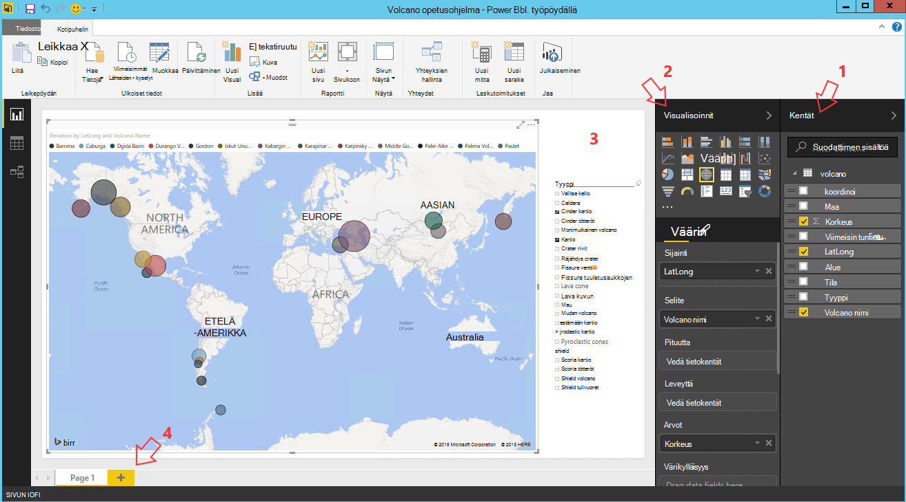

<properties
    pageTitle="Voit käyttää tietojen tiede virtuaalikoneen-kymmenen toimintoja | Microsoft Azure"
    description="Suorittaa eri tietojen tarkasteluun ja mallinnus tehtävän tiedot-tiede virtuaalikoneen."
    services="machine-learning"
    documentationCenter=""
    authors="bradsev"
    manager="jhubbard"
    editor="cgronlun"  />

<tags
    ms.service="machine-learning"
    ms.workload="data-services"
    ms.tgt_pltfrm="na"
    ms.devlang="na"
    ms.topic="article"
    ms.date="08/29/2016"
    ms.author="gokuma;weig;bradsev" />

# <a name="ten-things-you-can-do-on-the-data-science-virtual-machine"></a>Voit käyttää tietojen tiede virtuaalikoneen-kymmenen toimintoja

Microsoftin tietojen tiede virtuaalikoneen (DSVM) on tehokas tietojen tiede kehitysympäristö, jonka avulla voit suorittaa erilaisia tietojen tarkasteluun ja mallinnus tehtäviä. Ympäristön on jo muodostettu ja mukana useita Suositut tietojen analytics työkaluja, joiden avulla on helppo pääset nopeasti alkuun paikallisen-analyysin Cloud tai hybrid ominaisuuksissa. DSVM toimii muistuttaa paljon Azure-palvelujen kanssa ja voi lukea ja käsitellä tietoja, jotka on jo tallennettu Azure SQL Azure-tietovarasto, Azure tietojen järvi, Azuren tallennustilaan tai DocumentDB. Se hyödyntää myös muita analytics-työkaluja, kuten Azure koneen oppiminen ja Azure Data Factory.


Tässä artikkelissa käyttöösi selkeät oman DSVM käyttämisestä eri tietojen tiede tehtävien suorittamiseen ja käsitellä Azure muiden. Seuraavassa on muutamia esimerkkejä, voit tehdä DSVM:

1. Tietojen tutkiminen ja kehittää malleissa paikallisesti käyttämällä Microsoft-R palvelin Python DSVM
2. Jupyter muistikirjan avulla voit kokeilla tietosi Python 2, Python 3 Microsoft R-selaimen suorituskyky ja skaalattavuus suunniteltu R enterprise valmis-version
3. Operationalize mallien avulla R ja Python Azure koneen oppiminen asiakassovelluksissa voi käyttää käyttämällä yksinkertaista web services-liittymän mallit
4. Azure portal tai PowerShellin Azure resurssien hallinta
5. Laajenna tallennustilaa ja jakaa suurissa tietojoukkoja / koodi yli koko työryhmäsi luomalla Azure-tiedostosäilön oman DSVM käytettäväksi levyaseman nimellä
6. Jakaa-koodin avulla Github työryhmän kanssa sekä käyttää lisääminen säilöön esiasennettu Git asiakkaat - Git Bash Git Graafisen avulla.
7. Käyttää eri Azure tiedot ja analytics-palvelujen, kuten Azure-blob-säiliö Azure tietojen järvi, Azure Hdinsightiin (Hadoop), Azure DocumentDB Azure SQL-tietovarasto & tietokantojen
8. Raporttien ja raporttinäkymien Power BI Desktopin-valmiiksi asennettuna DSVM ja ottaa ne käyttöön pilveen
9. Skaalaa dynaamisesti oman DSVM projektin tarpeitasi
10. Lisätyökalut asentaminen virtuaalikoneen   


>[AZURE.NOTE] Lisää käyttökustannukset koskevat kattaa monet tässä artikkelissa luetellut lisätiedot tallennustilan ja analysoinnin palvelut. Lue lisätietoja [Azure hinnoittelu](https://azure.microsoft.com/pricing/) -sivulle.


**Edellytykset**

- Sinun on Azure tilauksen. Voit rekisteröidä varten ilmainen kokeiluversio [tähän](https://azure.microsoft.com/free/).

- Ohjeita valmisteluun tietojen tiede Virtual kone Azure-portaalissa on osoitteessa [luominen virtual machine](https://portal.azure.com/#create/microsoft-ads.standard-data-science-vmstandard-data-science-vm).

## <a name="1-explore-data-and-develop-models-using-microsoft-r-server-or-python"></a>1. tutkia tietoja ja kehittämään Microsoft R Server tai Python malleja

Voit esimerkiksi R ja Python kielten voit tehdä tietojen-analytics kirjoittaminen DSVM.

R voit käyttää IDE nimeltä "Vallankumous R yrityksen 8.0", joka löytyy Käynnistä-valikosta tai työpöydän. Microsoft on laatinut kirjastoja Avaa lähde ja CRAN-R käyttöön skaalattava analyysin ja voit analysoida tietoja suurempi kuin sallittu tekemällä rinnakkain artikkeli analyysi muistin päälle. Voit myös asentaa R-IDE, kuten [RStudio](https://www.rstudio.com/products/rstudio-desktop/)valittua.

Python voit käyttää IDE, kuten Visual Studio yhteisön Edition on valmiiksi asennettuna Visual Studio (PTVS)-tunniste Python työkaluja. Oletusarvon mukaan vain basic Python-2.7 on määritetty PTVS (ilman mitään analytics kirjasto, kuten SciKit, Pandas). Jos haluat ottaa käyttöön Anaconda Python 2.7 ja 3.5, tarvitset seuraavasti:

* Luo mukautettu eri ympäristöissä siirtymällä **Työkalut** -> **Python Työkalut** -> **Python ympäristöissä** ja valitsemalla sitten "**+ Mukautettu**" Visual Studion 2015 yhteisön Editionissa
* Anna kuvaus ja määritä ympäristön etuliite polut Anaconda Python 3.5 *c:\anaconda* Anaconda Python 2.7 tai *c:\anaconda\envs\py35* varten
* Valitse **Automaattinen** ja valitse **Käytä** Tallenna ympäristössä.

Seuraavassa on esimerkiksi näyttää mukautetun ympäristön valmisteleminen Visual Studiossa.


On [PTVS ohjeista](https://github.com/Microsoft/PTVS/wiki/Selecting-and-Installing-Python-Interpreters#hey-i-already-have-an-interpreter-on-my-machine-but-ptvs-doesnt-seem-to-know-about-it) lisätietoja siitä, miten voit luoda Python ympäristöissä.

Nyt voit on määritetty Python uuden projektin luominen. Siirry **tiedoston** -> **Uusi** -> **projektin** -> **Python** ja valitse luotavaa Python sovelluksen tyyppi. Voit määrittää haluamasi versio (Anaconda 2.7 tai 3.5) nykyisen projektin Python-ympäristöön: **Python ympäristön**hiiren kakkospainikkeella, valitse **Lisää tai poista Python ympäristöissä**ja valitse sitten haluamasi ympäristön liittämään projektiin. Löydät lisätietoja PTVS käyttäminen product [asiakirjat](https://github.com/Microsoft/PTVS/wiki) -sivu.

## <a name="2-using-a-jupyter-notebook-to-explore-and-model-your-data-with-python-or-r"></a>2. käytettäessä Jupyter muistikirjaa, tutki ja mallitietoihin Python tai R

Jupyter muistikirja on tehokas ympäristössä, joka sisältää selainpohjaisia "IDE" tietojen tarkasteluun ja muokkausta varten. Voit käyttää Python 2, Python 3 tai R (Avaa lähde ja Microsoft R-palvelin) Jupyter muistikirjaan.

Käynnistää Jupyter muistikirjan-valitsemalla Käynnistä-valikkokuvaketta tai työpöydän kuvakkeesta liittyvä **Jupyter muistikirja**. Valitse DSVM voit myös selata "https://localhost:9999 /" käyttämään Jupiter muistikirja. Jos sitä pyytää salasanaa, voit käyttää Jupyter muistikirjan vahvan salasanan luominen [säännöstä Microsoft tiede virtuaalikoneen](machine-learning-data-science-provision-vm.md) aiheen ***Jupyter muistikirjan palvelimessa vahvan salasanan luominen*** -kohdassa annettuja ohjeita avulla. 

Kun olet avannut muistikirjan, näkyviin tulee kansio, joka sisältää muutama Esimerkki muistikirjat, jotka ovat valmiiksi pakattu DSVM kyselyjä. Nyt voit tehdä seuraavia toimia:

- Napsauta muistikirjaa, jotta saat koodi.
- Suorita kullekin solulle painamalla näppäinyhdistelmää **VAIHTO + ENTER**.
- koko muistikirjan suorittaminen **solussa**napsauttamalla -> **suorittaminen**
- uuden muistikirjan luominen napsauttamalla Jupyter (vasemmassa yläkulmassa)-kuvaketta ja valitsemalla sitten **Uusi** -painikkeen oikealla ja valitsemalla sitten muistikirjan language (tunnetaan myös nimellä ytimet).   


>[AZURE.NOTE] Tällä hetkellä tuetaan Python 2.7, Python 3.5 ja R. Avaa lähde R sekä yrityksen R ydin tukee ohjelmoinnin skaalattava Microsoft R Server.   


Kun olet avannut voit selata muistikirjaa tietojen luoda mallin, Testaa kirjastojen valittua käyttämällä mallia.


## <a name="3-build-models-using-r-or-python-and-operationalize-them-using-azure-machine-learning"></a>3. Muodosta R tai Python mallit ja Operationalize ne käyttämällä Azure koneen oppiminen

Kun olet sisäisten ja vahvistaa mallin seuraava vaihe on yleensä ottamaan se tuotannon. Näin asiakkaan sovellusten käynnistää malleilla reaaliaikainen tai erä tilan perusteella. Azure koneen Learning tarjoaa, jolla operationalize R tai Python valmista mallia.

Azure koneen Learning-mallin operationalize-web-palvelu on määritetty, jonka avulla asiakkaat voivat soittaa muille käyttäjille, joka välittää syöteparametrit ja ennusteiden asetukseksi tulostaa mallin.   


>[AZURE.NOTE] Jollet ole vielä AzureML, voit hankkia vapaa työtilan tai vakio työtilan ohjesisältöä [AzureML Studio](https://studio.azureml.net/) Aloitussivu ja napsauttamalla "aloittaminen.   


### <a name="build-and-operationalize-python-models"></a>Muodosta ja Operationalize Python mallit

Seuraavassa on katkelma koodin kehitetty Python Jupyter muistikirjan, joka muodostaa SciKit Lue-kirjaston käytön yksinkertainen malli.

    #IRIS classification
    from sklearn import datasets
    from sklearn import svm
    clf = svm.SVC()
    iris = datasets.load_iris()
    X, y = iris.data, iris.target
    clf.fit(X, y)

Käytettävä menetelmä python-mallit käyttöön Azure koneen Learning rivittyy tekstinsyöttö mallin tuominen funktiota ja decorates myöntämä esiasennettu Azure koneen Learning python kirjaston määritteitä, joka ilmoittaa Azure koneen Learning työtila-tunnus, Ohjelmointirajapinnan avain ja syötteen ja palauttaa parametrit.  

    from azureml import services
    @services.publish(workspaceid, auth_token)
    @services.types(sep_l = float, sep_w = float, pet_l=float, pet_w=float)
    @services.returns(int) #0, or 1, or 2
    def predictIris(sep_l, sep_w, pet_l, pet_w):
    inputArray = [sep_l, sep_w, pet_l, pet_w]
    return clf.predict(inputArray)

Asiakas voi nyt soittaa web-palveluun. On helppokäyttöisyys kääreisiin, joka käyttää REST API-pyynnöt. Seuraavassa on esimerkkikoodi tarjoaman web-palveluun.

    # Consume through web service URL and keys
    from azureml import services
    @services.service(url, api_key)
    @services.types(sep_l = float, sep_w = float, pet_l=float, pet_w=float)
    @services.returns(float)
    def IrisPredictor(sep_l, sep_w, pet_l, pet_w):
    pass

    IrisPredictor(3,2,3,4)


>[AZURE.NOTE] Azure koneen Learning kirjasto on tuettu vain Python 2.7 tällä hetkellä.   


### <a name="build-and-operationalize-r-models"></a>Muodosta ja Operationalize R-mallit

Voit ottaa käyttöön R-mallien hallinta-tietojen tiede virtuaalikoneen tai muualla Azure koneen Learning tavalla, joka on samanlainen kuin kuinka se tehdään Python. Hänen seuraavasti:

- Luo alla työtila-tunnus ja auth settings.json tiedoston tunnuksen.
- Kirjoita paketti, mallin funktio ennustaa.
- Soita ```publishWebService``` välittää funktio-paketti Azure koneen Learning-kirjastossa.  

Seuraavassa on toimintosarja ja koodin katkelmat, jonka avulla voidaan määrittäminen, muodosta, julkaiseminen ja tarjoaman mallin web-palveluna Azure koneen Learning.

#### <a name="setup"></a>Asetukset

1.  Asenna AzureML R-paketti kirjoittamalla ```install.packages("AzureML")``` vallankumous R yrityksen 8.0 IDE tai R IDE.
2.  Lataa RTools [täältä](https://cran.r-project.org/bin/windows/Rtools/). Tarvitset zip-apuohjelman polku (ja nimetyt zip.exe), R-paketin operationalize AzureML kyselyjä.
3.  Luo kansio nimeltä settings.json tiedoston ```.azureml``` kotihakemistoosi-kohdassa ja kirjoita parametrit Azure ML työtilasta:

Settings.JSON tiedosto:

    {"workspace":{
    "id"                  : "ENTER YOUR AZUREML WORKSPACE ID",
    "authorization_token" : "ENTER YOUR AZUREML AUTH TOKEN"
    }}


#### <a name="build-a-model-in-r-and-publish-it-in-azure-ml"></a>R mallin luominen ja julkaiseminen Azure millilitroina

    library(AzureML)
    ws <- workspace(config="~/.azureml/settings.json")

    if(!require("lme4")) install.packages("lme4")
    library(lme4)
    set.seed(1)
    train <- sleepstudy[sample(nrow(sleepstudy), 120),]
    m <- lm(Reaction ~ Days + Subject, data = train)

    # Define a prediction function to publish based on the model:
    sleepyPredict <- function(newdata){
        predict(m, newdata=newdata)
    }

    ep <- publishWebService(ws, fun = sleepyPredict, name="sleepy lm", inputSchema = sleepstudy, data.frame=TRUE)

#### <a name="consume-the-model-deployed-in-azure-ml"></a>Kuluttavat käyttöön Azure millilitroina malli

Tarjoaman asiakassovellus mallia Käytämme Azure koneen Learning kirjaston nimi käyttämällä julkaistun web-palvelun hakemiseen `services` API-kutsu päätepisteen määrittämiseen. Valitse vain soitat `consume` toimi ja välittää tietoja kehyksen voi ennustaa.
Seuraava koodi käytetään tarjoaman julkaistaan Azure koneen Learning WWW-palvelun malli.


    library(AzureML)
    library(lme4)
    ws <- workspace(config="~/.azureml/settings.json")

    s <-  services(ws, name = "sleepy lm")
    s <- tail(s, 1) # use the last published function, in case of duplicate function names

    ep <- endpoints(ws, s)

    # OK, try this out, and compare with raw data
    ans = consume(ep, sleepstudy)$ans

Lisätietoja Azure koneen Learning R-kirjaston löytyy [tähän](https://cran.r-project.org/web/packages/AzureML/AzureML.pdf).


## <a name="4-administer-your-azure-resources-using-azure-portal-or-powershell"></a>4. Azure portal tai PowerShellin Azure resurssien hallinta

DSVM paitsi avulla voit luoda analytics-ratkaisun virtuaalikoneen paikallisesti, mutta voit myös käyttää Microsoft Azure cloud services. Azure tarjoaa useita suorittaminen, tallentaminen, analytics tietopalvelujen ja muut palvelut, joita voit hallita ja käyttää omaa DSVM.

Ammattimainen Azure tilaus ja pilvi resurssien selaimessa ja osoita [Azure portal](https://portal.azure.com). Voit käyttää myös PowerShellin Azure hallinnoimaan Azure tilauksen ja resurssien komentosarjan kautta.
Voit suorittaa PowerShellin Azure pikakuvakkeen työpöydälle tai liittyvä "Microsoft Azure Powershell-aloitusvalikkoon. Lue lisätietoja siitä, miten voit hallita Azure tilaus ja resurssien Windows Powershell-komentosarjojen [PowerShellin Microsoft Azure-ohjeet](../powershell-azure-resource-manager.md) .


## <a name="5-extend-your-storage-space-with-a-shared-file-system"></a>5. tallennustilaa jaetun tiedostojärjestelmän laajentaminen

Tietoja tutkijoiden jakaa suuria tietojoukkoja, koodi tai muita resursseja ryhmän sisällä. Itse DSVM on noin 70 gt käytettävissä olevaa tilaa. Tallennustilan siirtämisestä voi tarkastella tiedoston Azure-palvelu ja joko liittää se DSVM tai käyttää REST-Ohjelmointirajapinnalla kautta.   


>[AZURE.NOTE] Yksittäisten Tiedostokokorajoitus on 1 TT Azure tiedoston palvelun Jaa suurin tila on 5 Teratavua.   


Voit luoda Azure tiedoston palvelun Jaa PowerShellin Azure. Seuraavassa on komentosarja suoritetaan PowerShellin Azure luominen Azure tiedosto-palvelun jakaminen-kohdassa.

    # Authenticate to Azure.
    Login-AzureRmAccount
    # Select your subscription
    Get-AzureRmSubscription –SubscriptionName "<your subscription name>" | Select-AzureRmSubscription
    # Create a new resource group.
    New-AzureRmResourceGroup -Name <dsvmdatarg>
    # Create a new storage account. You can reuse existing storage account if you wish.
    New-AzureRmStorageAccount -Name <mydatadisk> -ResourceGroupName <dsvmdatarg> -Location "<Azure Data Center Name For eg. South Central US>" -Type "Standard_LRS"
    # Set your current working storage account
    Set-AzureRmCurrentStorageAccount –ResourceGroupName "<dsvmdatarg>" –StorageAccountName <mydatadisk>

    # Create a Azure File Service Share
    $s = New-AzureStorageShare <<teamsharename>>
    # Create a directory under the FIle share. You can give it any name
    New-AzureStorageDirectory -Share $s -Path <directory name>
    # List the share to confirm that everything worked
    Get-AzureStorageFile -Share $s


Nyt kun olet luonut Azure tiedostoresurssi, se voi ottaa virtual koneen Azure-tietokannassa. On suositeltavaa, että AM on sama Azure tietokeskuksen tallennustilan tiliksi viive ja tietojen siirto lisämaksujen välttämiseksi. Näin voit liittää aseman DSVM, joita voit suorittaa PowerShellin Azure-komentoja.


    # Get storage key of the storage account that has the Azure file share from Azure portal. Store it securely on the VM to avoid prompted in next command.
    cmdkey /add:<<mydatadisk>>.file.core.windows.net /user:<<mydatadisk>> /pass:<storage key>

    # Mount the Azure file share as Z: drive on the VM. You can chose another drive letter if you wish
    net use z:  \\<mydatadisk>.file.core.windows.net\<<teamsharename>>


Voit nyt käyttää aseman samalla tavalla kuin minkä tahansa tavallinen aseman AM.

## <a name="6-share-code-with-your-team-using-github"></a>6. jakaminen koodin käyttämällä Github ryhmän kanssa

Github on koodi-säilö, josta löydät otoksen koodi ja tietolähteiden useita eri työkaluja käyttöä eri toiminnot, jotka on jaettu developer-yhteisö. Se käyttää Git tekniikka seurata ja tallentaa koodin tiedostoversioiden. Github on myös ympäristö kohtaa, johon voit luoda oman säilöön tallentamiseen projektin työryhmän jaetun koodi ja asiakirjat, Toteuta Versionhallinta ja hallita myös joka käyttää tarkasteleminen ja osallistua koodi. Voit vierailla [Github Ohje sivujen](https://help.github.com/) käyttämiseen Git. Voit käyttää Github työskentely työryhmän kanssa, käytä yhteisön kehittämä koodi ja osallistua koodin yhteisöön tavoilla.

DSVM jo tulee asiakastyökalut on sekä komentorivillä hyvin Graafisen käyttämään Github säilöön. Komentorivi-työkalun Git ja Github kutsutaan Git Bash. Visual Studio DSVM asennettuihin on Git tunnisteet. Löydät pysäyttämisestä kuvakkeet käynnistysvalikon ja työpöydän työkalujen ohjelmistovaatimuksiin.

Lataa koodin käytät Github säilöstä ```git clone``` komento. Esimerkki voit ladata tietojen tiede säilöön julkaisemat Microsoft nykyiseen kansioon suorittamalla seuraava komento kun olet avannut ```git-bash```.

    git clone https://github.com/Azure/Azure-MachineLearning-DataScience.git

Visual Studiossa voit tehdä saman Kloonaa-toimintoa. Alla olevassa näyttökuvassa näkyy käyttäminen Git ja Github Työkalut Visual Studiossa.


Löydät lisätietoja Git avulla voit käsitellä github.com Github-säilöön useita resurssien käytettävissä. [Cheat taulukko](https://training.github.com/kit/downloads/github-git-cheat-sheet.pdf) on hyötyä viittaus.


## <a name="7-access-various-azure-data-and-analytics-services"></a>7. käyttää eri Azure tiedot ja analysoinnin palveluja

### <a name="azure-blob"></a>Azure-Blob

Azure-blob on luotettava, taloudellisia pilvitallennustilaa tietojen suuria ja pieniä. Anna meidän Tarkista, kuinka voit siirtää tietoja Azure-Blob-objektien ja access-tiedot tallennetaan Azure-Blob.

**Edellytyksenä**

- **Luo uusi Azure-Blob storage [Azure](https://portal.azure.com)-portaalista.**


- Vahvista esiasennettu komentoriviltä AzCopy työkalu osoitteessa ```C:\Program Files (x86)\Microsoft SDKs\Azure\AzCopy\azcopy.exe```. Voit lisätä avulla voit välttää koko komento-polku, kun suoritat tämän työkalun PATH-ympäristömuuttuja azcopy.exe sisältävä kansio. Katso lisätietoja AzCopy-työkalusta Lue [AzCopy asiakirjat](../storage/storage-use-azcopy.md)

- Käynnistä Azure-tallennustilan Explorer-työkalu. Se voi ladata [Microsoft Azure-tallennustilan Explorer](http://storageexplorer.com/). 


**Tietoja Siirry Azure-Blob AM: AzCopy**

Jos haluat siirtää tietoja paikallisina tiedostoina ja Blob-objektien tallennustilaan välillä, voit käyttää AzCopy komentorivin tai PowerShell:

    AzCopy /Source:C:\myfolder /Dest:https://<mystorageaccount>.blob.core.windows.net/<mycontainer> /DestKey:<storage account key> /Pattern:abc.txt

Korvaa **C:\myfolder** kohtaa, johon tiedosto on tallennettu, polku **mystorageaccount** blob storage tilin nimen, **mycontainer** säilön nimen, blob storage-pikanäppäin- **tallennustilan tilin avaimen** avulla. Löydät tallennustilan tilin tunnistetiedot [Azure](https://portal.azure.com)-portaalissa.


Suorita AzCopy komento PowerShell tai komentoriviltä. Tässä on joitakin Esimerkki käyttö AzCopy-komennon:


    # Copy *.sql from local machine to a Azure Blob
    "C:\Program Files (x86)\Microsoft SDKs\Azure\AzCopy\azcopy" /Source:"c:\Aaqs\Data Science Scripts" /Dest:https://[ENTER STORAGE ACCOUNT].blob.core.windows.net/[ENTER CONTAINER] /DestKey:[ENTER STORAGE KEY] /S /Pattern:*.sql

    # Copy back all files from Azure Blob container to Local machine

    "C:\Program Files (x86)\Microsoft SDKs\Azure\AzCopy\azcopy" /Dest:"c:\Aaqs\Data Science Scripts\temp" /Source:https://[ENTER STORAGE ACCOUNT].blob.core.windows.net/[ENTER CONTAINER] /SourceKey:[ENTER STORAGE KEY] /S


Kun suoritat AzCopy-komennon Azuren Blob-objektien kopioiminen näet tiedoston ohjelmat määrittäminen Azure-tallennustilan Explorerissa pian.


**Tietoja Siirry Azure-Blob AM: Azure-tallennustilan Explorer**

Voit myös Lataa paikallisen tiedoston tietoja oman AM Azure-tallennustilan Resurssienhallinnan avulla:

- Tietojen lataaminen säilön, valitse kohde-säilö ja napsauttamalla **Lataa** -painiketta.
- Valitse **...** **tiedostot** -ruudun oikealla puolella, valitse, valitse yksi tai useita tiedostoja ladataan tiedostojärjestelmästä ja valitse Aloita tiedostojen lataamisesta **Lataa** .


**Tietojen lukeminen Azure-Blob: AML lukija-moduuli**

Azure koneen Learning Studiossa lukea tietoja oman blob **tietojen tuominen-moduulin** avulla.


**Tietojen lukeminen Azure-Blob: Python ODBC**

Voit lukea tietoja suoraan Jupyter muistikirjan tai Python ohjelman blob **BlobService** kirjaston.

Tuoda tarvittavat paketit:

    import pandas as pd
    from pandas import Series, DataFrame
    import numpy as np
    import matplotlib.pyplot as plt
    from time import time
    import pyodbc
    import os
    from azure.storage.blob import BlobService
    import tables
    import time
    import zipfile
    import random

Valitse laajennus Azure-Blob-tilin tunnistetiedot ja lukea Blob:

    CONTAINERNAME = 'xxx'
    STORAGEACCOUNTNAME = 'xxxx'
    STORAGEACCOUNTKEY = 'xxxxxxxxxxxxxxxx'
    BLOBNAME = 'nyctaxidataset/nyctaxitrip/trip_data_1.csv'
    localfilename = 'trip_data_1.csv'
    LOCALDIRECTORY = os.getcwd()
    LOCALFILE =  os.path.join(LOCALDIRECTORY, localfilename)

    #download from blob
    t1 = time.time()
    blob_service = BlobService(account_name=STORAGEACCOUNTNAME,account_key=STORAGEACCOUNTKEY)
    blob_service.get_blob_to_path(CONTAINERNAME,BLOBNAME,LOCALFILE)
    t2 = time.time()
    print(("It takes %s seconds to download "+BLOBNAME) % (t2 - t1))

    #unzipping downloaded files if needed
    #with zipfile.ZipFile(ZIPPEDLOCALFILE, "r") as z:
    #    z.extractall(LOCALDIRECTORY)

    df1 = pd.read_csv(LOCALFILE, header=0)
    df1.columns = ['medallion','hack_license','vendor_id','rate_code','store_and_fwd_flag','pickup_datetime','dropoff_datetime','passenger_count','trip_time_in_secs','trip_distance','pickup_longitude','pickup_latitude','dropoff_longitude','dropoff_latitude']
    print 'the size of the data is: %d rows and  %d columns' % df1.shape

Tiedot on luku kehykseksi tiedot:


### <a name="azure-data-lake"></a>Azure tietojen järvi

Azure järvi tietosäilö on yhteensopiva kanssa Hadoop Distributed tiedoston järjestelmän (HDFS) big datasta analytics työmääriä hyper-akseli voi tallentaa. Se toimii Hadoop ekosysteemissä ja Azure tietojen järvi Analytics. Emme esittämään siitä, miten voit tietojen siirtäminen Azure tietovaraston järvi ja näyttää analytics Azure tietojen järvi Analytics avulla.

**Edellytyksenä**

- Luoda oman Azure tietojen järvi Analytics [Azure](https://portal.azure.com)-portaalissa.


- **Visual Studio** löydy [linkki](https://www.microsoft.com/download/details.aspx?id=49504) **Azure järvi Datatyökalut** on jo asennettu Visual Studio yhteisön Edition virtuaalikoneen eli. Kun käynnistäminen Visual Studio ja Azure tilauksen kirjautumisesta, näet Azure tietojen Analytics-tili ja tallennustilaa Visual Studio vasemmassa paneelissa.


**Siirrä tiedot AM tietojen Lake: Azure järvi hallinta**

Voit **Azure järvi tietoresurssien** lataa tiedot paikallisina tiedostoina virtuaalikoneen tietojen järvi säilöön.


Voit myös luoda tietojen putkijohto ja productionize tietojen-siirto, eri alueille tai Azure tietojen järvi [Azure tietojen Factory(ADF)](https://azure.microsoft.com/services/data-factory/)avulla. Emme suosittele tämän [artikkelin](https://azure.microsoft.com/blog/creating-big-data-pipelines-using-azure-data-lake-and-azure-data-factory/) , käy läpi vaiheet muodostamiseen data putkistot.

**Tietojen lukeminen Azure-Blob-objektien tietojen Lake: U SQL**

Jos tiedot ovat Azure-Blob-säiliö, voit lukea tietoja suoraan tallennustilan Azure Blob-objektien U-SQL-kysely. Ennen kirjoittamassa U-SQL-kyselyn, varmista, että tilisi Blob-objektien tallennustila on linkitetty Azure-tietoihin järvi. Siirry **Azure-portaaliin**, Etsi Azure tietojen järvi Analytics Raporttinäkymät-ikkunan, napsauta **Lisää tietolähde**, valitse tallennustyyppi **Azure** säilöön ja laajennus Azure-tallennustilan tilin nimi ja avaimen avulla. Voit sitten voi viitata tallennustilan tilin tallennetuista tiedoista.


Visual Studiossa lukea Blob-objektien tallennustilaan, tee joidenkin tietojen käsittelemistä, ominaisuuksien suunnittelu ja Azure tietojen järvi tai Azure-Blob-säiliö tuloksena olevat tiedot. Kun viittaat Blob-objektien tallennustilaan tietoja, käytä **wasb: / /**; Kun viittaat Azure tietojen järvi tietoja, käytä **swbhdfs: / /**


Voit käyttää seuraavia U-SQL-kyselyjä Visual Studiossa:

    @a =
        EXTRACT medallion string,
                hack_license string,
                vendor_id string,
                rate_code string,
                store_and_fwd_flag string,
                pickup_datetime string,
                dropoff_datetime string,
                passenger_count int,
                trip_time_in_secs double,
                trip_distance double,
                pickup_longitude string,
                pickup_latitude string,
                dropoff_longitude string,
                dropoff_latitude string

        FROM "wasb://<Container name>@<Azure Blob Storage Account Name>.blob.core.windows.net/<Input Data File Name>"
        USING Extractors.Csv();

    @b =
        SELECT vendor_id,
        COUNT(medallion) AS cnt_medallion,
        SUM(passenger_count) AS cnt_passenger,
        AVG(trip_distance) AS avg_trip_dist,
        MIN(trip_distance) AS min_trip_dist,
        MAX(trip_distance) AS max_trip_dist,
        AVG(trip_time_in_secs) AS avg_trip_time
        FROM @a
        GROUP BY vendor_id;

    OUTPUT @b   
    TO "swebhdfs://<Azure Data Lake Storage Account Name>.azuredatalakestore.net/<Folder Name>/<Output Data File Name>"
    USING Outputters.Csv();

    OUTPUT @b   
    TO "wasb://<Container name>@<Azure Blob Storage Account Name>.blob.core.windows.net/<Output Data File Name>"
    USING Outputters.Csv();


Kun kysely on lähetetty palvelimeen, kaavio, jossa näkyy projektin tila näkyvät.


**Kyselyn tietojen järvi tietojen: U SQL**

Kun tietojoukon nautitaan Azure tietojen järvi kyselyjä, voit käyttää [U SQL-kielen](../data-lake-analytics/data-lake-analytics-u-sql-get-started.md) kysely ja tarkastella tietoja. U-SQL-kielen muistuttaa T-SQL, mutta yhdistää joitakin ominaisuuksia C# niin, että käyttäjät voivat kirjoittaa mukautetun moduulit ja käyttäjän määrittämät funktiot jne. Voit käyttää komentosarjat edellisessä vaiheessa.

Jälkeen, kun kysely on lähetetty palvelimeen, tripdata_summary. CSV löytyy pian **Azure järvi tietoresurssien**, voi esikatsella tietoja mukaan hiiren kakkospainikkeella tiedostoa.


Voit avata tiedostotietoja:


### <a name="hdinsight-hadoop-clusters"></a>HDInsight Hadoop klustereiden

Azure Hdinsightiin on hallitun Apache Hadoop, ohjattu tai HBase myrsky palvelu-pilveen. Voit helposti käyttää Azure Hdinsightiin klustereiden tietojen tiede virtual tietokoneesta.

**Edellytyksenä**

- Luo uusi Azure-Blob storage [Azure](https://portal.azure.com)-portaalista. Tallennustilan tilin käytetään HDInsight klustereiden tietojen tallentamiseen.


- Azure Hdinsightiin Hadoop klustereiden [Azure](machine-learning-data-science-customize-hadoop-cluster.md) -portaalista mukauttaminen

  - Jos linkität tallennustilan tilin luotu HDInsight-klusterin luonnin yhteydessä. Tallennustilan tilin käytetään tietojen voi käsitellä sisällä klusterin käyttäminen.


  - Sinun on otettava **Etäkäyttöpalvelimen** klusterin pään solmu sen luomisen jälkeen. Muista määrittämiäsi (muun kuin sen luomisen osoitteessa klusterin määritetylle) etäkäyttöpalvelimen tunnistetiedot: tarvitset niitä alla.


  - Azure ML-työtilan luominen. Koneen Learning-kokeissa tallennetaan ML tässä työtilassa. Valitse korostettu asetukset-portaalissa, kuten alla olevassa näyttökuvassa.


  - Kirjoita Azure ML työtilan parametrit


  - Lataa IPython muistikirjan avulla. Ensin tuoda tarvittavat paketit, kytke tunnistetiedot, luominen db tallennustilan tilisi ja valitse Lataa HDI klustereihin tietoja.


        #Import required Packages
        import pyodbc
        import time as time
        import json
        import os
        import urllib
        import urllib2
        import warnings
        import re
        import pandas as pd
        import matplotlib.pyplot as plt
        from azure.storage.blob import BlobService
        warnings.filterwarnings("ignore", category=UserWarning, module='urllib2')


        #Create the connection to Hive using ODBC
        SERVER_NAME='xxx.azurehdinsight.net'
        DATABASE_NAME='nyctaxidb'
        USERID='xxx'
        PASSWORD='xxxx'
        DB_DRIVER='Microsoft Hive ODBC Driver'
        driver = 'DRIVER={' + DB_DRIVER + '}'
        server = 'Host=' + SERVER_NAME + ';Port=443'
        database = 'Schema=' + DATABASE_NAME
        hiveserv = 'HiveServerType=2'
        auth = 'AuthMech=6'
        uid = 'UID=' + USERID
        pwd = 'PWD=' + PASSWORD
        CONNECTION_STRING = ';'.join([driver,server,database,hiveserv,auth,uid,pwd])
        connection = pyodbc.connect(CONNECTION_STRING, autocommit=True)
        cursor=connection.cursor()


        #Create Hive database and tables
        queryString = "create database if not exists nyctaxidb;"
        cursor.execute(queryString)

        queryString = """
                        create external table if not exists nyctaxidb.trip
                        (
                            medallion string,
                            hack_license string,
                            vendor_id string,
                            rate_code string,
                            store_and_fwd_flag string,
                            pickup_datetime string,
                            dropoff_datetime string,
                            passenger_count int,
                            trip_time_in_secs double,
                            trip_distance double,
                            pickup_longitude double,
                            pickup_latitude double,
                            dropoff_longitude double,
                            dropoff_latitude double)  
                        PARTITIONED BY (month int)
                        ROW FORMAT DELIMITED FIELDS TERMINATED BY ',' lines terminated by '\\n'
                        STORED AS TEXTFILE LOCATION 'wasb:///nyctaxidbdata/trip' TBLPROPERTIES('skip.header.line.count'='1');
                    """
        cursor.execute(queryString)

        queryString = """
                        create external table if not exists nyctaxidb.fare
                        (
                            medallion string,
                            hack_license string,
                            vendor_id string,
                            pickup_datetime string,
                            payment_type string,
                            fare_amount double,
                            surcharge double,
                            mta_tax double,
                            tip_amount double,
                            tolls_amount double,
                            total_amount double)
                        PARTITIONED BY (month int)
                        ROW FORMAT DELIMITED FIELDS TERMINATED BY ',' lines terminated by '\\n'
                        STORED AS TEXTFILE LOCATION 'wasb:///nyctaxidbdata/fare' TBLPROPERTIES('skip.header.line.count'='1');
                    """
        cursor.execute(queryString)


        #Upload data from blob storage to HDI cluster
        for i in range(1,13):
            queryString = "LOAD DATA INPATH 'wasb:///nyctaxitripraw2/trip_data_%d.csv' INTO TABLE nyctaxidb2.trip PARTITION (month=%d);"%(i,i)
            cursor.execute(queryString)
            queryString = "LOAD DATA INPATH 'wasb:///nyctaxifareraw2/trip_fare_%d.csv' INTO TABLE nyctaxidb2.fare PARTITION (month=%d);"%(i,i)  
            cursor.execute(queryString)


- Vaihtoehtoisesti voit noudattaa tätä [vaiheittaista](machine-learning-data-science-process-hive-walkthrough.md) Kokousesitelmän taksin tietojen lataaminen HDI klusterin. Tärkeimmät vaiheet ovat seuraavat:

    - AzCopy: lataa pakatun CSV julkisen blob paikalliseen kansioon
    - AzCopy: lataa wsp CSV käyttäjän paikallisesta kansiosta HDI klusteriin
    - Kirjaudu sisään Hadoop-klusterin pään solmu ja valmisteleminen kokeilevaa tietojen analysointia varten

Kun tiedot on ladattu HDI klusterin, voit tarkistaa tietojen Azure-tallennustilan Resurssienhallinnassa. Ja käytössäsi on luotu HDI klusterin tietokanta-nyctaxidb.


**Tietojen tarkasteluun: rakenteen Python kyselyissä**

Tiedot on Hadoop-klusterin, voit pyodbc paketin Hadoop klustereiden ja kyselyn rakenne avulla voit tehdä tarkasteluun ja tekniikka ominaisuus tietokantayhteyden muodostamisessa. Voit tarkastella aiemmin luotuja taulukoita valmistelevat vaiheessa luomaasi.

    queryString = """
        show tables in nyctaxidb2;
        """
    pd.read_sql(queryString,connection)


Katsotaan tietueiden määrän jokaiselle kuukaudelle ja taajuuksilla Kallistettu tai ei työmatkan taulukossa:

    queryString = """
        select month, count(*) from nyctaxidb.trip group by month;
        """
    results = pd.read_sql(queryString,connection)

    %matplotlib inline

    results.columns = ['month', 'trip_count']
    df = results.copy()
    df.index = df['month']
    df['trip_count'].plot(kind='bar')


    queryString = """
        SELECT tipped, COUNT(*) AS tip_freq
        FROM
        (
            SELECT if(tip_amount > 0, 1, 0) as tipped, tip_amount
            FROM nyctaxidb.fare
        )tc
        GROUP BY tipped;
        """
    results = pd.read_sql(queryString,connection)

    results.columns = ['tipped', 'trip_count']
    df = results.copy()
    df.index = df['tipped']
    df['trip_count'].plot(kind='bar')


Syy voidaan laskea myös etäisyys Keräysvarastopaikka ja dropoff sijainti ja vertaa sitä työmatkan etäisyys.

    queryString = """
                    select pickup_longitude, pickup_latitude, dropoff_longitude, dropoff_latitude, trip_distance, trip_time_in_secs,
                        3959*2*2*atan((1-sqrt(1-pow(sin((dropoff_latitude-pickup_latitude)
                        *radians(180)/180/2),2)-cos(pickup_latitude*radians(180)/180)
                        *cos(dropoff_latitude*radians(180)/180)*pow(sin((dropoff_longitude-pickup_longitude)*radians(180)/180/2),2)))
                        /sqrt(pow(sin((dropoff_latitude-pickup_latitude)*radians(180)/180/2),2)
                        +cos(pickup_latitude*radians(180)/180)*cos(dropoff_latitude*radians(180)/180)*
                        pow(sin((dropoff_longitude-pickup_longitude)*radians(180)/180/2),2))) as direct_distance
                        from nyctaxidb.trip
                        where month=1
                            and pickup_longitude between -90 and -30
                            and pickup_latitude between 30 and 90
                            and dropoff_longitude between -90 and -30
                            and dropoff_latitude between 30 and 90;
                """
    results = pd.read_sql(queryString,connection)
    results.head(5)


    results.columns = ['pickup_longitude', 'pickup_latitude', 'dropoff_longitude',
                       'dropoff_latitude', 'trip_distance', 'trip_time_in_secs', 'direct_distance']
    df = results.loc[results['trip_distance']<=100] #remove outliers
    df = df.loc[df['direct_distance']<=100] #remove outliers
    plt.scatter(df['direct_distance'], df['trip_distance'])


Nyt valmisteleminen japanin mallinnus alas näyte (1 %) tietojoukko. Voit Käytämme näitä tietoja AML lukija-moduulissa.


        queryString = """
        create  table if not exists nyctaxi_downsampled_dataset_testNEW (
        medallion string,
        hack_license string,
        vendor_id string,
        rate_code string,
        store_and_fwd_flag string,
        pickup_datetime string,
        dropoff_datetime string,
        pickup_hour string,
        pickup_week string,
        weekday string,
        passenger_count int,
        trip_time_in_secs double,
        trip_distance double,
        pickup_longitude double,
        pickup_latitude double,
        dropoff_longitude double,
        dropoff_latitude double,
        direct_distance double,
        payment_type string,
        fare_amount double,
        surcharge double,
        mta_tax double,
        tip_amount double,
        tolls_amount double,
        total_amount double,
        tipped string,
        tip_class string
        )
        row format delimited fields terminated by ','
        lines terminated by '\\n'
        stored as textfile;
        """
        cursor.execute(queryString)

        --- now insert contents of the join into the above internal table

        queryString = """
        insert overwrite table nyctaxi_downsampled_dataset_testNEW
        select
        t.medallion,
        t.hack_license,
        t.vendor_id,
        t.rate_code,
        t.store_and_fwd_flag,
        t.pickup_datetime,
        t.dropoff_datetime,
        hour(t.pickup_datetime) as pickup_hour,
        weekofyear(t.pickup_datetime) as pickup_week,
        from_unixtime(unix_timestamp(t.pickup_datetime, 'yyyy-MM-dd HH:mm:ss'),'u') as weekday,
        t.passenger_count,
        t.trip_time_in_secs,
        t.trip_distance,
        t.pickup_longitude,
        t.pickup_latitude,
        t.dropoff_longitude,
        t.dropoff_latitude,
        t.direct_distance,
        f.payment_type,
        f.fare_amount,
        f.surcharge,
        f.mta_tax,
        f.tip_amount,
        f.tolls_amount,
        f.total_amount,
        if(tip_amount>0,1,0) as tipped,
        if(tip_amount=0,0,
        if(tip_amount>0 and tip_amount<=5,1,
        if(tip_amount>5 and tip_amount<=10,2,
        if(tip_amount>10 and tip_amount<=20,3,4)))) as tip_class
        from
        (
        select
        medallion,
        hack_license,
        vendor_id,
        rate_code,
        store_and_fwd_flag,
        pickup_datetime,
        dropoff_datetime,
        passenger_count,
        trip_time_in_secs,
        trip_distance,
        pickup_longitude,
        pickup_latitude,
        dropoff_longitude,
        dropoff_latitude,
        3959*2*2*atan((1-sqrt(1-pow(sin((dropoff_latitude-pickup_latitude)
        radians(180)/180/2),2)-cos(pickup_latitude*radians(180)/180)
        *cos(dropoff_latitude*radians(180)/180)*pow(sin((dropoff_longitude-pickup_longitude)*radians(180)/180/2),2)))
        /sqrt(pow(sin((dropoff_latitude-pickup_latitude)*radians(180)/180/2),2)
        +cos(pickup_latitude*radians(180)/180)*cos(dropoff_latitude*radians(180)/180)*pow(sin((dropoff_longitude-pickup_longitude)*radians(180)/180/2),2))) as direct_distance,
        rand() as sample_key

        from trip
        where pickup_latitude between 30 and 90
            and pickup_longitude between -90 and -30
            and dropoff_latitude between 30 and 90
            and dropoff_longitude between -90 and -30
        )t
        join
        (
        select
        medallion,
        hack_license,
        vendor_id,
        pickup_datetime,
        payment_type,
        fare_amount,
        surcharge,
        mta_tax,
        tip_amount,
        tolls_amount,
        total_amount
        from fare
        )f
        on t.medallion=f.medallion and t.hack_license=f.hack_license and t.pickup_datetime=f.pickup_datetime
        where t.sample_key<=0.01
        """
        cursor.execute(queryString)

Jonkin aikaa, kun näet tiedot on ladattu Hadoop klustereissa:

    queryString = """
        select * from nyctaxi_downsampled_dataset limit 10;
        """
    cursor.execute(queryString)
    pd.read_sql(queryString,connection)


**Lue tiedot käyttämällä AML HDI: Lukija-moduuli**

Voi myös access-tietokannan Hadoop-klusterin AML Studiossa **lukija** -moduulin avulla. Liitä HDI klustereiden ja Azure-tallennustilan tilin tunnistetiedot ja osaat luonnissa machine learning mallien avulla tietokannan HDI klustereissa.


Valitse voi tarkastella scored tietojoukko:


### <a name="azure-sql-data-warehouse--databases"></a>Azure SQL-tietovarasto ja tietokannat

Azure SQL-tietovarasto on joustavasti tietovarasto palveluna yritysluokan SQL Server-käyttökokemuksen.

Voit valmistella Azure SQL-tietovarasto tämän [artikkelin](../sql-data-warehouse/sql-data-warehouse-get-started-provision.md)ohjeiden mukaisesti. Kun valmistelu Azure SQL-tietovarasto, voit käyttää tätä [vaiheittaista](machine-learning-data-science-process-sqldw-walkthrough.md) tietojen lataaminen ja käytön muutamassa SQL-tietovarasto tietojen mallinnus tarkasteluun.

#### <a name="azure-documentdb"></a>Azure DocumentDB

Azure DocumentDB on NoSQL tietokanta pilveen. Sen avulla voit käsitellä tiedostoja, kuten JSON ja avulla voit tallentaa ja kyselyjen asiakirjat.

Sinun on suoritettava urheiluvälineet kohden voivat käyttää DocumentDB DSVM seuraavasti.

1. Asenna DocumentDB Python SDK (Suorita ```pip install pydocumentdb``` komentoriviltä)
1. [Azure](https://portal.azure.com) -portaalista DocumentDB tilin ja asiakirjan DB-tietokannan luominen
1. Voit ladata "DocumentDB siirtotyökalun" [Tässä](http://www.microsoft.com/downloads/details.aspx?FamilyID=cda7703a-2774-4c07-adcc-ad02ddc1a44d) ja Pura valittua kansioon
1. Tuoda tallennettuja [julkisen Blob-objektien](https://cahandson.blob.core.windows.net/samples/volcano.json) kanssa seuraavan komennon parametrit siirtotyökalun (dtui.exe hakemistosta, johon asensit DocumentDB siirtotyökalun) yhdeksi DocumentDB tietoja JSON (volcano tiedot). Kirjoita lähde ja kohteen sijainnin parametrit alla.

    /s:JsonFile /s.Files:https://cahandson.blob.core.windows.net/samples/volcano.json /t:DocumentDBBulk /t.ConnectionString:AccountEndpoint=https://[DocDBAccountName].documents.azure.com:443/; AccountKey = [[avain]; tietokannan = volcano /t.Collection:volcano1

Kun tuot tietoja, voit siirtyä Jupyter ja Avaa muistikirja liittyvä *DocumentDBSample* , joka sisältää python koodi käyttää DocumentDB sekä joitakin basic kyselyt. Lue lisää DocumentDB ohjesisältöä palvelun [asiakirjat-sivu](https://azure.microsoft.com/documentation/learning-paths/documentdb/)


## <a name="8-build-reports-and-dashboard-using-the-power-bi-desktop"></a>8. Muodosta raporttien ja koontinäytön Power BI Desktopin käyttäminen

Anna meidän visualisointi Volcano JSON-tiedosto on tuli DocumentDB yllä olevassa esimerkissä Power BI: n saada tietoa visual tiedot. Yksityiskohtaiset ohjeet ovat saatavilla [Power BI-artikkelissa](../documentdb/documentdb-powerbi-visualize.md). Korkean tason vaiheet ovat alla:

1. Avaa Power BI Desktopin ja tee "Nouda tiedot". Määritä URL-osoite kuin: https://cahandson.blob.core.windows.net/samples/volcano.json
2. Näkyviin tulee tuodut luettelona JSON-tietueet
3. Luettelon muuntaminen taulukoksi, jotta PowerBI käsitellä sama
4. Sarakkeiden laajentaminen napsauttamalla Laajenna-kuvaketta (samaa tiliä "vasemman ja oikean nuolipainikkeen"-kuvakkeella Valitse sarakkeen oikealla puolella)
5. Huomaa, että sijainti on "Tietueen"-kenttää. Laajenna tietue ja valitse vain koordinaatit. Koordinaatin on luettelo-sarake
6. Lisää taulukkoon uusi sarake luettelon coordinate sarakkeen muuntaa pilkku erillisessä LatLong sarakkeessa ketjuttaa kahden elementin käyttämällä kaavaa coordinate luettelon kenttään ```Text.From([coordinates]{1})&","&Text.From([coordinates]{0})```.
7. Lopuksi muunnat ```Elevation``` desimaali- ja valitse **Sulje** ja **Käytä**sarakkeen.

Sen sijaan, että vaiheet voit liittää seuraava koodi komentosarjojen ulos PowerBI, jonka avulla voit kirjoittaa tiedot muunnokset kyselyn kielen muokkaus-edellä kuvatut vaiheet.


    let
        Source = Json.Document(Web.Contents("https://cahandson.blob.core.windows.net/samples/volcano.json")),
        #"Converted to Table" = Table.FromList(Source, Splitter.SplitByNothing(), null, null, ExtraValues.Error),
        #"Expanded Column1" = Table.ExpandRecordColumn(#"Converted to Table", "Column1", {"Volcano Name", "Country", "Region", "Location", "Elevation", "Type", "Status", "Last Known Eruption", "id"}, {"Volcano Name", "Country", "Region", "Location", "Elevation", "Type", "Status", "Last Known Eruption", "id"}),
        #"Expanded Location" = Table.ExpandRecordColumn(#"Expanded Column1", "Location", {"coordinates"}, {"coordinates"}),
        #"Added Custom" = Table.AddColumn(#"Expanded Location", "LatLong", each Text.From([coordinates]{1})&","&Text.From([coordinates]{0})),
        #"Changed Type" = Table.TransformColumnTypes(#"Added Custom",{{"Elevation", type number}})
    in
        #"Changed Type"


Tiedot on nyt Power BI-tietomallissa. Power BI desktop pitäisi näyttää alla kuvatulla tavalla.


Voit aloittaa raportteja ja visualisointeja tietomallin avulla. Voit noudattaa raportin luominen [Power BI-artikkelin](../documentdb/documentdb-powerbi-visualize.md#build-the-reports) ohjeita. Lopputulos on raportti, joka näyttää seuraavalta.



## <a name="9-dynamically-scale-your-dsvm-to-meet-your-project-needs"></a>9. Skaalaa dynaamisesti oman DSVM projektin tarpeitasi

Voit skaalata ylä-ja project omien tarpeiden DSVM. Jos et tarvitse käyttää AM illalla tai viikonloput, voit [Azure portal](https://portal.azure.com)AM Sammuta vain.

>[AZURE.NOTE]  Laske kulujen maksamaan, jos käytät vain käyttöjärjestelmän Sammuta AM.  

Jos tarvitset käsitellään joitakin suuria asteikko-analyysi ja on enemmän suorittimen ja muistin ja/tai levyn kapasiteetti löydät suuri valinta AM kokoisille suorittimen sydämiä, muistin koko ja (mukaan lukien tasainen tilan asemat) levyn tyypit, jotka täyttävät suorittaminen ja talousarvion tarpeisiin. Täydellinen luettelo VMs sekä niiden hourly Laske hinnat on käytettävissä [Azuren näennäiskoneiden hinnoittelu](https://azure.microsoft.com/pricing/details/virtual-machines/) -sivulla.

Vastaavasti jos tarvitset AM käsittely kapasiteetin vähentää (esimerkiksi: pää työmäärää siirretään Hadoop tai Ohjattu klusterin), voit skaalata AM esiintymän asetukset klusterin [Azure portal](https://portal.azure.com) ja siirtyä alaspäin. Seuraavassa on näyttökuvan.


## <a name="10-install-additional-tools-on-your-virtual-machine"></a>10. Lisätyökalut asentaminen virtuaalikoneen

Microsoft on pakattu useita työkaluja, joilla on mielestäsi voivat osoite monia analytics on yhteisiä tietoja ja että olisi säästää aikaa mukaan sinun tarvitse asentaa ja määrittää oman ympäristöissä yksi kerrallaan ja säästää kustannuksia mukaan maksaa vain resursseille, jota käytetään.

Azure tiedot ja analysoinnin muiden sopivat analytics-ympäristöä varten tämän artikkelin avulla voidaan hyödyntää. Ymmärrämme, että joissakin tapauksissa tarpeitasi saattaa edellyttää muita työkaluja, kuten joitakin omistusoikeuksia muiden valmistajien työkaluja. Käytettävissäsi täydet järjestelmänvalvojan virtuaalikoneen uusia työkaluja, sinun täytyy asentaa. Voit myös asentaa muita pakettien Python ja R, joita ei ole asennettu valmiiksi. Voit käyttää Python joko ```conda``` tai ```pip```. Voit käyttää R ```install.packages()``` konsoli-R tai käyttää IDE ja valitse sitten "**pakettien** -> **Asentaa pakettien...**".

## <a name="summary"></a>Yhteenveto
Nämä ovat vain muutamia esimerkkejä Tee käyttöön Microsoft tietojen tiede virtuaalikoneen. On monia muita asioita, jotka voit ansiosta tehokkaita analytics-ympäristössä.
