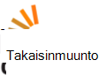

<properties
    pageTitle="Azure Media Services-palveluiden yhteisön yleiskatsaus | Microsoft Azure"
    description="Tämä Azure Media Services (AMS) yhteisösivu käsitellään eri tavalla, Nouda päivitykset AMS tietoja, näet uuden videot ja Podcast, kysymyksiä ja antaa palautetta. "
    services="media-services"
    documentationCenter=""
    authors="juliako"
    manager="erikre"
    editor=""/>

<tags
    ms.service="media-services"
    ms.workload="media"
    ms.tgt_pltfrm="na"
    ms.devlang="dotnet"
    ms.topic="article"
    ms.date="09/26/2016"  
    ms.author="juliako"/>

# Azure Media yhteisö  

Tämä Azure Media Services (AMS) yhteisösivu käsitellään eri tavalla voit saat AMS päivitykset, uuden videoissa ja Podcast, kysymyksiä ja antaa palautetta.   

##Videot ja Podcast

Jakson|Esittäjän|Päivämäärä
---|---|---
[DRM ja mediasisällön suojaaminen](https://azure.microsoft.com/documentation/videos/azurefridayprotectingyourmediacontentdrm/)|Mingfei Varvikko|02/19/2016
[AES-salausta ja mediasisällön suojaaminen](https://azure.microsoft.com/documentation/videos/azure-media-services-protecting-your-media-content-with-aes-encryption/)|Mingfei Varvikko|2/19/2016
[Azure Media Services Developer perinpohjaisesti käsittelevään artikkeliin](https://azure.microsoft.com/documentation/videos/build-2015-azure-media-services-developer-deep-dive/)|Mingfei Varvikko|04/27/2015
[Azure Media indeksointitoiminto luo automaattisesti mediatiedostojen tallenteet](https://azure.microsoft.com/documentation/videos/azure-media-indexer-autoatically-creates-transcripts-for-your-media-with-adarsh-solanki/)|Adarsh Solanki|07/09/2015
[Microsoft Azure Media-palveluissa Adarsh Solanki Hyperlapse](https://azure.microsoft.com/documentation/videos/microsoft-hyperlapse-in-azure-media-services-with-adarsh-solanki/)|Adarsh Solanki|10/07/2015

##Palautteen antaminen ja ehdotukset

[AZURE.INCLUDE [media-services-user-voice-include](../../includes/media-services-user-voice-include.md)]

##Keskustelun

###Twitter-

Käytä [@MSFTAzureMedia](https://twitter.com/MSFTAzureMedia) twitter kahvaa noudattamalla Twitter AMS uutiset ja päivitykset. Voit käyttää [@AzureSupport](https://twitter.com/azuresupport) tukipyyntö Twitter-twitter kahvaa.  
 
### Online-keskustelupalstat

Pääomasijoitusprojekteihin liittyviä kysymyksiä nykyisen tuotteita ja ominaisuuksia voi käyttää seuraavia keskustelupalstoilla.

MSDN ei tällä hetkellä AMS ensisijainen keskustelupalstalle.

 

 

## Pyydä ryhmän

Azure Media Services ensisijainen sähköpostiosoite on: **mediaservices@microsoft.com**.

Seuraavassa taulukossa on lueteltu ominaisuus sub ryhmiä sähköpostin:

Toiminto|Sähköpostin
---|---
Azure Media Analytics|amsanalytics@microsoft.com
Azure Media Player-ohjelmassa|ampinfo@microsoft.com 
Azure Media Explorer|amse@microsoft.com
Työnkulun suunnittelu|mepd@microsoft.com
