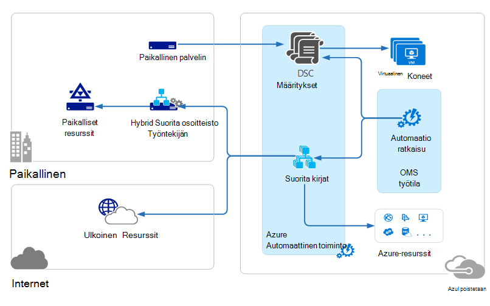

<properties 
   pageTitle="Toimintojen hallinta Suite (OMS) arkkitehtuuri | Microsoft Azure"
   description="Microsoft toimintojen hallinta Suite (OMS) on Microsoftin pilvipohjainen IT hallintaratkaisu, jonka avulla voit hallita ja suojata paikallisen oman ja cloud infrastruktuuria.  Tässä artikkelissa on eri palvelut sisältyvät OMS ja linkkejä yksityiskohtaiset niiden sisältöön."
   services="operations-management-suite"
   documentationCenter=""
   authors="bwren"
   manager="jwhit"
   editor="tysonn" />
<tags 
   ms.service="operations-management-suite"
   ms.devlang="na"
   ms.topic="get-started-article"
   ms.tgt_pltfrm="na"
   ms.workload="infrastructure-services"
   ms.date="10/27/2016"
   ms.author="bwren" />

# OMS-arkkitehtuuri

[Toimintojen hallinta Suite (OMS)](https://azure.microsoft.com/documentation/services/operations-management-suite/) on kokoelma pilvipohjaisia palveluja yhteyttä paikalliseen hallintaan ja cloud-ympäristössä.  Tässä artikkelissa kuvataan erilaisista paikallisista ja pilvessä osista OMS ja niiden korkean tason cloud tietojenkäsittely arkkitehtuuri.  Voit viitata Saat lisätietoja palvelun ohjeissa.

## Lokitiedoston Analytics

Kaikki [Lokin Analytics](https://azure.microsoft.com/documentation/services/log-analytics/) keräämät tiedot tallennetaan OMS säilöön, joka isännöi Azure-tietokannassa.  Yhdistettyjen lähteiden luoda OMS säilö kerätä tietoja.  Tällä hetkellä tueta yhdistettyjen lähteiden kolmenlaisia.

- [Windows](../log-analytics/log-analytics-windows-agents.md) - tai [Linux](../log-analytics/log-analytics-linux-agents.md) tietokoneeseen asennetussa agentti yhdistetty suoraan OMS.
- System Center Operations Manager (SCOM) hallinta ryhmän [Log Analytics yhteydessä](../log-analytics/log-analytics-om-agents.md) .  SCOM tekijöiden edelleen yhteydessä joka toimittaa tapahtuma- ja suorituskykytietoja Log Analytics hallinta-palvelimiin.
- [Azure-tallennustilan tilin](../log-analytics/log-analytics-azure-storage.md) , joka kerää [Azure diagnostiikka](../cloud-services/cloud-services-dotnet-diagnostics.md) tietoja työntekijän rooli, web-roolin tai virtual machine Azure-tietokannassa.

Tietolähteiden määrittää lokiin Analytics yhdistetyn lähteistä, kuten tapahtumalokit ja suorituskyvyn laskureita keräämiä tietoja.  Ratkaisujen Lisää toimintoja OMS ja helposti voidaan lisätä työtilan [OMS ratkaisuvalikoimaan](../log-analytics/log-analytics-add-solutions.md).  Jotkin ratkaisut voi vaatia suoran yhteyden, kirjaudu Analytics SCOM tekijöiden samalla, kun muut saattaa edellyttää muita agentti on asennettu.

Lokitiedoston Analytics on verkkopohjainen portal, joiden avulla voit hallita OMS resursseja, lisääminen ja määrittäminen OMS-ratkaisuja, ja tarkastella ja analysoida tietoja OMS säilössä.

## Azure automaatio

[Azure automaatio runbooks](http://azure.microsoft.com/documentation/services/automation) suoritetaan Azure pilveen, ja voit käyttää Azure muiden cloud Services-palveluissa tai käytettävissä olevat julkiset Internetissä olevat resurssit.  Voit myös määrittää paikallisen koneet oman paikallisten tietojen Centerissä [Hybrid Runbookin työntekijä](../automation/automation-hybrid-runbook-worker.md) avulla niin, että runbooks voi käyttää paikallisen resursseja.

[DSC määritykset](../automation/automation-dsc-overview.md) tallennetaan Azure automaatio voidaan ottaa käyttöön Azuren näennäiskoneiden suoraan.  Muita fyysisiä ja näennäiskoneiden pyytää käyttömahdollisuudet Azure automaatio DSC salaus puretaan palvelimesta.

Azure automaatio on OMS-ratkaisun, joka näyttää Tilasto- ja linkit käynnistää Azure portal-toiminnot.

## Azure varmuuskopiointi

Suojatun [Azure varmuuskopioidut](http://azure.microsoft.com/documentation/services/backup) tiedot on tallennettu varmuuskopion säilöön, joka sijaitsee tietyn maantieteellisen alueen.  Tietoja samalla alueella replikoida ja riippuen säilöön, voivat myös replikoida edelleen redundancy toisen alueen.

Azure varmuuskopiointi on kolme ratkaisevan skenaariot.

- Windows-tietokoneessa, jossa Azure Backup agentti.  Näin varmuuskopion tiedostojen ja kansioiden mistä tahansa Windows server tai asiakkaan suoraan yhteyttä Azure varmuuskopion säilö.  
- System Center Data Protection Manager (DPM) tai Microsoft Azure varmuuskopion Server. Voit hyödyntää DPM tai Microsoft Azure varmuuskopion Server varmuuskopioiminen tiedostojen ja kansioiden lisäksi sovelluksen-toiminnoista, kuten SQL: n ja SharePoint paikalliseen tallennussijaintiin ja valitse replikoida oman Azure varmuuskopion säilö.
- Azure virtuaalikoneen tunnisteet.  Voit varmuuskopioida Azuren näennäiskoneiden, että Azure varmuuskopion säilö.

Azure varmuuskopiointi on OMS-ratkaisun, joka näyttää Tilasto- ja linkit käynnistää Azure portal-toiminnot.

## Azure sivuston palauttaminen

[Azure palauttaminen](http://azure.microsoft.com/documentation/services/site-recovery) orchestrates replikoinnin ja tuntisesta näennäiskoneiden ja fyysinen palvelimien automaattisesti. Replikoinnin tietoja siirretään Hyper-V isännät VMware hypervisors ja fyysinen palvelimet ensisijainen ja toissijainen palvelinkeskusten tai palvelinkeskukseen ja Azure tallennustilan välillä.  Sivuston palauttaminen tallentaa metatietoja vaults tietyn Azure maantieteellisen alueen sijaitsee. Ei ole replikoitua tiedot tallennetaan palauttaminen-palvelu.

Azure sivuston palautus on kolme ratkaisevan replikoinnin skenaarioita.

**Hyper-V näennäiskoneiden sallittuja**
- Jos Hyper-V näennäiskoneiden hallitaan VMM paveikslėlis, voit toistaa toissijaisen tietokeskuksen tai Azure-tallennustilan.  Azure-replikoinnin on suojattu internet-yhteyden kautta.  Toissijainen palvelinkeskukseen replikointi on lähiverkossa.
- Jos Hyper-V näennäiskoneiden eivät ole hallitsee VMM, voit toistaa vain Azure-tallennustilan.  Azure-replikoinnin on suojattu internet-yhteyden kautta.
 
**VMWare näennäiskoneiden sallittuja**
- Voit toistaa VMware näennäiskoneiden toissijainen palvelinkeskukseen, jossa VMware tai Azure-tallennustilan.  Azure-replikoinnin voi ilmetä, sivuston sivustossa VPN tai Azure ExpressRoute tai suojatun Internet-yhteyden päälle. Toissijainen palvelinkeskukseen Replikointi tapahtuu InMage Scout tietojen kanavan kautta.
 
**Replikoinnin fyysinen Windowsin ja Linux-palvelimien** 
- Voit toistaa fyysiset palvelimet toissijainen palvelinkeskukseen tai Azure-tallennustilan. Azure-replikoinnin voi ilmetä, sivuston sivustossa VPN tai Azure ExpressRoute tai suojatun Internet-yhteyden päälle. Toissijainen palvelinkeskukseen Replikointi tapahtuu InMage Scout tietojen kanavan kautta.  Azure sivuston palautus on OMS-ratkaisun, joka näyttää joitakin tilastotiedot, mutta sinun on käytettävä Azure portaalin toiminnot.

## Seuraavat vaiheet

- Lisätietoja [lokin Analytics](http://azure.microsoft.com/documentation/services/log-analytics).
- Lisätietoja [Azure automaatio](https://azure.microsoft.com/documentation/services/automation).
- Lisätietoja [Azure varmuuskopion](http://azure.microsoft.com/documentation/services/backup).
- Lisätietoja [Azure palauttaminen](http://azure.microsoft.com/documentation/services/site-recovery).
