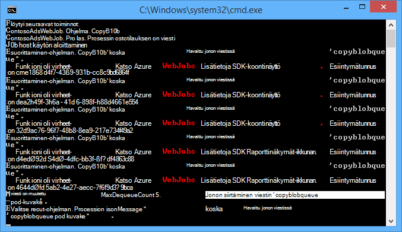
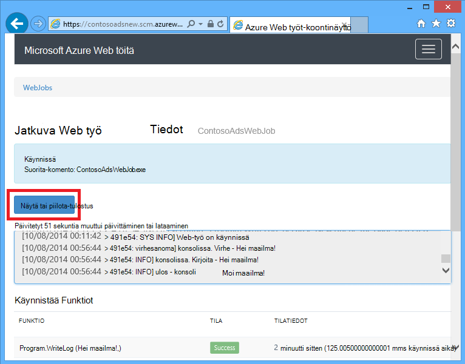
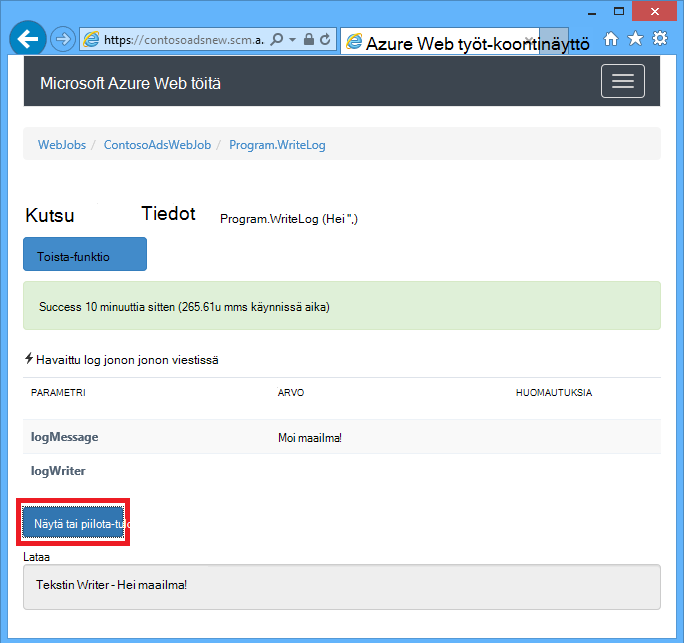
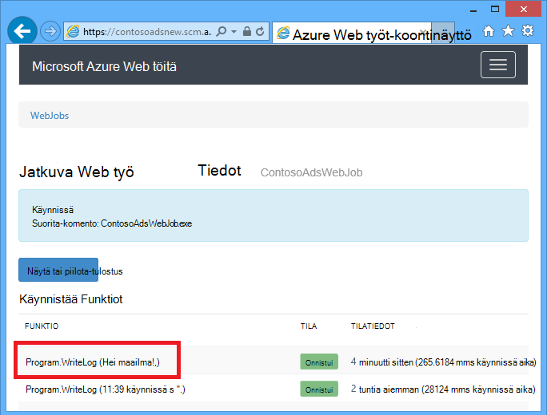
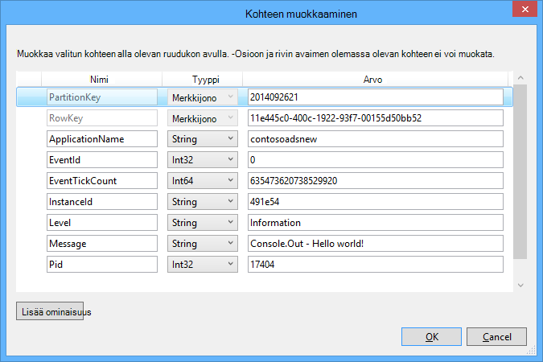
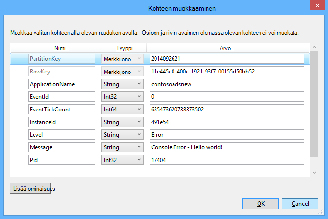

<properties
    pageTitle="Käytön aloittaminen jonon tallennustilan ja Visual Studio yhdistetty services (WebJob projektit) | Microsoft Azure"
    description="Pikaviestien käyttäminen Azure jonon tallennustilan WebJob projektin jälkeen yhteyden Visual Studiossa tallennustilan tilin yhdistetyt palvelut."
    services="storage"
    documentationCenter=""
    authors="TomArcher"
    manager="douge"
    editor=""/>

<tags
    ms.service="storage"
    ms.workload="web"
    ms.tgt_pltfrm="vs-getting-started"
    ms.devlang="na"
    ms.topic="article"
    ms.date="07/18/2016"
    ms.author="tarcher"/>

# Azure-jonossa tallennustilan ja Visual Studio käytön aloittaminen yhdistetyt palvelut (WebJob projektit)

[AZURE.INCLUDE [storage-try-azure-tools-queues](../../includes/storage-try-azure-tools-queues.md)]

## Yleiskatsaus

Tässä artikkelissa kuvataan, miten käyttäminen Azure jonon tallennustilan Visual Studio Azure WebJob projektin, kun olet luonut tai Viitattu Azure-tallennustilan tilin Visual Studio **Lisää yhdistetyt palvelut** -valintaikkunan avulla. Kun lisäät tallennustilan tilin WebJob projektin Visual Studio **Lisää yhdistetyt palvelut** -valintaikkunan, tarvittavat Azure-tallennustilan NuGet paketit on asennettu, .NET viitteet on lisätty projektiin ja yhteyden merkkijonot tallennustilan tilin päivitetään App.config-tiedostoa.  

Tässä artikkelissa on C# MALLIKOODEJA, joka näyttää, miten käyttävät Azure WebJobs SDK 1.x Azure jonon tallennustilan-palvelussa.

Azure jonon tallennustila on palvelu, projektiin paljon viestejä, jotka voi käyttää mitä tahansa maailmanlaajuisesti todennetut puhelujen soittaminen HTTP tai HTTPS kautta. Yksittäisen jonon viesti voi olla enintään 64 Kilotavun kokoinen ja jono voi sisältää miljoonia viestit-tallennustilan tilin kokonaiskapasiteetti rajoissa. Saat lisätietoja [Azure jonon tallennustilan käyttämällä .NET käytön aloittaminen](storage-dotnet-how-to-use-queues.md) . Saat lisätietoja ASP.NET [ASP.NET](http://www.asp.net).

## Funktion käynnistämisestä jonon viestin saapuessa

Jos haluat kirjoittaa funktion, joka WebJobs SDK soittaa jonon viestin saapuessa, käytä **QueueTrigger** -määritettä. Määritteen konstruktoria kestää parametrin, joka määrittää jonon lisääminen nimi. Katso, miten voit määrittää jonon nimen dynaamisesti, lisätietoa [määrittämisestä asetukset](#how-to-set-configuration-options).

### Merkkijono sanomien

Seuraavassa esimerkissä jonossa on merkkijono, viestin, joten **QueueTrigger** käytetään kyselymerkkijonon parametrin **logMessage** , joka sisältää jonon viestin sisältöä. -Funktion [kirjoittaa log viestin koontinäyttö](#how-to-write-logs).

        public static void ProcessQueueMessage([QueueTrigger("logqueue")] string logMessage, TextWriter logger)
        {
            logger.WriteLine(logMessage);
        }

Lisäksi **merkkijono**-parametrin ehkä DBCS-matriisi, **CloudQueueMessage** -objektin tai POCO määrittämiisi arvoihin.

### POCO [(Normaali vanha CLR-objekti](http://en.wikipedia.org/wiki/Plain_Old_CLR_Object)) jonon viestit

Seuraavassa esimerkissä jonon viesti sisältää JSON **BlobInformation** objekti, joka sisältää **BlobName** ominaisuuden. SDK deserializes automaattisesti objekti.

        public static void WriteLogPOCO([QueueTrigger("logqueue")] BlobInformation blobInfo, TextWriter logger)
        {
            logger.WriteLine("Queue message refers to blob: " + blobInfo.BlobName);
        }

SDK käyttää [Newtonsoft.Json NuGet paketin](http://www.nuget.org/packages/Newtonsoft.Json) onnistu ja poistaa viestit. Jos luot sanomien ohjelmassa, joka ei käytä WebJobs SDK-paketissa, voit kirjoittaa koodin, kuten seuraavassa esimerkissä POCO jonossa viestin, joka on SDK: ssa voidaan jäsentää luominen.

        BlobInformation blobInfo = new BlobInformation() { BlobName = "log.txt" };
        var queueMessage = new CloudQueueMessage(JsonConvert.SerializeObject(blobInfo));
        logQueue.AddMessage(queueMessage);

### Asynkroninen Funktiot

Seuraavat asynkroninen funktion [kirjoittaa lokia koontinäyttö](#how-to-write-logs).

        public async static Task ProcessQueueMessageAsync([QueueTrigger("logqueue")] string logMessage, TextWriter logger)
        {
            await logger.WriteLineAsync(logMessage);
        }

Asynkroninen Funktiot saattaa kestää [peruutus-tunnuksen](http://www.asp.net/mvc/overview/performance/using-asynchronous-methods-in-aspnet-mvc-4#CancelToken), joka kopioi blob seuraavan esimerkin mukaisesti. ( **QueueTrigger** paikkamerkin kuvaus-kohdassa [BLOB](#how-to-read-and-write-blobs-and-tables-while-processing-a-queue-message) .)

        public async static Task ProcessQueueMessageAsyncCancellationToken(
            [QueueTrigger("blobcopyqueue")] string blobName,
            [Blob("textblobs/{queueTrigger}",FileAccess.Read)] Stream blobInput,
            [Blob("textblobs/{queueTrigger}-new",FileAccess.Write)] Stream blobOutput,
            CancellationToken token)
        {
            await blobInput.CopyToAsync(blobOutput, 4096, token);
        }

## QueueTrigger määrite toimii tyypit

Voit käyttää seuraavia **QueueTrigger** :

* **merkkijono**
* POCO kuin JSON tyyppi
* **Byte]**
* **CloudQueueMessage**

## Kysely-menetelmällä

SDK toteuttaa satunnainen eksponentiaalisen Edellinen käytöstä algoritmin vähentää vapaa-jonossa kyselyt tallennustilan kustannukset-tehoste.  Kun viesti löytyy, SDK odottaa kahden sekunnin ajan ja sen jälkeen tarkistaa toisen viestin; Kun sanomaa ei löydy Odota noin neljän sekunnin ajan ennen kuin yrität uudelleen. Epäonnistui Symbol jonon-ilmoitus, kun odotusaika säilyy niin, että, kunnes ohjausobjekti suurin odotusaika, jonka oletusarvo on minuutin kuluttua. [Suurin odotusaika on määritettävä](#how-to-set-configuration-options).

## Useita kertoja

Jos web-sovellus toimii eri esiintymissä, jatkuva WebJobs suoritetaan jokaiseen tietokoneeseen ja Jokaisessa koneessa käynnistimien Odota ja yritä suorittaa toimintoja. Joissakin tilanteissa Tämä voi aiheuttaa joitakin toimintoja käsittelyn samat tiedot kahdesti niin Funktiot olisi idempotent (kirjoitettu niin, että kutsumista ne toistuvasti syötteen tietoja ei tuottaa samat tulokset).  

## Rinnakkaisia suorittaminen

Jos sinulla on useita eri olevien Kuuntele funktioita, SDK soittavat ne rinnakkain, kun viestejä vastaanotetaan samanaikaisesti.

Sama koskee, kun useita viestejä vastaanotetaan yhden jonon. Oletusarvon mukaan SDK saa 16 sanomien erän kerrallaan ja käynnistää haluamasi funktio käsittelee ne rinnakkain. [Erän koko on määritettävä](#how-to-set-configuration-options). Kun käsitellään numero syötetään puolen erän koko, SDK saa muuta erää ja aloittaa käsittelyn viestit. Tämän vuoksi samanaikainen viestit käsitellään funktiota kohden enimmäismäärä on yksi ja puoli kertaa erän koko. Tämä rajoitus koskee erikseen jokaiselle funktio, joka on **QueueTrigger** -määrite. Jos et halua rinnakkain suorittamisen yksi jono vastaanotetut viestit-arvoksi 1 erän koko.

## Hae jonossa tai jonon viestin metatiedot

Voit hankkia lisäämällä parametreja menetelmän allekirjoitus viestin seuraavat ominaisuudet:

* **DateTimeOffset-arvoa** expirationTime
* **DateTimeOffset-arvoa** insertionTime
* **DateTimeOffset-arvoa** nextVisibleTime
* **merkkijonon** queueTrigger (sisältää viestiteksti)
* **merkkijonon** tunnus
* **merkkijonon** popReceipt
* **int** -dequeueCount

Jos haluat käsitellä Azure tallennustilan API, voit lisätä myös **CloudStorageAccount** parametrin.

Seuraavassa esimerkissä kirjoitetaan kaikki metatiedot INFO-sovelluksen lokiin. Esimerkissä logMessage ja queueTrigger sisältää jonon viestin sisältöä.

        public static void WriteLog([QueueTrigger("logqueue")] string logMessage,
            DateTimeOffset expirationTime,
            DateTimeOffset insertionTime,
            DateTimeOffset nextVisibleTime,
            string id,
            string popReceipt,
            int dequeueCount,
            string queueTrigger,
            CloudStorageAccount cloudStorageAccount,
            TextWriter logger)
        {
            logger.WriteLine(
                "logMessage={0}\n" +
            "expirationTime={1}\ninsertionTime={2}\n" +
                "nextVisibleTime={3}\n" +
                "id={4}\npopReceipt={5}\ndequeueCount={6}\n" +
                "queue endpoint={7} queueTrigger={8}",
                logMessage, expirationTime,
                insertionTime,
                nextVisibleTime, id,
                popReceipt, dequeueCount,
                cloudStorageAccount.QueueEndpoint,
                queueTrigger);
        }

Tässä on esimerkki lokia sample code kirjoittama:

        logMessage=Hello world!
        expirationTime=10/14/2014 10:31:04 PM +00:00
        insertionTime=10/7/2014 10:31:04 PM +00:00
        nextVisibleTime=10/7/2014 10:41:23 PM +00:00
        id=262e49cd-26d3-4303-ae88-33baf8796d91
        popReceipt=AgAAAAMAAAAAAAAAfc9H0n/izwE=
        dequeueCount=1
        queue endpoint=https://contosoads.queue.core.windows.net/
        queueTrigger=Hello world!

## Kaksivaiheista sulkeminen

Funktion, joka suoritetaan jatkuva WebJob hyväksyä **CancellationToken** parametri, joka mahdollistaa käyttöjärjestelmän funktio ilmoittaa, kun WebJob on lopetetaan. Tämä ilmoitus avulla voit varmistaa, funktio ei lopeta odottamatta niin, että jättää tiedot epäyhtenäiseen tilaan.

Seuraavassa esimerkissä esitetään tarkistaminen pian funktion WebJob lopettamista varten.

    public static void GracefulShutdownDemo(
                [QueueTrigger("inputqueue")] string inputText,
                TextWriter logger,
                CancellationToken token)
    {
        for (int i = 0; i < 100; i++)
        {
            if (token.IsCancellationRequested)
            {
                logger.WriteLine("Function was cancelled at iteration {0}", i);
                break;
            }
            Thread.Sleep(1000);
            logger.WriteLine("Normal processing for queue message={0}", inputText);
        }
    }

**Huomautus:** Koontinäyttö ehkä ole oikein Näytä tila ja tulosteen toiminnot, jotka on suljettu.

Lisätietoja on artikkelissa [WebJobs kaksivaiheista Sammuta](http://blog.amitapple.com/post/2014/05/webjobs-graceful-shutdown/#.VCt1GXl0wpR).   

## Jonon viestin luominen jonon viestin käsiteltäessä

Jos haluat kirjoittaa funktion, joka luo uuden jonon viestin, käytä **jonon** -määritettä. **QueueTrigger**, kuten jonon nimen merkkijonona Välitä tai voit [määrittää jonon nimen dynaamisesti](#how-to-set-configuration-options).

### Merkkijono sanomien

Asynkroninen koodi-näyte Luo uuden jonon viestin nimeltä "outputqueue" samaa sisältöä vastaanotti nimeltä "inputqueue" jonossa jonon viestinä jonossa. (Asynkroninen funktioiden käyttäminen **IAsyncCollector<T> ** tässä osassa myöhemmin esitetyllä tavalla.)

        public static void CreateQueueMessage(
            [QueueTrigger("inputqueue")] string queueMessage,
            [Queue("outputqueue")] out string outputQueueMessage )
        {
            outputQueueMessage = queueMessage;
        }

### POCO [(Normaali vanha CLR-objekti](http://en.wikipedia.org/wiki/Plain_Old_CLR_Object)) jonon viestit

Jonon viestin, joka sisältää merkkijonon sijaan POCO luominen välittää POCO tyyppi tulosteen parametrina **jonon** Määritekonstruktorilla.

        public static void CreateQueueMessage(
            [QueueTrigger("inputqueue")] BlobInformation blobInfoInput,
            [Queue("outputqueue")] out BlobInformation blobInfoOutput )
        {
            blobInfoOutput = blobInfoInput;
        }

SDK serializes automaattisesti JSON objekti. Jonon viestin luodaan aina, vaikka objekti on null.

### Luo useita viestejä tai asynkroninen Funktiot

Jos haluat luoda useita viestejä, tehdä tulosteen jonossa parametrin tyypin **ICollector<T> ** tai **IAsyncCollector<T>**, kuten seuraavassa esimerkissä.

        public static void CreateQueueMessages(
            [QueueTrigger("inputqueue")] string queueMessage,
            [Queue("outputqueue")] ICollector<string> outputQueueMessage,
            TextWriter logger)
        {
            logger.WriteLine("Creating 2 messages in outputqueue");
            outputQueueMessage.Add(queueMessage + "1");
            outputQueueMessage.Add(queueMessage + "2");
        }

Jonon jokaisen viestin luodaan heti, kun **Lisää** menetelmää kutsutaan.

### Tiedostotyypit, joka toimii jonon-määrite

Voit käyttää parametrin seuraavanlaisia **jonon** määrite:

* **merkkijono** (Luo jonon viesti, jos parametriarvo on muu kuin null, kun funktio päättyy)
* **ulos byte]** (toiminta **merkkijono**)
* **CloudQueueMessage ulos** (toiminta **merkkijono**)
* **POCO ulos** (liittymätyypillä, Luo viestin null-objektin ja jos parametri on tyhjä, kun funktio päättyy)
* **ICollector**
* **IAsyncCollector**
* **CloudQueue** (luomisen viestiä, joissa manuaalisesti suoraan Azure-tallennustilan API)

### Käytä funktiota tekstissä WebJobs SDK määritteet

Jos haluat tehdä joitakin työt-funktion ennen kuin käytät WebJobs SDK-määrite, kuten **jonossa**, **Blob-objektien**tai **taulukon**, voit käyttää **IBinder** -liittymän.

Seuraavassa esimerkissä tulee syötteen jonon viestin ja luo uusi viesti, jossa tulostus-jonossa samaa sisältöä. Tulosteen jonon nimi on määritetty koodilla funktion tekstiosaan.

        public static void CreateQueueMessage(
            [QueueTrigger("inputqueue")] string queueMessage,
            IBinder binder)
        {
            string outputQueueName = "outputqueue" + DateTime.Now.Month.ToString();
            QueueAttribute queueAttribute = new QueueAttribute(outputQueueName);
            CloudQueue outputQueue = binder.Bind<CloudQueue>(queueAttribute);
            outputQueue.AddMessage(new CloudQueueMessage(queueMessage));
        }

**IBinder** -liittymän voidaan myös **taulukon** ja **Blob** -ominaisuuksilla.

## Miten lukemiseen ja kirjoittamiseen BLOB-objektit ja taulukot jonon viestin käsiteltäessä

**Blob-objektien** ja **taulukon** määritteet mahdollistavat lukemiseen ja kirjoittamiseen BLOB-objektit ja taulukot. Tässä osassa mallit koskevat BLOB-objektit. Katso, [miten voit käyttää Azure-blob-säiliö ja WebJobs SDK](../app-service-web/websites-dotnet-webjobs-sdk-storage-blobs-how-to.md)MALLIKOODEJA, jotka näyttävät käynnistämisestä prosessit BLOB-objektit luodaan tai päivitetään, ja MALLIKOODEJA, lukeminen ja kirjoittaminen taulukot, tutustu [käyttämään Azure-taulukkotallennus WebJobs SDK: N kanssa](../app-service-web/websites-dotnet-webjobs-sdk-storage-tables-how-to.md).

### Merkkijono sanomien käynnistävä blob-toiminnot

**QueueTrigger** on jonon viestiin, joka sisältää merkkijonon, voit käyttää **Blob** -määritteen **blobPath** parametri, joka sisältää viestin sisällön paikkamerkki.

Seuraavassa esimerkissä **Stream** objektien lukemiseen ja kirjoittamiseen BLOB-objektit. Jonon viesti on textblobs säilö sijaitsee Blob-objektien nimi. Kopion Blob-objektien kanssa "-uusi" liitetään nimi luodaan samaan säilö.

        public static void ProcessQueueMessage(
            [QueueTrigger("blobcopyqueue")] string blobName,
            [Blob("textblobs/{queueTrigger}",FileAccess.Read)] Stream blobInput,
            [Blob("textblobs/{queueTrigger}-new",FileAccess.Write)] Stream blobOutput)
        {
            blobInput.CopyTo(blobOutput, 4096);
        }

**Blob** -Määritekonstruktorilla kestää **blobPath** -parametri, joka määrittää säilö ja Blob-objektien nimi. Saat lisätietoja tämän paikkamerkin [käyttämisestä Azure-blob-säiliö WebJobs SDK: N kanssa](../app-service-web/websites-dotnet-webjobs-sdk-storage-blobs-how-to.md).

Kun määrite decorates **Stream** -objektia, toinen konstruktorin parametri näyttää **FileAccess** -tilassa luku ja kirjoita luku-/ kirjoitusoikeudet.

Seuraavassa esimerkissä **CloudBlockBlob** objektin poistaminen blob. Jonon viesti on blob nimi.

        public static void DeleteBlob(
            [QueueTrigger("deleteblobqueue")] string blobName,
            [Blob("textblobs/{queueTrigger}")] CloudBlockBlob blobToDelete)
        {
            blobToDelete.Delete();
        }

### POCO [(Normaali vanha CLR-objekti](http://en.wikipedia.org/wiki/Plain_Old_CLR_Object)) jonon viestit

POCO, tallennettujen JSON jonon viestissä voit paikkamerkit, että objektin nimi ominaisuudet **jonon** -määritteen **blobPath** -parametrissa. Voit käyttää myös jonon metatietojen ominaisuuksien nimiä paikkamerkkeinä. Katso [jono ja jonon viestin metatiedot](#get-queue-or-queue-message-metadata).

Seuraavassa esimerkissä kopioi blob uusi blob tunnistetta. Jonon viesti on **BlobInformation** -objekti, joka sisältää **BlobName** ja **BlobNameWithoutExtension** ominaisuudet. Ominaisuuksien nimet käytetään **Blob-objektien** määritteet blob-polku-sovelluksessa paikkamerkkeinä.

        public static void CopyBlobPOCO(
            [QueueTrigger("copyblobqueue")] BlobInformation blobInfo,
            [Blob("textblobs/{BlobName}", FileAccess.Read)] Stream blobInput,
            [Blob("textblobs/{BlobNameWithoutExtension}.txt", FileAccess.Write)] Stream blobOutput)
        {
            blobInput.CopyTo(blobOutput, 4096);
        }

SDK käyttää [Newtonsoft.Json NuGet paketin](http://www.nuget.org/packages/Newtonsoft.Json) onnistu ja poistaa viestit. Jos luot sanomien ohjelmassa, joka ei käytä WebJobs SDK-paketissa, voit kirjoittaa koodin, kuten seuraavassa esimerkissä POCO jonossa viestin, joka on SDK: ssa voidaan jäsentää luominen.

        BlobInformation blobInfo = new BlobInformation() { BlobName = "boot.log", BlobNameWithoutExtension = "boot" };
        var queueMessage = new CloudQueueMessage(JsonConvert.SerializeObject(blobInfo));
        logQueue.AddMessage(queueMessage);

Jos haluat tehdä joitakin työt-funktion ennen blob sitominen objektin, voit [käyttää WebJobs SDK määritteet funktiota tekstissä](#use-webjobs-sdk-attributes-in-the-body-of-a-function)mukaisesti määrite funktion tekstiosaan.

###Voit käyttää Blob-määrite, jonka tyypit

**Blob** -määrite voidaan käyttää seuraavia:

* **Muodossa** (Lue ja kirjoita, määritetty FileAccess konstruktori parametrilla)
* **TextReader-kohteesta**
* **TextWriter**
* **merkkijono** (luku)
* **merkkijono** (Kirjoita; Luo blob vain, jos Merkkijonoparametri on muut kuin null, kun funktio palauttaa)
* POCO (luku)
* ulos POCO (Kirjoita; aina Luo blob, Luo tyhjä objektina, jos POCO-parametri on nolla, kun funktio palauttaa)
* **CloudBlobStream** (Kirjoita)
* **ICloudBlob** (luku- tai kirjoitusoikeudet)
* **CloudBlockBlob** (luku- tai kirjoitusoikeudet)
* **CloudPageBlob** (luku- tai kirjoitusoikeudet)

##Kokoukseen sanomien käsitteleminen

Viestit, joiden sisältö aiheuttaa funktio voi epäonnistua kutsutaan *sanomien*. Kun funktio epäonnistuu, jonossa viesti ei poisteta ja tekstin on noudettu uudelleen aiheuttaa toistettava jakson. SDK automaattisesti voit keskeyttää jakson jälkeen Iteraatioita rajoitettu määrä tai voit tehdä sen manuaalisesti.

### Torjuttujen viestien automaattinen käsittely

SDK soittaa funktion enintään 5 luvulla käsittelemään jonossa viestin. Jos viidennen yritä epäonnistuu, viesti siirretään torjuttujen jonossa. Näet määrittäminen uudelleenyritykset enimmäismäärän [määrittäminen asetukset](#how-to-set-configuration-options).

Torjuttujen jonossa nimeltä *{originalqueuename}*-torjuttujen. Voit kirjoittaa funktion prosessin viesteihin torjuttujen jonossa kirjaaminen ne tai lähettämällä ilmoituksen, että manuaalinen huomiota tarvita.

Seuraavassa esimerkissä **CopyBlob** funktio epäonnistuu, kun jonossa viesti sisältää Blob-objektien, jota ei ole nimi. Tällöin viesti siirretään copyblobqueue jonossa copyblobqueue kosketusmyrkky jonossa. **ProcessPoisonMessage** kirjaa torjuttujen viestin.

        public static void CopyBlob(
            [QueueTrigger("copyblobqueue")] string blobName,
            [Blob("textblobs/{queueTrigger}", FileAccess.Read)] Stream blobInput,
            [Blob("textblobs/{queueTrigger}-new", FileAccess.Write)] Stream blobOutput)
        {
            blobInput.CopyTo(blobOutput, 4096);
        }

        public static void ProcessPoisonMessage(
            [QueueTrigger("copyblobqueue-poison")] string blobName, TextWriter logger)
        {
            logger.WriteLine("Failed to copy blob, name=" + blobName);
        }

Seuraavassa kuvassa konsolin tulosteen näiden funktioiden torjuttujen viestin käsittelyn yhteydessä.

### Manuaalinen torjuttujen viestin käsittely

Saat lisäämällä **int** -parametri, joka on nimeltä **dequeueCount** funktion, kuinka monta kertaa, viestiin on noudettu käsittelyä varten. Voit tarkistaa dequeue Laske-funktio ja suorita oman torjuttujen viestin käsittely kun määrä on suurempi kuin kynnysarvo, kuten seuraavassa esimerkissä.

        public static void CopyBlob(
            [QueueTrigger("copyblobqueue")] string blobName, int dequeueCount,
            [Blob("textblobs/{queueTrigger}", FileAccess.Read)] Stream blobInput,
            [Blob("textblobs/{queueTrigger}-new", FileAccess.Write)] Stream blobOutput,
            TextWriter logger)
        {
            if (dequeueCount > 3)
            {
                logger.WriteLine("Failed to copy blob, name=" + blobName);
            }
            else
            {
            blobInput.CopyTo(blobOutput, 4096);
            }
        }

## Kokoonpanoasetusten määrittäminen

**JobHostConfiguration** tyyppi avulla voit määrittää seuraavia määritysvaihtoehtoja:

* Määrittää SDK yhteyden merkkijonot koodi.
* Määritä **QueueTrigger** asetukset, kuten enintään jonosta poistamisen määrä.
* Pyydä jonon nimet määritys.

###Määritä SDK yhteyden merkkijonot koodi

Määrittäminen SDK yhteyden merkkijonot koodin avulla voit käyttää omia yhteyden merkkijonon nimiä tiedostojen tai ympäristömuuttujat seuraavan esimerkin mukaisesti.

        static void Main(string[] args)
        {
            var _storageConn = ConfigurationManager
                .ConnectionStrings["MyStorageConnection"].ConnectionString;

            var _dashboardConn = ConfigurationManager
                .ConnectionStrings["MyDashboardConnection"].ConnectionString;

            var _serviceBusConn = ConfigurationManager
                .ConnectionStrings["MyServiceBusConnection"].ConnectionString;

            JobHostConfiguration config = new JobHostConfiguration();
            config.StorageConnectionString = _storageConn;
            config.DashboardConnectionString = _dashboardConn;
            config.ServiceBusConnectionString = _serviceBusConn;
            JobHost host = new JobHost(config);
            host.RunAndBlock();
        }

### QueueTrigger asetusten määrittäminen

Voit määrittää seuraavat asetukset, jotka koskevat jonon viestin käsittely:

- On noudettu samanaikaisesti, joka suoritetaan rinnakkain niiden sanomien sallittu enimmäismäärä (oletusarvo on 16).
- Enimmäismäärä ennen jonon viesti on lähetetty torjuttujen jonon uudelleenyritykset (oletusarvo on 5).
- Suurin odotusaika ennen kysely uudelleen, kun jono on tyhjä (oletusarvo on 1 minuutti).

Seuraavassa esimerkissä esitetään, miten voit määrittää nämä asetukset:

        static void Main(string[] args)
        {
            JobHostConfiguration config = new JobHostConfiguration();
            config.Queues.BatchSize = 8;
            config.Queues.MaxDequeueCount = 4;
            config.Queues.MaxPollingInterval = TimeSpan.FromSeconds(15);
            JobHost host = new JobHost(config);
            host.RunAndBlock();
        }

### Määritä arvot WebJobs SDK konstruktori parametrit-koodi

Joskus haluat määrittää jonon nimi, blob nimi tai säilö tai taulukon nimen koodi koodata eikä se. Haluat esimerkiksi määrittää **QueueTrigger** jonon nimi määritysten tiedoston tai ympäristön muuttujana.

Voit tehdä, lähi- **NameResolver** objektin mukaan **JobHostConfiguration** tyypin. Erityistä paikkamerkit uhkaavat WebJobs SDK määritteen konstruktorin parametrien etumerkki prosenttia (%) Sisällytä ja **NameResolver** -koodi määrittää todellisten arvojen näiden paikkamerkit sijasta.

Oletetaan esimerkiksi, jota haluat käyttää logqueuetest testiympäristössä ja yksi nimetty logqueueprod tuotannon jonossa. Sen sijaan, että koodattu jonon nimestä haluat määrittää merkinnän nimi **appSettings** kokoelma, joka on todellinen jonon nimi. Jos **appSettings** avain on logqueue, funktion näyttää samalta kuin seuraavassa esimerkissä.

        public static void WriteLog([QueueTrigger("%logqueue%")] string logMessage)
        {
            Console.WriteLine(logMessage);
        }

**NameResolver** luokan sitten saatu jonon nimen **appSettings** seuraavan esimerkin mukaisesti:

        public class QueueNameResolver : INameResolver
        {
            public string Resolve(string name)
            {
                return ConfigurationManager.AppSettings[name].ToString();
            }
        }

Välittää **NameResolver** luokan **JobHost** -objektin, kuten seuraavassa esimerkissä.

        static void Main(string[] args)
        {
            JobHostConfiguration config = new JobHostConfiguration();
            config.NameResolver = new QueueNameResolver();
            JobHost host = new JobHost(config);
            host.RunAndBlock();
        }

**Huomautus:** Jonossa, taulukon ja Blob-objektien nimet selvitetään aina, kun funktio kutsutaan, mutta blob-säilö nimet selvitetään vain, kun sovellus käynnistyy. Blob-säilö nimeä ei voi muuttaa työn ollessa käynnissä.

## Käynnistämisestä funktio manuaalisesti

Käynnistettävän funktion manuaalisesti, käytä **Soita** tai **CallAsync** menetelmää **JobHost** objektin ja funktion **NoAutomaticTrigger** -määritteen seuraavan esimerkin mukaisesti.

        public class Program
        {
            static void Main(string[] args)
            {
                JobHost host = new JobHost();
                host.Call(typeof(Program).GetMethod("CreateQueueMessage"), new { value = "Hello world!" });
            }

            [NoAutomaticTrigger]
            public static void CreateQueueMessage(
                TextWriter logger,
                string value,
                [Queue("outputqueue")] out string message)
            {
                message = value;
                logger.WriteLine("Creating queue message: ", message);
            }
        }

## Viestin kirjoittaminen lokit

Koontinäytön näkyy lokit kahdessa paikassa: sivulle, jossa WebJob ja tietyn WebJob kutsu sivu.

Konsolin vaihtoehtoja, jotka kutsut funktion tai **Main()** -menetelmä tuloste näkyy WebJob raporttinäkymä-sivulle, ei tietyn menetelmän käynnistyksessä sivu. Tulosteen TextWriter objektia, jonka saat parametrin menetelmä allekirjoitukseen näkyy menetelmän käynnistyksessä raporttinäkymä-sivulle.

Konsolin tuloste ei voi linkittää tiettyyn kutsun, koska konsolin on yksi threaded monta työtehtävien on käynnissä yhtä aikaa. Minkä vuoksi SDK sisältää jokaisen funktion kutsu yksilöllinen log writer-objektin mukana.

Kirjoittaa [sovelluksen jäljityksen lokitiedostot](web-sites-dotnet-troubleshoot-visual-studio.md#logsoverview), käytä **Console.Out** (Luo lokit tiedot merkitty) ja **Console.Error** (Luo lokit Merkitse virheeksi). Löytämiseen on käyttää [jäljitys tai TraceSource](http://blogs.msdn.com/b/mcsuksoldev/archive/2014/09/04/adding-trace-to-azure-web-sites-and-web-jobs.aspx), joka sisältää lisäksi tiedot ja virheen yksityiskohtainen varoitus ja kriittinen tasot. Sovelluksen jäljityksen lokitiedostot näkyvät web app kirjautuvat lokitiedostoihin, Azure-taulukoiden tai Azure-BLOB sen mukaan, miten voit määrittää Azure koodiin. On TOSI, jos kaikki konsolin tulosteen, viimeisimmän 100 sovelluksen lokit näkyvät myös raporttinäkymä-sivulle WebJob eikä funktion kutsu sivua varten.

Konsolin tulos näkyy vain, jos ohjelma on käynnissä Azure-WebJob, ei, jos ohjelma on käynnissä paikallisesti Raporttinäkymät-ikkunan tai muussa ympäristössä.

Voit poistaa kirjaaminen käytöstä määrittämällä Raporttinäkymät-ikkunan yhteysmerkkijono Null. Lisätietoja [siitä, miten voit määrittää asetukset](#how-to-set-configuration-options).

Seuraavassa esimerkissä esitetään, kirjoittaa lokit usealla eri tavalla:

        public static void WriteLog(
            [QueueTrigger("logqueue")] string logMessage,
            TextWriter logger)
        {
            Console.WriteLine("Console.Write - " + logMessage);
            Console.Out.WriteLine("Console.Out - " + logMessage);
            Console.Error.WriteLine("Console.Error - " + logMessage);
            logger.WriteLine("TextWriter - " + logMessage);
        }

WebJobs SDK-koontinäytön **TextWriter** objektista tulos näkyy kun Siirry tietty funktio kutsu-sivulle ja valitse **Näytä tai piilota tulos**:

WebJobs SDK-koontinäytön viimeisimmän 100 riviä konsolin tulosteen Näytä määrittäminen, kun Siirry WebJob (ei käytössä funktion kutsu) sivulle ja valitse **Näytä tai piilota tulosteen**.

Jatkuva WebJob-sovelluksen lokit näkyvät/tietojen/työt/jatkuva /*{webjobname}*/job_log.txt web app-tiedostojärjestelmässä.

        [09/26/2014 21:01:13 > 491e54: INFO] Console.Write - Hello world!
        [09/26/2014 21:01:13 > 491e54: ERR ] Console.Error - Hello world!
        [09/26/2014 21:01:13 > 491e54: INFO] Console.Out - Hello world!

Azure-blob-sovelluksen lokit näyttävät tältä: 2014-09-26T21:01:13,Information,contosoadsnew,491e54,635473620738373502,0,17404,17,Console.Write - Hei maailma!, 2014-09-26T21:01:13,Error,contosoadsnew,491e54,635473620738373502,0,17404,19,Console.Error - Hei!, 2014-09-26T21:01:13,Information,contosoadsnew,491e54,635473620738529920,0,17404,17,Console.Out - Hei maailma!,

Ja Azure-taulukon **Console.Out** ja **Console.Error** lokit näyttää tältä:

##Seuraavat vaiheet

Tässä artikkelissa on tarjonnut MALLIKOODEJA, jotka esittävät yleisiä tilanteita, joissa käyttäminen Azure olevien käsittelemisestä. Saat lisätietoja Azure WebJobs ja WebJobs SDK käyttäminen [Azure WebJobs dokumentaatioresurssit](http://go.microsoft.com/fwlink/?linkid=390226).
