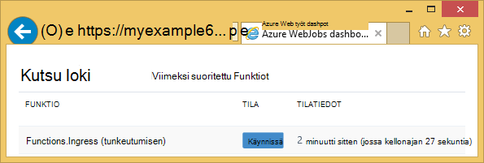

<properties
    pageTitle="Azure-tallennustilan ja Visual Studio käytön aloittaminen yhdistetyt palvelut (WebJob projektit)"
    description="Pikaviestien käyttäminen Azure-taulukkotallennus Azure WebJobs projektissa Visual Studiossa, kun yhteyden Visual Studiossa tallennustilan tilin yhdistetyt palvelut"
    services="storage"
    documentationCenter=""
    authors="TomArcher"
    manager="douge"
    editor=""/>

<tags
    ms.service="storage"
    ms.workload="web"
    ms.tgt_pltfrm="vs-getting-started"
    ms.devlang="na"
    ms.topic="article"
    ms.date="07/18/2016"
    ms.author="tarcher"/>

# Käytön aloittaminen Azure Storage (Azure WebJob projektit)

[AZURE.INCLUDE [storage-try-azure-tools-tables](../../includes/storage-try-azure-tools-tables.md)]

## Yleiskatsaus

Tässä artikkelissa on C# MALLIKOODEJA, jotka näyttävät Näytä Azure WebJobs SDK-version käyttämisestä 1.x Azuren taulukkojen tallennustilaan-palvelussa. MALLIKOODEJA Käytä [WebJobs SDK](../app-service-web/websites-dotnet-webjobs-sdk.md) -versiota 1.x.

Azure-taulukosta tallennuspalvelu avulla voit tallentaa rakenteellisen suurista tietomääristä. Palvelu on NoSQL datastore, joka hyväksyy todennetut kutsut ja Azure pilveen sivuihin. Azure-taulukoiden soveltuvat erinomaisesti rakenteellisia ja relaatio tietojen tallentaminen.  Saat lisätietoja [Azure-taulukkotallennus käyttämällä .NET käytön aloittaminen](storage-dotnet-how-to-use-tables.md#create-a-table) .

Joitakin koodikatkelmat Näytä **taulukko** -määrite käyttää funktioita, joita kutsutaan manuaalisesti, ei ole käyttämällä jotakin käynnistimen määritteet.

## Kohteiden lisääminen taulukkoon

Kohteiden lisääminen taulukkoon, käytä **taulukko** -määrite, jonka **ICollector<T> ** tai **IAsyncCollector<T> ** parametri, jossa **T** määrittää rakenne, johon haluat lisätä kohteita. Määritteen konstruktoria kestää parametrin, joka määrittää taulukon nimi.

Seuraava koodi Esimerkki Lisää **henkilö** kohteiden *tunkeutumisen*-taulukon.

        [NoAutomaticTrigger]
        public static void IngressDemo(
            [Table("Ingress")] ICollector<Person> tableBinding)
        {
            for (int i = 0; i < 100000; i++)
            {
                tableBinding.Add(
                    new Person() {
                        PartitionKey = "Test",
                        RowKey = i.ToString(),
                        Name = "Name" }
                    );
            }
        }

Yleensä **ICollector** käyttämällä tyyppi johdetaan **TableEntity** tai toteuttaa **ITableEntity**, mutta siinä ei ole. Jommankumman seuraavista **henkilön** luokista käsitellä edellisen **tunkeutumisen** menetelmän esitetyn koodin.

        public class Person : TableEntity
        {
            public string Name { get; set; }
        }

        public class Person
        {
            public string PartitionKey { get; set; }
            public string RowKey { get; set; }
            public string Name { get; set; }
        }

Jos haluat käsitellä Azure tallennustilan API, voit lisätä **CloudStorageAccount** parametrin menetelmän allekirjoitus.

## Reaaliaikainen seuranta

Koska tietojen tunkeutumisen Funktiot käsitellä usein suurista tietomääristä, WebJobs SDK Raporttinäkymät-ikkunan on reaaliaikainen seurantatiedot. **Kutsu Log** -osassa kerrotaan Jos funktio suoritetaan.

**Kutsu** tietosivu raportoi toiminnon edistyminen (kirjoitettu kohteiden määrä) samalla, kun se on käynnissä, ja voit keskeyttää sen mahdollisuuden.

Kun toiminto on valmis, **Kutsun tiedot** -sivulla raportit kirjoitettu rivien määrä.

## Useiden kohteiden lukeminen taulukosta

Taulukon lukemaan käyttää **taulukon** -määrite, jonka **IQueryable<T> ** parametri, jossa **kirjoittaa** johdetaan **TableEntity** tai toteuttaa **ITableEntity**.

Seuraava koodi malli lukee ja kirjaa kaikki rivit **tunkeutumisen** taulukosta:

        public static void ReadTable(
            [Table("Ingress")] IQueryable<Person> tableBinding,
            TextWriter logger)
        {
            var query = from p in tableBinding select p;
            foreach (Person person in query)
            {
                logger.WriteLine("PK:{0}, RK:{1}, Name:{2}",
                    person.PartitionKey, person.RowKey, person.Name);
            }
        }

### Yhden kohteen lukeminen taulukosta

Tällä **taulukon** Määritekonstruktorilla, jonka avulla voit määrittää-osio ja rivin avaimen, kun haluat sitoa yhden taulukon kohteeseen kaksi muut parametrit.

Seuraava koodi malli kuuluu taulukkorivin **henkilö** -kohteen osion avain ja rivin avaimen arvojen perusteella jonon viestin vastaanotettu:  

        public static void ReadTableEntity(
            [QueueTrigger("inputqueue")] Person personInQueue,
            [Table("persontable","{PartitionKey}", "{RowKey}")] Person personInTable,
            TextWriter logger)
        {
            if (personInTable == null)
            {
                logger.WriteLine("Person not found: PK:{0}, RK:{1}",
                        personInQueue.PartitionKey, personInQueue.RowKey);
            }
            else
            {
                logger.WriteLine("Person found: PK:{0}, RK:{1}, Name:{2}",
                        personInTable.PartitionKey, personInTable.RowKey, personInTable.Name);
            }
        }

Tässä esimerkissä **henkilö** -luokkaa ei ole toteuttamisesta **ITableEntity**.

## .NET tallennustilan Ohjelmointirajapinnan käyttäminen suoraan taulukon käyttöä varten

Voit käyttää myös **taulukon** määrite **CloudTable** objektia joustavuutta taulukon käsitteleminen.

Seuraava koodi malli käyttää **CloudTable** objekti yhden kohteen lisääminen *tunkeutumisen* taulukkoon.

        public static void UseStorageAPI(
            [Table("Ingress")] CloudTable tableBinding,
            TextWriter logger)
        {
            var person = new Person()
                {
                    PartitionKey = "Test",
                    RowKey = "100",
                    Name = "Name"
                };
            TableOperation insertOperation = TableOperation.Insert(person);
            tableBinding.Execute(insertOperation);
        }

Lisätietoja **CloudTable** objektin käyttämisestä on artikkelissa [Azure-taulukkotallennus käyttämällä .NET käytön aloittaminen](storage-dotnet-how-to-use-tables.md).

## Aiheeseen liittyvät olevien toimintaohjeet artikkelin aiheita

Lisätietoja käsittelemisestä taulukon käsittely saatu jonon viestin tai WebJobs SDK skenaarioissa eivät tiettyjä taulukon käsittely on artikkelissa [aloittaminen Azure jonon tallennustilan ja Visual Studio yhdistetyt palvelut (WebJob projektit)](vs-storage-webjobs-getting-started-queues.md).

## Seuraavat vaiheet

Tässä artikkelissa on tarjonnut MALLIKOODEJA, jotka esittävät yleisiä tilanteita, joissa Azure taulukoiden käsittelemisestä. Saat lisätietoja Azure WebJobs ja WebJobs SDK käyttäminen [Azure WebJobs dokumentaatioresurssit](http://go.microsoft.com/fwlink/?linkid=390226).
