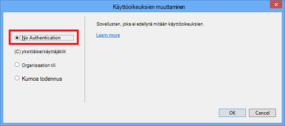

<properties
    pageTitle="Luo kuvia korotuksia"
    description="Kerrotaan, miten voit luoda kuvia korotuksia Azure säilöjen tietoihin määrittäminen ohjeiden mukaan."
    services=""
    solutions=""
    documentationCenter=""
    authors="kenhoff"
    manager="ilanas"
    editor="tysonn"/>

<tags
    ms.service="contributor-guide"
    ms.devlang=""
    ms.topic="article"
    ms.tgt_pltfrm=""
    ms.workload=""
    ms.date="06/25/2015"
    ms.author="kenhoff" />

# <a name="create-images-in-markdown"></a>Luo kuvia korotuksia

## <a name="image-folder-creation-and-link-syntax"></a>Kuva kansion luomista ja linkin syntaksi

Tarvitset uuden artikkelin Luo kansio seuraavassa kansiossa:

    /articles/<service-directory>/media/<article-name>/

Esimerkki:

    /articles/app-service/media/app-service-enterprise-multichannel-apps/

Kun olet luonut kansion ja siihen lisätyt kuvat, käytä seuraavaa syntaksia kuvien luominen artikkeli:

```

```
Esimerkki:

Katso esimerkki [korotuksia-malli](../markdown%20templates/markdown-template-for-new-articles.md) .  Viittaus Kuvalinkkien korotuksia mallin on suunniteltu mallin alareunassa.

## <a name="guidelines-specific-to-azuremicrosoftcom"></a>Azure.microsoft.com liittyviä ohjeita

Näyttökuvat suositellaan tällä hetkellä, jos se ei ole mahdollista lisätä ongelman kuvaus vaiheet. Sisällön kirjoittaminen, niin, että sisällön oma ilman näyttökuvien tarvittaessa.

Noudata seuraavia ohjeita luodessasi ja ClipArt-tiedostot mukaan lukien:
- ClipArt-tiedostot eivät jakaa tiedostoja. Kopioi tiedosto on ja lisätä tiettyä aihetta media-kansio. Jakaminen tiedostojen välillä ei suositella, koska se on helpompaa, poista poistettu sisällön ja kuvien, joka säilyttää repo Puhdista.

- Tiedostomuodot: .png - tiedostojen käyttäminen ne laatua ja ylläpitää niiden laadun lokalisoinnin aikana. Muut tiedostomuodot ei enää niiden laatua. .Jpeg muoto on sallittu, mutta ei ensisijainen.  Ei ole animoitu GIF-tiedostoja.

- Käyttää Paintin annettu oletusleveyden punaisina neliöinä (5 kuvapistettä) huomion tiettyyn osat-näyttökuvat.  

    Esimerkki:

    

- Kun se on järkevää, voit rajata kuvia, jotta Käyttöliittymän osat näkyvät täysikokoisena vapaasti. Varmista, että kontekstissa ei ole valittuna käyttäjille, vaikka.

- Vältä välilyöntejä näyttökuvat reunassa. Jos voit rajata niin, että jättää valkoisella taustalla reunoille näyttökuvan, lisätä kuvan yksi kuvapiste harmaa reunat.  Jos Paintissa, käytä vaaleampi harmaa oletusarvon värivalikoimaa (0xC3C3C3). Jos jotkin kuvan app, RGB-väri on R195, G195, 195. Voit lisätä kuvan harmaa reunan helposti Vision--seuraavasti, valitse kuva, valitse rivi ja varmistaa, oikea väri on määritetty ja muuta sitten haluamasi viivan leveys 1 1/2 pt.  Näyttökuvat pitäisi olla 1 kuvapisteen-koskevia harmaa reuna, niin, että näyttökuvan valkoisilla alueilla ei pehmennys WWW-sivustoon.

    Esimerkki:

    
    
    Työkalu, jonka avulla automatisoida tarvittavat reunaviivan lisääminen kuvia Katso [AddACOMBorder korjaustyökalulla – voit automatisoida ACOM kuvia tarvittavat 1 kuvapisteen harmaa reunaviivan lisääminen](https://github.com/Azure/Azure-CSI-Content-Tools/tree/master/Tools/AddACOMImageBorder).

- Käsitteellisiä kuvia välilyönnillä ei tarvitse harmaa reuna.  

    Esimerkki:

    

- Kokeile ei voi tehdä kuvaan liian pitkä.  Kuvat automaattisesti kokoa muutetaan jos ne ovat liian pitkä. Kuitenkin koon joskus aiheuttaa fuzziness, jotta Suosittelemme rajoittaa kuvien 780 leveyttä kuvapistettä ja manuaalisesti ennen lähettämistä tarvittaessa kuvien kokoa.

- Näytä komento tulostaa näyttökuvia.  Artikkeli sisältää ohjeet, jos käyttäjä työskentelee sisällä on, jos se on hyödyllinen näyttäminen näyttökuvat komennon tulosteessa. Tässä tapauksessa rajoittaminen shell-leveys tietoja 72 merkkiä yleensä varmistaa kuva pysyy 780 kuvapistettä leveys yleisohjeet kuluessa. Ennen siihen tulosteen näyttökuva ikkunan kokoa niin, että vain asianmukaiset-komento ja tulos näytetään (Voit myös kanssa molemmille puolille tyhjä rivi).

- Kestää koko näyttökuvat Windowsin, kun se on mahdollista. Kun selain näyttökuva ottaen kokoa selainikkunan, 780 kuvapistettä leveä tai vähemmän ja Säilytä ja selaimen ikkunan korkeuden lyhyt mahdollisimman sellainen, että sovelluksesi sopii keskusteluikkunasta käsin.

    Esimerkki:

    

- Ole varovainen tiedoista tulee näkyviin näyttökuvat kanssa.  Ei Näytä sisäiset yrityksen tietojen ja henkilökohtaisten tietojen varalta.

- Havainnollistava kuva tai kaaviot Käytä virallinen kuvakkeet Cloud- ja Enterprise-symboli ja kuvake määrittäminen. Julkinen joukko on saatavilla kohdassa http://aka.ms/CnESymbols.

- Korvaa paikkamerkkiteksti kulma hakasulkeissa näyttökuvat henkilökohtaiset ja yksityiset tiedot. Tämä sisältää käyttäjien nimet ja muut Aiheeseen liittyvät tiedot tilauksen tunnukset. Henkilöiden nimien voidaan korvata [hyväksytty fictious nimi](https://aka.ms/ficticiousnames)(vain työntekijä-linkki). Älä käytä Väriliitu tai merkki Vihje Paint peittää tai pehmennystä henkilökohtaisia tai yksityisiä tietoja.

  Seuraavassa kuvassa on päivitetty oikein todellinen **Tilaustunnus** korvaaminen paikkamerkin tiedot:

  

### <a name="contributors-guide-links"></a>Osallistujat-opas linkit

- [Yleistä artikkelissa](./../README.md)
- [Indeksi ohjeet artikkeleista](./contributor-guide-index.md)
