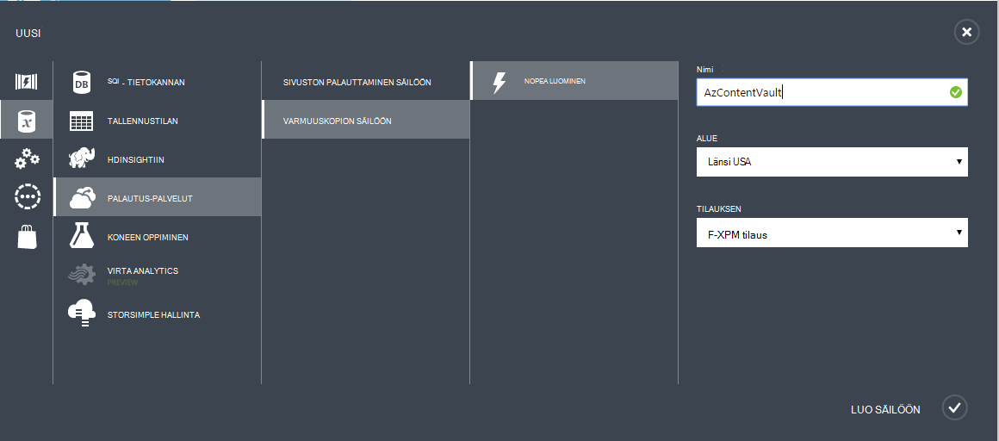

## Luo varmuuskopio säilöön
Voit varmuuskopioida tiedostot ja tiedot Windows Server tai Data Protection Manager (DPM) Azure tai kun varmuuskopioimalla IaaS VMs Azure, sinun on luotava maantieteellisen alueen, johon haluat tallentaa tiedot varmuuskopion säilö.

Seuraavat vaiheet opastaa säilö voidaan tallentaa varmuuskopioiden luomista.

1. Kirjautuminen [hallinta-portaalissa](https://manage.windowsazure.com/)
2. **Uusi** > **Tietopalvelujen** > **Palautus Services** > **Varmuuskopiointi säilö** ja valitse **Nopea luominen**.

    

3. Kirjoita **nimi** -parametrin kutsumanimi tunnistavan varmuuskopiointi säilö. Tämä on oltava yksilöllinen jokaisen tilauksen.

4. Valitse **alue** -parametrin maantieteellisen alueen varmuuskopiointi säilö varten. Valinta määrittää maantieteellisen alueen, johon varmuuskopioidut tiedot lähetetään. Valitsemalla Sulje sijaintisi maantieteellisen alueen voit pienentää verkon latenssin kun Azure varmuuskopioimalla.

5. Napsauta työnkulun **Luominen säilö** . Se voi viedä aikaa luoda varmuuskopion säilö. Tarkista tila, voit valvoa portaalin alareunassa ilmoitukset.

    

6. Kun varmuuskopioinnin säilö on luotu, viestin ilmoittaa säilö on luotu. Säilö myös näkyy resurssien palautuksen palveluiden **aktiiviseksi**.

    

### Azure varmuuskopiointi - Redundancy tallennusasetukset

>[AZURE.IMPORTANT] Löydät parhaan mahdollisen ajan tunnistavan redundancy tallennuspaikka on oikealle säilö luonnin jälkeen ja ennen missään rekisteröity säilö. Kun kohde on rekisteröity säilö, redundancy tallennuspaikka on lukittu, eikä sitä voi muokata.

Yrityksesi tarpeisiin Määritä tallennustilan redundancy Azure varmuuskopiointi Taustajärjestelmä lisätallennustilaa. Jos käytät Azure ensisijainen varmuuskopion tallennustilan päätepisteen (kuten varmuuskopioidaan, Azure Windows-palvelimesta), sinun kannattaa harkita Geo tarpeettomat tallennuspaikka valitsemalla (oletusarvo). Tarkastella varmuuskopiointi-säilö **määrittäminen** -asetuksissa.

#### GEO tarpeettomat Storage (GRS)
GRS ylläpitää tietojen kuusi kopioita. GRS tiedot on replikoida kolme kertaa ensisijainen alueella ja on myös replikoida kolme kertaa toissijainen alueen satoja Mailia tarjoaa parhaan viimeinen myyntipäivä ensisijainen alueen ulkopuolella. Jos ensisijainen alueen tallentamalla tiedot GRS, milloin Azure varmuuskopiointi varmistetaan, että tiedot on kestävät kaksi eri alueilla.

#### Paikallisesti tarpeettomat Storage (LRS)
Paikallisesti tarpeettomat storage (LRS) säilyttää tietosi kolme kopiota. LRS on replikoida yksittäisen tilan yhden alueen sisällä kolme kertaa. LRS suojaa tietoja Normaali laitteisto, mutta ei koko Azure tilojen virhe.

Jos käytät Azure ensisijaisen varmuuskopion tallennustilan päätepisteen (esimerkiksi käytät SCDPM paikallisen varmuuskopion kopioi paikallisen & käytön Azure pitkällä aikavälillä säilytys on), sinun kannattaa harkita valintaa paikallisesti tarpeettomat tallennustilan varmuuskopiointi-säilö **Määritä** -vaihtoehtoa. Tämä lisää alaspäin kustannusten tiedot tallennetaan Azure-käyttämisessä alemmalle tasolle viimeinen myyntipäivä tiedoillesi mahdollisesti ensisijaisen kopiot hyväksyttäväksi.

