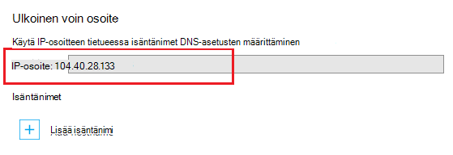

Etsi resursseja Internetissä käytetään toimialueen nimi järjestelmän (DNS). Esimerkiksi kun kirjoitat web app-osoite selaimen tai web-sivulla olevaa linkkiä, se käyttää DNS toimialueen muuntamiseksi IP-osoite. IP-osoite on sort, kuten katuosoitteen, mutta se ei ole hyvin ihmisille friendly. Esimerkiksi on helpompi muistaa kuin muista IP-osoite, kuten 192.168.1.88 tai 2001:0:4137:1f67:24a2:3888:9cce:fea3 DNS-nimi, esimerkiksi **contoso.com** .

DNS-järjestelmään perustuu *tietueita*. Tietueiden liittäminen määritetty *nimi*, esimerkiksi **contoso.com**IP-osoite tai toiseen DNS-nimi. Kun sovellus, kuten selain hakee nimi DNS-palvelimesta, se havaitsee tietueen ja käyttää riippumatta siitä, mitä se osoittaa osoitteeksi. Jos se osoittaa on IP-osoite, selain käyttää kyseistä arvoa. Jos se osoittaa toiseen DNS-nimi-sovellus on tarkkuus Tee uudelleen. Kaikki nimenselvitys päättyy kädessä IP-osoite.

Luodessasi web app-sovelluksen palvelun DNS-nimi määritetään automaattisesti web App-sovellukseen. Tämä nimi Vie muodossa ** &lt;yourwebappname&gt;. azurewebsites.net**. On myös virtual IP-osoite käytettäväksi luotaessa DNS-tietueita, jotta voit luoda tietueita, jotka osoittavat **. azurewebsites.net**, tai voit osoittaa IP-osoite.

> [AZURE.NOTE] Web-sovelluksen IP-osoite muuttuu, jos poistat ja luo web-sovelluksen tai muuttaminen App palvelun suunnitelman tila **vapaa** , kun se on määritetty **Basic**, **jaettu**tai **Vakio**.

On myös useita erilaisia tietueet, joissa omia Funktiot ja rajoituksia, mutta verkkosovelluksissa on vain tärkeisiin kaksi *A* ja *CNAME* -tietueet.

###Osoitetietue (tietue)

A-tietue yhdistää toimialueen, kuten **contoso.com** tai **www.contoso.com**, *tai yleismerkkien toimialueen* ** \*. contoso.com**, IP-osoitteeseen. Kyseessä web app-sovelluksen Service-palvelun virtual IP- tai tietyn IP-osoite, voit ostaa web Appissa.

A-tietue päälle CNAME-tietue tärkeimmät edut ovat seuraavat:

* Voit yhdistää päätoimialueen, esimerkiksi **contoso.com** IP-osoite; useissa rekisteröintipalveluissa Salli vain tämän käyttämällä tietueisiin

* Voit määrittää yhden arvon, joka käyttää yleismerkkejä, kuten ** \*. contoso.com**, jossa käsitellä useita alitoimialueisiin, kuten **mail.contoso.com**, **blogs.contoso.com**tai **www.contso.com**pyynnöt.

> [AZURE.NOTE] A-tietue on nyt yhdistetty staattinen IP-osoite, koska muutoksia ei voi selvittää automaattisesti koodiin IP-osoite. Mukautetun toimialuenimen asetusten määrittäminen web-sovelluksen; sait tietueisiin käytettäväksi IP-osoite kuitenkin arvoksi voivat muuttua, jos poistat ja luo web-sovelluksen tai muuttaa sovelluksen palvelun suunnittelu-tilassa ja **vapaa**takaisin.

###Tietueen alias (CNAME-tietue)

CNAME-tietue yhdistää *tietyn* DNS-nimi, kuten **mail.contoso.com** tai **www.contoso.com**toiseen (canonical) toimialuenimi. Kyseessä palvelun Web sovellukset, canonical toimialuenimi on ** &lt;yourwebappname >. azurewebsites.net** toimialuenimen koodiin. Luomiasi CNAME-TIETUE Luo tunnusnimen ** &lt;yourwebappname >. azurewebsites.net** toimialuenimi. CNAME-merkinnän ratkaisee IP-osoitteen lisääminen ** &lt;yourwebappname >. azurewebsites.net** toimialuenimi automaattisesti, joten jos web Appin IP-osoite muuttuu, sinun ei tarvitse tehdä mitään.

> [AZURE.NOTE] Jotkin toimialuerekisteröijät Salli vain voidaan yhdistää alitoimialueita, kun käytät CNAME-tietue, kuten **www.contoso.com**ja ei pääkansion nimiä, esimerkiksi **contoso.com**. Lisätietoja CNAME-tietueet on rekisteröintipalvelustasi, <a href="http://en.wikipedia.org/wiki/CNAME_record">CNAME-tietue Wikipedia-tapahtuma</a>tai <a href="http://tools.ietf.org/html/rfc1035">IETF toimialuenimet - käyttöönotto ja määritys</a> -asiakirjan ohjeissa.

###Web app DNS-tiedot

A-tietue käyttäminen Web Apps pidentämiseksi sinun on luotava TXT-tietueet:

* **Päätoimialueen** - A DNS TXT-tietueen, **@** , ** &lt;yourwebappname&gt;. azurewebsites.net**.

* **Alikansiot tietyn toimialueen** – A DNS-nimen ** &lt;aliraportti toimialueen >** , ** &lt;yourwebappname&gt;. azurewebsites.net**. Esimerkiksi **blogit** Jos tietueessa on **blogs.contoso.com**.

* **Yleismerkkien sub-dodmains varten** - A DNS TXT-tietueen, ***, ** &lt;yourwebappname&gt;. azurewebsites.net**.

Varmista, että omistat toimialueen, jota yrität käyttää käytetään tämä TXT-tietue. Tämä on lisäksi luominen A-tietue valitsemalla web Appin virtuaalinen IP-osoite.

Voit etsiä IP-osoite ja **. azurewebsites.net** nimet web App-ohjelman mukaan seuraavasti:

1. Avaa [Azure Portal](https://portal.azure.com)selaimella.

2. **Web Apps** -sivu-web-sovelluksen nimi ja valitse sivun alareunasta **Mukautetut toimialueet** .

    

3. **Mukautetut toimialueet** -sivu tulee näkyviin virtual IP-osoite. Tallentaa tiedot, kun sitä käytetään, kun luot DNS-tietueita

    

    > [AZURE.NOTE] Ei voi käyttää mukautettuja toimialuenimiä **vapaa** -web-sovelluksen ja sovelluksen palvelusopimus on päivitettävä **jaettu**, **Basic**, **Normaali**tai **Premium** taso. Saat lisätietoja sovelluksen palvelun osalta hinnat tasoa, mukaan lukien koodiin hinnoittelu tason tutustumalla Katso, [miten voit skaalata verkkosovelluksissa](../articles/web-sites-scale.md).
