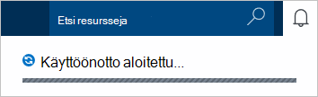

1.  Kirjautuminen [Azure portal](https://portal.azure.com/).
2.  Jumpbar, valitse **Uusi**ja valitsemalla **tiedot + tallennustilan** **DocumentDB (NoSQL)**.

      

3. Määritä uudet määritykset DocumentDB tilin **uusi tili** -sivu.

    

    - Kirjoita **tunnus** -ruutuun DocumentDB tilin nimi.  Kun **tunnus** on tarkistettu, vihreä valintamerkki tulee **tunnus** -ruutuun. **Tunnus** -arvo muuttuu isäntänimi URI kuluessa. **Tunnus** voi olla vain pieniä kirjaimia, numeroita ja '-' merkki ja on oltava 3 – 50 merkkiä. Huomaa, että *documents.azure.com* liitetään valitsemasi päätepisteen nimi, joka tulos tulee DocumentDB tilin päätepiste.

    - Valitse **DocumentDB** **NoSQL API** -ruudussa.  

    - **Tilauksen**Valitse Azure tilaus, jota haluat käyttää DocumentDB-tilillä. Jos tiliisi on vain yksi tilaus, tiliin on valittuna oletusarvoisesti.

    - **Resurssiryhmä**Valitse tai luo resurssiryhmä DocumentDB tilissäsi.  Oletusarvon mukaan luodaan uusi resurssiryhmä. Lisätietoja on artikkelissa [Azure-portaalissa voit hallita Azure resursseja](../articles/azure-portal/resource-group-portal.md).

    - **Sijainnin** avulla voit määrittää maantieteellinen sijainti, johon isännöimiseen DocumentDB-tilillesi. 

4.  Kun uusi DocumentDB tilin asetukset on määritetty, valitse **Luo**. Käyttöönoton tilan tarkistaminen Tarkista ilmoitukset-toiminnossa.  

      

    

5.  Kun DocumentDB-tili on luotu, on valmis käytettäväksi oletusasetukset. **Istunnon**on määritetty oletusarvoinen yhdenmukaisuuden DocumentDB tilin.  Voit muuttaa oletusarvon yhdenmukaisuuden resurssi-valikossa **Oletusarvon yhdenmukaisuuden** . Lisätietoja DocumentDB tarjoamia yhdenmukaisuuden tasot, katso [yhdenmukaisuuden tasojen DocumentDB](../articles/documentdb/documentdb-consistency-levels.md).

      

      

[How to: Create a DocumentDB account]: #Howto
[Next steps]: #NextSteps
[documentdb-manage]:../articles/documentdb/documentdb-manage.md
