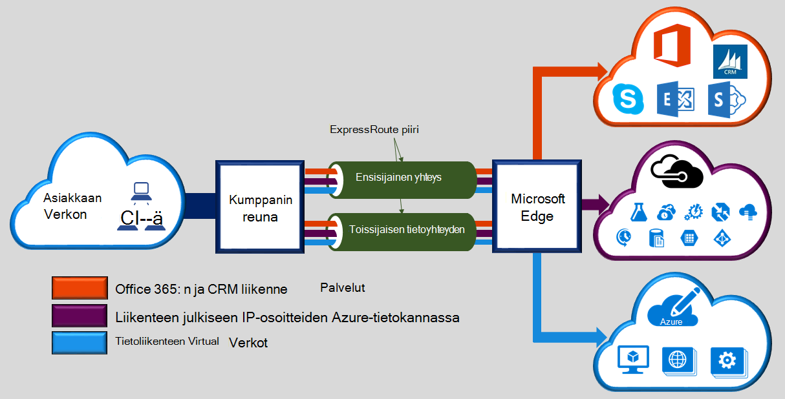

Microsoft Azure ExpressRoute avulla voit laajentaa paikallisen lopettaminen Microsoft cloud connectivity tarjoaja helpottaa erillinen yksityisen yhteyden kautta. ExpressRoute voit muodostaa yhteyden Microsoftin pilvipalveluihin, kuten Microsoft Azure, Office 365: ssä ja CRM Online. Yhteys voi olla minkä tahansa-,-tahansa (IP-VPN)-verkko, pisteestä pisteeseen-Ethernet-verkon tai näennäinen rajat-yhteyden kautta rinnakkain-tilojen yhteyden palveluntarjoajaasi. ExpressRoute yhteydet ei siirry julkisen Internetin välityksellä. Näin ExpressRoute yhteydet tarjoaa useita luotettavasti, nopeampi nopeuksia, pienet viiveet suurempia ja suurempi kuin tavallinen yhteydet suojaus Internetin välityksellä.  

